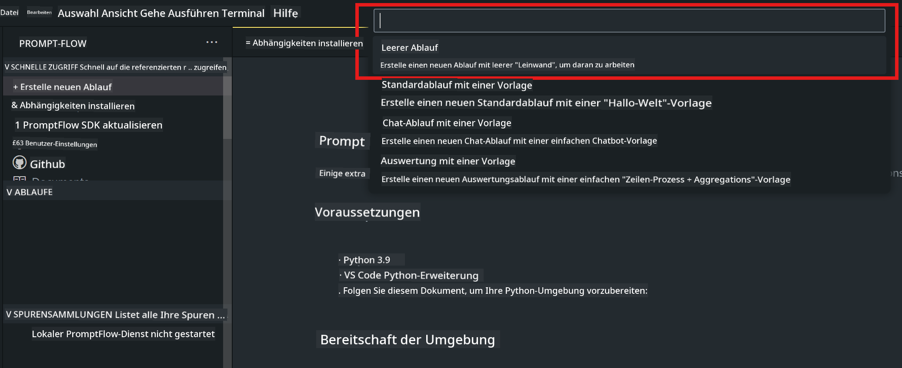
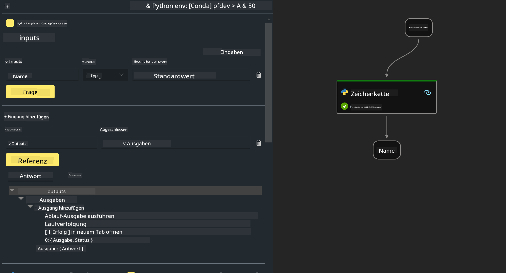

<!--
CO_OP_TRANSLATOR_METADATA:
{
  "original_hash": "bc29f7fe7fc16bed6932733eac8c81b8",
  "translation_date": "2025-03-27T11:54:17+00:00",
  "source_file": "md\\02.Application\\02.Code\\Phi3\\VSCodeExt\\HOL\\AIPC\\02.PromptflowWithNPU.md",
  "language_code": "de"
}
-->
# **Lab 2 - Ausführen von Prompt flow mit Phi-3-mini in AIPC**

## **Was ist Prompt flow**

Prompt flow ist eine Suite von Entwicklungstools, die den gesamten Entwicklungszyklus von LLM-basierten KI-Anwendungen erleichtert – von Ideenfindung, Prototyping, Testen, Bewertung bis hin zu Produktion und Überwachung. Es macht das Prompt Engineering viel einfacher und ermöglicht es Ihnen, LLM-Anwendungen mit Produktionsqualität zu erstellen.

Mit Prompt flow können Sie:

- Flows erstellen, die LLMs, Prompts, Python-Code und andere Tools in einem ausführbaren Workflow miteinander verbinden.

- Ihre Flows debuggen und iterieren, insbesondere die Interaktion mit LLMs, ohne großen Aufwand.

- Ihre Flows bewerten und Qualitäts- sowie Leistungsmetriken mit größeren Datensätzen berechnen.

- Tests und Bewertungen in Ihr CI/CD-System integrieren, um die Qualität Ihres Flows sicherzustellen.

- Ihre Flows auf die von Ihnen gewählte Plattform bereitstellen oder einfach in den Code Ihrer App integrieren.

- (Optional, aber sehr empfohlen) Mit Ihrem Team zusammenarbeiten, indem Sie die Cloud-Version von Prompt flow in Azure AI nutzen.

## **Was ist AIPC**

Ein AI-PC verfügt über eine CPU, eine GPU und eine NPU, die jeweils spezifische Fähigkeiten zur KI-Beschleunigung bieten. Eine NPU, oder Neural Processing Unit, ist ein spezialisierter Beschleuniger, der Aufgaben der künstlichen Intelligenz (KI) und des maschinellen Lernens (ML) direkt auf Ihrem PC bearbeitet, anstatt Daten zur Verarbeitung in die Cloud zu senden. GPU und CPU können diese Aufgaben ebenfalls übernehmen, aber die NPU ist besonders gut bei energieeffizienten KI-Berechnungen. Der AI-PC stellt einen grundlegenden Wandel dar, wie unsere Computer arbeiten. Es ist keine Lösung für ein Problem, das vorher nicht existierte, sondern verspricht eine enorme Verbesserung für alltägliche PC-Nutzungen.

Wie funktioniert das? Im Vergleich zu generativer KI und den massiven großen Sprachmodellen (LLMs), die auf Unmengen öffentlicher Daten trainiert wurden, ist die KI, die auf Ihrem PC stattfindet, auf nahezu jeder Ebene zugänglicher. Das Konzept ist einfacher zu verstehen, und da es auf Ihren Daten trainiert wird, ohne Zugriff auf die Cloud zu benötigen, sind die Vorteile für eine breitere Bevölkerung sofort attraktiver.

Kurzfristig umfasst die Welt des AI-PCs persönliche Assistenten und kleinere KI-Modelle, die direkt auf Ihrem PC laufen und Ihre Daten nutzen, um persönliche, private und sicherere KI-Verbesserungen für alltägliche Aufgaben zu bieten – wie das Erstellen von Meetingprotokollen, Organisieren einer Fantasy-Football-Liga, Automatisieren von Verbesserungen für Foto- und Videobearbeitung oder das Erstellen des perfekten Zeitplans für ein Familientreffen basierend auf den Ankunfts- und Abfahrtszeiten aller Beteiligten.

## **Erstellen von Code-Generierungsflows auf AIPC**

***Note*** ：Falls Sie die Installation der Umgebung noch nicht abgeschlossen haben, besuchen Sie bitte [Lab 0 - Installationen](./01.Installations.md).

1. Öffnen Sie die Prompt flow Extension in Visual Studio Code und erstellen Sie ein leeres Flow-Projekt.



2. Fügen Sie Eingabe- und Ausgabeparameter hinzu und integrieren Sie Python-Code als neuen Flow.



Sie können sich an dieser Struktur (flow.dag.yaml) orientieren, um Ihren Flow zu erstellen:

```yaml

inputs:
  question:
    type: string
    default: how to write Bubble Algorithm
outputs:
  answer:
    type: string
    reference: ${Chat_With_Phi3.output}
nodes:
- name: Chat_With_Phi3
  type: python
  source:
    type: code
    path: Chat_With_Phi3.py
  inputs:
    question: ${inputs.question}


```

3. Fügen Sie Code in ***Chat_With_Phi3.py*** hinzu.

```python


from promptflow.core import tool

# import torch
from transformers import AutoTokenizer, pipeline,TextStreamer
import intel_npu_acceleration_library as npu_lib

import warnings

import asyncio
import platform

class Phi3CodeAgent:
    
    model = None
    tokenizer = None
    text_streamer = None
    
    model_id = "microsoft/Phi-3-mini-4k-instruct"

    @staticmethod
    def init_phi3():
        
        if Phi3CodeAgent.model is None or Phi3CodeAgent.tokenizer is None or Phi3CodeAgent.text_streamer is None:
            Phi3CodeAgent.model = npu_lib.NPUModelForCausalLM.from_pretrained(
                                    Phi3CodeAgent.model_id,
                                    torch_dtype="auto",
                                    dtype=npu_lib.int4,
                                    trust_remote_code=True
                                )
            Phi3CodeAgent.tokenizer = AutoTokenizer.from_pretrained(Phi3CodeAgent.model_id)
            Phi3CodeAgent.text_streamer = TextStreamer(Phi3CodeAgent.tokenizer, skip_prompt=True)

    

    @staticmethod
    def chat_with_phi3(prompt):
        
        Phi3CodeAgent.init_phi3()

        messages = "<|system|>You are a AI Python coding assistant. Please help me to generate code in Python.The answer only genertated Python code, but any comments and instructions do not need to be generated<|end|><|user|>" + prompt +"<|end|><|assistant|>"


        generation_args = {
            "max_new_tokens": 1024,
            "return_full_text": False,
            "temperature": 0.3,
            "do_sample": False,
            "streamer": Phi3CodeAgent.text_streamer,
        }

        pipe = pipeline(
            "text-generation",
            model=Phi3CodeAgent.model,
            tokenizer=Phi3CodeAgent.tokenizer,
            # **generation_args
        )

        result = ''

        with warnings.catch_warnings():
            warnings.simplefilter("ignore")
            response = pipe(messages, **generation_args)
            result =response[0]['generated_text']
            return result


@tool
def my_python_tool(question: str) -> str:
    if platform.system() == 'Windows':
        asyncio.set_event_loop_policy(asyncio.WindowsSelectorEventLoopPolicy())
    return Phi3CodeAgent.chat_with_phi3(question)


```

4. Sie können den Flow über Debug oder Run testen, um zu überprüfen, ob der generierte Code korrekt ist.


5. Führen Sie den Flow als Entwicklungs-API im Terminal aus.

```

pf flow serve --source ./ --port 8080 --host localhost   

```

Sie können ihn in Postman / Thunder Client testen.

### **Hinweis**

1. Der erste Durchlauf dauert lange. Es wird empfohlen, das Phi-3-Modell über Hugging Face CLI herunterzuladen.

2. Aufgrund der begrenzten Rechenleistung der Intel NPU wird empfohlen, Phi-3-mini-4k-instruct zu verwenden.

3. Wir nutzen die Intel NPU-Beschleunigung zur Quantisierung der INT4-Konvertierung. Wenn Sie den Dienst erneut ausführen, müssen Sie jedoch den Cache und die nc_workshop-Ordner löschen.

## **Ressourcen**

1. Lernen Sie Promptflow [https://microsoft.github.io/promptflow/](https://microsoft.github.io/promptflow/)

2. Lernen Sie Intel NPU-Beschleunigung [https://github.com/intel/intel-npu-acceleration-library](https://github.com/intel/intel-npu-acceleration-library)

3. Beispielcode herunterladen [Lokaler NPU-Agent Beispielcode](../../../../../../../../../code/07.Lab/01/AIPC)

**Haftungsausschluss**:  
Dieses Dokument wurde mithilfe des KI-Übersetzungsdienstes [Co-op Translator](https://github.com/Azure/co-op-translator) übersetzt. Obwohl wir uns um Genauigkeit bemühen, weisen wir darauf hin, dass automatisierte Übersetzungen Fehler oder Ungenauigkeiten enthalten können. Das Originaldokument in seiner ursprünglichen Sprache sollte als maßgebliche Quelle betrachtet werden. Für kritische Informationen wird eine professionelle menschliche Übersetzung empfohlen. Wir haften nicht für Missverständnisse oder Fehlinterpretationen, die sich aus der Nutzung dieser Übersetzung ergeben.