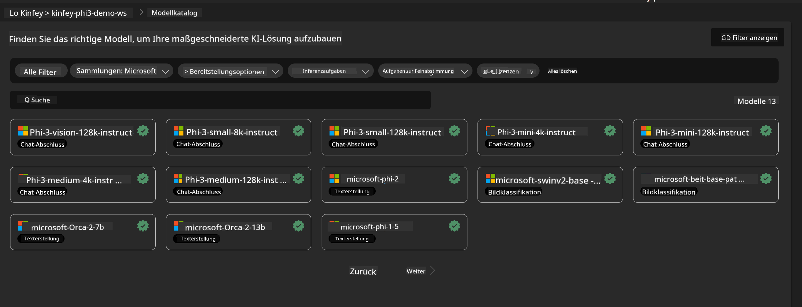
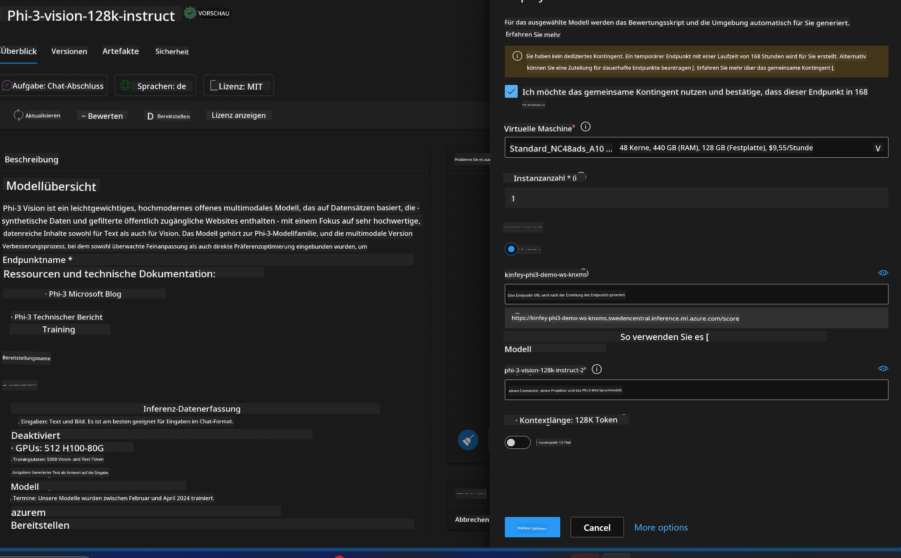
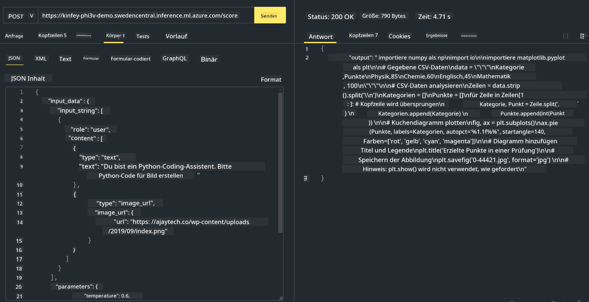

<!--
CO_OP_TRANSLATOR_METADATA:
{
  "original_hash": "20cb4e6ac1686248e8be913ccf6c2bc2",
  "translation_date": "2025-03-27T12:25:01+00:00",
  "source_file": "md\\02.Application\\02.Code\\Phi3\\VSCodeExt\\HOL\\Apple\\03.DeployPhi3VisionOnAzure.md",
  "language_code": "de"
}
-->
# **Lab 3 - Phi-3-Vision auf dem Azure Machine Learning Service bereitstellen**

Wir nutzen NPU, um den Produktionsbetrieb des lokalen Codes abzuschließen, und möchten anschließend die Möglichkeit einführen, PHI-3-VISION zu integrieren, um Bilder in Code umzuwandeln.

In dieser Einführung können wir schnell einen Model-as-a-Service Phi-3 Vision-Dienst im Azure Machine Learning Service aufbauen.

***Hinweis***: Phi-3 Vision benötigt Rechenleistung, um Inhalte schneller zu generieren. Wir benötigen Cloud-Computing-Ressourcen, um dies zu ermöglichen.

### **1. Azure Machine Learning Service erstellen**

Wir müssen einen Azure Machine Learning Service im Azure-Portal erstellen. Wenn du lernen möchtest, wie das geht, besuche bitte diesen Link: [https://learn.microsoft.com/azure/machine-learning/quickstart-create-resources?view=azureml-api-2](https://learn.microsoft.com/azure/machine-learning/quickstart-create-resources?view=azureml-api-2)

### **2. Phi-3 Vision im Azure Machine Learning Service auswählen**



### **3. Phi-3-Vision in Azure bereitstellen**



### **4. Endpoint in Postman testen**



***Hinweis***

1. Die zu übermittelnden Parameter müssen Authorization, azureml-model-deployment und Content-Type enthalten. Du musst die Bereitstellungsinformationen überprüfen, um diese zu erhalten.

2. Um Parameter zu übermitteln, benötigt Phi-3-Vision einen Bildlink. Bitte orientiere dich an der Methode von GPT-4-Vision, um Parameter zu übermitteln, zum Beispiel:

```json

{
  "input_data":{
    "input_string":[
      {
        "role":"user",
        "content":[ 
          {
            "type": "text",
            "text": "You are a Python coding assistant.Please create Python code for image "
          },
          {
              "type": "image_url",
              "image_url": {
                "url": "https://ajaytech.co/wp-content/uploads/2019/09/index.png"
              }
          }
        ]
      }
    ],
    "parameters":{
          "temperature": 0.6,
          "top_p": 0.9,
          "do_sample": false,
          "max_new_tokens": 2048
    }
  }
}

```

3. Verwende die Post-Methode, um **/score** aufzurufen.

**Herzlichen Glückwunsch**! Du hast die schnelle PHI-3-VISION-Bereitstellung abgeschlossen und ausprobiert, wie man mit Bildern Code generiert. Als Nächstes können wir Anwendungen unter Nutzung von NPUs und Cloud-Ressourcen erstellen.

**Haftungsausschluss**:  
Dieses Dokument wurde mithilfe des KI-Übersetzungsdienstes [Co-op Translator](https://github.com/Azure/co-op-translator) übersetzt. Obwohl wir uns um Genauigkeit bemühen, weisen wir darauf hin, dass automatisierte Übersetzungen Fehler oder Ungenauigkeiten enthalten können. Das Originaldokument in seiner ursprünglichen Sprache sollte als maßgebliche Quelle betrachtet werden. Für kritische Informationen wird eine professionelle menschliche Übersetzung empfohlen. Wir übernehmen keine Haftung für Missverständnisse oder Fehlinterpretationen, die sich aus der Nutzung dieser Übersetzung ergeben.