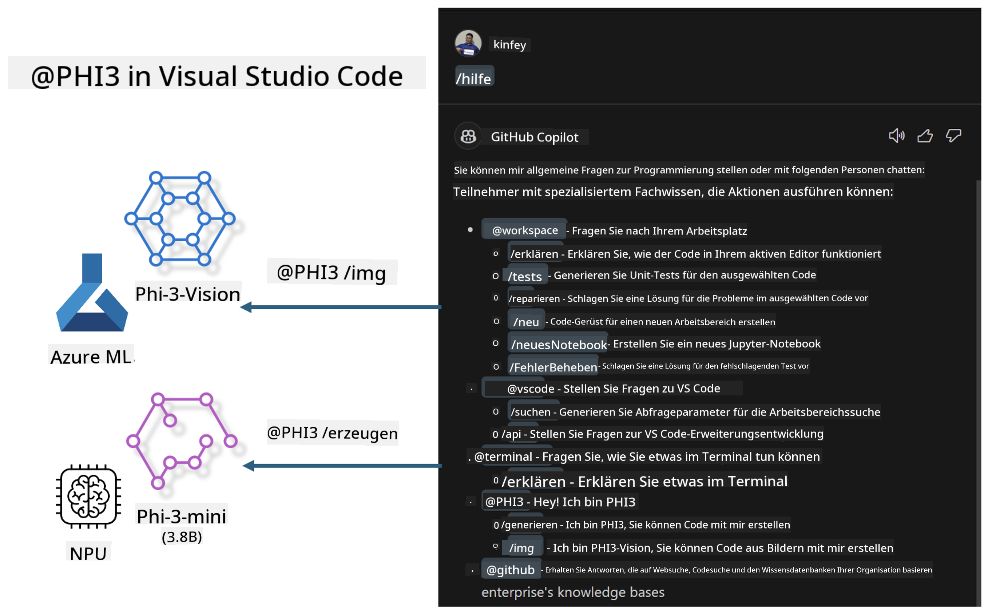

<!--
CO_OP_TRANSLATOR_METADATA:
{
  "original_hash": "00b7a699de8ac405fa821f4c0f7fc0ab",
  "translation_date": "2025-03-27T11:37:55+00:00",
  "source_file": "md\\02.Application\\02.Code\\Phi3\\VSCodeExt\\README.md",
  "language_code": "de"
}
-->
# **Erstellen Sie Ihren eigenen Visual Studio Code GitHub Copilot Chat mit der Microsoft Phi-3-Familie**

Haben Sie den Workspace-Agenten im GitHub Copilot Chat genutzt? Möchten Sie Ihren eigenen Code-Agenten für Ihr Team erstellen? Dieses praktische Lab soll das Open-Source-Modell kombinieren, um einen unternehmensspezifischen Code-Business-Agenten zu entwickeln.

## **Grundlagen**

### **Warum Microsoft Phi-3 wählen**

Phi-3 ist eine Modellfamilie, die phi-3-mini, phi-3-small und phi-3-medium umfasst. Diese Modelle basieren auf unterschiedlichen Trainingsparametern für Textgenerierung, Dialogvervollständigung und Code-Generierung. Außerdem gibt es phi-3-vision, das auf Vision basiert. Diese Modelle eignen sich für Unternehmen oder Teams, die Offline-Lösungen für generative KI erstellen möchten.

Empfohlene Lektüre: [https://github.com/microsoft/PhiCookBook/blob/main/md/01.Introduction/01/01.PhiFamily.md](https://github.com/microsoft/PhiCookBook/blob/main/md/01.Introduction/01/01.PhiFamily.md)

### **Microsoft GitHub Copilot Chat**

Die GitHub Copilot Chat-Erweiterung bietet eine Chat-Oberfläche, mit der Sie direkt in VS Code mit GitHub Copilot interagieren und Antworten auf codingbezogene Fragen erhalten können, ohne Dokumentationen durchforsten oder Online-Foren durchsuchen zu müssen.

Copilot Chat kann Syntaxhervorhebungen, Einrückungen und andere Formatierungsfunktionen nutzen, um die generierte Antwort klarer darzustellen. Je nach Benutzerfrage können die Ergebnisse Links zu den Quellen enthalten, die Copilot für die Antwort genutzt hat, wie Quellcodedateien oder Dokumentationen, sowie Schaltflächen für den Zugriff auf VS-Code-Funktionen.

- Copilot Chat integriert sich in Ihren Entwicklungsprozess und bietet Unterstützung genau dort, wo Sie sie benötigen:

- Starten Sie ein Inline-Chat-Gespräch direkt aus dem Editor oder Terminal, um Hilfe während des Codierens zu erhalten.

- Verwenden Sie die Chat-Ansicht, um jederzeit einen KI-Assistenten zur Seite zu haben.

- Starten Sie Quick Chat, um eine schnelle Frage zu stellen und direkt weiterzuarbeiten.

Sie können GitHub Copilot Chat in verschiedenen Szenarien nutzen, wie zum Beispiel:

- Beantwortung von Fragen, wie man ein Problem am besten löst.

- Erklärungen zu fremdem Code und Verbesserungsvorschläge.

- Vorschläge für Code-Korrekturen.

- Generierung von Unit-Testfällen.

- Erstellung von Code-Dokumentationen.

Empfohlene Lektüre: [https://code.visualstudio.com/docs/copilot/copilot-chat](https://code.visualstudio.com/docs/copilot/copilot-chat?WT.mc_id=aiml-137032-kinfeylo)

### **Microsoft GitHub Copilot Chat @workspace**

Durch die Nutzung von **@workspace** in Copilot Chat können Sie Fragen zu Ihrem gesamten Codebestand stellen. Copilot ruft basierend auf der Frage intelligent relevante Dateien und Symbole ab, die es dann in seiner Antwort als Links und Codebeispiele referenziert.

Um Ihre Frage zu beantworten, durchsucht **@workspace** dieselben Quellen, die ein Entwickler in VS Code nutzen würde:

- Alle Dateien im Workspace, mit Ausnahme der Dateien, die in einer .gitignore-Datei ignoriert werden.

- Die Verzeichnisstruktur mit verschachtelten Ordner- und Dateinamen.

- Den Code-Suchindex von GitHub, falls der Workspace ein GitHub-Repository ist und durch die Codesuche indexiert wurde.

- Symbole und Definitionen im Workspace.

- Aktuell ausgewählten Text oder sichtbaren Text im aktiven Editor.

Hinweis: .gitignore wird ignoriert, wenn Sie eine Datei geöffnet haben oder Text innerhalb einer ignorierten Datei ausgewählt ist.

Empfohlene Lektüre: [https://code.visualstudio.com/docs/copilot/copilot-chat](https://code.visualstudio.com/docs/copilot/workspace-context?WT.mc_id=aiml-137032-kinfeylo)

## **Mehr über dieses Lab erfahren**

GitHub Copilot hat die Programmier-Effizienz in Unternehmen erheblich verbessert, und jedes Unternehmen möchte die entsprechenden Funktionen von GitHub Copilot anpassen. Viele Unternehmen haben auf Basis ihrer eigenen Geschäftsszenarien und Open-Source-Modelle ähnliche Erweiterungen wie GitHub Copilot entwickelt. Für Unternehmen sind angepasste Erweiterungen leichter zu kontrollieren, aber dies kann die Benutzererfahrung beeinträchtigen. Schließlich ist GitHub Copilot leistungsfähiger bei allgemeinen Szenarien und Fachthemen. Wenn die Erfahrung konsistent bleibt, wäre es besser, die eigene Erweiterung des Unternehmens anzupassen. GitHub Copilot Chat bietet relevante APIs, damit Unternehmen die Chat-Erfahrung erweitern können. Eine konsistente Benutzererfahrung zu erhalten und gleichzeitig angepasste Funktionen zu haben, führt zu einer besseren Nutzererfahrung.

Dieses Lab verwendet hauptsächlich das Phi-3-Modell, kombiniert mit der lokalen NPU und Azure-Hybridlösungen, um einen benutzerdefinierten Agenten im GitHub Copilot Chat ***@PHI3*** zu erstellen. Dieser unterstützt Unternehmensentwickler bei der Code-Generierung ***(@PHI3 /gen)*** und der Code-Generierung basierend auf Bildern ***(@PHI3 /img)***.

### ***Hinweis:*** 

Dieses Lab wird derzeit auf AIPC von Intel CPU und Apple Silicon implementiert. Wir werden die Qualcomm-Version der NPU weiterhin aktualisieren.

## **Lab**

| Name | Beschreibung | AIPC | Apple |
| ------------ | ----------- | -------- |-------- |
| Lab0 - Installationen(✅) | Konfigurieren und Installieren der relevanten Umgebungen und Tools | [Go](./HOL/AIPC/01.Installations.md) |[Go](./HOL/Apple/01.Installations.md) |
| Lab1 - Prompt Flow mit Phi-3-mini ausführen (✅) | In Kombination mit AIPC / Apple Silicon wird die lokale NPU genutzt, um Code-Generierung mit Phi-3-mini zu erstellen | [Go](./HOL/AIPC/02.PromptflowWithNPU.md) |  [Go](./HOL/Apple/02.PromptflowWithMLX.md) |
| Lab2 - Phi-3-vision auf Azure Machine Learning Service bereitstellen (✅) | Code-Generierung durch Bereitstellung des Model Catalog - Phi-3-vision Image auf Azure Machine Learning Service | [Go](./HOL/AIPC/03.DeployPhi3VisionOnAzure.md) |[Go](./HOL/Apple/03.DeployPhi3VisionOnAzure.md) |
| Lab3 - Erstellen eines @phi-3-Agenten in GitHub Copilot Chat (✅) | Erstellen eines benutzerdefinierten Phi-3-Agenten in GitHub Copilot Chat, um Code-Generierung, Code aus Bildern, RAG usw. durchzuführen | [Go](./HOL/AIPC/04.CreatePhi3AgentInVSCode.md) | [Go](./HOL/Apple/04.CreatePhi3AgentInVSCode.md) |
| Beispielcode (✅)  | Beispielcode herunterladen | [Go](../../../../../../../code/07.Lab/01/AIPC) | [Go](../../../../../../../code/07.Lab/01/Apple) |

## **Ressourcen**

1. Phi-3 Cookbook [https://github.com/microsoft/Phi-3CookBook](https://github.com/microsoft/Phi-3CookBook)

2. Mehr über GitHub Copilot erfahren [https://learn.microsoft.com/training/paths/copilot/](https://learn.microsoft.com/training/paths/copilot/?WT.mc_id=aiml-137032-kinfeylo)

3. Mehr über GitHub Copilot Chat erfahren [https://learn.microsoft.com/training/paths/accelerate-app-development-using-github-copilot/](https://learn.microsoft.com/training/paths/accelerate-app-development-using-github-copilot/?WT.mc_id=aiml-137032-kinfeylo)

4. Mehr über die GitHub Copilot Chat API erfahren [https://code.visualstudio.com/api/extension-guides/chat](https://code.visualstudio.com/api/extension-guides/chat?WT.mc_id=aiml-137032-kinfeylo)

5. Mehr über Azure AI Foundry erfahren [https://learn.microsoft.com/training/paths/create-custom-copilots-ai-studio/](https://learn.microsoft.com/training/paths/create-custom-copilots-ai-studio/?WT.mc_id=aiml-137032-kinfeylo)

6. Mehr über den Model Catalog von Azure AI Foundry erfahren [https://learn.microsoft.com/azure/ai-studio/how-to/model-catalog-overview](https://learn.microsoft.com/azure/ai-studio/how-to/model-catalog-overview)

**Haftungsausschluss**:  
Dieses Dokument wurde mit dem KI-Übersetzungsdienst [Co-op Translator](https://github.com/Azure/co-op-translator) übersetzt. Obwohl wir uns um Genauigkeit bemühen, weisen wir darauf hin, dass automatisierte Übersetzungen Fehler oder Ungenauigkeiten enthalten können. Das Originaldokument in seiner ursprünglichen Sprache sollte als maßgebliche Quelle betrachtet werden. Für kritische Informationen wird eine professionelle menschliche Übersetzung empfohlen. Wir übernehmen keine Haftung für Missverständnisse oder Fehlinterpretationen, die durch die Nutzung dieser Übersetzung entstehen.