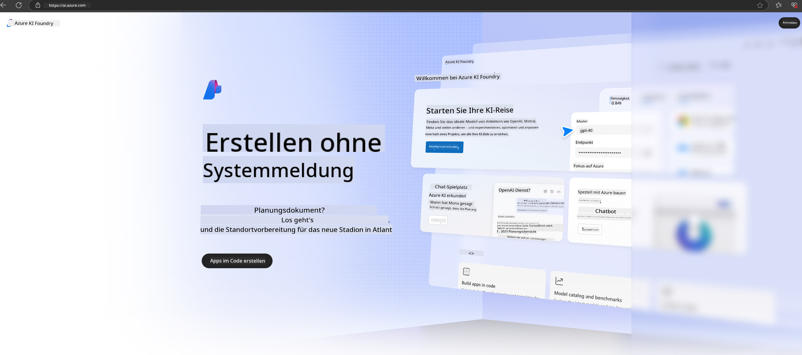

<!--
CO_OP_TRANSLATOR_METADATA:
{
  "original_hash": "3a1e48b628022485aac989c9f733e792",
  "translation_date": "2025-03-27T13:20:17+00:00",
  "source_file": "md\\02.QuickStart\\AzureAIFoundry_QuickStart.md",
  "language_code": "de"
}
-->
# **Verwendung von Phi-3 in Azure AI Foundry**

Mit der Entwicklung von Generativer KI hoffen wir, eine einheitliche Plattform zu nutzen, um verschiedene LLM und SLM, die Integration von Unternehmensdaten, Fine-Tuning/RAG-Operationen und die Bewertung verschiedener Unternehmensbereiche nach der Integration von LLM und SLM zu verwalten. Dadurch können intelligente Anwendungen der generativen KI besser umgesetzt werden. [Azure AI Foundry](https://ai.azure.com) ist eine Plattform für generative KI auf Unternehmensebene.

Mit Azure AI Foundry können Sie Antworten von großen Sprachmodellen (LLM) bewerten und die Anwendungskomponenten mit Prompt Flow orchestrieren, um die Leistung zu optimieren. Die Plattform erleichtert die Skalierung, sodass Proof-of-Concepts mühelos in vollständige Produktionslösungen überführt werden können. Kontinuierliches Monitoring und Verfeinerung unterstützen langfristigen Erfolg.

Wir können das Phi-3-Modell schnell auf Azure AI Foundry bereitstellen, indem wir einfache Schritte ausführen, und anschließend Azure AI Foundry nutzen, um Phi-3-bezogene Aufgaben wie Playground/Chat, Fine-Tuning, Bewertung und andere Arbeiten zu erledigen.

## **1. Vorbereitung**

Wenn Sie die [Azure Developer CLI](https://learn.microsoft.com/azure/developer/azure-developer-cli/overview?WT.mc_id=aiml-138114-kinfeylo) bereits auf Ihrem Rechner installiert haben, können Sie diese Vorlage ganz einfach verwenden, indem Sie den folgenden Befehl in einem neuen Verzeichnis ausführen.

## Manuelle Erstellung

Das Erstellen eines Microsoft Azure AI Foundry-Projekts und -Hubs ist eine großartige Möglichkeit, Ihre KI-Arbeit zu organisieren und zu verwalten. Hier ist eine Schritt-für-Schritt-Anleitung, um Ihnen den Einstieg zu erleichtern:

### Projekt erstellen in Azure AI Foundry

1. **Gehen Sie zu Azure AI Foundry**: Melden Sie sich im Azure AI Foundry-Portal an.
2. **Erstellen Sie ein Projekt**:
   - Wenn Sie sich in einem Projekt befinden, wählen Sie oben links auf der Seite "Azure AI Foundry", um zur Startseite zu gelangen.
   - Wählen Sie "+ Projekt erstellen".
   - Geben Sie einen Namen für das Projekt ein.
   - Wenn Sie bereits einen Hub haben, wird dieser standardmäßig ausgewählt. Falls Sie Zugriff auf mehrere Hubs haben, können Sie einen anderen aus dem Dropdown-Menü auswählen. Falls Sie einen neuen Hub erstellen möchten, wählen Sie "Neuen Hub erstellen" und geben Sie einen Namen ein.
   - Wählen Sie "Erstellen".

### Hub erstellen in Azure AI Foundry

1. **Gehen Sie zu Azure AI Foundry**: Melden Sie sich mit Ihrem Azure-Konto an.
2. **Erstellen Sie einen Hub**:
   - Wählen Sie das Verwaltungszentrum aus dem linken Menü.
   - Wählen Sie "Alle Ressourcen", klicken Sie dann auf den Abwärtspfeil neben "+ Neues Projekt" und wählen "+ Neuer Hub".
   - Geben Sie im Dialogfeld "Neuen Hub erstellen" einen Namen für Ihren Hub ein (z. B. contoso-hub) und ändern Sie die anderen Felder nach Wunsch.
   - Wählen Sie "Weiter", überprüfen Sie die Informationen und klicken Sie dann auf "Erstellen".

Für detailliertere Anweisungen können Sie die offizielle [Microsoft-Dokumentation](https://learn.microsoft.com/azure/ai-studio/how-to/create-projects) konsultieren.

Nach erfolgreicher Erstellung können Sie das Studio, das Sie erstellt haben, über [ai.azure.com](https://ai.azure.com/) aufrufen.

Auf einer AI Foundry können mehrere Projekte existieren. Erstellen Sie ein Projekt in AI Foundry zur Vorbereitung.

Erstellen Sie Azure AI Foundry [QuickStarts](https://learn.microsoft.com/azure/ai-studio/quickstarts/get-started-code)

## **2. Phi-Modell in Azure AI Foundry bereitstellen**

Klicken Sie auf die Option "Erkunden" des Projekts, um den Modellkatalog zu öffnen, und wählen Sie Phi-3.

Wählen Sie Phi-3-mini-4k-instruct.

Klicken Sie auf "Bereitstellen", um das Modell Phi-3-mini-4k-instruct bereitzustellen.

> [!NOTE]
>
> Sie können die Rechenleistung beim Bereitstellen auswählen.

## **3. Playground Chat Phi in Azure AI Foundry**

Gehen Sie zur Bereitstellungsseite, wählen Sie Playground und chatten Sie mit Phi-3 von Azure AI Foundry.

## **4. Modellbereitstellung aus Azure AI Foundry**

Um ein Modell aus dem Azure Model Catalog bereitzustellen, können Sie folgende Schritte ausführen:

- Melden Sie sich bei Azure AI Foundry an.
- Wählen Sie das Modell aus, das Sie aus dem Modellkatalog von Azure AI Foundry bereitstellen möchten.
- Wählen Sie auf der Detailseite des Modells "Bereitstellen" und anschließend "Serverless API mit Azure AI Content Safety".
- Wählen Sie das Projekt aus, in dem Sie Ihre Modelle bereitstellen möchten. Um das Serverless API-Angebot zu nutzen, muss Ihr Workspace zur Region East US 2 oder Schweden Central gehören. Sie können den Namen der Bereitstellung anpassen.
- Wählen Sie im Bereitstellungsassistenten die Option "Preise und Bedingungen", um mehr über die Preise und Nutzungsbedingungen zu erfahren.
- Wählen Sie "Bereitstellen". Warten Sie, bis die Bereitstellung abgeschlossen ist und Sie zur Seite "Bereitstellungen" weitergeleitet werden.
- Wählen Sie "Im Playground öffnen", um mit dem Modell zu interagieren.
- Sie können jederzeit zur Seite "Bereitstellungen" zurückkehren, die Bereitstellung auswählen und die Ziel-URL des Endpunkts sowie den geheimen Schlüssel notieren, mit denen Sie die Bereitstellung aufrufen und Ergebnisse generieren können.
- Sie finden die Details des Endpunkts, die URL und Zugriffsschlüssel jederzeit, indem Sie zur Registerkarte "Build" navigieren und "Bereitstellungen" im Abschnitt "Komponenten" auswählen.

> [!NOTE]
> Bitte beachten Sie, dass Ihr Konto über die Berechtigungen der Azure AI Developer-Rolle in der Ressourcengruppe verfügen muss, um diese Schritte auszuführen.

## **5. Verwendung der Phi-API in Azure AI Foundry**

Sie können über Postman GET auf https://{Ihr Projektname}.region.inference.ml.azure.com/swagger.json zugreifen und dies mit dem Schlüssel kombinieren, um die bereitgestellten Schnittstellen kennenzulernen.

Sie können die Anfrageparameter sowie die Antwortparameter sehr bequem abrufen.

**Haftungsausschluss**:  
Dieses Dokument wurde mit dem KI-Übersetzungsdienst [Co-op Translator](https://github.com/Azure/co-op-translator) übersetzt. Obwohl wir uns um Genauigkeit bemühen, beachten Sie bitte, dass automatisierte Übersetzungen Fehler oder Ungenauigkeiten enthalten können. Das Originaldokument in seiner ursprünglichen Sprache sollte als maßgebliche Quelle betrachtet werden. Für kritische Informationen wird eine professionelle menschliche Übersetzung empfohlen. Wir übernehmen keine Haftung für Missverständnisse oder Fehlinterpretationen, die sich aus der Nutzung dieser Übersetzung ergeben.