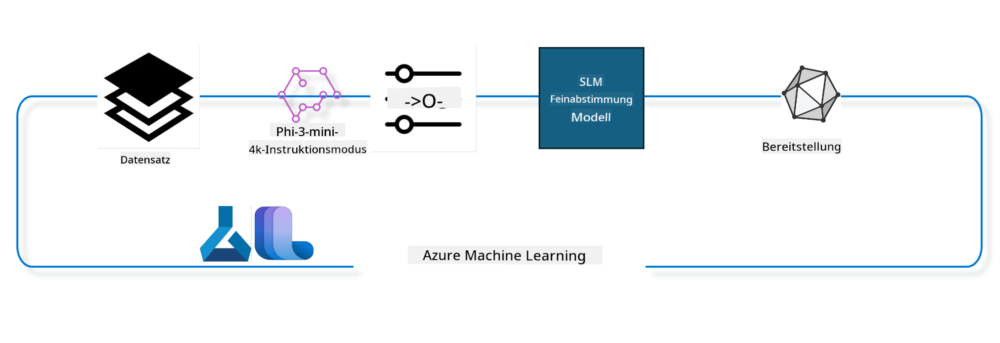

<!--
CO_OP_TRANSLATOR_METADATA:
{
  "original_hash": "944949f040e61b2ea25b3460f7394fd4",
  "translation_date": "2025-03-27T14:30:57+00:00",
  "source_file": "md\\03.FineTuning\\FineTuning_MLSDK.md",
  "language_code": "de"
}
-->
## Wie man Chat-Vervollständigungs-Komponenten aus dem Azure ML-Systemregister verwendet, um ein Modell zu verfeinern

In diesem Beispiel werden wir das Modell Phi-3-mini-4k-instruct feinabstimmen, um eine Unterhaltung zwischen zwei Personen mit dem ultrachat_200k-Datensatz abzuschließen.



Das Beispiel zeigt, wie Sie mit dem Azure ML SDK und Python eine Feinabstimmung durchführen und das verfeinerte Modell für Echtzeit-Inferenzen an einem Online-Endpunkt bereitstellen können.

### Trainingsdaten

Wir verwenden den ultrachat_200k-Datensatz. Dies ist eine stark gefilterte Version des UltraChat-Datensatzes, der zur Schulung von Zephyr-7B-β, einem hochmodernen 7B-Chat-Modell, verwendet wurde.

### Modell

Wir verwenden das Modell Phi-3-mini-4k-instruct, um zu zeigen, wie ein Benutzer ein Modell für die Aufgabe der Chat-Vervollständigung verfeinern kann. Wenn Sie dieses Notebook von einer spezifischen Modellkarte geöffnet haben, denken Sie daran, den spezifischen Modellnamen zu ersetzen.

### Aufgaben

- Wählen Sie ein Modell zur Feinabstimmung aus.
- Wählen und erkunden Sie die Trainingsdaten.
- Konfigurieren Sie den Feinabstimmungsjob.
- Führen Sie den Feinabstimmungsjob aus.
- Überprüfen Sie Trainings- und Evaluierungsmetriken.
- Registrieren Sie das feinabgestimmte Modell.
- Stellen Sie das feinabgestimmte Modell für Echtzeit-Inferenzen bereit.
- Bereinigen Sie Ressourcen.

## 1. Voraussetzungen einrichten

- Abhängigkeiten installieren
- Verbindung zum AzureML-Arbeitsbereich herstellen. Erfahren Sie mehr unter SDK-Authentifizierung einrichten. Ersetzen Sie <WORKSPACE_NAME>, <RESOURCE_GROUP> und <SUBSCRIPTION_ID> unten.
- Verbindung zum AzureML-Systemregister herstellen
- Optionalen Experimentnamen festlegen
- Überprüfen oder erstellen Sie die Berechnung.

> [!NOTE]
> Anforderungen: Ein einzelner GPU-Knoten kann mehrere GPU-Karten haben. Zum Beispiel gibt es in einem Knoten von Standard_NC24rs_v3 vier NVIDIA V100 GPUs, während in Standard_NC12s_v3 zwei NVIDIA V100 GPUs vorhanden sind. Siehe die Dokumentation für diese Informationen. Die Anzahl der GPU-Karten pro Knoten wird unten im Parameter `gpus_per_node` festgelegt. Die korrekte Einstellung dieses Werts stellt sicher, dass alle GPUs im Knoten genutzt werden. Die empfohlenen GPU-Compute-SKUs finden Sie hier und hier.

### Python-Bibliotheken

Installieren Sie Abhängigkeiten, indem Sie die folgende Zelle ausführen. Dieser Schritt ist nicht optional, wenn Sie in einer neuen Umgebung arbeiten.

```bash
pip install azure-ai-ml
pip install azure-identity
pip install datasets==2.9.0
pip install mlflow
pip install azureml-mlflow
```

### Interaktion mit Azure ML

1. Dieses Python-Skript wird verwendet, um mit dem Azure Machine Learning (Azure ML) Service zu interagieren. Hier ist eine Übersicht, was es macht:

    - Es importiert notwendige Module aus den Paketen `azure.ai.ml`, `azure.identity` und `azure.ai.ml.entities`. Außerdem wird das Modul `time` importiert.

    - Es versucht, mit `DefaultAzureCredential()` zu authentifizieren, was eine vereinfachte Authentifizierungserfahrung bietet, um schnell mit der Entwicklung von Anwendungen in der Azure-Cloud zu beginnen. Falls dies fehlschlägt, wechselt es zu `InteractiveBrowserCredential()`, das eine interaktive Login-Eingabeaufforderung bietet.

    - Es versucht dann, eine `MLClient`-Instanz mit der Methode `from_config` zu erstellen, die die Konfiguration aus der Standardkonfigurationsdatei (`config.json`) liest. Falls dies fehlschlägt, erstellt es eine `MLClient`-Instanz, indem es die `subscription_id`, `resource_group_name` und `workspace_name` manuell angibt.

    - Es erstellt eine weitere `MLClient`-Instanz, diesmal für das Azure ML-Register mit dem Namen "azureml". Dieses Register ist der Ort, an dem Modelle, Feinabstimmungspipelines und Umgebungen gespeichert werden.

    - Es setzt den Experimentnamen auf "chat_completion_Phi-3-mini-4k-instruct".

    - Es generiert einen eindeutigen Zeitstempel, indem es die aktuelle Zeit (in Sekunden seit der Epoche, als Gleitkommazahl) in eine ganze Zahl und dann in eine Zeichenkette umwandelt. Dieser Zeitstempel kann verwendet werden, um eindeutige Namen und Versionen zu erstellen.

    ```python
    # Import necessary modules from Azure ML and Azure Identity
    from azure.ai.ml import MLClient
    from azure.identity import (
        DefaultAzureCredential,
        InteractiveBrowserCredential,
    )
    from azure.ai.ml.entities import AmlCompute
    import time  # Import time module
    
    # Try to authenticate using DefaultAzureCredential
    try:
        credential = DefaultAzureCredential()
        credential.get_token("https://management.azure.com/.default")
    except Exception as ex:  # If DefaultAzureCredential fails, use InteractiveBrowserCredential
        credential = InteractiveBrowserCredential()
    
    # Try to create an MLClient instance using the default config file
    try:
        workspace_ml_client = MLClient.from_config(credential=credential)
    except:  # If that fails, create an MLClient instance by manually providing the details
        workspace_ml_client = MLClient(
            credential,
            subscription_id="<SUBSCRIPTION_ID>",
            resource_group_name="<RESOURCE_GROUP>",
            workspace_name="<WORKSPACE_NAME>",
        )
    
    # Create another MLClient instance for the Azure ML registry named "azureml"
    # This registry is where models, fine-tuning pipelines, and environments are stored
    registry_ml_client = MLClient(credential, registry_name="azureml")
    
    # Set the experiment name
    experiment_name = "chat_completion_Phi-3-mini-4k-instruct"
    
    # Generate a unique timestamp that can be used for names and versions that need to be unique
    timestamp = str(int(time.time()))
    ```

## 2. Wählen Sie ein Basis-Modell zur Feinabstimmung aus

1. Phi-3-mini-4k-instruct ist ein leichtgewichtiges, hochmodernes Open-Modell mit 3,8 Milliarden Parametern, das auf Datensätzen basiert, die für Phi-2 verwendet wurden. Das Modell gehört zur Phi-3-Modellfamilie, und die Mini-Version gibt es in zwei Varianten: 4K und 128K, was die Kontextlänge (in Tokens) darstellt, die es unterstützen kann. Wir müssen das Modell für unseren spezifischen Zweck verfeinern, um es zu verwenden. Sie können diese Modelle im Modellkatalog im AzureML Studio durchsuchen, indem Sie nach der Aufgabe "Chat-Vervollständigung" filtern. In diesem Beispiel verwenden wir das Modell Phi-3-mini-4k-instruct. Wenn Sie dieses Notebook für ein anderes Modell geöffnet haben, ersetzen Sie den Modellnamen und die Version entsprechend.

    > [!NOTE]
    > Die `model id`-Eigenschaft des Modells. Diese wird als Eingabe für den Feinabstimmungsjob übergeben. Sie ist auch als Feld "Asset ID" auf der Modell-Detailseite im AzureML Studio Modellkatalog verfügbar.

2. Dieses Python-Skript interagiert mit dem Azure Machine Learning (Azure ML) Service. Hier ist eine Übersicht, was es macht:

    - Es setzt den `model_name` auf "Phi-3-mini-4k-instruct".

    - Es verwendet die `get`-Methode der `models`-Eigenschaft des Objekts `registry_ml_client`, um die neueste Version des Modells mit dem angegebenen Namen aus dem Azure ML-Register abzurufen. Die `get`-Methode wird mit zwei Argumenten aufgerufen: dem Namen des Modells und einem Label, das angibt, dass die neueste Version des Modells abgerufen werden soll.

    - Es gibt eine Nachricht in der Konsole aus, die den Namen, die Version und die ID des Modells angibt, das für die Feinabstimmung verwendet wird. Die `format`-Methode der Zeichenkette wird verwendet, um den Namen, die Version und die ID des Modells in die Nachricht einzufügen. Der Name, die Version und die ID des Modells werden als Eigenschaften des Objekts `foundation_model` abgerufen.

    ```python
    # Set the model name
    model_name = "Phi-3-mini-4k-instruct"
    
    # Get the latest version of the model from the Azure ML registry
    foundation_model = registry_ml_client.models.get(model_name, label="latest")
    
    # Print the model name, version, and id
    # This information is useful for tracking and debugging
    print(
        "\n\nUsing model name: {0}, version: {1}, id: {2} for fine tuning".format(
            foundation_model.name, foundation_model.version, foundation_model.id
        )
    )
    ```

## 3. Erstellen Sie eine Berechnung für den Job

Der Feinabstimmungsjob funktioniert NUR mit GPU-Computern. Die Größe der Berechnung hängt davon ab, wie groß das Modell ist, und es kann in den meisten Fällen schwierig sein, die richtige Berechnung für den Job zu identifizieren. In dieser Zelle leiten wir den Benutzer an, die richtige Berechnung für den Job auszuwählen.

> [!NOTE]
> Die unten aufgeführten Computer funktionieren mit der optimiertesten Konfiguration. Änderungen an der Konfiguration können zu einem "Cuda Out Of Memory"-Fehler führen. In solchen Fällen versuchen Sie, die Berechnung auf eine größere Größe zu aktualisieren.

> [!NOTE]
> Stellen Sie beim Auswählen der `compute_cluster_size` unten sicher, dass die Berechnung in Ihrer Ressourcengruppe verfügbar ist. Wenn eine bestimmte Berechnung nicht verfügbar ist, können Sie eine Anfrage stellen, um Zugriff auf die Rechenressourcen zu erhalten.

### Überprüfung des Modells auf Unterstützung der Feinabstimmung

1. Dieses Python-Skript interagiert mit einem Azure Machine Learning (Azure ML)-Modell. Hier ist eine Übersicht, was es macht:

    - Es importiert das Modul `ast`, das Funktionen zur Verarbeitung von Bäumen der abstrakten Syntaxgrammatik von Python bereitstellt.

    - Es überprüft, ob das Objekt `foundation_model` (das ein Modell in Azure ML darstellt) ein Tag mit dem Namen `finetune_compute_allow_list` hat. Tags in Azure ML sind Schlüssel-Wert-Paare, die Sie erstellen und verwenden können, um Modelle zu filtern und zu sortieren.

    - Wenn das Tag `finetune_compute_allow_list` vorhanden ist, verwendet es die Funktion `ast.literal_eval`, um den Wert des Tags (einen String) sicher in eine Python-Liste zu parsen. Diese Liste wird dann der Variablen `computes_allow_list` zugewiesen. Es gibt dann eine Nachricht aus, die angibt, dass eine Berechnung aus der Liste erstellt werden sollte.

    - Wenn das Tag `finetune_compute_allow_list` nicht vorhanden ist, setzt es `computes_allow_list` auf `None` und gibt eine Nachricht aus, die angibt, dass das Tag `finetune_compute_allow_list` nicht Teil der Tags des Modells ist.

    - Zusammenfassend überprüft dieses Skript ein spezifisches Tag in den Metadaten des Modells, konvertiert den Wert des Tags in eine Liste, falls es existiert, und gibt entsprechend Rückmeldung an den Benutzer.

    ```python
    # Import the ast module, which provides functions to process trees of the Python abstract syntax grammar
    import ast
    
    # Check if the 'finetune_compute_allow_list' tag is present in the model's tags
    if "finetune_compute_allow_list" in foundation_model.tags:
        # If the tag is present, use ast.literal_eval to safely parse the tag's value (a string) into a Python list
        computes_allow_list = ast.literal_eval(
            foundation_model.tags["finetune_compute_allow_list"]
        )  # convert string to python list
        # Print a message indicating that a compute should be created from the list
        print(f"Please create a compute from the above list - {computes_allow_list}")
    else:
        # If the tag is not present, set computes_allow_list to None
        computes_allow_list = None
        # Print a message indicating that the 'finetune_compute_allow_list' tag is not part of the model's tags
        print("`finetune_compute_allow_list` is not part of model tags")
    ```

### Überprüfung der Berechnungsinstanz

1. Dieses Python-Skript interagiert mit dem Azure Machine Learning (Azure ML)-Service und führt mehrere Überprüfungen an einer Berechnungsinstanz durch. Hier ist eine Übersicht, was es macht:

    - Es versucht, die Berechnungsinstanz mit dem in `compute_cluster` gespeicherten Namen aus dem Azure ML-Arbeitsbereich abzurufen. Wenn der Bereitstellungsstatus der Berechnungsinstanz "fehlgeschlagen" ist, löst es einen `ValueError` aus.

    - Es überprüft, ob `computes_allow_list` nicht `None` ist. Falls nicht, konvertiert es alle Berechnungsgrößen in der Liste in Kleinbuchstaben und überprüft, ob die Größe der aktuellen Berechnungsinstanz in der Liste enthalten ist. Falls nicht, löst es einen `ValueError` aus.

    - Falls `computes_allow_list` `None` ist, überprüft es, ob die Größe der Berechnungsinstanz in einer Liste von nicht unterstützten GPU-VM-Größen enthalten ist. Falls ja, löst es einen `ValueError` aus.

    - Es ruft eine Liste aller verfügbaren Berechnungsgrößen im Arbeitsbereich ab. Es iteriert dann über diese Liste, und für jede Berechnungsgröße überprüft es, ob deren Name mit der Größe der aktuellen Berechnungsinstanz übereinstimmt. Falls ja, ruft es die Anzahl der GPUs für diese Berechnungsgröße ab und setzt `gpu_count_found` auf `True`.

    - Wenn `gpu_count_found` `True` ist, gibt es die Anzahl der GPUs in der Berechnungsinstanz aus. Falls `gpu_count_found` `False` ist, löst es einen `ValueError` aus.

    - Zusammenfassend führt dieses Skript mehrere Überprüfungen an einer Berechnungsinstanz in einem Azure ML-Arbeitsbereich durch, einschließlich des Bereitstellungsstatus, der Größe im Vergleich zu einer Zulassungs- oder Ausschlussliste und der Anzahl der GPUs. 

    ```python
    # Print the exception message
    print(e)
    # Raise a ValueError if the compute size is not available in the workspace
    raise ValueError(
        f"WARNING! Compute size {compute_cluster_size} not available in workspace"
    )
    
    # Retrieve the compute instance from the Azure ML workspace
    compute = workspace_ml_client.compute.get(compute_cluster)
    # Check if the provisioning state of the compute instance is "failed"
    if compute.provisioning_state.lower() == "failed":
        # Raise a ValueError if the provisioning state is "failed"
        raise ValueError(
            f"Provisioning failed, Compute '{compute_cluster}' is in failed state. "
            f"please try creating a different compute"
        )
    
    # Check if computes_allow_list is not None
    if computes_allow_list is not None:
        # Convert all compute sizes in computes_allow_list to lowercase
        computes_allow_list_lower_case = [x.lower() for x in computes_allow_list]
        # Check if the size of the compute instance is in computes_allow_list_lower_case
        if compute.size.lower() not in computes_allow_list_lower_case:
            # Raise a ValueError if the size of the compute instance is not in computes_allow_list_lower_case
            raise ValueError(
                f"VM size {compute.size} is not in the allow-listed computes for finetuning"
            )
    else:
        # Define a list of unsupported GPU VM sizes
        unsupported_gpu_vm_list = [
            "standard_nc6",
            "standard_nc12",
            "standard_nc24",
            "standard_nc24r",
        ]
        # Check if the size of the compute instance is in unsupported_gpu_vm_list
        if compute.size.lower() in unsupported_gpu_vm_list:
            # Raise a ValueError if the size of the compute instance is in unsupported_gpu_vm_list
            raise ValueError(
                f"VM size {compute.size} is currently not supported for finetuning"
            )
    
    # Initialize a flag to check if the number of GPUs in the compute instance has been found
    gpu_count_found = False
    # Retrieve a list of all available compute sizes in the workspace
    workspace_compute_sku_list = workspace_ml_client.compute.list_sizes()
    available_sku_sizes = []
    # Iterate over the list of available compute sizes
    for compute_sku in workspace_compute_sku_list:
        available_sku_sizes.append(compute_sku.name)
        # Check if the name of the compute size matches the size of the compute instance
        if compute_sku.name.lower() == compute.size.lower():
            # If it does, retrieve the number of GPUs for that compute size and set gpu_count_found to True
            gpus_per_node = compute_sku.gpus
            gpu_count_found = True
    # If gpu_count_found is True, print the number of GPUs in the compute instance
    if gpu_count_found:
        print(f"Number of GPU's in compute {compute.size}: {gpus_per_node}")
    else:
        # If gpu_count_found is False, raise a ValueError
        raise ValueError(
            f"Number of GPU's in compute {compute.size} not found. Available skus are: {available_sku_sizes}."
            f"This should not happen. Please check the selected compute cluster: {compute_cluster} and try again."
        )
    ```

## 4. Wählen Sie den Datensatz zur Feinabstimmung des Modells

1. Wir verwenden den ultrachat_200k-Datensatz. Der Datensatz hat vier Splits, die für Supervised Fine-Tuning (sft) geeignet sind.
Generierungsranking (gen). Die Anzahl der Beispiele pro Split ist wie folgt:

    ```bash
    train_sft test_sft  train_gen  test_gen
    207865  23110  256032  28304
    ```

1. Die nächsten Zellen zeigen grundlegende Datenvorbereitung für die Feinabstimmung:

### Einige Datenzeilen visualisieren

Wir möchten, dass dieses Beispiel schnell ausgeführt wird, also speichern wir die Dateien `train_sft` und `test_sft`, die 5 % der bereits beschnittenen Zeilen enthalten. Das bedeutet, dass das feinabgestimmte Modell eine geringere Genauigkeit haben wird, daher sollte es nicht für den realen Einsatz verwendet werden.
Das Skript `download-dataset.py` wird verwendet, um den ultrachat_200k-Datensatz herunterzuladen und den Datensatz in ein Format umzuwandeln, das von der Feinabstimmungspipeline-Komponente konsumiert werden kann. Da der Datensatz groß ist, verwenden wir hier nur einen Teil des Datensatzes.

1. Das folgende Skript lädt nur 5 % der Daten herunter. Dies kann durch Ändern des Parameters `dataset_split_pc` auf den gewünschten Prozentsatz erhöht werden.

    > [!NOTE]
    > Einige Sprachmodelle haben unterschiedliche Sprachcodes, daher sollten die Spaltennamen im Datensatz entsprechend angepasst werden.

1. Hier ist ein Beispiel, wie die Daten aussehen sollten:
Der Chat-Vervollständigungs-Datensatz wird im Parquet-Format gespeichert, wobei jeder Eintrag das folgende Schema verwendet:

    - Dies ist ein JSON-Dokument (JavaScript Object Notation), ein beliebtes Datenformat für den Austausch. Es ist kein ausführbarer Code, sondern eine Möglichkeit, Daten zu speichern und zu transportieren. Hier ist eine Übersicht über seine Struktur:

    - "prompt": Dieser Schlüssel enthält einen Zeichenkettenwert, der eine Aufgabe oder Frage darstellt, die einem KI-Assistenten gestellt wird.

    - "messages": Dieser Schlüssel enthält ein Array von Objekten. Jedes Objekt stellt eine Nachricht in einer Unterhaltung zwischen einem Benutzer und einem KI-Assistenten dar. Jedes Nachrichtenobjekt hat zwei Schlüssel:

    - "content": Dieser Schlüssel enthält einen Zeichenkettenwert, der den Inhalt der Nachricht darstellt.
    - "role": Dieser Schlüssel enthält einen Zeichenkettenwert, der die Rolle der Entität darstellt, die die Nachricht gesendet hat. Es kann entweder "user" oder "assistant" sein.
    - "prompt_id": Dieser Schlüssel enthält einen Zeichenkettenwert, der eine eindeutige Kennung für die Eingabeaufforderung darstellt.

1. In diesem spezifischen JSON-Dokument wird eine Unterhaltung dargestellt, bei der ein Benutzer einen KI-Assistenten auffordert, einen Protagonisten für eine dystopische Geschichte zu erstellen. Der Assistent antwortet, und der Benutzer fordert dann weitere Details an. Der Assistent stimmt zu, weitere Details bereitzustellen. Die gesamte Unterhaltung ist mit einer spezifischen `prompt_id` verknüpft.

    ```python
    {
        // The task or question posed to an AI assistant
        "prompt": "Create a fully-developed protagonist who is challenged to survive within a dystopian society under the rule of a tyrant. ...",
        
        // An array of objects, each representing a message in a conversation between a user and an AI assistant
        "messages":[
            {
                // The content of the user's message
                "content": "Create a fully-developed protagonist who is challenged to survive within a dystopian society under the rule of a tyrant. ...",
                // The role of the entity that sent the message
                "role": "user"
            },
            {
                // The content of the assistant's message
                "content": "Name: Ava\n\n Ava was just 16 years old when the world as she knew it came crashing down. The government had collapsed, leaving behind a chaotic and lawless society. ...",
                // The role of the entity that sent the message
                "role": "assistant"
            },
            {
                // The content of the user's message
                "content": "Wow, Ava's story is so intense and inspiring! Can you provide me with more details.  ...",
                // The role of the entity that sent the message
                "role": "user"
            }, 
            {
                // The content of the assistant's message
                "content": "Certainly! ....",
                // The role of the entity that sent the message
                "role": "assistant"
            }
        ],
        
        // A unique identifier for the prompt
        "prompt_id": "d938b65dfe31f05f80eb8572964c6673eddbd68eff3db6bd234d7f1e3b86c2af"
    }
    ```

### Daten herunterladen

1. Dieses Python-Skript wird verwendet, um einen Datensatz mit einem Hilfsskript namens `download-dataset.py` herunterzuladen. Hier ist eine Übersicht, was es macht:

    - Es importiert das Modul `os`, das eine plattformübergreifende Möglichkeit bietet, betriebssystemspezifische Funktionalitäten zu nutzen.

    - Es verwendet die Funktion `os.system`, um das Skript `download-dataset.py` mit spezifischen Befehlszeilenargumenten in der Shell auszuführen. Die Argumente geben an, welcher Datensatz heruntergeladen werden soll (`HuggingFaceH4/ultrachat_200k`), in welches Verzeichnis er heruntergeladen werden soll (`ultrachat_200k_dataset`) und wie viel Prozent des Datensatzes aufgeteilt werden sollen (5). Die Funktion `os.system` gibt den Exit-Status des ausgeführten Befehls zurück; dieser Status wird in der Variablen `exit_status` gespeichert.

    - Es überprüft, ob `exit_status` nicht 0 ist. In Unix-ähnlichen Betriebssystemen zeigt ein Exit-Status von 0 normalerweise an, dass ein Befehl erfolgreich war, während jede andere Zahl einen Fehler anzeigt. Wenn `exit_status` nicht 0 ist, löst es eine Ausnahme mit einer Nachricht aus, die darauf hinweist, dass ein Fehler beim Herunterladen des Datensatzes aufgetreten ist.

    - Zusammenfassend führt dieses Skript einen Befehl aus, um einen Datensatz mit einem Hilfsskript herunterzuladen, und löst eine Ausnahme aus, wenn der Befehl fehlschlägt.

    ```python
    # Import the os module, which provides a way of using operating system dependent functionality
    import os
    
    # Use the os.system function to run the download-dataset.py script in the shell with specific command-line arguments
    # The arguments specify the dataset to download (HuggingFaceH4/ultrachat_200k), the directory to download it to (ultrachat_200k_dataset), and the percentage of the dataset to split (5)
    # The os.system function returns the exit status of the command it executed; this status is stored in the exit_status variable
    exit_status = os.system(
        "python ./download-dataset.py --dataset HuggingFaceH4/ultrachat_200k --download_dir ultrachat_200k_dataset --dataset_split_pc 5"
    )
    
    # Check if exit_status is not 0
    # In Unix-like operating systems, an exit status of 0 usually indicates that a command has succeeded, while any other number indicates an error
    # If exit_status is not 0, raise an Exception with a message indicating that there was an error downloading the dataset
    if exit_status != 0:
        raise Exception("Error downloading dataset")
    ```

### Laden von Daten in ein DataFrame

1. Dieses Python-Skript lädt eine JSON-Lines-Datei in ein pandas-DataFrame und zeigt die ersten fünf Zeilen an. Hier ist eine Übersicht, was es macht:

    - Es importiert die Bibliothek `pandas`, eine leistungsstarke Bibliothek zur Datenmanipulation und -analyse.

    - Es setzt die maximale Spaltenbreite für pandas' Anzeigeoptionen auf 0. Das bedeutet, dass der vollständige Text jeder Spalte ohne Kürzung angezeigt wird, wenn das DataFrame gedruckt wird.

    - Es verwendet die Funktion `pd.read_json`, um die Datei `train_sft.jsonl` aus dem Verzeichnis `ultrachat_200k_dataset` in ein DataFrame zu laden. Das Argument `lines=True` gibt an, dass die Datei im JSON-Lines-Format vorliegt, bei dem jede Zeile ein separates JSON-Objekt ist.

    - Es verwendet die Methode `head`, um die ersten fünf Zeilen des DataFrame anzuzeigen. Wenn das DataFrame weniger als fünf Zeilen hat, werden alle angezeigt.

    - Zusammenfassend lädt dieses Skript eine JSON-Lines-Datei in ein DataFrame und zeigt die ersten fünf Zeilen mit vollständigem Spaltentext an.

    ```python
    # Import the pandas library, which is a powerful data manipulation and analysis library
    import pandas as pd
    
    # Set the maximum column width for pandas' display options to 0
    # This means that the full text of each column will be displayed without truncation when the DataFrame is printed
    pd.set_option("display.max_colwidth", 0)
    
    # Use the pd.read_json function to load the train_sft.jsonl file from the ultrachat_200k_dataset directory into a DataFrame
    # The lines=True argument indicates that the file is in JSON Lines format, where each line is a separate JSON object
    df = pd.read_json("./ultrachat_200k_dataset/train_sft.jsonl", lines=True)
    
    # Use the head method to display the first 5 rows of the DataFrame
    # If the DataFrame has less than 5 rows, it will display all of them
    df.head()
    ```

## 5. Senden Sie den Feinabstimmungsjob unter Verwendung des Modells und der Daten als Eingaben

Erstellen Sie den Job, der die Chat-Vervollständigungs-Pipeline-Komponente verwendet. Erfahren Sie mehr über alle unterstützten Parameter für die Feinabstimmung.

### Feinabstimmungsparameter definieren

1. Feinabstimmungsparameter können in zwei Kategorien unterteilt werden: Trainingsparameter und Optimierungsparameter.

1. Trainingsparameter definieren die Trainingsaspekte wie:

    - Den Optimierer, Scheduler, der verwendet werden soll
    - Die Metrik zur Optimierung der Feinabstimmung
    - Anzahl der Trainingsschritte, Batch-Größen und so weiter
    - Optimierungsparameter helfen bei der Optimierung des GPU-Speichers und der effektiven Nutzung der Computeressourcen.

1. Unten sind einige der Parameter aufgeführt, die zu dieser Kategorie gehören. Die Optimierungsparameter unterscheiden sich je nach Modell und sind mit dem Modell verpackt, um diese Variationen zu handhaben.

    - Aktivieren Sie DeepSpeed und LoRA
    - Aktivieren Sie Mixed Precision Training
    - Aktivieren Sie Multi-Node-Training

> [!NOTE]
> Überwachtes Feinabstimmen kann zu einem Verlust der Ausrichtung oder katastrophalem Vergessen führen. Wir empfehlen, dieses Problem zu überprüfen und eine Ausrichtungsphase durchzuführen, nachdem Sie die Feinabstimmung
Trainingspipeline basierend auf verschiedenen Parametern und anschließender Ausgabe des Anzeigenamens. ```python
    # Define a function to generate a display name for the training pipeline
    def get_pipeline_display_name():
        # Calculate the total batch size by multiplying the per-device batch size, the number of gradient accumulation steps, the number of GPUs per node, and the number of nodes used for fine-tuning
        batch_size = (
            int(finetune_parameters.get("per_device_train_batch_size", 1))
            * int(finetune_parameters.get("gradient_accumulation_steps", 1))
            * int(gpus_per_node)
            * int(finetune_parameters.get("num_nodes_finetune", 1))
        )
        # Retrieve the learning rate scheduler type
        scheduler = finetune_parameters.get("lr_scheduler_type", "linear")
        # Retrieve whether DeepSpeed is applied
        deepspeed = finetune_parameters.get("apply_deepspeed", "false")
        # Retrieve the DeepSpeed stage
        ds_stage = finetune_parameters.get("deepspeed_stage", "2")
        # If DeepSpeed is applied, include "ds" followed by the DeepSpeed stage in the display name; if not, include "nods"
        if deepspeed == "true":
            ds_string = f"ds{ds_stage}"
        else:
            ds_string = "nods"
        # Retrieve whether Layer-wise Relevance Propagation (LoRa) is applied
        lora = finetune_parameters.get("apply_lora", "false")
        # If LoRa is applied, include "lora" in the display name; if not, include "nolora"
        if lora == "true":
            lora_string = "lora"
        else:
            lora_string = "nolora"
        # Retrieve the limit on the number of model checkpoints to keep
        save_limit = finetune_parameters.get("save_total_limit", -1)
        # Retrieve the maximum sequence length
        seq_len = finetune_parameters.get("max_seq_length", -1)
        # Construct the display name by concatenating all these parameters, separated by hyphens
        return (
            model_name
            + "-"
            + "ultrachat"
            + "-"
            + f"bs{batch_size}"
            + "-"
            + f"{scheduler}"
            + "-"
            + ds_string
            + "-"
            + lora_string
            + f"-save_limit{save_limit}"
            + f"-seqlen{seq_len}"
        )
    
    # Call the function to generate the display name
    pipeline_display_name = get_pipeline_display_name()
    # Print the display name
    print(f"Display name used for the run: {pipeline_display_name}")
    ```

### Pipeline konfigurieren

Dieses Python-Skript definiert und konfiguriert eine Machine-Learning-Pipeline mit dem Azure Machine Learning SDK. Hier ist eine Übersicht darüber, was es macht:

1. Es importiert notwendige Module aus dem Azure AI ML SDK.  
1. Es ruft eine Pipeline-Komponente namens "chat_completion_pipeline" aus dem Registry ab.  
1. Es definiert einen Pipeline-Job mit `@pipeline` decorator and the function `create_pipeline`. The name of the pipeline is set to `pipeline_display_name`.

1. Inside the `create_pipeline` function, it initializes the fetched pipeline component with various parameters, including the model path, compute clusters for different stages, dataset splits for training and testing, the number of GPUs to use for fine-tuning, and other fine-tuning parameters.

1. It maps the output of the fine-tuning job to the output of the pipeline job. This is done so that the fine-tuned model can be easily registered, which is required to deploy the model to an online or batch endpoint.

1. It creates an instance of the pipeline by calling the `create_pipeline` function.

1. It sets the `force_rerun` setting of the pipeline to `True`, meaning that cached results from previous jobs will not be used.

1. It sets the `continue_on_step_failure` setting of the pipeline to `False`, was bedeutet, dass die Pipeline stoppt, wenn ein Schritt fehlschlägt.  
1. Zusammengefasst definiert und konfiguriert dieses Skript eine Machine-Learning-Pipeline für eine Chat-Vervollständigungsaufgabe mit dem Azure Machine Learning SDK.  

```python
    # Import necessary modules from the Azure AI ML SDK
    from azure.ai.ml.dsl import pipeline
    from azure.ai.ml import Input
    
    # Fetch the pipeline component named "chat_completion_pipeline" from the registry
    pipeline_component_func = registry_ml_client.components.get(
        name="chat_completion_pipeline", label="latest"
    )
    
    # Define the pipeline job using the @pipeline decorator and the function create_pipeline
    # The name of the pipeline is set to pipeline_display_name
    @pipeline(name=pipeline_display_name)
    def create_pipeline():
        # Initialize the fetched pipeline component with various parameters
        # These include the model path, compute clusters for different stages, dataset splits for training and testing, the number of GPUs to use for fine-tuning, and other fine-tuning parameters
        chat_completion_pipeline = pipeline_component_func(
            mlflow_model_path=foundation_model.id,
            compute_model_import=compute_cluster,
            compute_preprocess=compute_cluster,
            compute_finetune=compute_cluster,
            compute_model_evaluation=compute_cluster,
            # Map the dataset splits to parameters
            train_file_path=Input(
                type="uri_file", path="./ultrachat_200k_dataset/train_sft.jsonl"
            ),
            test_file_path=Input(
                type="uri_file", path="./ultrachat_200k_dataset/test_sft.jsonl"
            ),
            # Training settings
            number_of_gpu_to_use_finetuning=gpus_per_node,  # Set to the number of GPUs available in the compute
            **finetune_parameters
        )
        return {
            # Map the output of the fine tuning job to the output of pipeline job
            # This is done so that we can easily register the fine tuned model
            # Registering the model is required to deploy the model to an online or batch endpoint
            "trained_model": chat_completion_pipeline.outputs.mlflow_model_folder
        }
    
    # Create an instance of the pipeline by calling the create_pipeline function
    pipeline_object = create_pipeline()
    
    # Don't use cached results from previous jobs
    pipeline_object.settings.force_rerun = True
    
    # Set continue on step failure to False
    # This means that the pipeline will stop if any step fails
    pipeline_object.settings.continue_on_step_failure = False
    ```

### Job einreichen

1. Dieses Python-Skript reicht einen Machine-Learning-Pipeline-Job in einem Azure Machine Learning-Arbeitsbereich ein und wartet darauf, dass der Job abgeschlossen wird. Hier ist eine Übersicht darüber, was es macht:

   - Es ruft die Methode `create_or_update` des `jobs`-Objekts im `workspace_ml_client` auf, um den Pipeline-Job einzureichen. Die auszuführende Pipeline wird durch `pipeline_object` angegeben, und das Experiment, unter dem der Job ausgeführt wird, wird durch `experiment_name` spezifiziert.  
   - Es ruft die Methode `stream` des `jobs`-Objekts im `workspace_ml_client` auf, um auf den Abschluss des Pipeline-Jobs zu warten. Der Job, auf den gewartet wird, wird durch das Attribut `name` des `pipeline_job`-Objekts angegeben.  
   - Zusammengefasst reicht dieses Skript einen Machine-Learning-Pipeline-Job in einem Azure Machine Learning-Arbeitsbereich ein und wartet darauf, dass der Job abgeschlossen wird.  

```python
    # Submit the pipeline job to the Azure Machine Learning workspace
    # The pipeline to be run is specified by pipeline_object
    # The experiment under which the job is run is specified by experiment_name
    pipeline_job = workspace_ml_client.jobs.create_or_update(
        pipeline_object, experiment_name=experiment_name
    )
    
    # Wait for the pipeline job to complete
    # The job to wait for is specified by the name attribute of the pipeline_job object
    workspace_ml_client.jobs.stream(pipeline_job.name)
    ```

## 6. Das fein abgestimmte Modell im Arbeitsbereich registrieren

Wir registrieren das Modell aus der Ausgabe des Feinabstimmungs-Jobs. Dadurch wird die Abstammung zwischen dem fein abgestimmten Modell und dem Feinabstimmungs-Job nachverfolgt. Der Feinabstimmungs-Job wiederum verfolgt die Abstammung zum Basis-Modell, den Daten und dem Trainingscode.

### ML-Modell registrieren

1. Dieses Python-Skript registriert ein Machine-Learning-Modell, das in einer Azure Machine Learning-Pipeline trainiert wurde. Hier ist eine Übersicht darüber, was es macht:

   - Es importiert notwendige Module aus dem Azure AI ML SDK.  
   - Es überprüft, ob die `trained_model`-Ausgabe aus dem Pipeline-Job verfügbar ist, indem es die Methode `get` des `jobs`-Objekts im `workspace_ml_client` aufruft und auf dessen `outputs`-Attribut zugreift.  
   - Es erstellt einen Pfad zum trainierten Modell, indem es einen String mit dem Namen des Pipeline-Jobs und dem Namen der Ausgabe ("trained_model") formatiert.  
   - Es definiert einen Namen für das fein abgestimmte Modell, indem es "-ultrachat-200k" an den ursprünglichen Modellnamen anhängt und alle Schrägstriche durch Bindestriche ersetzt.  
   - Es bereitet die Registrierung des Modells vor, indem es ein `Model`-Objekt mit verschiedenen Parametern erstellt, einschließlich des Pfades zum Modell, des Typs des Modells (MLflow-Modell), des Namens und der Version des Modells sowie einer Beschreibung des Modells.  
   - Es registriert das Modell, indem es die Methode `create_or_update` des `models`-Objekts im `workspace_ml_client` mit dem `Model`-Objekt als Argument aufruft.  
   - Es gibt das registrierte Modell aus.  

1. Zusammengefasst registriert dieses Skript ein Machine-Learning-Modell, das in einer Azure Machine Learning-Pipeline trainiert wurde.  

```python
    # Import necessary modules from the Azure AI ML SDK
    from azure.ai.ml.entities import Model
    from azure.ai.ml.constants import AssetTypes
    
    # Check if the `trained_model` output is available from the pipeline job
    print("pipeline job outputs: ", workspace_ml_client.jobs.get(pipeline_job.name).outputs)
    
    # Construct a path to the trained model by formatting a string with the name of the pipeline job and the name of the output ("trained_model")
    model_path_from_job = "azureml://jobs/{0}/outputs/{1}".format(
        pipeline_job.name, "trained_model"
    )
    
    # Define a name for the fine-tuned model by appending "-ultrachat-200k" to the original model name and replacing any slashes with hyphens
    finetuned_model_name = model_name + "-ultrachat-200k"
    finetuned_model_name = finetuned_model_name.replace("/", "-")
    
    print("path to register model: ", model_path_from_job)
    
    # Prepare to register the model by creating a Model object with various parameters
    # These include the path to the model, the type of the model (MLflow model), the name and version of the model, and a description of the model
    prepare_to_register_model = Model(
        path=model_path_from_job,
        type=AssetTypes.MLFLOW_MODEL,
        name=finetuned_model_name,
        version=timestamp,  # Use timestamp as version to avoid version conflict
        description=model_name + " fine tuned model for ultrachat 200k chat-completion",
    )
    
    print("prepare to register model: \n", prepare_to_register_model)
    
    # Register the model by calling the create_or_update method of the models object in the workspace_ml_client with the Model object as the argument
    registered_model = workspace_ml_client.models.create_or_update(
        prepare_to_register_model
    )
    
    # Print the registered model
    print("registered model: \n", registered_model)
    ```

## 7. Das fein abgestimmte Modell zu einem Online-Endpunkt bereitstellen

Online-Endpunkte bieten eine dauerhafte REST-API, die in Anwendungen integriert werden kann, die das Modell nutzen müssen.

### Endpunkt verwalten

1. Dieses Python-Skript erstellt einen verwalteten Online-Endpunkt in Azure Machine Learning für ein registriertes Modell. Hier ist eine Übersicht darüber, was es macht:

   - Es importiert notwendige Module aus dem Azure AI ML SDK.  
   - Es definiert einen eindeutigen Namen für den Online-Endpunkt, indem es einen Zeitstempel an den String "ultrachat-completion-" anhängt.  
   - Es bereitet die Erstellung des Online-Endpunkts vor, indem es ein `ManagedOnlineEndpoint`-Objekt mit verschiedenen Parametern erstellt, einschließlich des Namens des Endpunkts, einer Beschreibung des Endpunkts und des Authentifizierungsmodus ("key").  
   - Es erstellt den Online-Endpunkt, indem es die Methode `begin_create_or_update` des `workspace_ml_client` mit dem `ManagedOnlineEndpoint`-Objekt als Argument aufruft. Anschließend wartet es auf den Abschluss der Erstellung, indem es die Methode `wait` aufruft.  

1. Zusammengefasst erstellt dieses Skript einen verwalteten Online-Endpunkt in Azure Machine Learning für ein registriertes Modell.  

```python
    # Import necessary modules from the Azure AI ML SDK
    from azure.ai.ml.entities import (
        ManagedOnlineEndpoint,
        ManagedOnlineDeployment,
        ProbeSettings,
        OnlineRequestSettings,
    )
    
    # Define a unique name for the online endpoint by appending a timestamp to the string "ultrachat-completion-"
    online_endpoint_name = "ultrachat-completion-" + timestamp
    
    # Prepare to create the online endpoint by creating a ManagedOnlineEndpoint object with various parameters
    # These include the name of the endpoint, a description of the endpoint, and the authentication mode ("key")
    endpoint = ManagedOnlineEndpoint(
        name=online_endpoint_name,
        description="Online endpoint for "
        + registered_model.name
        + ", fine tuned model for ultrachat-200k-chat-completion",
        auth_mode="key",
    )
    
    # Create the online endpoint by calling the begin_create_or_update method of the workspace_ml_client with the ManagedOnlineEndpoint object as the argument
    # Then wait for the creation operation to complete by calling the wait method
    workspace_ml_client.begin_create_or_update(endpoint).wait()
    ```

> [!NOTE]  
> Hier finden Sie die Liste der unterstützten SKUs für die Bereitstellung - [Managed online endpoints SKU list](https://learn.microsoft.com/azure/machine-learning/reference-managed-online-endpoints-vm-sku-list)

### ML-Modell bereitstellen

1. Dieses Python-Skript stellt ein registriertes Machine-Learning-Modell zu einem verwalteten Online-Endpunkt in Azure Machine Learning bereit. Hier ist eine Übersicht darüber, was es macht:

   - Es importiert das Modul `ast`, das Funktionen zum Verarbeiten von Bäumen der Python-Abstraktsyntaxgrammatik bereitstellt.  
   - Es setzt den Instanztyp für die Bereitstellung auf "Standard_NC6s_v3".  
   - Es überprüft, ob der Tag `inference_compute_allow_list` im Basis-Modell vorhanden ist. Wenn ja, wird der Tag-Wert von einem String in eine Python-Liste konvertiert und `inference_computes_allow_list` zugewiesen. Wenn nicht, wird `inference_computes_allow_list` auf `None` gesetzt.  
   - Es überprüft, ob der angegebene Instanztyp in der Allow-Liste enthalten ist. Wenn nicht, wird eine Nachricht ausgegeben, die den Benutzer auffordert, einen Instanztyp aus der Allow-Liste auszuwählen.  
   - Es bereitet die Erstellung der Bereitstellung vor, indem es ein `ManagedOnlineDeployment`-Objekt mit verschiedenen Parametern erstellt, einschließlich des Namens der Bereitstellung, des Namens des Endpunkts, der ID des Modells, des Instanztyps und der Anzahl, der Einstellungen für die Lebensfähigkeit und der Anforderungseinstellungen.  
   - Es erstellt die Bereitstellung, indem es die Methode `begin_create_or_update` des `workspace_ml_client` mit dem `ManagedOnlineDeployment`-Objekt als Argument aufruft. Anschließend wartet es auf den Abschluss der Erstellung, indem es die Methode `wait` aufruft.  
   - Es setzt den Traffic des Endpunkts so, dass 100 % des Traffics zur "demo"-Bereitstellung geleitet werden.  
   - Es aktualisiert den Endpunkt, indem es die Methode `begin_create_or_update` des `workspace_ml_client` mit dem `endpoint`-Objekt als Argument aufruft. Anschließend wartet es auf den Abschluss der Aktualisierung, indem es die Methode `result` aufruft.  

1. Zusammengefasst stellt dieses Skript ein registriertes Machine-Learning-Modell zu einem verwalteten Online-Endpunkt in Azure Machine Learning bereit.  

```python
    # Import the ast module, which provides functions to process trees of the Python abstract syntax grammar
    import ast
    
    # Set the instance type for the deployment
    instance_type = "Standard_NC6s_v3"
    
    # Check if the `inference_compute_allow_list` tag is present in the foundation model
    if "inference_compute_allow_list" in foundation_model.tags:
        # If it is, convert the tag value from a string to a Python list and assign it to `inference_computes_allow_list`
        inference_computes_allow_list = ast.literal_eval(
            foundation_model.tags["inference_compute_allow_list"]
        )
        print(f"Please create a compute from the above list - {computes_allow_list}")
    else:
        # If it's not, set `inference_computes_allow_list` to `None`
        inference_computes_allow_list = None
        print("`inference_compute_allow_list` is not part of model tags")
    
    # Check if the specified instance type is in the allow list
    if (
        inference_computes_allow_list is not None
        and instance_type not in inference_computes_allow_list
    ):
        print(
            f"`instance_type` is not in the allow listed compute. Please select a value from {inference_computes_allow_list}"
        )
    
    # Prepare to create the deployment by creating a `ManagedOnlineDeployment` object with various parameters
    demo_deployment = ManagedOnlineDeployment(
        name="demo",
        endpoint_name=online_endpoint_name,
        model=registered_model.id,
        instance_type=instance_type,
        instance_count=1,
        liveness_probe=ProbeSettings(initial_delay=600),
        request_settings=OnlineRequestSettings(request_timeout_ms=90000),
    )
    
    # Create the deployment by calling the `begin_create_or_update` method of the `workspace_ml_client` with the `ManagedOnlineDeployment` object as the argument
    # Then wait for the creation operation to complete by calling the `wait` method
    workspace_ml_client.online_deployments.begin_create_or_update(demo_deployment).wait()
    
    # Set the traffic of the endpoint to direct 100% of the traffic to the "demo" deployment
    endpoint.traffic = {"demo": 100}
    
    # Update the endpoint by calling the `begin_create_or_update` method of the `workspace_ml_client` with the `endpoint` object as the argument
    # Then wait for the update operation to complete by calling the `result` method
    workspace_ml_client.begin_create_or_update(endpoint).result()
    ```

## 8. Den Endpunkt mit Beispieldaten testen

Wir werden einige Beispieldaten aus dem Test-Dataset abrufen und an den Online-Endpunkt zur Inferenz übermitteln. Anschließend zeigen wir die bewerteten Labels neben den Ground-Truth-Labels an.

### Ergebnisse lesen

1. Dieses Python-Skript liest eine JSON-Lines-Datei in ein pandas DataFrame, entnimmt eine zufällige Stichprobe und setzt den Index zurück. Hier ist eine Übersicht darüber, was es macht:

   - Es liest die Datei `./ultrachat_200k_dataset/test_gen.jsonl` in ein pandas DataFrame ein. Die Funktion `read_json` wird mit dem Argument `lines=True` verwendet, da die Datei im JSON-Lines-Format vorliegt, bei dem jede Zeile ein separates JSON-Objekt ist.  
   - Es entnimmt eine zufällige Stichprobe von 1 Zeile aus dem DataFrame. Die Funktion `sample` wird mit dem Argument `n=1` verwendet, um die Anzahl der zufälligen Zeilen anzugeben, die ausgewählt werden sollen.  
   - Es setzt den Index des DataFrames zurück. Die Funktion `reset_index` wird mit dem Argument `drop=True` verwendet, um den ursprünglichen Index zu entfernen und ihn durch einen neuen Index mit Standard-Ganzzahlenwerten zu ersetzen.  
   - Es zeigt die ersten 2 Zeilen des DataFrames mit der Funktion `head` und dem Argument `2` an. Da das DataFrame nach der Stichprobenziehung jedoch nur eine Zeile enthält, wird nur diese eine Zeile angezeigt.  

1. Zusammengefasst liest dieses Skript eine JSON-Lines-Datei in ein pandas DataFrame ein, entnimmt eine zufällige Stichprobe von 1 Zeile, setzt den Index zurück und zeigt die erste Zeile an.  

```python
    # Import pandas library
    import pandas as pd
    
    # Read the JSON Lines file './ultrachat_200k_dataset/test_gen.jsonl' into a pandas DataFrame
    # The 'lines=True' argument indicates that the file is in JSON Lines format, where each line is a separate JSON object
    test_df = pd.read_json("./ultrachat_200k_dataset/test_gen.jsonl", lines=True)
    
    # Take a random sample of 1 row from the DataFrame
    # The 'n=1' argument specifies the number of random rows to select
    test_df = test_df.sample(n=1)
    
    # Reset the index of the DataFrame
    # The 'drop=True' argument indicates that the original index should be dropped and replaced with a new index of default integer values
    # The 'inplace=True' argument indicates that the DataFrame should be modified in place (without creating a new object)
    test_df.reset_index(drop=True, inplace=True)
    
    # Display the first 2 rows of the DataFrame
    # However, since the DataFrame only contains one row after the sampling, this will only display that one row
    test_df.head(2)
    ```

### JSON-Objekt erstellen

1. Dieses Python-Skript erstellt ein JSON-Objekt mit spezifischen Parametern und speichert es in einer Datei. Hier ist eine Übersicht darüber, was es macht:

   - Es importiert das Modul `json`, das Funktionen zum Arbeiten mit JSON-Daten bereitstellt.  
   - Es erstellt ein Dictionary `parameters` mit Schlüsseln und Werten, die Parameter für ein Machine-Learning-Modell darstellen. Die Schlüssel sind "temperature", "top_p", "do_sample" und "max_new_tokens", und ihre entsprechenden Werte sind 0.6, 0.9, True und 200.  
   - Es erstellt ein weiteres Dictionary `test_json` mit zwei Schlüsseln: "input_data" und "params". Der Wert von "input_data" ist ein weiteres Dictionary mit den Schlüsseln "input_string" und "parameters". Der Wert von "input_string" ist eine Liste, die die erste Nachricht aus dem `test_df` DataFrame enthält. Der Wert von "parameters" ist das zuvor erstellte Dictionary `parameters`. Der Wert von "params" ist ein leeres Dictionary.  
   - Es öffnet eine Datei namens `sample_score.json`.  

```python
    # Import the json module, which provides functions to work with JSON data
    import json
    
    # Create a dictionary `parameters` with keys and values that represent parameters for a machine learning model
    # The keys are "temperature", "top_p", "do_sample", and "max_new_tokens", and their corresponding values are 0.6, 0.9, True, and 200 respectively
    parameters = {
        "temperature": 0.6,
        "top_p": 0.9,
        "do_sample": True,
        "max_new_tokens": 200,
    }
    
    # Create another dictionary `test_json` with two keys: "input_data" and "params"
    # The value of "input_data" is another dictionary with keys "input_string" and "parameters"
    # The value of "input_string" is a list containing the first message from the `test_df` DataFrame
    # The value of "parameters" is the `parameters` dictionary created earlier
    # The value of "params" is an empty dictionary
    test_json = {
        "input_data": {
            "input_string": [test_df["messages"][0]],
            "parameters": parameters,
        },
        "params": {},
    }
    
    # Open a file named `sample_score.json` in the `./ultrachat_200k_dataset` directory in write mode
    with open("./ultrachat_200k_dataset/sample_score.json", "w") as f:
        # Write the `test_json` dictionary to the file in JSON format using the `json.dump` function
        json.dump(test_json, f)
    ```

### Endpunkt aufrufen

1. Dieses Python-Skript ruft einen Online-Endpunkt in Azure Machine Learning auf, um eine JSON-Datei zu bewerten. Hier ist eine Übersicht darüber, was es macht:

   - Es ruft die Methode `invoke` der Eigenschaft `online_endpoints` des `workspace_ml_client`-Objekts auf. Diese Methode wird verwendet, um eine Anfrage an einen Online-Endpunkt zu senden und eine Antwort zu erhalten.  
   - Es gibt den Namen des Endpunkts und der Bereitstellung mit den Argumenten `endpoint_name` und `deployment_name` an. In diesem Fall ist der Endpunktname in der Variablen `online_endpoint_name` gespeichert und der Bereitstellungsname lautet "demo".  
   - Es gibt den Pfad zur JSON-Datei, die bewertet werden soll, mit dem Argument `request_file` an. In diesem Fall lautet die Datei `./ultrachat_200k_dataset/sample_score.json`.  
   - Es speichert die Antwort des Endpunkts in der Variablen `response`.  
   - Es gibt die Rohantwort aus.  

1. Zusammengefasst ruft dieses Skript einen Online-Endpunkt in Azure Machine Learning auf, um eine JSON-Datei zu bewerten, und gibt die Antwort aus.  

```python
    # Invoke the online endpoint in Azure Machine Learning to score the `sample_score.json` file
    # The `invoke` method of the `online_endpoints` property of the `workspace_ml_client` object is used to send a request to an online endpoint and get a response
    # The `endpoint_name` argument specifies the name of the endpoint, which is stored in the `online_endpoint_name` variable
    # The `deployment_name` argument specifies the name of the deployment, which is "demo"
    # The `request_file` argument specifies the path to the JSON file to be scored, which is `./ultrachat_200k_dataset/sample_score.json`
    response = workspace_ml_client.online_endpoints.invoke(
        endpoint_name=online_endpoint_name,
        deployment_name="demo",
        request_file="./ultrachat_200k_dataset/sample_score.json",
    )
    
    # Print the raw response from the endpoint
    print("raw response: \n", response, "\n")
    ```

## 9. Den Online-Endpunkt löschen

1. Vergessen Sie nicht, den Online-Endpunkt zu löschen, da sonst der Abrechnungsmesser für die vom Endpunkt genutzte Rechenleistung weiterläuft. Diese Zeile Python-Code löscht einen Online-Endpunkt in Azure Machine Learning. Hier ist eine Übersicht darüber, was sie macht:

   - Es ruft die Methode `begin_delete` der Eigenschaft `online_endpoints` des `workspace_ml_client`-Objekts auf. Diese Methode wird verwendet, um die Löschung eines Online-Endpunkts zu starten.  
   - Es gibt den Namen des zu löschenden Endpunkts mit dem Argument `name` an. In diesem Fall ist der Endpunktname in der Variablen `online_endpoint_name` gespeichert.  
   - Es ruft die Methode `wait` auf, um auf den Abschluss der Löschoperation zu warten. Dies ist eine blockierende Operation, die verhindert, dass das Skript weiterläuft, bis die Löschung abgeschlossen ist.  

1. Zusammengefasst startet diese Zeile Code die Löschung eines Online-Endpunkts in Azure Machine Learning und wartet auf den Abschluss der Operation.  

```python
    # Delete the online endpoint in Azure Machine Learning
    # The `begin_delete` method of the `online_endpoints` property of the `workspace_ml_client` object is used to start the deletion of an online endpoint
    # The `name` argument specifies the name of the endpoint to be deleted, which is stored in the `online_endpoint_name` variable
    # The `wait` method is called to wait for the deletion operation to complete. This is a blocking operation, meaning that it will prevent the script from continuing until the deletion is finished
    workspace_ml_client.online_endpoints.begin_delete(name=online_endpoint_name).wait()
    ```

**Haftungsausschluss**:  
Dieses Dokument wurde mithilfe des KI-Übersetzungsdienstes [Co-op Translator](https://github.com/Azure/co-op-translator) übersetzt. Obwohl wir uns um Genauigkeit bemühen, weisen wir darauf hin, dass automatisierte Übersetzungen Fehler oder Ungenauigkeiten enthalten können. Das Originaldokument in seiner ursprünglichen Sprache sollte als maßgebliche Quelle betrachtet werden. Für kritische Informationen wird eine professionelle menschliche Übersetzung empfohlen. Wir übernehmen keine Haftung für Missverständnisse oder Fehlinterpretationen, die sich aus der Nutzung dieser Übersetzung ergeben.