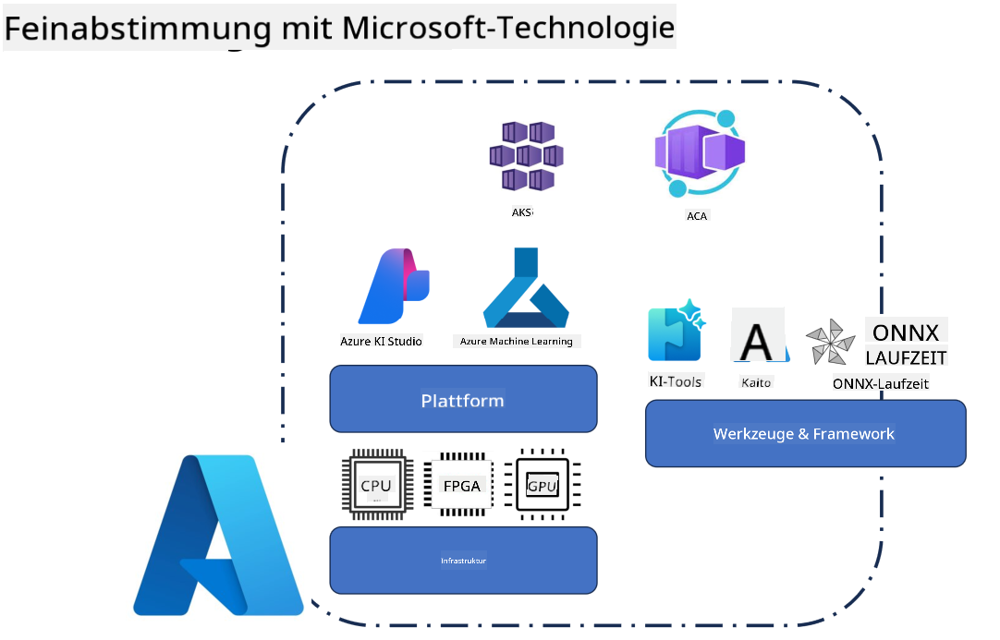
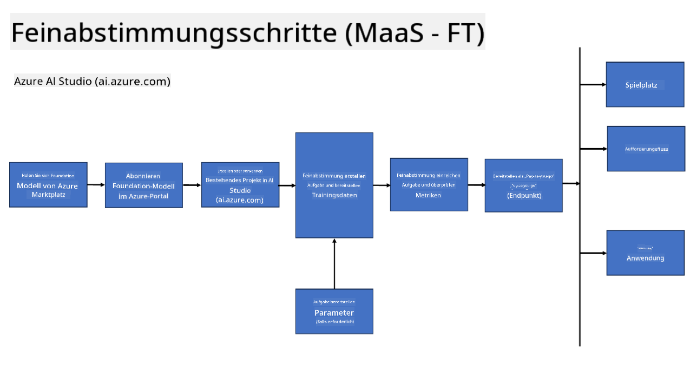
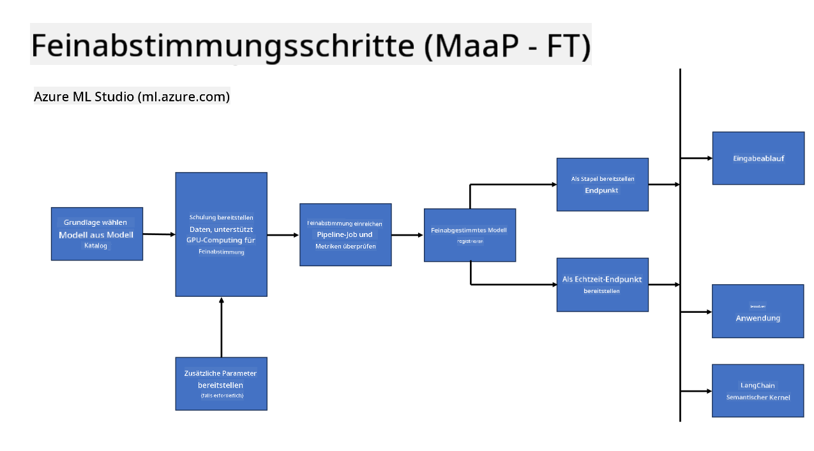
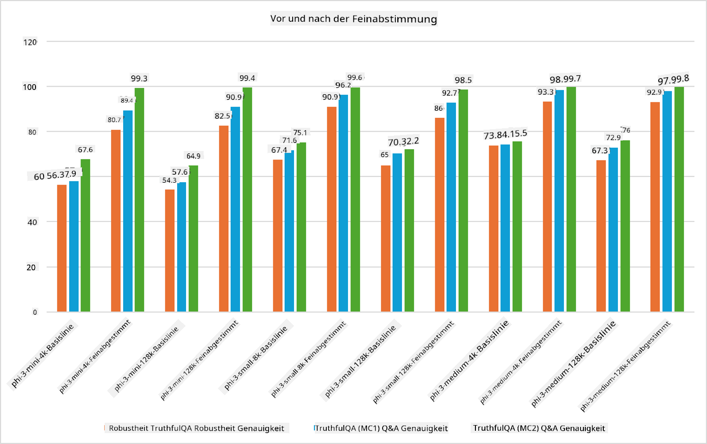

<!--
CO_OP_TRANSLATOR_METADATA:
{
  "original_hash": "cb5648935f63edc17e95ce38f23adc32",
  "translation_date": "2025-03-27T15:14:02+00:00",
  "source_file": "md\\03.FineTuning\\FineTuning_Scenarios.md",
  "language_code": "de"
}
-->
## Szenarien für Feintuning

**Plattform** Dies umfasst verschiedene Technologien wie Azure AI Foundry, Azure Machine Learning, AI Tools, Kaito und ONNX Runtime.

**Infrastruktur** Dazu gehören die CPU und FPGA, die für den Feintuning-Prozess essenziell sind. Lassen Sie mich Ihnen die Symbole für jede dieser Technologien zeigen.

**Tools & Framework** Dazu gehören ONNX Runtime und ONNX Runtime. Lassen Sie mich Ihnen die Symbole für diese Technologien zeigen.
[Symbole für ONNX Runtime und ONNX Runtime einfügen]

Der Feintuning-Prozess mit Microsoft-Technologien umfasst verschiedene Komponenten und Werkzeuge. Durch das Verständnis und die Nutzung dieser Technologien können wir unsere Anwendungen effektiv optimieren und bessere Lösungen entwickeln.

## Modell als Dienst

Feintuning des Modells mithilfe von gehostetem Feintuning, ohne dass Rechenressourcen erstellt und verwaltet werden müssen.

Serverloses Feintuning ist verfügbar für Phi-3-mini- und Phi-3-medium-Modelle, wodurch Entwickler die Modelle schnell und einfach für Cloud- und Edge-Szenarien anpassen können, ohne Rechenressourcen organisieren zu müssen. Wir haben außerdem angekündigt, dass Phi-3-small jetzt über unser Angebot „Models-as-a-Service“ verfügbar ist, sodass Entwickler schnell und einfach mit der KI-Entwicklung beginnen können, ohne die zugrunde liegende Infrastruktur verwalten zu müssen.

## Modell als Plattform

Benutzer verwalten ihre eigenen Rechenressourcen, um ihre Modelle zu optimieren.

[Feintuning-Beispiel](https://github.com/Azure/azureml-examples/blob/main/sdk/python/foundation-models/system/finetune/chat-completion/chat-completion.ipynb)

## Szenarien für Feintuning

| | | | | | | |
|-|-|-|-|-|-|-|
|Szenario|LoRA|QLoRA|PEFT|DeepSpeed|ZeRO|DORA|
|Anpassung vortrainierter LLMs an spezifische Aufgaben oder Domänen|Ja|Ja|Ja|Ja|Ja|Ja|
|Feintuning für NLP-Aufgaben wie Textklassifikation, Named Entity Recognition und maschinelle Übersetzung|Ja|Ja|Ja|Ja|Ja|Ja|
|Feintuning für QA-Aufgaben|Ja|Ja|Ja|Ja|Ja|Ja|
|Feintuning zur Generierung menschlicher Antworten in Chatbots|Ja|Ja|Ja|Ja|Ja|Ja|
|Feintuning zur Generierung von Musik, Kunst oder anderen kreativen Formen|Ja|Ja|Ja|Ja|Ja|Ja|
|Reduzierung von Rechen- und finanziellen Kosten|Ja|Ja|Nein|Ja|Ja|Nein|
|Reduzierung des Speicherverbrauchs|Nein|Ja|Nein|Ja|Ja|Ja|
|Verwendung weniger Parameter für effizientes Feintuning|Nein|Ja|Ja|Nein|Nein|Ja|
|Speichereffiziente Form der Datenparallelität, die Zugriff auf den aggregierten GPU-Speicher aller verfügbaren GPU-Geräte ermöglicht|Nein|Nein|Nein|Ja|Ja|Ja|

## Beispiele für Feintuning-Leistung

**Haftungsausschluss**:  
Dieses Dokument wurde mit dem KI-Übersetzungsdienst [Co-op Translator](https://github.com/Azure/co-op-translator) übersetzt. Obwohl wir uns um Genauigkeit bemühen, weisen wir darauf hin, dass automatisierte Übersetzungen Fehler oder Ungenauigkeiten enthalten können. Das Originaldokument in seiner ursprünglichen Sprache sollte als maßgebliche Quelle betrachtet werden. Für kritische Informationen wird eine professionelle menschliche Übersetzung empfohlen. Wir übernehmen keine Haftung für Missverständnisse oder Fehlinterpretationen, die durch die Nutzung dieser Übersetzung entstehen.