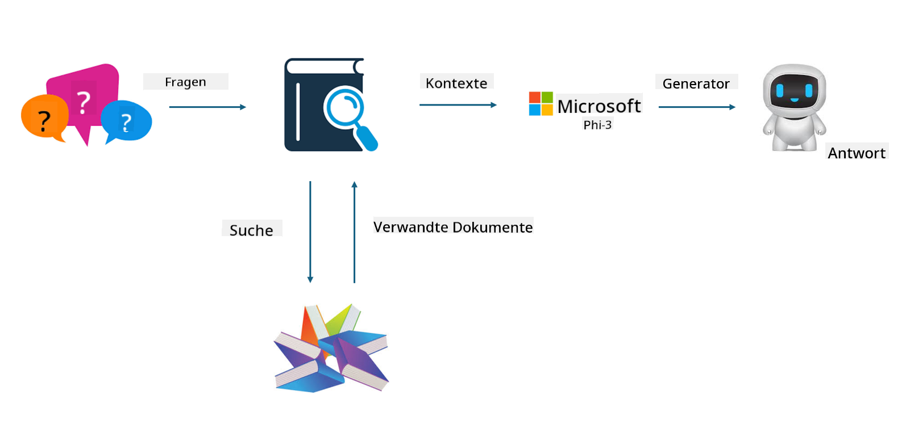

<!--
CO_OP_TRANSLATOR_METADATA:
{
  "original_hash": "e4e010400c2918557b36bb932a14004c",
  "translation_date": "2025-03-27T15:39:24+00:00",
  "source_file": "md\\03.FineTuning\\FineTuning_vs_RAG.md",
  "language_code": "de"
}
-->
## Feinabstimmung vs. RAG

## Retrieval Augmented Generation

RAG kombiniert Datenabruf mit Textgenerierung. Die strukturierten und unstrukturierten Daten eines Unternehmens werden in einer Vektordatenbank gespeichert. Bei der Suche nach relevanten Inhalten werden die passenden Zusammenfassungen und Inhalte gefunden, um einen Kontext zu bilden. Anschließend wird die Textgenerierungsfähigkeit von LLM/SLM genutzt, um Inhalte zu erstellen.

## RAG-Prozess

## Feinabstimmung
Die Feinabstimmung basiert auf der Verbesserung eines bestehenden Modells. Es ist nicht notwendig, bei der Modellalgorithmik von vorne zu beginnen, allerdings müssen kontinuierlich Daten gesammelt werden. Wenn in industriellen Anwendungen präzisere Terminologie und Sprache benötigt werden, ist die Feinabstimmung die bessere Wahl. Wenn sich Ihre Daten jedoch häufig ändern, kann die Feinabstimmung kompliziert werden.

## Wie wählt man?
Wenn unsere Antwort externe Daten einbeziehen muss, ist RAG die beste Wahl.

Wenn Sie stabiles und präzises Fachwissen aus einer Branche benötigen, ist Feinabstimmung eine gute Option. RAG priorisiert das Abrufen relevanter Inhalte, trifft jedoch möglicherweise nicht immer die spezialisierten Nuancen.

Die Feinabstimmung erfordert einen hochwertigen Datensatz, und wenn es sich nur um einen kleinen Datenbereich handelt, wird der Unterschied nicht groß sein. RAG ist flexibler.  
Die Feinabstimmung ist eine Art Blackbox, eine Art Metaphysik, und es ist schwierig, die internen Mechanismen zu verstehen. RAG hingegen erleichtert es, die Datenquelle zu identifizieren, wodurch Halluzinationen oder Inhaltsfehler besser angepasst und mehr Transparenz geboten werden können.

**Haftungsausschluss**:  
Dieses Dokument wurde mithilfe des KI-Übersetzungsdienstes [Co-op Translator](https://github.com/Azure/co-op-translator) übersetzt. Obwohl wir uns um Genauigkeit bemühen, weisen wir darauf hin, dass automatisierte Übersetzungen Fehler oder Ungenauigkeiten enthalten können. Das Originaldokument in seiner ursprünglichen Sprache sollte als maßgebliche Quelle betrachtet werden. Für kritische Informationen wird eine professionelle menschliche Übersetzung empfohlen. Wir haften nicht für Missverständnisse oder Fehlinterpretationen, die sich aus der Nutzung dieser Übersetzung ergeben.