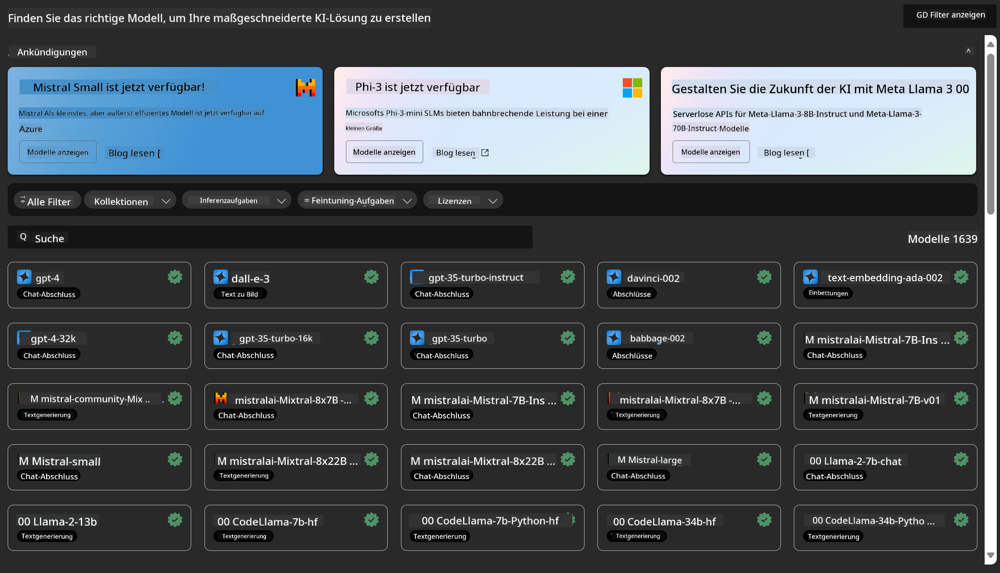
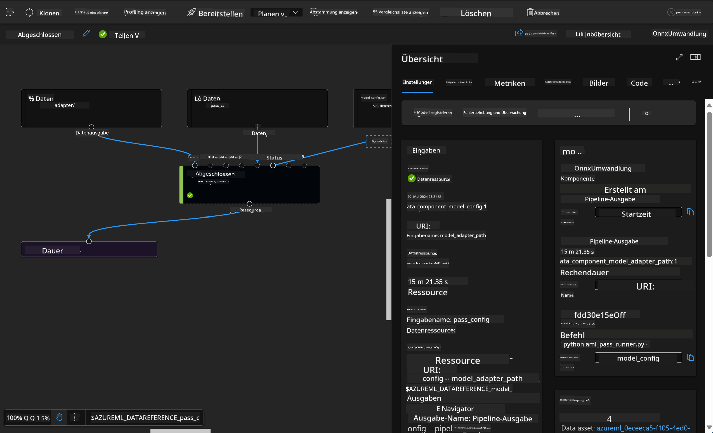

<!--
CO_OP_TRANSLATOR_METADATA:
{
  "original_hash": "7fe541373802e33568e94e13226d463c",
  "translation_date": "2025-03-27T15:47:32+00:00",
  "source_file": "md\\03.FineTuning\\Introduce_AzureML.md",
  "language_code": "de"
}
-->
# **Einführung in den Azure Machine Learning Service**

[Azure Machine Learning](https://ml.azure.com?WT.mc_id=aiml-138114-kinfeylo) ist ein Cloud-Service zur Beschleunigung und Verwaltung des Lebenszyklus von Machine-Learning-Projekten (ML).

ML-Experten, Datenwissenschaftler und Ingenieure können ihn in ihren täglichen Arbeitsabläufen nutzen, um:

- Modelle zu trainieren und bereitzustellen.
- Machine-Learning-Operationen (MLOps) zu verwalten.
- Sie können ein Modell in Azure Machine Learning erstellen oder ein Modell verwenden, das mit einer Open-Source-Plattform wie PyTorch, TensorFlow oder scikit-learn entwickelt wurde.
- MLOps-Tools helfen Ihnen, Modelle zu überwachen, neu zu trainieren und erneut bereitzustellen.

## Für wen ist Azure Machine Learning geeignet?

**Datenwissenschaftler und ML-Ingenieure**

Sie können Tools nutzen, um ihre täglichen Arbeitsabläufe zu beschleunigen und zu automatisieren.  
Azure ML bietet Funktionen für Fairness, Erklärbarkeit, Nachverfolgung und Prüfbarkeit.  

**Anwendungsentwickler**

Sie können Modelle nahtlos in Anwendungen oder Dienste integrieren.  

**Plattformentwickler**

Ihnen steht eine robuste Auswahl an Tools zur Verfügung, die durch dauerhafte Azure Resource Manager APIs unterstützt werden.  
Diese Tools ermöglichen den Aufbau fortschrittlicher ML-Werkzeuge.  

**Unternehmen**

Unternehmen, die in der Microsoft Azure Cloud arbeiten, profitieren von vertrauter Sicherheit und rollenbasierter Zugriffskontrolle.  
Projekte können so eingerichtet werden, dass der Zugriff auf geschützte Daten und bestimmte Operationen kontrolliert wird.  

## Produktivität für das gesamte Team

ML-Projekte erfordern oft ein Team mit unterschiedlichen Fähigkeiten, um sie zu entwickeln und zu warten.

Azure ML bietet Tools, die es ermöglichen:
- Mit dem Team über gemeinsame Notebooks, Rechenressourcen, serverlose Berechnungen, Daten und Umgebungen zu kollaborieren.
- Modelle zu entwickeln, die Fairness, Erklärbarkeit, Nachverfolgung und Prüfbarkeit gewährleisten, um Anforderungen an Herkunft und Prüfungen zu erfüllen.
- ML-Modelle schnell und einfach in großem Maßstab bereitzustellen und effizient mit MLOps zu verwalten und zu steuern.
- Machine-Learning-Arbeitslasten überall auszuführen, mit integrierter Governance, Sicherheit und Compliance.

## Plattformübergreifende Tools

Jeder in einem ML-Team kann seine bevorzugten Tools nutzen, um Aufgaben zu erledigen.  
Egal, ob Sie schnelle Experimente durchführen, Hyperparameter optimieren, Pipelines erstellen oder Inferenzprozesse verwalten, Sie können vertraute Schnittstellen verwenden, darunter:
- Azure Machine Learning Studio
- Python SDK (v2)
- Azure CLI (v2)
- Azure Resource Manager REST APIs  

Während Sie Modelle verfeinern und im Entwicklungszyklus zusammenarbeiten, können Sie Assets, Ressourcen und Metriken innerhalb der Azure Machine Learning Studio-Benutzeroberfläche teilen und finden.

## **LLM/SLM in Azure ML**

Azure ML hat viele Funktionen im Zusammenhang mit LLM/SLM hinzugefügt und kombiniert LLMOps und SLMOps, um eine unternehmensweite Plattform für generative künstliche Intelligenz zu schaffen.

### **Modellkatalog**

Unternehmensnutzer können verschiedene Modelle je nach Geschäftsszenario über den Modellkatalog bereitstellen und als Model as Service Dienste für Entwickler oder Nutzer anbieten.

Der Modellkatalog im Azure Machine Learning Studio ist der zentrale Ort, um eine Vielzahl von Modellen zu entdecken und zu nutzen, die es Ihnen ermöglichen, Anwendungen mit generativer KI zu erstellen. Der Modellkatalog enthält Hunderte von Modellen von Anbietern wie Azure OpenAI Service, Mistral, Meta, Cohere, Nvidia, Hugging Face sowie Modelle, die von Microsoft trainiert wurden. Modelle von anderen Anbietern als Microsoft sind Nicht-Microsoft-Produkte, wie in den Produktbedingungen von Microsoft definiert, und unterliegen den Bedingungen, die mit dem Modell bereitgestellt werden.

### **Job-Pipeline**

Das Kernstück einer Machine-Learning-Pipeline besteht darin, eine vollständige Machine-Learning-Aufgabe in einen mehrstufigen Workflow aufzuteilen. Jeder Schritt ist eine handhabbare Komponente, die individuell entwickelt, optimiert, konfiguriert und automatisiert werden kann. Die Schritte sind über klar definierte Schnittstellen miteinander verbunden. Der Azure Machine Learning Pipeline-Service orchestriert automatisch alle Abhängigkeiten zwischen den Pipeline-Schritten.

Beim Feinabstimmen von SLM / LLM können wir unsere Daten-, Trainings- und Generierungsprozesse über die Pipeline verwalten.

### **Prompt Flow**

Vorteile der Verwendung von Azure Machine Learning Prompt Flow  
Azure Machine Learning Prompt Flow bietet eine Reihe von Vorteilen, die Nutzern helfen, von der Ideenfindung über Experimente bis hin zu produktionsreifen Anwendungen auf LLM-Basis zu gelangen:

**Agilität im Prompt Engineering**

Interaktive Entwicklungsumgebung: Azure Machine Learning Prompt Flow bietet eine visuelle Darstellung der Struktur des Flows, sodass Nutzer ihre Projekte leicht verstehen und navigieren können. Es bietet auch eine Notebook-ähnliche Programmiererfahrung für eine effiziente Entwicklung und Debugging des Flows.  
Varianten für Prompt-Tuning: Nutzer können mehrere Prompt-Varianten erstellen und vergleichen, um einen iterativen Verfeinerungsprozess zu ermöglichen.  

Bewertung: Eingebaute Bewertungsflows ermöglichen es Nutzern, die Qualität und Effektivität ihrer Prompts und Flows zu beurteilen.  

Umfassende Ressourcen: Azure Machine Learning Prompt Flow enthält eine Bibliothek mit integrierten Tools, Beispielen und Vorlagen, die als Ausgangspunkt für die Entwicklung dienen, Kreativität fördern und den Prozess beschleunigen.

**Unternehmensbereitschaft für Anwendungen auf LLM-Basis**

Zusammenarbeit: Azure Machine Learning Prompt Flow unterstützt die Teamzusammenarbeit, sodass mehrere Nutzer gemeinsam an Prompt-Engineering-Projekten arbeiten, Wissen teilen und Versionskontrolle durchführen können.

All-in-One-Plattform: Azure Machine Learning Prompt Flow vereinfacht den gesamten Prompt-Engineering-Prozess, von der Entwicklung und Bewertung bis hin zur Bereitstellung und Überwachung. Nutzer können ihre Flows mühelos als Azure Machine Learning Endpoints bereitstellen und deren Leistung in Echtzeit überwachen, um einen optimalen Betrieb und kontinuierliche Verbesserung sicherzustellen.

Azure Machine Learning Lösungen für Unternehmensbereitschaft: Prompt Flow nutzt die robusten Unternehmenslösungen von Azure Machine Learning und bietet eine sichere, skalierbare und zuverlässige Grundlage für die Entwicklung, das Experimentieren und die Bereitstellung von Flows.

Mit Azure Machine Learning Prompt Flow können Nutzer ihre Agilität im Prompt Engineering entfalten, effektiv zusammenarbeiten und Unternehmenslösungen nutzen, um erfolgreiche Anwendungen auf LLM-Basis zu entwickeln und bereitzustellen.

Durch die Kombination der Rechenleistung, Daten und verschiedener Komponenten von Azure ML können Unternehmensentwickler problemlos ihre eigenen Anwendungen mit künstlicher Intelligenz erstellen.

**Haftungsausschluss**:  
Dieses Dokument wurde mit dem KI-Übersetzungsdienst [Co-op Translator](https://github.com/Azure/co-op-translator) übersetzt. Obwohl wir uns um Genauigkeit bemühen, weisen wir darauf hin, dass automatisierte Übersetzungen Fehler oder Ungenauigkeiten enthalten können. Das Originaldokument in seiner ursprünglichen Sprache sollte als maßgebliche Quelle betrachtet werden. Für kritische Informationen wird eine professionelle menschliche Übersetzung empfohlen. Wir übernehmen keine Haftung für Missverständnisse oder Fehlinterpretationen, die sich aus der Nutzung dieser Übersetzung ergeben.