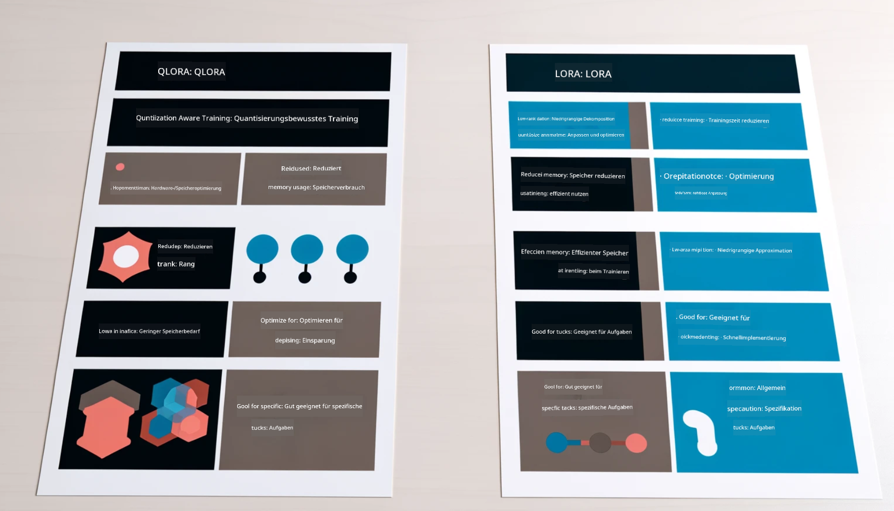

<!--
CO_OP_TRANSLATOR_METADATA:
{
  "original_hash": "743d7e9cb9c4e8ea642d77bee657a7fa",
  "translation_date": "2025-03-27T15:59:53+00:00",
  "source_file": "md\\03.FineTuning\\LetPhi3gotoIndustriy.md",
  "language_code": "de"
}
-->
# **Lass Phi-3 ein Branchenexperte werden**

Um das Phi-3-Modell in einer Branche einzusetzen, müssen branchenspezifische Geschäftsdaten in das Phi-3-Modell integriert werden. Dafür stehen zwei verschiedene Optionen zur Verfügung: RAG (Retrieval Augmented Generation) und Fine-Tuning.

## **RAG vs Fine-Tuning**

### **Retrieval Augmented Generation**

RAG kombiniert Datenabruf und Textgenerierung. Die strukturierten und unstrukturierten Daten des Unternehmens werden in einer Vektordatenbank gespeichert. Beim Suchen nach relevanten Inhalten werden Zusammenfassungen und Inhalte gefunden, die einen Kontext bilden. Diese werden dann mit den Textgenerierungsfähigkeiten von LLM/SLM kombiniert, um Inhalte zu erstellen.

### **Fine-Tuning**

Fine-Tuning basiert auf der Verbesserung eines bestehenden Modells. Es ist nicht erforderlich, mit dem Modellalgorithmus zu beginnen, aber es müssen kontinuierlich Daten gesammelt werden. Wenn Sie in branchenspezifischen Anwendungen präzisere Terminologie und Sprachstile benötigen, ist Fine-Tuning die bessere Wahl. Wenn sich Ihre Daten jedoch häufig ändern, kann Fine-Tuning kompliziert werden.

### **Wie wählt man aus**

1. Wenn unsere Antwort externe Daten einbeziehen muss, ist RAG die beste Wahl.

2. Wenn Sie stabiles und präzises Branchenwissen ausgeben müssen, ist Fine-Tuning eine gute Wahl. RAG konzentriert sich darauf, relevante Inhalte abzurufen, trifft jedoch möglicherweise nicht immer die spezialisierten Nuancen.

3. Fine-Tuning erfordert ein qualitativ hochwertiges Datenset. Wenn es sich nur um einen kleinen Datenbereich handelt, macht es keinen großen Unterschied. RAG ist flexibler.

4. Fine-Tuning ist eine Blackbox, eine Art Metaphysik, und es ist schwierig, den internen Mechanismus zu verstehen. RAG hingegen ermöglicht es, die Datenquelle leichter zu identifizieren, wodurch Halluzinationen oder Inhaltsfehler effektiv angepasst und eine bessere Transparenz gewährleistet werden können.

### **Anwendungsfälle**

1. Vertikale Branchen, die spezifische Fachbegriffe und Ausdrucksweisen erfordern: ***Fine-Tuning*** ist die beste Wahl.

2. QA-Systeme, die die Synthese verschiedener Wissenspunkte umfassen: ***RAG*** ist die beste Wahl.

3. Die Kombination automatisierter Geschäftsprozesse: ***RAG + Fine-Tuning*** ist die beste Wahl.

## **Wie man RAG verwendet**

Eine Vektordatenbank ist eine Sammlung von Daten, die in mathematischer Form gespeichert sind. Vektordatenbanken erleichtern es maschinellen Lernmodellen, frühere Eingaben zu behalten, wodurch maschinelles Lernen in Anwendungsfällen wie Suche, Empfehlungen und Textgenerierung unterstützt werden kann. Daten können anhand von Ähnlichkeitsmetriken identifiziert werden, anstatt exakte Übereinstimmungen zu erfordern. Dies ermöglicht es Computermodellen, den Kontext der Daten zu verstehen.

Die Vektordatenbank ist der Schlüssel zur Realisierung von RAG. Wir können Daten mithilfe von Vektormodellen wie text-embedding-3, jina-ai-embedding usw. in Vektorspeicher umwandeln.

Erfahren Sie mehr über die Erstellung einer RAG-Anwendung [https://github.com/microsoft/Phi-3CookBook](https://github.com/microsoft/Phi-3CookBook?WT.mc_id=aiml-138114-kinfeylo)

## **Wie man Fine-Tuning verwendet**

Die häufig verwendeten Algorithmen im Fine-Tuning sind Lora und QLora. Wie wählt man aus?
- [Erfahren Sie mehr mit diesem Beispiel-Notebook](../../../../code/04.Finetuning/Phi_3_Inference_Finetuning.ipynb)
- [Beispiel eines Python-Fine-Tuning-Skripts](../../../../code/04.Finetuning/FineTrainingScript.py)

### **Lora und QLora**

LoRA (Low-Rank Adaptation) und QLoRA (Quantized Low-Rank Adaptation) sind Techniken, die verwendet werden, um große Sprachmodelle (LLMs) mithilfe von Parameter Efficient Fine Tuning (PEFT) zu optimieren. PEFT-Techniken sind darauf ausgelegt, Modelle effizienter zu trainieren als traditionelle Methoden.  
LoRA ist eine eigenständige Fine-Tuning-Technik, die den Speicherbedarf reduziert, indem eine Niedrigrang-Approximation auf die Gewichtsmatrix angewendet wird. Sie bietet schnelle Trainingszeiten und behält die Leistung nahe an traditionellen Fine-Tuning-Methoden.

QLoRA ist eine erweiterte Version von LoRA, die Quantisierungstechniken integriert, um den Speicherbedarf weiter zu reduzieren. QLoRA quantisiert die Genauigkeit der Gewichtungsparameter im vortrainierten LLM auf eine Präzision von 4 Bit, was speichereffizienter ist als LoRA. Allerdings ist das Training mit QLoRA etwa 30 % langsamer als mit LoRA, da zusätzliche Schritte zur Quantisierung und Dekompression erforderlich sind.

QLoRA verwendet LoRA als Zusatz, um die Fehler zu beheben, die durch die Quantisierung entstehen. QLoRA ermöglicht das Fine-Tuning riesiger Modelle mit Milliarden von Parametern auf relativ kleinen, weit verbreiteten GPUs. Zum Beispiel kann QLoRA ein Modell mit 70 Milliarden Parametern, das normalerweise 36 GPUs erfordert, mit nur 2 GPUs optimieren.

**Haftungsausschluss**:  
Dieses Dokument wurde mit dem KI-Übersetzungsdienst [Co-op Translator](https://github.com/Azure/co-op-translator) übersetzt. Obwohl wir uns um Genauigkeit bemühen, weisen wir darauf hin, dass automatisierte Übersetzungen Fehler oder Ungenauigkeiten enthalten können. Das Originaldokument in seiner ursprünglichen Sprache sollte als maßgebliche Quelle betrachtet werden. Für kritische Informationen wird eine professionelle menschliche Übersetzung empfohlen. Wir übernehmen keine Haftung für Missverständnisse oder Fehlinterpretationen, die aus der Nutzung dieser Übersetzung resultieren.