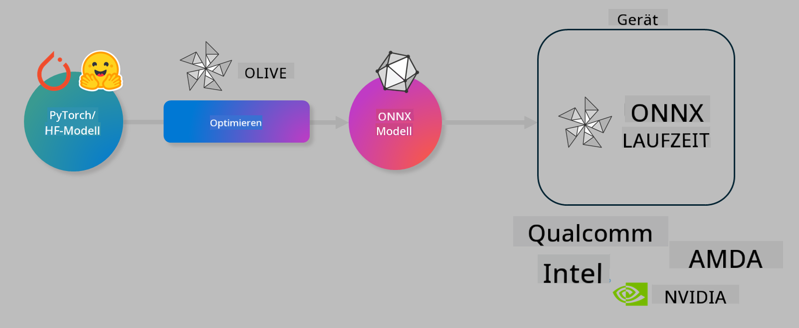

<!--
CO_OP_TRANSLATOR_METADATA:
{
  "original_hash": "6bbe47de3b974df7eea29dfeccf6032b",
  "translation_date": "2025-03-27T16:14:14+00:00",
  "source_file": "md\\03.FineTuning\\olive-lab\\readme.md",
  "language_code": "de"
}
-->
# Lab. Optimieren von KI-Modellen für Inferenz auf Geräten

## Einführung

> [!IMPORTANT]
> Für dieses Lab wird eine **Nvidia A10 oder A100 GPU** mit den zugehörigen Treibern und installiertem CUDA-Toolkit (Version 12+) benötigt.

> [!NOTE]
> Dieses Lab dauert **35 Minuten** und gibt Ihnen eine praktische Einführung in die Kernkonzepte der Optimierung von Modellen für die Inferenz auf Geräten mit OLIVE.

## Lernziele

Am Ende dieses Labs können Sie OLIVE verwenden, um:

- Ein KI-Modell mit der AWQ-Quantisierungsmethode zu quantisieren.
- Ein KI-Modell für eine spezifische Aufgabe zu feinabstimmen.
- LoRA-Adapter (feinabgestimmtes Modell) für eine effiziente Inferenz auf Geräten mit ONNX Runtime zu generieren.

### Was ist Olive?

Olive (*O*NNX *live*) ist ein Toolkit zur Modelloptimierung mit einer begleitenden CLI, das es ermöglicht, Modelle für die ONNX Runtime bereitzustellen +++https://onnxruntime.ai+++ mit hoher Qualität und Leistung.



Das Eingabeformat für Olive ist in der Regel ein PyTorch- oder Hugging Face-Modell, und die Ausgabe ist ein optimiertes ONNX-Modell, das auf einem Gerät (Bereitstellungsziel) mit ONNX Runtime ausgeführt wird. Olive optimiert das Modell für den KI-Beschleuniger (NPU, GPU, CPU) des Bereitstellungsziels, der von einem Hardwareanbieter wie Qualcomm, AMD, Nvidia oder Intel bereitgestellt wird.

Olive führt einen *Workflow* aus, der eine geordnete Sequenz einzelner Modelloptimierungsaufgaben namens *Passes* darstellt. Beispiele für Passes sind: Modellkompression, Graph-Capture, Quantisierung, Graph-Optimierung. Jeder Pass hat eine Reihe von Parametern, die abgestimmt werden können, um die besten Metriken, wie Genauigkeit und Latenz, zu erreichen, die vom jeweiligen Evaluator bewertet werden. Olive verwendet eine Suchstrategie mit einem Algorithmus, der jeden Pass einzeln oder mehrere Passes gemeinsam automatisch optimiert.

#### Vorteile von Olive

- **Reduziert Frustration und Zeit**, die durch manuelle Versuche und Irrtümer bei der Experimentierung mit verschiedenen Techniken zur Graph-Optimierung, Kompression und Quantisierung entstehen. Definieren Sie Ihre Qualitäts- und Leistungsanforderungen, und Olive findet automatisch das beste Modell für Sie.
- **Über 40 integrierte Modelloptimierungskomponenten**, die modernste Techniken in den Bereichen Quantisierung, Kompression, Graph-Optimierung und Feinabstimmung abdecken.
- **Einfach zu bedienende CLI** für gängige Modelloptimierungsaufgaben. Zum Beispiel: olive quantize, olive auto-opt, olive finetune.
- Modellpaketierung und Bereitstellung sind integriert.
- Unterstützung für die Generierung von Modellen für **Multi-LoRA-Serving**.
- Erstellung von Workflows mit YAML/JSON zur Orchestrierung von Modelloptimierungs- und Bereitstellungsaufgaben.
- Integration mit **Hugging Face** und **Azure AI**.
- Eingebauter **Caching-Mechanismus**, um **Kosten zu sparen**.

## Lab-Anleitung
> [!NOTE]
> Bitte stellen Sie sicher, dass Sie Ihr Azure AI Hub und Projekt eingerichtet sowie Ihre A100-Compute-Instanz gemäß Lab 1 konfiguriert haben.

### Schritt 0: Verbindung zu Ihrer Azure AI Compute herstellen

Sie stellen die Verbindung zur Azure AI Compute mithilfe der Remote-Funktion in **VS Code** her.

1. Öffnen Sie Ihre **VS Code**-Desktopanwendung:
1. Öffnen Sie die **Befehlspalette** mit **Shift+Ctrl+P**.
1. Suchen Sie in der Befehlspalette nach **AzureML - remote: Connect to compute instance in New Window**.
1. Folgen Sie den Anweisungen auf dem Bildschirm, um die Verbindung zur Compute-Instanz herzustellen. Dazu gehört die Auswahl Ihres Azure-Abonnements, Ihrer Ressourcengruppe, Ihres Projekts und des Computernamens, die Sie in Lab 1 eingerichtet haben.
1. Sobald Sie mit Ihrer Azure ML Compute-Instanz verbunden sind, wird dies **unten links in Visual Code** angezeigt `><Azure ML: Compute Name`.

### Schritt 1: Dieses Repository klonen

In VS Code können Sie ein neues Terminal mit **Ctrl+J** öffnen und dieses Repository klonen:

Im Terminal sollte die Eingabeaufforderung angezeigt werden:

```
azureuser@computername:~/cloudfiles/code$ 
```  
Klonen Sie die Lösung:  

```bash
cd ~/localfiles
git clone https://github.com/microsoft/phi-3cookbook.git
```  

### Schritt 2: Ordner in VS Code öffnen

Um VS Code im entsprechenden Ordner zu öffnen, führen Sie den folgenden Befehl im Terminal aus. Dadurch wird ein neues Fenster geöffnet:

```bash
code phi-3cookbook/code/04.Finetuning/Olive-lab
```  

Alternativ können Sie den Ordner auch über **Datei** > **Ordner öffnen** öffnen.

### Schritt 3: Abhängigkeiten installieren

Öffnen Sie ein Terminalfenster in VS Code in Ihrer Azure AI Compute-Instanz (Tipp: **Ctrl+J**) und führen Sie die folgenden Befehle aus, um die Abhängigkeiten zu installieren:

```bash
conda create -n olive-ai python=3.11 -y
conda activate olive-ai
pip install -r requirements.txt
az extension remove -n azure-cli-ml
az extension add -n ml
```  

> [!NOTE]
> Die Installation aller Abhängigkeiten dauert etwa **5 Minuten**.

In diesem Lab werden Sie Modelle aus dem Azure AI Model-Katalog herunterladen und hochladen. Um auf den Model-Katalog zugreifen zu können, müssen Sie sich bei Azure anmelden mit:

```bash
az login
```  

> [!NOTE]
> Beim Anmelden werden Sie aufgefordert, Ihr Abonnement auszuwählen. Stellen Sie sicher, dass Sie das für dieses Lab bereitgestellte Abonnement auswählen.

### Schritt 4: Olive-Befehle ausführen

Öffnen Sie ein Terminalfenster in VS Code in Ihrer Azure AI Compute-Instanz (Tipp: **Ctrl+J**) und stellen Sie sicher, dass die `olive-ai`-Conda-Umgebung aktiviert ist:

```bash
conda activate olive-ai
```  

Führen Sie anschließend die folgenden Olive-Befehle in der Befehlszeile aus.

1. **Daten inspizieren:** In diesem Beispiel werden Sie das Phi-3.5-Mini-Modell feinabstimmen, sodass es auf reisebezogene Fragen spezialisiert ist. Der folgende Code zeigt die ersten Datensätze des Datensatzes im JSON-Lines-Format an:

    ```bash
    head data/data_sample_travel.jsonl
    ```  

1. **Modell quantisieren:** Bevor Sie das Modell trainieren, quantisieren Sie es mit dem folgenden Befehl, der eine Technik namens Active Aware Quantization (AWQ) +++https://arxiv.org/abs/2306.00978+++ verwendet. AWQ quantisiert die Gewichte eines Modells, indem die Aktivierungen berücksichtigt werden, die während der Inferenz erzeugt werden. Dadurch wird die Genauigkeit des Modells besser erhalten als bei herkömmlichen Gewichtquantisierungsmethoden.

    ```bash
    olive quantize \
       --model_name_or_path microsoft/Phi-3.5-mini-instruct \
       --trust_remote_code \
       --algorithm awq \
       --output_path models/phi/awq \
       --log_level 1
    ```  

    Die AWQ-Quantisierung dauert **~8 Minuten** und reduziert die Modellgröße von **~7,5 GB auf ~2,5 GB**.

   In diesem Lab zeigen wir Ihnen, wie Sie Modelle von Hugging Face importieren (zum Beispiel: `microsoft/Phi-3.5-mini-instruct`). However, Olive also allows you to input models from the Azure AI catalog by updating the `model_name_or_path` argument to an Azure AI asset ID (for example:  `azureml://registries/azureml/models/Phi-3.5-mini-instruct/versions/4`). 

1. **Train the model:** Next, the `olive finetune`-Befehl das quantisierte Modell feinabstimmt. Die Quantisierung des Modells *vor* der Feinabstimmung statt danach liefert eine bessere Genauigkeit, da der Feinabstimmungsprozess einige Verluste der Quantisierung wiederherstellt.

    ```bash
    olive finetune \
        --method lora \
        --model_name_or_path models/phi/awq \
        --data_files "data/data_sample_travel.jsonl" \
        --data_name "json" \
        --text_template "<|user|>\n{prompt}<|end|>\n<|assistant|>\n{response}<|end|>" \
        --max_steps 100 \
        --output_path ./models/phi/ft \
        --log_level 1
    ```  

    Die Feinabstimmung dauert **~6 Minuten** (mit 100 Schritten).

1. **Optimieren:** Nachdem das Modell trainiert wurde, optimieren Sie es nun mit Olives `auto-opt` command, which will capture the ONNX graph and automatically perform a number of optimizations to improve the model performance for CPU by compressing the model and doing fusions. It should be noted, that you can also optimize for other devices such as NPU or GPU by just updating the `--device` and `--provider`-Argumenten - in diesem Lab verwenden wir jedoch die CPU.

    ```bash
    olive auto-opt \
       --model_name_or_path models/phi/ft/model \
       --adapter_path models/phi/ft/adapter \
       --device cpu \
       --provider CPUExecutionProvider \
       --use_ort_genai \
       --output_path models/phi/onnx-ao \
       --log_level 1
    ```  

    Die Optimierung dauert **~5 Minuten**.

### Schritt 5: Schneller Test der Modellausführung

Um das Modell zu testen, erstellen Sie eine Python-Datei in Ihrem Ordner namens **app.py** und kopieren Sie den folgenden Code:

```python
import onnxruntime_genai as og
import numpy as np

print("loading model and adapters...", end="", flush=True)
model = og.Model("models/phi/onnx-ao/model")
adapters = og.Adapters(model)
adapters.load("models/phi/onnx-ao/model/adapter_weights.onnx_adapter", "travel")
print("DONE!")

tokenizer = og.Tokenizer(model)
tokenizer_stream = tokenizer.create_stream()

params = og.GeneratorParams(model)
params.set_search_options(max_length=100, past_present_share_buffer=False)
user_input = "what is the best thing to see in chicago"
params.input_ids = tokenizer.encode(f"<|user|>\n{user_input}<|end|>\n<|assistant|>\n")

generator = og.Generator(model, params)

generator.set_active_adapter(adapters, "travel")

print(f"{user_input}")

while not generator.is_done():
    generator.compute_logits()
    generator.generate_next_token()

    new_token = generator.get_next_tokens()[0]
    print(tokenizer_stream.decode(new_token), end='', flush=True)

print("\n")
```  

Führen Sie den Code aus mit:

```bash
python app.py
```  

### Schritt 6: Modell in Azure AI hochladen

Das Hochladen des Modells in ein Azure AI Model-Repository macht das Modell für andere Mitglieder Ihres Entwicklungsteams zugänglich und verwaltet auch die Versionskontrolle des Modells. Um das Modell hochzuladen, führen Sie den folgenden Befehl aus:

> [!NOTE]
> Aktualisieren Sie die `{}` placeholders with the name of your resource group and Azure AI Project Name. 

To find your resource group `"resourceGroup"` und den Azure AI-Projektnamen und führen Sie den folgenden Befehl aus:

```
az ml workspace show
```  

Oder indem Sie zu +++ai.azure.com+++ gehen und **Management Center** > **Projekt** > **Übersicht** auswählen.

Aktualisieren Sie die `{}`-Platzhalter mit dem Namen Ihrer Ressourcengruppe und des Azure AI-Projektnamens.

```bash
az ml model create \
    --name ft-for-travel \
    --version 1 \
    --path ./models/phi/onnx-ao \
    --resource-group {RESOURCE_GROUP_NAME} \
    --workspace-name {PROJECT_NAME}
```  
Anschließend können Sie Ihr hochgeladenes Modell sehen und Ihr Modell unter https://ml.azure.com/model/list bereitstellen.

**Haftungsausschluss**:  
Dieses Dokument wurde mit dem KI-Übersetzungsdienst [Co-op Translator](https://github.com/Azure/co-op-translator) übersetzt. Obwohl wir uns um Genauigkeit bemühen, beachten Sie bitte, dass automatisierte Übersetzungen Fehler oder Ungenauigkeiten enthalten können. Das Originaldokument in seiner ursprünglichen Sprache sollte als maßgebliche Quelle betrachtet werden. Für wichtige Informationen wird eine professionelle menschliche Übersetzung empfohlen. Wir übernehmen keine Haftung für Missverständnisse oder Fehlinterpretationen, die aus der Nutzung dieser Übersetzung entstehen.