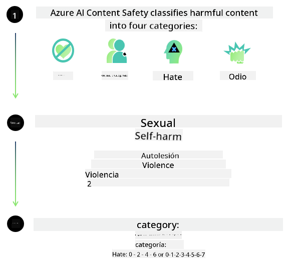
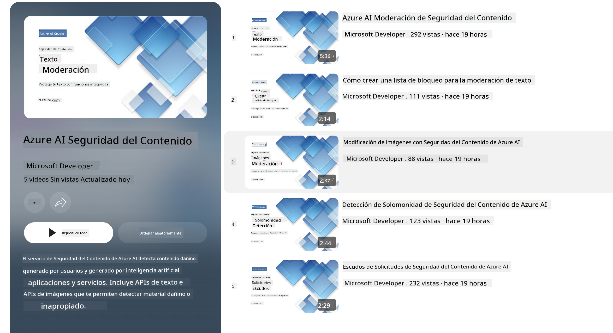

<!--
CO_OP_TRANSLATOR_METADATA:
{
  "original_hash": "c8273672cc57df2be675407a1383aaf0",
  "translation_date": "2025-03-27T05:13:30+00:00",
  "source_file": "md\\01.Introduction\\01\\01.AISafety.md",
  "language_code": "es"
}
-->
# Seguridad de IA para modelos Phi

La familia de modelos Phi fue desarrollada de acuerdo con el [Estándar de IA Responsable de Microsoft](https://query.prod.cms.rt.microsoft.com/cms/api/am/binary/RE5cmFl), que es un conjunto de requisitos a nivel empresarial basado en los siguientes seis principios: responsabilidad, transparencia, equidad, confiabilidad y seguridad, privacidad y seguridad, e inclusión, los cuales forman los [principios de IA Responsable de Microsoft](https://www.microsoft.com/ai/responsible-ai).

Al igual que los modelos Phi anteriores, se adoptó un enfoque de evaluación de seguridad multifacética y entrenamiento posterior de seguridad, con medidas adicionales para considerar las capacidades multilingües de esta versión. Nuestro enfoque para el entrenamiento y las evaluaciones de seguridad, incluyendo pruebas en múltiples idiomas y categorías de riesgo, está descrito en el [artículo sobre entrenamiento posterior de seguridad de Phi](https://arxiv.org/abs/2407.13833). Aunque los modelos Phi se benefician de este enfoque, los desarrolladores deben aplicar las mejores prácticas de IA responsable, incluyendo mapear, medir y mitigar los riesgos asociados con su caso de uso específico y contexto cultural y lingüístico.

## Mejores Prácticas

Al igual que otros modelos, la familia de modelos Phi puede comportarse de maneras que sean injustas, poco confiables u ofensivas.

Algunos de los comportamientos limitantes de SLM y LLM que debes tener en cuenta incluyen:

- **Calidad del Servicio:** Los modelos Phi están entrenados principalmente con texto en inglés. Los idiomas distintos al inglés tendrán un rendimiento inferior. Las variedades del idioma inglés con menos representación en los datos de entrenamiento podrían experimentar un rendimiento inferior en comparación con el inglés americano estándar.
- **Representación de Daños y Perpetuación de Estereotipos:** Estos modelos pueden sobre-representar o infra-representar a ciertos grupos de personas, eliminar la representación de algunos grupos o reforzar estereotipos degradantes o negativos. A pesar del entrenamiento posterior de seguridad, estas limitaciones pueden estar presentes debido a niveles de representación diferentes de distintos grupos o a la prevalencia de ejemplos de estereotipos negativos en los datos de entrenamiento que reflejan patrones reales y sesgos sociales.
- **Contenido Inapropiado u Ofensivo:** Estos modelos pueden generar otros tipos de contenido inapropiado u ofensivo, lo que podría hacerlos inadecuados para ser implementados en contextos sensibles sin mitigaciones adicionales específicas para el caso de uso.
- **Confiabilidad de la Información:** Los modelos de lenguaje pueden generar contenido sin sentido o fabricar contenido que podría parecer razonable pero es inexacto o está desactualizado.
- **Alcance Limitado para Código:** La mayoría de los datos de entrenamiento de Phi-3 están basados en Python y utilizan paquetes comunes como "typing, math, random, collections, datetime, itertools". Si el modelo genera scripts en Python que utilizan otros paquetes o scripts en otros lenguajes, recomendamos encarecidamente que los usuarios verifiquen manualmente todos los usos de las API.

Los desarrolladores deben aplicar las mejores prácticas de IA responsable y son responsables de garantizar que un caso de uso específico cumpla con las leyes y regulaciones relevantes (por ejemplo, privacidad, comercio, etc.).

## Consideraciones de IA Responsable

Al igual que otros modelos de lenguaje, los modelos de la serie Phi pueden comportarse de maneras que sean injustas, poco confiables u ofensivas. Algunos de los comportamientos limitantes que debes tener en cuenta incluyen:

**Calidad del Servicio:** Los modelos Phi están entrenados principalmente con texto en inglés. Los idiomas distintos al inglés tendrán un rendimiento inferior. Las variedades del idioma inglés con menos representación en los datos de entrenamiento podrían experimentar un rendimiento inferior en comparación con el inglés americano estándar.

**Representación de Daños y Perpetuación de Estereotipos:** Estos modelos pueden sobre-representar o infra-representar a ciertos grupos de personas, eliminar la representación de algunos grupos o reforzar estereotipos degradantes o negativos. A pesar del entrenamiento posterior de seguridad, estas limitaciones pueden estar presentes debido a niveles de representación diferentes de distintos grupos o a la prevalencia de ejemplos de estereotipos negativos en los datos de entrenamiento que reflejan patrones reales y sesgos sociales.

**Contenido Inapropiado u Ofensivo:** Estos modelos pueden generar otros tipos de contenido inapropiado u ofensivo, lo que podría hacerlos inadecuados para ser implementados en contextos sensibles sin mitigaciones adicionales específicas para el caso de uso.

**Confiabilidad de la Información:** Los modelos de lenguaje pueden generar contenido sin sentido o fabricar contenido que podría parecer razonable pero es inexacto o está desactualizado.

**Alcance Limitado para Código:** La mayoría de los datos de entrenamiento de Phi-3 están basados en Python y utilizan paquetes comunes como "typing, math, random, collections, datetime, itertools". Si el modelo genera scripts en Python que utilizan otros paquetes o scripts en otros lenguajes, recomendamos encarecidamente que los usuarios verifiquen manualmente todos los usos de las API.

Los desarrolladores deben aplicar las mejores prácticas de IA responsable y son responsables de garantizar que un caso de uso específico cumpla con las leyes y regulaciones relevantes (por ejemplo, privacidad, comercio, etc.). Las áreas importantes a considerar incluyen:

**Asignación:** Los modelos pueden no ser adecuados para escenarios que puedan tener un impacto significativo en el estado legal o la asignación de recursos u oportunidades de vida (por ejemplo, vivienda, empleo, crédito, etc.) sin evaluaciones adicionales y técnicas de eliminación de sesgos.

**Escenarios de Alto Riesgo:** Los desarrolladores deben evaluar la idoneidad de utilizar modelos en escenarios de alto riesgo donde las salidas injustas, poco confiables u ofensivas puedan ser extremadamente costosas o causar daño. Esto incluye brindar asesoramiento en dominios sensibles o especializados donde la precisión y la confiabilidad son críticas (por ejemplo, asesoramiento legal o de salud). Se deben implementar salvaguardas adicionales a nivel de aplicación según el contexto de implementación.

**Desinformación:** Los modelos pueden generar información inexacta. Los desarrolladores deben seguir las mejores prácticas de transparencia e informar a los usuarios finales que están interactuando con un sistema de IA. A nivel de aplicación, los desarrolladores pueden construir mecanismos de retroalimentación y flujos de trabajo para fundamentar las respuestas en información contextual específica del caso de uso, una técnica conocida como Generación Aumentada por Recuperación (RAG).

**Generación de Contenido Dañino:** Los desarrolladores deben evaluar las salidas según su contexto y utilizar clasificadores de seguridad disponibles o soluciones personalizadas apropiadas para su caso de uso.

**Uso Indebido:** Otras formas de uso indebido, como fraude, spam o producción de malware, pueden ser posibles, y los desarrolladores deben garantizar que sus aplicaciones no violen las leyes y regulaciones aplicables.

### Ajuste Fino y Seguridad de Contenido de IA

Después de ajustar un modelo, recomendamos encarecidamente aprovechar las medidas de [Seguridad de Contenido de Azure AI](https://learn.microsoft.com/azure/ai-services/content-safety/overview) para monitorear el contenido generado por los modelos, identificar y bloquear posibles riesgos, amenazas y problemas de calidad.

[Seguridad de Contenido de Azure AI](https://learn.microsoft.com/azure/ai-services/content-safety/overview) admite contenido tanto en texto como en imágenes. Puede implementarse en la nube, contenedores desconectados y en dispositivos perimetrales/embebidos.

## Descripción General de la Seguridad de Contenido de Azure AI

La Seguridad de Contenido de Azure AI no es una solución única para todos; puede personalizarse para alinearse con las políticas específicas de las empresas. Además, sus modelos multilingües le permiten comprender varios idiomas simultáneamente.

- **Seguridad de Contenido de Azure AI**
- **Microsoft Developer**
- **5 videos**

El servicio de Seguridad de Contenido de Azure AI detecta contenido dañino generado por usuarios y por IA en aplicaciones y servicios. Incluye APIs de texto e imagen que permiten detectar material dañino o inapropiado.

[Lista de reproducción de Seguridad de Contenido de IA](https://www.youtube.com/playlist?list=PLlrxD0HtieHjaQ9bJjyp1T7FeCbmVcPkQ)

**Descargo de responsabilidad**:  
Este documento ha sido traducido utilizando el servicio de traducción automática [Co-op Translator](https://github.com/Azure/co-op-translator). Si bien nos esforzamos por lograr precisión, tenga en cuenta que las traducciones automatizadas pueden contener errores o imprecisiones. El documento original en su idioma nativo debe considerarse la fuente autorizada. Para información crítica, se recomienda una traducción profesional realizada por humanos. No nos hacemos responsables de malentendidos o interpretaciones erróneas que surjan del uso de esta traducción.