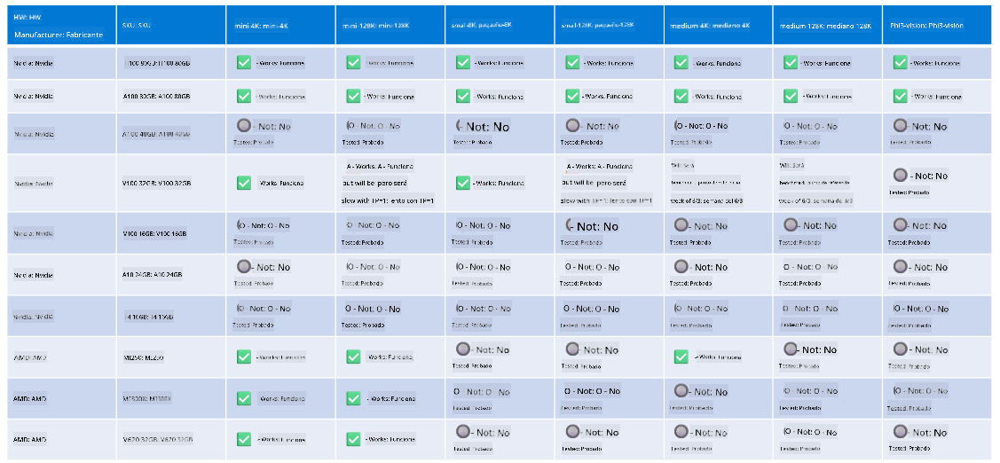

<!--
CO_OP_TRANSLATOR_METADATA:
{
  "original_hash": "8cdc17ce0f10535da30b53d23fe1a795",
  "translation_date": "2025-03-27T05:51:18+00:00",
  "source_file": "md\\01.Introduction\\01\\01.Hardwaresupport.md",
  "language_code": "es"
}
-->
# Soporte de Hardware Phi

Microsoft Phi ha sido optimizado para ONNX Runtime y es compatible con Windows DirectML. Funciona bien en diversos tipos de hardware, incluidos GPUs, CPUs e incluso dispositivos móviles.

## Hardware del dispositivo
Específicamente, el hardware compatible incluye:

- GPU SKU: RTX 4090 (DirectML)
- GPU SKU: 1 A100 80GB (CUDA)
- CPU SKU: Standard F64s v2 (64 vCPUs, 128 GiB de memoria)

## SKU móvil

- Android - Samsung Galaxy S21
- Apple iPhone 14 o superior Procesador A16/A17

## Especificaciones de Hardware Phi

- Configuración mínima requerida.
- Windows: GPU compatible con DirectX 12 y un mínimo de 4GB de RAM combinada

CUDA: GPU NVIDIA con capacidad de cómputo >= 7.02



## Ejecutando onnxruntime en múltiples GPUs

Actualmente, los modelos Phi ONNX disponibles son solo para 1 GPU. Es posible admitir múltiples GPUs para el modelo Phi, pero ORT con 2 GPUs no garantiza que se obtenga más rendimiento en comparación con 2 instancias de ORT. Por favor, consulta [ONNX Runtime](https://onnxruntime.ai/) para las últimas actualizaciones.

En [Build 2024 el equipo GenAI ONNX](https://youtu.be/WLW4SE8M9i8?si=EtG04UwDvcjunyfC) anunció que habían habilitado instancias múltiples en lugar de múltiples GPUs para los modelos Phi.

Actualmente, esto te permite ejecutar una instancia de onnxruntime o onnxruntime-genai con la variable de entorno CUDA_VISIBLE_DEVICES como esta.

```Python
CUDA_VISIBLE_DEVICES=0 python infer.py
CUDA_VISIBLE_DEVICES=1 python infer.py
```

Siéntete libre de explorar Phi más a fondo en [Azure AI Foundry](https://ai.azure.com)

**Descargo de responsabilidad**:  
Este documento ha sido traducido utilizando el servicio de traducción automática [Co-op Translator](https://github.com/Azure/co-op-translator). Si bien nos esforzamos por lograr precisión, tenga en cuenta que las traducciones automáticas pueden contener errores o imprecisiones. El documento original en su idioma nativo debe considerarse como la fuente autorizada. Para información crítica, se recomienda una traducción profesional realizada por humanos. No nos hacemos responsables por malentendidos o interpretaciones erróneas que puedan surgir del uso de esta traducción.