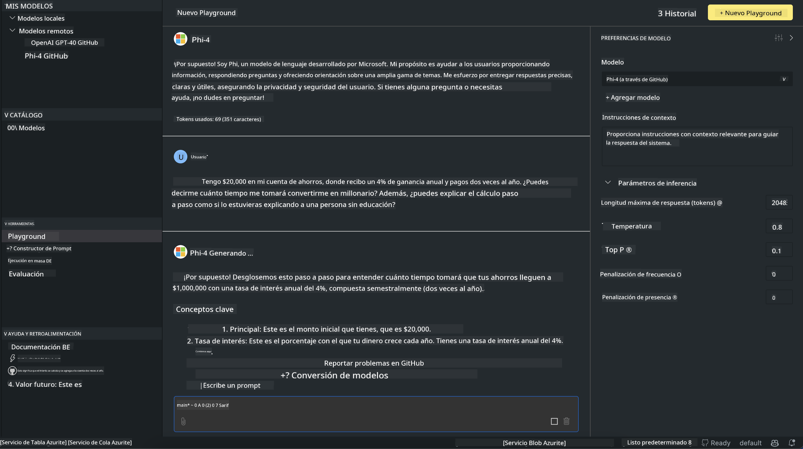

<!--
CO_OP_TRANSLATOR_METADATA:
{
  "original_hash": "4951d458c0b60c02cd1e751b40903877",
  "translation_date": "2025-03-27T06:35:29+00:00",
  "source_file": "md\\01.Introduction\\02\\05.AITK.md",
  "language_code": "es"
}
-->
# Familia Phi en AITK

[AI Toolkit para VS Code](https://marketplace.visualstudio.com/items?itemName=ms-windows-ai-studio.windows-ai-studio) simplifica el desarrollo de aplicaciones de IA generativa al reunir herramientas avanzadas de desarrollo de IA y modelos del catálogo Azure AI Foundry y otros catálogos como Hugging Face. Podrás explorar el catálogo de modelos de IA impulsado por GitHub Models y Azure AI Foundry Model Catalogs, descargarlos localmente o de forma remota, ajustarlos, probarlos y usarlos en tu aplicación.

La vista previa de AI Toolkit se ejecutará localmente. La inferencia local o el ajuste fino dependen del modelo que selecciones; es posible que necesites una GPU como NVIDIA CUDA GPU. También puedes ejecutar GitHub Models directamente con AITK.

## Comenzando

[Aprende más sobre cómo instalar el subsistema de Windows para Linux](https://learn.microsoft.com/windows/wsl/install?WT.mc_id=aiml-137032-kinfeylo)

y [cómo cambiar la distribución predeterminada](https://learn.microsoft.com/windows/wsl/install#change-the-default-linux-distribution-installed).

[Repositorio de GitHub de AI Toolkit](https://github.com/microsoft/vscode-ai-toolkit/)

- Windows, Linux, macOS
  
- Para el ajuste fino en Windows y Linux, necesitarás una GPU Nvidia. Además, **Windows** requiere el subsistema de Windows para Linux con la distribución de Ubuntu 18.4 o superior. [Aprende más sobre cómo instalar el subsistema de Windows para Linux](https://learn.microsoft.com/windows/wsl/install) y [cómo cambiar la distribución predeterminada](https://learn.microsoft.com/windows/wsl/install#change-the-default-linux-distribution-installed).

### Instalar AI Toolkit

AI Toolkit se distribuye como una [Extensión de Visual Studio Code](https://code.visualstudio.com/docs/setup/additional-components#_vs-code-extensions), por lo que primero necesitas instalar [VS Code](https://code.visualstudio.com/docs/setup/windows?WT.mc_id=aiml-137032-kinfeylo) y luego descargar AI Toolkit desde el [VS Marketplace](https://marketplace.visualstudio.com/items?itemName=ms-windows-ai-studio.windows-ai-studio).
El [AI Toolkit está disponible en el Visual Studio Marketplace](https://marketplace.visualstudio.com/items?itemName=ms-windows-ai-studio.windows-ai-studio) y se puede instalar como cualquier otra extensión de VS Code.

Si no estás familiarizado con la instalación de extensiones de VS Code, sigue estos pasos:

### Iniciar sesión

1. En la barra de actividad de VS Code, selecciona **Extensiones**.
1. En la barra de búsqueda de extensiones, escribe "AI Toolkit".
1. Selecciona "AI Toolkit for Visual Studio Code".
1. Selecciona **Instalar**.

¡Ahora estás listo para usar la extensión!

Se te pedirá que inicies sesión en GitHub, así que haz clic en "Permitir" para continuar. Serás redirigido a la página de inicio de sesión de GitHub.

Inicia sesión y sigue los pasos del proceso. Una vez completado con éxito, serás redirigido a VS Code.

Después de instalar la extensión, verás el icono de AI Toolkit aparecer en tu barra de actividad.

¡Exploremos las acciones disponibles!

### Acciones Disponibles

La barra lateral principal del AI Toolkit está organizada en  

- **Modelos**
- **Recursos**
- **Playground**  
- **Ajuste fino**
- **Evaluación**

Estas opciones están disponibles en la sección Recursos. Para comenzar, selecciona **Catálogo de Modelos**.

### Descargar un modelo del catálogo

Al iniciar AI Toolkit desde la barra lateral de VS Code, puedes seleccionar entre las siguientes opciones:


- Encuentra un modelo compatible en el **Catálogo de Modelos** y descárgalo localmente.
- Prueba la inferencia del modelo en el **Model Playground**.
- Ajusta el modelo localmente o de forma remota en **Model Fine-tuning**.
- Despliega modelos ajustados en la nube mediante el palette de comandos de AI Toolkit.
- Evalúa modelos.

> [!NOTE]
>
> **GPU Vs CPU**
>
> Notarás que las tarjetas de los modelos muestran el tamaño del modelo, la plataforma y el tipo de acelerador (CPU, GPU). Para un rendimiento optimizado en **dispositivos Windows que tengan al menos una GPU**, selecciona versiones de modelos que solo apunten a Windows.
>
> Esto asegura que tengas un modelo optimizado para el acelerador DirectML.
>
> Los nombres de los modelos tienen el formato:
>
> - `{model_name}-{accelerator}-{quantization}-{format}`.
>
>Para verificar si tienes una GPU en tu dispositivo Windows, abre **Administrador de Tareas** y luego selecciona la pestaña **Rendimiento**. Si tienes GPU(s), aparecerán listadas con nombres como "GPU 0" o "GPU 1".

### Ejecutar el modelo en el playground

Después de configurar todos los parámetros, haz clic en **Generar Proyecto**.

Una vez que tu modelo se haya descargado, selecciona **Load in Playground** en la tarjeta del modelo en el catálogo:

- Inicia la descarga del modelo.
- Instala todos los requisitos previos y dependencias.
- Crea un espacio de trabajo en VS Code.



### Usar la API REST en tu aplicación 

AI Toolkit incluye un servidor web API REST local **en el puerto 5272** que utiliza el [formato de OpenAI chat completions](https://platform.openai.com/docs/api-reference/chat/create). 

Esto te permite probar tu aplicación localmente sin depender de un servicio de modelo de IA en la nube. Por ejemplo, el siguiente archivo JSON muestra cómo configurar el cuerpo de la solicitud:

```json
{
    "model": "Phi-4",
    "messages": [
        {
            "role": "user",
            "content": "what is the golden ratio?"
        }
    ],
    "temperature": 0.7,
    "top_p": 1,
    "top_k": 10,
    "max_tokens": 100,
    "stream": true
}
```

Puedes probar la API REST utilizando (por ejemplo) [Postman](https://www.postman.com/) o la utilidad CURL (Client URL):

```bash
curl -vX POST http://127.0.0.1:5272/v1/chat/completions -H 'Content-Type: application/json' -d @body.json
```

### Usar la biblioteca cliente de OpenAI para Python

```python
from openai import OpenAI

client = OpenAI(
    base_url="http://127.0.0.1:5272/v1/", 
    api_key="x" # required for the API but not used
)

chat_completion = client.chat.completions.create(
    messages=[
        {
            "role": "user",
            "content": "what is the golden ratio?",
        }
    ],
    model="Phi-4",
)

print(chat_completion.choices[0].message.content)
```

### Usar la biblioteca cliente de Azure OpenAI para .NET

Agrega la [biblioteca cliente de Azure OpenAI para .NET](https://www.nuget.org/packages/Azure.AI.OpenAI/) a tu proyecto utilizando NuGet:

```bash
dotnet add {project_name} package Azure.AI.OpenAI --version 1.0.0-beta.17
```

Agrega un archivo C# llamado **OverridePolicy.cs** a tu proyecto y pega el siguiente código:

```csharp
// OverridePolicy.cs
using Azure.Core.Pipeline;
using Azure.Core;

internal partial class OverrideRequestUriPolicy(Uri overrideUri)
    : HttpPipelineSynchronousPolicy
{
    private readonly Uri _overrideUri = overrideUri;

    public override void OnSendingRequest(HttpMessage message)
    {
        message.Request.Uri.Reset(_overrideUri);
    }
}
```

A continuación, pega el siguiente código en tu archivo **Program.cs**:

```csharp
// Program.cs
using Azure.AI.OpenAI;

Uri localhostUri = new("http://localhost:5272/v1/chat/completions");

OpenAIClientOptions clientOptions = new();
clientOptions.AddPolicy(
    new OverrideRequestUriPolicy(localhostUri),
    Azure.Core.HttpPipelinePosition.BeforeTransport);
OpenAIClient client = new(openAIApiKey: "unused", clientOptions);

ChatCompletionsOptions options = new()
{
    DeploymentName = "Phi-4",
    Messages =
    {
        new ChatRequestSystemMessage("You are a helpful assistant. Be brief and succinct."),
        new ChatRequestUserMessage("What is the golden ratio?"),
    }
};

StreamingResponse<StreamingChatCompletionsUpdate> streamingChatResponse
    = await client.GetChatCompletionsStreamingAsync(options);

await foreach (StreamingChatCompletionsUpdate chatChunk in streamingChatResponse)
{
    Console.Write(chatChunk.ContentUpdate);
}
```

## Ajuste Fino con AI Toolkit

- Comienza con el descubrimiento de modelos y el playground.
- Ajuste fino e inferencia de modelos utilizando recursos de computación locales.
- Ajuste fino e inferencia remota utilizando recursos de Azure.

[Ajuste Fino con AI Toolkit](../../03.FineTuning/Finetuning_VSCodeaitoolkit.md)

## Recursos de Preguntas y Respuestas de AI Toolkit

Por favor, consulta nuestra [página de Preguntas y Respuestas](https://github.com/microsoft/vscode-ai-toolkit/blob/main/archive/QA.md) para los problemas más comunes y sus soluciones.

**Descargo de responsabilidad**:  
Este documento ha sido traducido utilizando el servicio de traducción automática [Co-op Translator](https://github.com/Azure/co-op-translator). Si bien nos esforzamos por lograr precisión, tenga en cuenta que las traducciones automáticas pueden contener errores o imprecisiones. El documento original en su idioma nativo debe considerarse como la fuente autorizada. Para información crítica, se recomienda una traducción profesional realizada por humanos. No nos hacemos responsables por malentendidos o interpretaciones erróneas que surjan del uso de esta traducción.