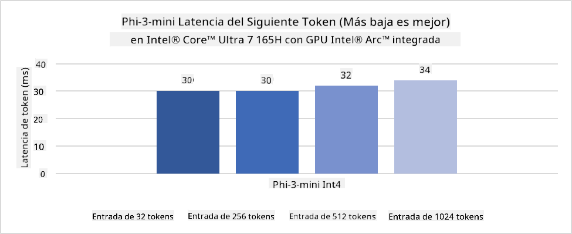
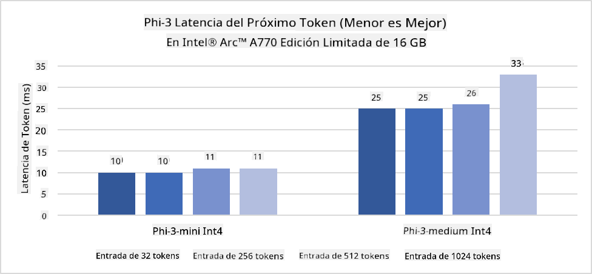
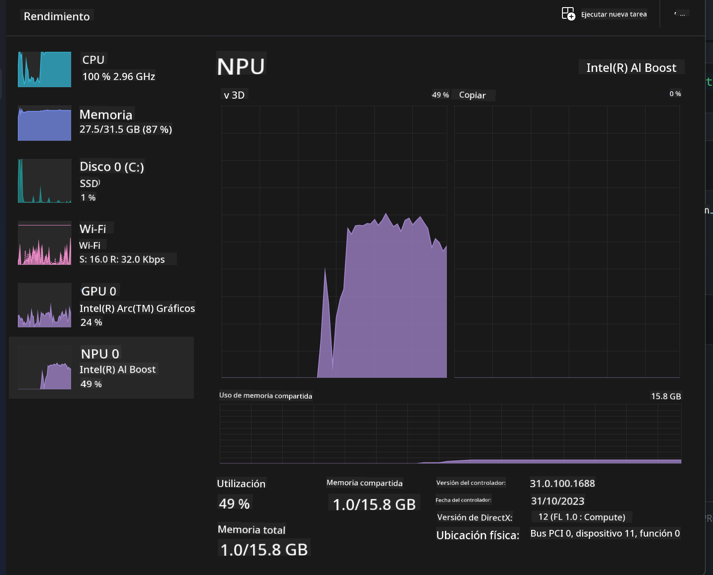
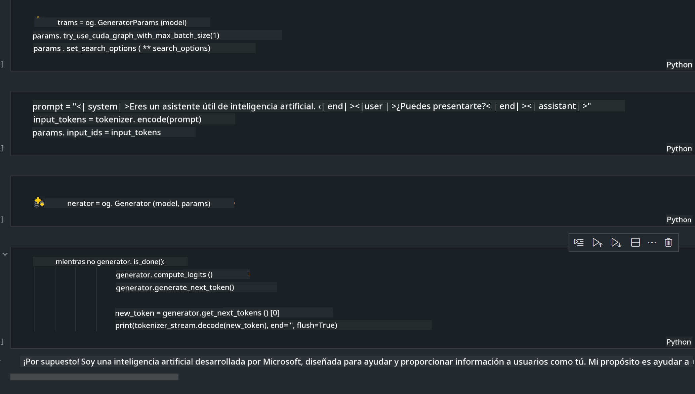
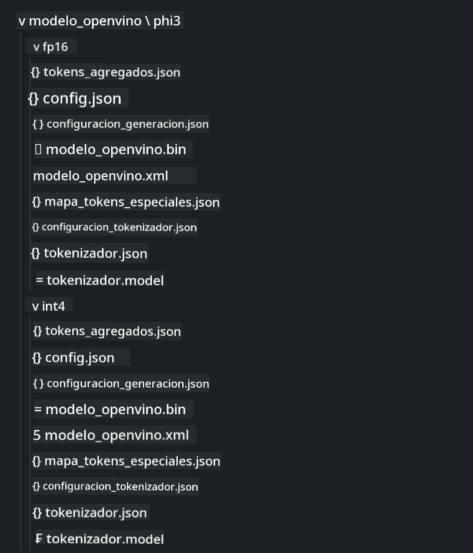
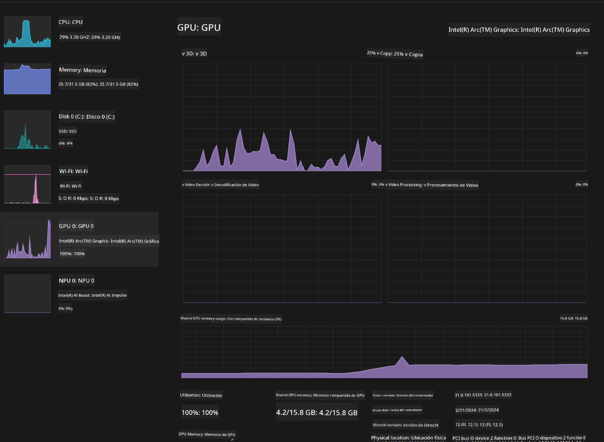

<!--
CO_OP_TRANSLATOR_METADATA:
{
  "original_hash": "e08ce816e23ad813244a09ca34ebb8ac",
  "translation_date": "2025-03-27T06:53:59+00:00",
  "source_file": "md\\01.Introduction\\03\\AIPC_Inference.md",
  "language_code": "es"
}
-->
# **Inferencia de Phi-3 en AI PC**

Con el avance de la inteligencia artificial generativa y la mejora en las capacidades de hardware de los dispositivos periféricos, un número creciente de modelos de inteligencia artificial generativa ahora puede integrarse en los dispositivos BYOD (Bring Your Own Device) de los usuarios. Las AI PCs son parte de estos modelos. A partir de 2024, Intel, AMD y Qualcomm han colaborado con fabricantes de PCs para introducir AI PCs que faciliten el despliegue de modelos de inteligencia artificial generativa localizados mediante modificaciones de hardware. En esta discusión, nos centraremos en las AI PCs de Intel y exploraremos cómo implementar Phi-3 en una AI PC de Intel.

### ¿Qué es un NPU?

Un NPU (Unidad de Procesamiento Neural) es un procesador o unidad de procesamiento dedicada en un SoC más grande, diseñada específicamente para acelerar operaciones de redes neuronales y tareas de inteligencia artificial. A diferencia de los CPUs y GPUs de propósito general, los NPUs están optimizados para la computación paralela basada en datos, lo que los hace altamente eficientes en el procesamiento de grandes cantidades de datos multimedia, como videos e imágenes, y en el procesamiento de datos para redes neuronales. Son especialmente hábiles para manejar tareas relacionadas con inteligencia artificial, como reconocimiento de voz, desenfoque de fondo en videollamadas y procesos de edición de fotos o videos como la detección de objetos.

## NPU vs GPU

Aunque muchas cargas de trabajo de inteligencia artificial y aprendizaje automático se ejecutan en GPUs, hay una diferencia crucial entre GPUs y NPUs.  
Las GPUs son conocidas por sus capacidades de computación paralela, pero no todas son igualmente eficientes más allá del procesamiento gráfico. Los NPUs, por otro lado, están diseñados específicamente para los cálculos complejos involucrados en las operaciones de redes neuronales, lo que los hace muy efectivos para tareas de inteligencia artificial.

En resumen, los NPUs son los genios matemáticos que aceleran los cálculos de inteligencia artificial y juegan un papel clave en la era emergente de las AI PCs.

***Este ejemplo está basado en el último procesador Intel Core Ultra.***

## **1. Usar NPU para ejecutar el modelo Phi-3**

El dispositivo Intel® NPU es un acelerador de inferencia de inteligencia artificial integrado en los CPUs de cliente Intel, comenzando con la generación de CPUs Intel® Core™ Ultra (anteriormente conocida como Meteor Lake). Permite la ejecución eficiente en términos de energía de tareas de redes neuronales artificiales.





**Biblioteca de Aceleración Intel NPU**

La Biblioteca de Aceleración Intel NPU [https://github.com/intel/intel-npu-acceleration-library](https://github.com/intel/intel-npu-acceleration-library) es una biblioteca de Python diseñada para aumentar la eficiencia de tus aplicaciones aprovechando el poder del Intel Neural Processing Unit (NPU) para realizar cálculos de alta velocidad en hardware compatible.

Ejemplo de Phi-3-mini en una AI PC con procesadores Intel® Core™ Ultra.


Instala la biblioteca de Python con pip

```bash

   pip install intel-npu-acceleration-library

```

***Nota*** El proyecto aún está en desarrollo, pero el modelo de referencia ya está muy completo.

### **Ejecutando Phi-3 con la Biblioteca de Aceleración Intel NPU**

Usando la aceleración NPU de Intel, esta biblioteca no afecta el proceso de codificación tradicional. Solo necesitas usar esta biblioteca para cuantificar el modelo original Phi-3, como FP16, INT8, INT4, por ejemplo:

```python
from transformers import AutoTokenizer, pipeline,TextStreamer
from intel_npu_acceleration_library import NPUModelForCausalLM, int4
from intel_npu_acceleration_library.compiler import CompilerConfig
import warnings

model_id = "microsoft/Phi-3-mini-4k-instruct"

compiler_conf = CompilerConfig(dtype=int4)
model = NPUModelForCausalLM.from_pretrained(
    model_id, use_cache=True, config=compiler_conf, attn_implementation="sdpa"
).eval()

tokenizer = AutoTokenizer.from_pretrained(model_id)

text_streamer = TextStreamer(tokenizer, skip_prompt=True)
```

Después de la cuantificación exitosa, continúa la ejecución para llamar al NPU y ejecutar el modelo Phi-3.

```python
generation_args = {
   "max_new_tokens": 1024,
   "return_full_text": False,
   "temperature": 0.3,
   "do_sample": False,
   "streamer": text_streamer,
}

pipe = pipeline(
   "text-generation",
   model=model,
   tokenizer=tokenizer,
)

query = "<|system|>You are a helpful AI assistant.<|end|><|user|>Can you introduce yourself?<|end|><|assistant|>"

with warnings.catch_warnings():
    warnings.simplefilter("ignore")
    pipe(query, **generation_args)
```

Al ejecutar el código, podemos ver el estado de ejecución del NPU a través del Administrador de Tareas.



***Ejemplos*** : [AIPC_NPU_DEMO.ipynb](../../../../../code/03.Inference/AIPC/AIPC_NPU_DEMO.ipynb)

## **2. Usar DirectML + ONNX Runtime para ejecutar el modelo Phi-3**

### **¿Qué es DirectML?**

[DirectML](https://github.com/microsoft/DirectML) es una biblioteca de DirectX 12 de alto rendimiento y acelerada por hardware para aprendizaje automático. DirectML proporciona aceleración por GPU para tareas comunes de aprendizaje automático en una amplia gama de hardware y controladores compatibles, incluidos todos los GPUs capaces de DirectX 12 de proveedores como AMD, Intel, NVIDIA y Qualcomm.

Cuando se usa de forma independiente, la API de DirectML es una biblioteca de bajo nivel de DirectX 12 y es adecuada para aplicaciones de alto rendimiento y baja latencia, como frameworks, juegos y otras aplicaciones en tiempo real. La interoperabilidad fluida de DirectML con Direct3D 12, así como su bajo overhead y conformidad entre hardware, hacen que DirectML sea ideal para acelerar el aprendizaje automático cuando se desea alto rendimiento y la confiabilidad y predictibilidad de los resultados en diferentes hardware es crítica.

***Nota*** : La última versión de DirectML ya admite NPU (https://devblogs.microsoft.com/directx/introducing-neural-processor-unit-npu-support-in-directml-developer-preview/).

### DirectML y CUDA en términos de capacidades y rendimiento:

**DirectML** es una biblioteca de aprendizaje automático desarrollada por Microsoft. Está diseñada para acelerar cargas de trabajo de aprendizaje automático en dispositivos Windows, incluidos escritorios, laptops y dispositivos periféricos.  
- Basado en DX12: DirectML está construido sobre DirectX 12 (DX12), lo que proporciona una amplia gama de soporte de hardware en GPUs, incluidas NVIDIA y AMD.  
- Soporte más amplio: Al aprovechar DX12, DirectML puede funcionar con cualquier GPU que admita DX12, incluso GPUs integradas.  
- Procesamiento de imágenes: DirectML procesa imágenes y otros datos utilizando redes neuronales, lo que lo hace adecuado para tareas como reconocimiento de imágenes, detección de objetos y más.  
- Facilidad de configuración: Configurar DirectML es sencillo y no requiere SDKs o bibliotecas específicas de los fabricantes de GPUs.  
- Rendimiento: En algunos casos, DirectML funciona bien y puede ser más rápido que CUDA, especialmente para ciertas cargas de trabajo.  
- Limitaciones: Sin embargo, hay instancias en las que DirectML puede ser más lento, particularmente para tamaños de lotes grandes en float16.

**CUDA** es la plataforma de computación paralela y modelo de programación de NVIDIA. Permite a los desarrolladores aprovechar el poder de las GPUs NVIDIA para la computación de propósito general, incluido el aprendizaje automático y simulaciones científicas.  
- Específico de NVIDIA: CUDA está estrechamente integrado con las GPUs NVIDIA y está diseñado específicamente para ellas.  
- Altamente optimizado: Proporciona un rendimiento excelente para tareas aceleradas por GPU, especialmente al usar GPUs NVIDIA.  
- Ampliamente utilizado: Muchos frameworks y bibliotecas de aprendizaje automático (como TensorFlow y PyTorch) tienen soporte para CUDA.  
- Personalización: Los desarrolladores pueden ajustar configuraciones de CUDA para tareas específicas, lo que puede llevar a un rendimiento óptimo.  
- Limitaciones: Sin embargo, la dependencia de CUDA en hardware NVIDIA puede ser limitante si se busca una compatibilidad más amplia entre diferentes GPUs.

### Elegir entre DirectML y CUDA

La elección entre DirectML y CUDA depende de tu caso de uso específico, disponibilidad de hardware y preferencias.  
Si buscas una compatibilidad más amplia y facilidad de configuración, DirectML podría ser una buena opción. Sin embargo, si tienes GPUs NVIDIA y necesitas un rendimiento altamente optimizado, CUDA sigue siendo una opción sólida. En resumen, tanto DirectML como CUDA tienen sus fortalezas y debilidades, por lo que considera tus requisitos y hardware disponible al tomar una decisión.

### **IA Generativa con ONNX Runtime**

En la era de la inteligencia artificial, la portabilidad de los modelos de IA es muy importante. ONNX Runtime permite desplegar modelos entrenados fácilmente en diferentes dispositivos. Los desarrolladores no necesitan prestar atención al framework de inferencia y pueden usar una API unificada para completar la inferencia del modelo. En la era de la inteligencia artificial generativa, ONNX Runtime también ha realizado optimizaciones de código (https://onnxruntime.ai/docs/genai/). A través de ONNX Runtime optimizado, el modelo generativo cuantificado puede inferirse en diferentes terminales. En IA Generativa con ONNX Runtime, puedes realizar inferencias de modelos de IA mediante APIs de Python, C#, C / C++. Por supuesto, el despliegue en iPhone puede aprovechar la API de Generative AI con ONNX Runtime en C++.

[Código de Ejemplo](https://github.com/Azure-Samples/Phi-3MiniSamples/tree/main/onnx)

***Compilar IA generativa con la biblioteca ONNX Runtime***

```bash

winget install --id=Kitware.CMake  -e

git clone https://github.com/microsoft/onnxruntime.git

cd .\onnxruntime\

./build.bat --build_shared_lib --skip_tests --parallel --use_dml --config Release

cd ../

git clone https://github.com/microsoft/onnxruntime-genai.git

cd .\onnxruntime-genai\

mkdir ort

cd ort

mkdir include

mkdir lib

copy ..\onnxruntime\include\onnxruntime\core\providers\dml\dml_provider_factory.h ort\include

copy ..\onnxruntime\include\onnxruntime\core\session\onnxruntime_c_api.h ort\include

copy ..\onnxruntime\build\Windows\Release\Release\*.dll ort\lib

copy ..\onnxruntime\build\Windows\Release\Release\onnxruntime.lib ort\lib

python build.py --use_dml


```

**Instalar la biblioteca**

```bash

pip install .\onnxruntime_genai_directml-0.3.0.dev0-cp310-cp310-win_amd64.whl

```

Este es el resultado de ejecución



***Ejemplos*** : [AIPC_DirectML_DEMO.ipynb](../../../../../code/03.Inference/AIPC/AIPC_DirectML_DEMO.ipynb)

## **3. Usar Intel OpenVINO para ejecutar el modelo Phi-3**

### **¿Qué es OpenVINO?**

[OpenVINO](https://github.com/openvinotoolkit/openvino) es un toolkit de código abierto para optimizar y desplegar modelos de aprendizaje profundo. Proporciona un rendimiento mejorado para modelos de visión, audio y lenguaje de frameworks populares como TensorFlow, PyTorch y más. OpenVINO también puede usarse en combinación con CPU y GPU para ejecutar el modelo Phi-3.

***Nota***: Actualmente, OpenVINO no admite NPU.

### **Instalar la biblioteca OpenVINO**

```bash

 pip install git+https://github.com/huggingface/optimum-intel.git

 pip install git+https://github.com/openvinotoolkit/nncf.git

 pip install openvino-nightly

```

### **Ejecutando Phi-3 con OpenVINO**

Al igual que con NPU, OpenVINO completa la ejecución de modelos de inteligencia artificial generativa mediante modelos cuantificados. Necesitamos cuantificar el modelo Phi-3 primero y completar la cuantificación del modelo en la línea de comandos a través de optimum-cli.

**INT4**

```bash

optimum-cli export openvino --model "microsoft/Phi-3-mini-4k-instruct" --task text-generation-with-past --weight-format int4 --group-size 128 --ratio 0.6  --sym  --trust-remote-code ./openvinomodel/phi3/int4

```

**FP16**

```bash

optimum-cli export openvino --model "microsoft/Phi-3-mini-4k-instruct" --task text-generation-with-past --weight-format fp16 --trust-remote-code ./openvinomodel/phi3/fp16

```

El formato convertido se ve así:



Carga rutas del modelo (model_dir), configuraciones relacionadas (ov_config = {"PERFORMANCE_HINT": "LATENCY", "NUM_STREAMS": "1", "CACHE_DIR": ""}) y dispositivos acelerados por hardware (GPU.0) a través de OVModelForCausalLM.

```python

ov_model = OVModelForCausalLM.from_pretrained(
     model_dir,
     device='GPU.0',
     ov_config=ov_config,
     config=AutoConfig.from_pretrained(model_dir, trust_remote_code=True),
     trust_remote_code=True,
)

```

Al ejecutar el código, podemos ver el estado de ejecución de la GPU a través del Administrador de Tareas.



***Ejemplos*** : [AIPC_OpenVino_Demo.ipynb](../../../../../code/03.Inference/AIPC/AIPC_OpenVino_Demo.ipynb)

### ***Nota*** : Los tres métodos anteriores tienen sus propias ventajas, pero se recomienda usar la aceleración NPU para la inferencia en AI PCs.

**Descargo de responsabilidad**:  
Este documento ha sido traducido utilizando el servicio de traducción automática [Co-op Translator](https://github.com/Azure/co-op-translator). Si bien nos esforzamos por lograr precisión, tenga en cuenta que las traducciones automatizadas pueden contener errores o imprecisiones. El documento original en su idioma nativo debe considerarse la fuente autorizada. Para información crítica, se recomienda una traducción profesional realizada por humanos. No nos hacemos responsables de malentendidos o interpretaciones erróneas que puedan surgir del uso de esta traducción.