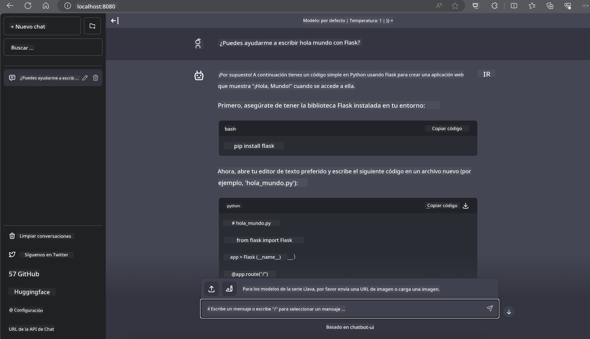

<!--
CO_OP_TRANSLATOR_METADATA:
{
  "original_hash": "be4101a30d98e95a71d42c276e8bcd37",
  "translation_date": "2025-03-27T07:23:33+00:00",
  "source_file": "md\\01.Introduction\\03\\Jetson_Inference.md",
  "language_code": "es"
}
-->
# **Inferencia de Phi-3 en Nvidia Jetson**

Nvidia Jetson es una serie de placas de computación integradas de Nvidia. Los modelos Jetson TK1, TX1 y TX2 cuentan con un procesador Tegra (o SoC) de Nvidia que integra una unidad central de procesamiento (CPU) con arquitectura ARM. Jetson es un sistema de bajo consumo diseñado para acelerar aplicaciones de aprendizaje automático. Nvidia Jetson es utilizado por desarrolladores profesionales para crear productos innovadores de inteligencia artificial en todas las industrias, así como por estudiantes y entusiastas para aprender sobre IA de manera práctica y realizar proyectos increíbles. SLM se implementa en dispositivos de borde como Jetson, lo que permite una mejor ejecución de escenarios industriales de aplicaciones generativas de IA.

## Implementación en NVIDIA Jetson:
Los desarrolladores que trabajan en robótica autónoma y dispositivos integrados pueden aprovechar Phi-3 Mini. El tamaño relativamente pequeño de Phi-3 lo hace ideal para implementaciones en el borde. Los parámetros han sido ajustados meticulosamente durante el entrenamiento, garantizando alta precisión en las respuestas.

### Optimización TensorRT-LLM:
La [biblioteca TensorRT-LLM de NVIDIA](https://github.com/NVIDIA/TensorRT-LLM?WT.mc_id=aiml-138114-kinfeylo) optimiza la inferencia de modelos de lenguaje grandes. Es compatible con la ventana de contexto extendida de Phi-3 Mini, mejorando tanto el rendimiento como la latencia. Las optimizaciones incluyen técnicas como LongRoPE, FP8 y procesamiento por lotes en vuelo.

### Disponibilidad e Implementación:
Los desarrolladores pueden explorar Phi-3 Mini con la ventana de contexto de 128K en [NVIDIA's AI](https://www.nvidia.com/en-us/ai-data-science/generative-ai/). Está empaquetado como un NVIDIA NIM, un microservicio con una API estándar que puede implementarse en cualquier lugar. Además, las [implementaciones de TensorRT-LLM en GitHub](https://github.com/NVIDIA/TensorRT-LLM).

## **1. Preparación**

a. Jetson Orin NX / Jetson NX

b. JetPack 5.1.2+
   
c. Cuda 11.8
   
d. Python 3.8+

## **2. Ejecutar Phi-3 en Jetson**

Podemos elegir entre [Ollama](https://ollama.com) o [LlamaEdge](https://llamaedge.com)

Si deseas usar gguf en la nube y en dispositivos de borde al mismo tiempo, LlamaEdge puede entenderse como WasmEdge (WasmEdge es un entorno de ejecución de WebAssembly ligero, de alto rendimiento y escalable, adecuado para aplicaciones nativas de la nube, en el borde y descentralizadas. Admite aplicaciones sin servidor, funciones integradas, microservicios, contratos inteligentes y dispositivos IoT. Puedes implementar el modelo cuantitativo de gguf en dispositivos de borde y en la nube a través de LlamaEdge).


Aquí están los pasos para usarlo:

1. Instalar y descargar las bibliotecas y archivos relacionados

```bash

curl -sSf https://raw.githubusercontent.com/WasmEdge/WasmEdge/master/utils/install.sh | bash -s -- --plugin wasi_nn-ggml

curl -LO https://github.com/LlamaEdge/LlamaEdge/releases/latest/download/llama-api-server.wasm

curl -LO https://github.com/LlamaEdge/chatbot-ui/releases/latest/download/chatbot-ui.tar.gz

tar xzf chatbot-ui.tar.gz

```

**Nota**: llama-api-server.wasm y chatbot-ui deben estar en el mismo directorio

2. Ejecutar los scripts en la terminal

```bash

wasmedge --dir .:. --nn-preload default:GGML:AUTO:{Your gguf path} llama-api-server.wasm -p phi-3-chat

```

Aquí está el resultado de ejecución:



***Código de ejemplo*** [Phi-3 mini WASM Notebook Sample](https://github.com/Azure-Samples/Phi-3MiniSamples/tree/main/wasm)

En resumen, Phi-3 Mini representa un gran avance en la modelización del lenguaje, combinando eficiencia, conciencia del contexto y el poder de optimización de NVIDIA. Ya sea que estés construyendo robots o aplicaciones en el borde, Phi-3 Mini es una herramienta poderosa que vale la pena considerar.

**Descargo de responsabilidad**:  
Este documento ha sido traducido utilizando el servicio de traducción automática [Co-op Translator](https://github.com/Azure/co-op-translator). Aunque nos esforzamos por lograr precisión, tenga en cuenta que las traducciones automatizadas pueden contener errores o imprecisiones. El documento original en su idioma nativo debe considerarse como la fuente autorizada. Para información crítica, se recomienda una traducción profesional realizada por humanos. No somos responsables de malentendidos o interpretaciones erróneas que surjan del uso de esta traducción.