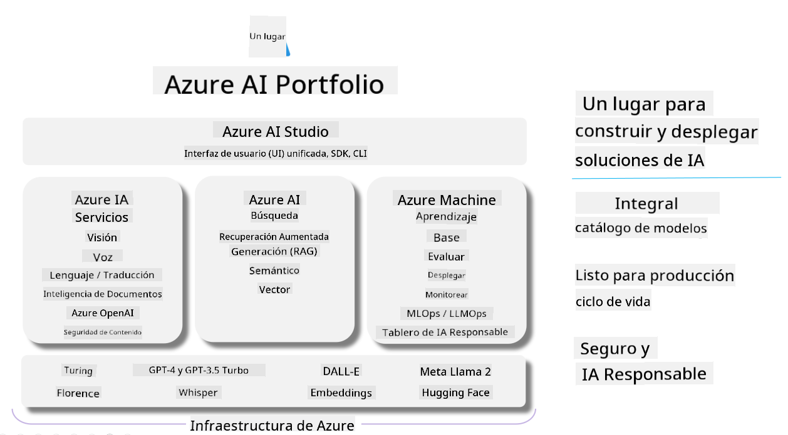

<!--
CO_OP_TRANSLATOR_METADATA:
{
  "original_hash": "7b4235159486df4000e16b7b46ddfec3",
  "translation_date": "2025-03-27T08:49:40+00:00",
  "source_file": "md\\01.Introduction\\05\\AIFoundry.md",
  "language_code": "es"
}
-->
# **Uso de Azure AI Foundry para evaluación**

Cómo evaluar tu aplicación de IA generativa usando [Azure AI Foundry](https://ai.azure.com?WT.mc_id=aiml-138114-kinfeylo). Ya sea que estés evaluando conversaciones de un solo turno o de múltiples turnos, Azure AI Foundry ofrece herramientas para analizar el rendimiento y la seguridad del modelo.

## Cómo evaluar aplicaciones de IA generativa con Azure AI Foundry
Para instrucciones más detalladas, consulta la [Documentación de Azure AI Foundry](https://learn.microsoft.com/azure/ai-studio/how-to/evaluate-generative-ai-app?WT.mc_id=aiml-138114-kinfeylo)

Estos son los pasos para comenzar:

## Evaluación de modelos de IA generativa en Azure AI Foundry

**Requisitos previos**

- Un conjunto de datos de prueba en formato CSV o JSON.
- Un modelo de IA generativa desplegado (como Phi-3, GPT 3.5, GPT 4 o modelos Davinci).
- Un entorno de ejecución con una instancia de cómputo para realizar la evaluación.

## Métricas de evaluación integradas

Azure AI Foundry permite evaluar tanto conversaciones de un solo turno como conversaciones complejas de múltiples turnos.  
Para escenarios de Recuperación Aumentada por Generación (RAG), donde el modelo se basa en datos específicos, puedes analizar el rendimiento utilizando métricas de evaluación integradas.  
Además, puedes evaluar escenarios generales de preguntas y respuestas de un solo turno (no RAG).

## Creación de una ejecución de evaluación

Desde la interfaz de usuario de Azure AI Foundry, navega a la página de Evaluar o a la página de Flujo de Prompt.  
Sigue el asistente de creación de evaluación para configurar una ejecución de evaluación. Proporciona un nombre opcional para tu evaluación.  
Selecciona el escenario que se alinea con los objetivos de tu aplicación.  
Elige una o más métricas de evaluación para analizar los resultados del modelo.

## Flujo de evaluación personalizado (Opcional)

Para mayor flexibilidad, puedes establecer un flujo de evaluación personalizado. Adapta el proceso de evaluación según tus necesidades específicas.

## Visualización de resultados

Después de ejecutar la evaluación, registra, visualiza y analiza métricas de evaluación detalladas en Azure AI Foundry. Obtén información sobre las capacidades y limitaciones de tu aplicación.

**Nota** Azure AI Foundry está actualmente en vista previa pública, por lo que debe usarse con fines de experimentación y desarrollo. Para cargas de trabajo en producción, considera otras opciones. Explora la [documentación oficial de AI Foundry](https://learn.microsoft.com/azure/ai-studio/?WT.mc_id=aiml-138114-kinfeylo) para más detalles e instrucciones paso a paso.

**Descargo de responsabilidad**:  
Este documento ha sido traducido utilizando el servicio de traducción automática [Co-op Translator](https://github.com/Azure/co-op-translator). Si bien nos esforzamos por lograr precisión, tenga en cuenta que las traducciones automáticas pueden contener errores o imprecisiones. El documento original en su idioma nativo debe considerarse la fuente autorizada. Para información crítica, se recomienda una traducción profesional realizada por humanos. No nos hacemos responsables de ningún malentendido o interpretación errónea que surja del uso de esta traducción.