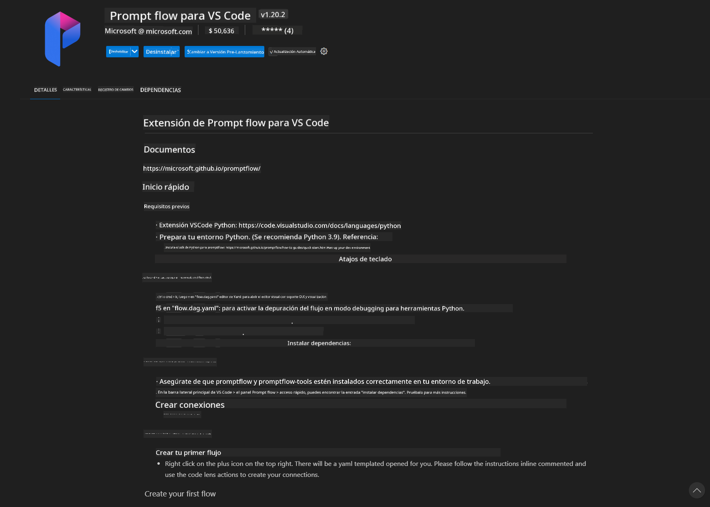
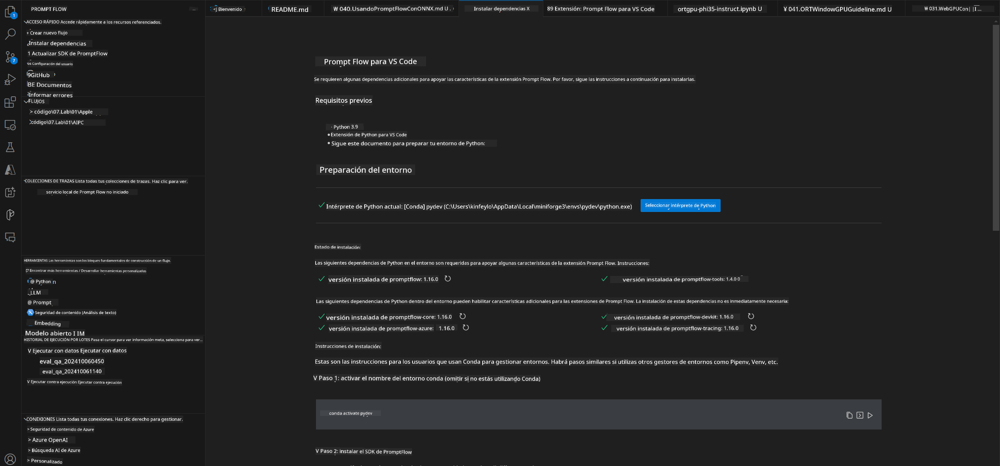
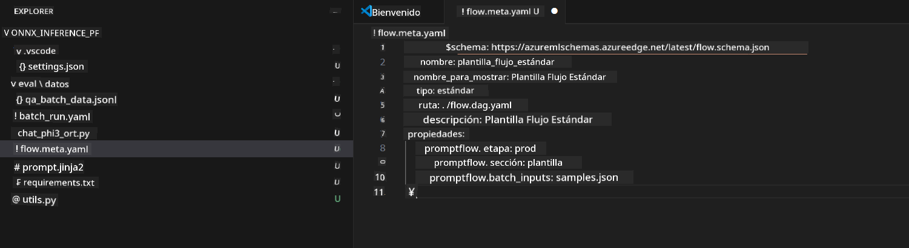
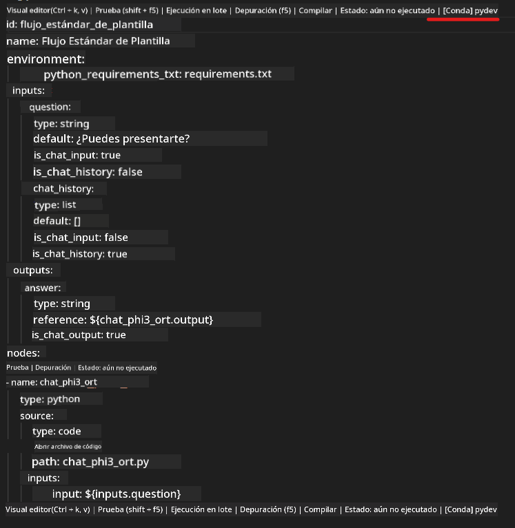
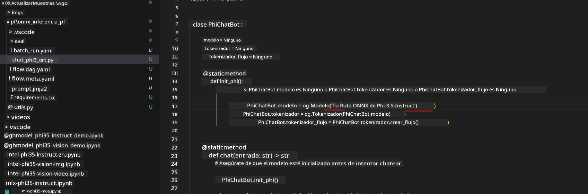
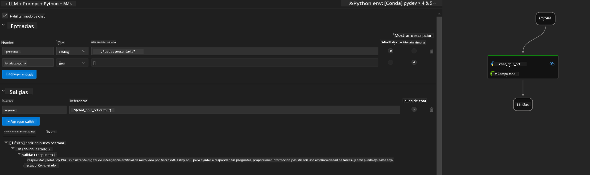
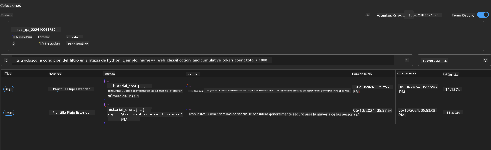

<!--
CO_OP_TRANSLATOR_METADATA:
{
  "original_hash": "92e7dac1e5af0dd7c94170fdaf6860fe",
  "translation_date": "2025-03-27T11:10:11+00:00",
  "source_file": "md\\02.Application\\01.TextAndChat\\Phi3\\UsingPromptFlowWithONNX.md",
  "language_code": "es"
}
-->
# Usar GPU de Windows para crear una solución Prompt flow con Phi-3.5-Instruct ONNX

El siguiente documento es un ejemplo de cómo usar PromptFlow con ONNX (Open Neural Network Exchange) para desarrollar aplicaciones de IA basadas en modelos Phi-3.

PromptFlow es un conjunto de herramientas de desarrollo diseñadas para simplificar el ciclo completo de desarrollo de aplicaciones de IA basadas en LLM (Modelos de Lenguaje Grande), desde la idea y el prototipo hasta las pruebas y la evaluación.

Al integrar PromptFlow con ONNX, los desarrolladores pueden:

- **Optimizar el rendimiento del modelo**: Aprovechar ONNX para una inferencia y despliegue eficientes del modelo.
- **Simplificar el desarrollo**: Utilizar PromptFlow para gestionar el flujo de trabajo y automatizar tareas repetitivas.
- **Mejorar la colaboración**: Facilitar una mejor colaboración entre los miembros del equipo al proporcionar un entorno de desarrollo unificado.

**Prompt flow** es un conjunto de herramientas de desarrollo diseñadas para simplificar el ciclo completo de desarrollo de aplicaciones de IA basadas en LLM, desde la ideación, el prototipado, las pruebas, la evaluación, hasta el despliegue en producción y el monitoreo. Hace que la ingeniería de prompts sea mucho más sencilla y permite construir aplicaciones de LLM con calidad de producción.

Prompt flow puede conectarse a OpenAI, Azure OpenAI Service y modelos personalizables (Huggingface, LLM/SLM locales). Esperamos implementar el modelo ONNX cuantificado de Phi-3.5 en aplicaciones locales. Prompt flow puede ayudarnos a planificar mejor nuestro negocio y completar soluciones locales basadas en Phi-3.5. En este ejemplo, combinaremos la biblioteca GenAI de ONNX Runtime para completar la solución Prompt flow basada en GPU de Windows.

## **Instalación**

### **ONNX Runtime GenAI para GPU de Windows**

Lee esta guía para configurar ONNX Runtime GenAI para GPU de Windows [haz clic aquí](./ORTWindowGPUGuideline.md)

### **Configurar Prompt flow en VSCode**

1. Instalar la extensión de Prompt flow para VS Code



2. Después de instalar la extensión de Prompt flow para VS Code, haz clic en la extensión y selecciona **Installation dependencies**. Sigue esta guía para instalar el SDK de Prompt flow en tu entorno.



3. Descarga [Código de ejemplo](../../../../../../code/09.UpdateSamples/Aug/pf/onnx_inference_pf) y usa VS Code para abrir este ejemplo.



4. Abre **flow.dag.yaml** para seleccionar tu entorno de Python.



   Abre **chat_phi3_ort.py** para cambiar la ubicación de tu modelo Phi-3.5-instruct ONNX.



5. Ejecuta tu Prompt flow para realizar pruebas.

Abre **flow.dag.yaml** y haz clic en el editor visual.


Después de hacer clic en esto, ejecútalo para probar.



1. Puedes ejecutar un lote en el terminal para verificar más resultados.

```bash

pf run create --file batch_run.yaml --stream --name 'Your eval qa name'    

```

Puedes verificar los resultados en tu navegador predeterminado.



**Descargo de responsabilidad**:  
Este documento ha sido traducido utilizando el servicio de traducción por IA [Co-op Translator](https://github.com/Azure/co-op-translator). Si bien nos esforzamos por lograr precisión, tenga en cuenta que las traducciones automáticas pueden contener errores o imprecisiones. El documento original en su idioma nativo debe considerarse como la fuente autorizada. Para información crítica, se recomienda una traducción profesional realizada por humanos. No nos hacemos responsables por malentendidos o interpretaciones erróneas que surjan del uso de esta traducción.