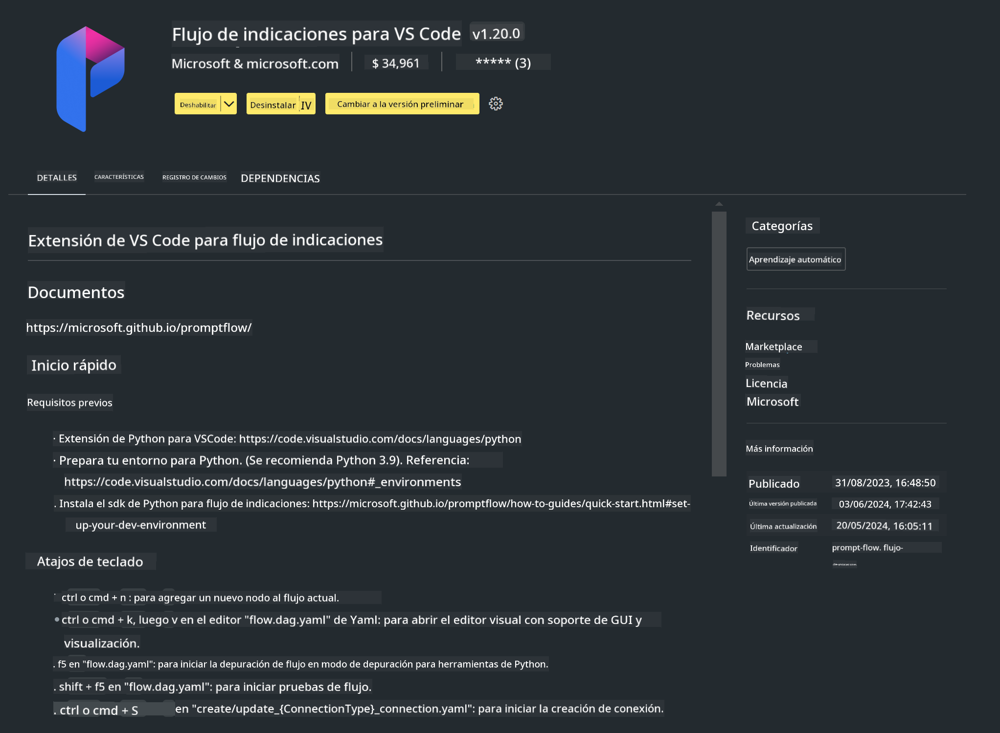

<!--
CO_OP_TRANSLATOR_METADATA:
{
  "original_hash": "a4ef39027902e82f2c33d568d2a2259a",
  "translation_date": "2025-03-27T11:47:08+00:00",
  "source_file": "md\\02.Application\\02.Code\\Phi3\\VSCodeExt\\HOL\\AIPC\\01.Installations.md",
  "language_code": "es"
}
-->
# **Lab 0 - Instalación**

Cuando ingresamos al Lab, necesitamos configurar el entorno correspondiente:

### **1. Python 3.11+**

Se recomienda usar miniforge para configurar tu entorno de Python.

Para configurar miniforge, consulta [https://github.com/conda-forge/miniforge](https://github.com/conda-forge/miniforge).

Después de configurar miniforge, ejecuta el siguiente comando en Power Shell:

```bash

conda create -n pyenv python==3.11.8 -y

conda activate pyenv

```

### **2. Instalar Prompt flow SDK**

En el Lab 1, utilizamos Prompt flow, por lo que necesitas configurar el Prompt flow SDK.

```bash

pip install promptflow --upgrade

```

Puedes verificar el SDK de Prompt flow con este comando:

```bash

pf --version

```

### **3. Instalar la Extensión de Prompt flow para Visual Studio Code**



### **4. Biblioteca de Aceleración Intel NPU**

Los procesadores de nueva generación de Intel admiten NPU. Si deseas usar la NPU para ejecutar LLMs / SLMs localmente, puedes usar la ***Biblioteca de Aceleración Intel NPU***. Si deseas saber más, puedes leer [https://github.com/microsoft/PhiCookBook/blob/main/md/01.Introduction/03/AIPC_Inference.md](https://github.com/microsoft/PhiCookBook/blob/main/md/01.Introduction/03/AIPC_Inference.md).

Instala la Biblioteca de Aceleración Intel NPU en bash:

```bash

pip install intel-npu-acceleration-library

```

***Nota***: Ten en cuenta que esta biblioteca admite transformers ***4.40.2***, por favor confirma la versión.

### **5. Otras Bibliotecas de Python**

Crea un archivo requirements.txt y agrega este contenido:

```txt

notebook
numpy 
scipy 
scikit-learn 
matplotlib 
pandas 
pillow 
graphviz

```

### **6. Instalar NVM**

Instala nvm en Powershell:

```bash

winget install -e --id CoreyButler.NVMforWindows

```

Instala nodejs 18.20:

```bash

nvm install 18.20.0

nvm use 18.20.0

```

### **7. Instalar Soporte de Desarrollo para Visual Studio Code**

```bash

npm install --global yo generator-code

```

¡Felicidades! Has configurado exitosamente el SDK. Ahora, procede con los pasos prácticos.

**Descargo de responsabilidad**:  
Este documento ha sido traducido utilizando el servicio de traducción automática [Co-op Translator](https://github.com/Azure/co-op-translator). Aunque nos esforzamos por garantizar la precisión, tenga en cuenta que las traducciones automatizadas pueden contener errores o imprecisiones. El documento original en su idioma nativo debe considerarse como la fuente autorizada. Para información crítica, se recomienda una traducción profesional realizada por humanos. No nos hacemos responsables de ningún malentendido o interpretación errónea que surja del uso de esta traducción.