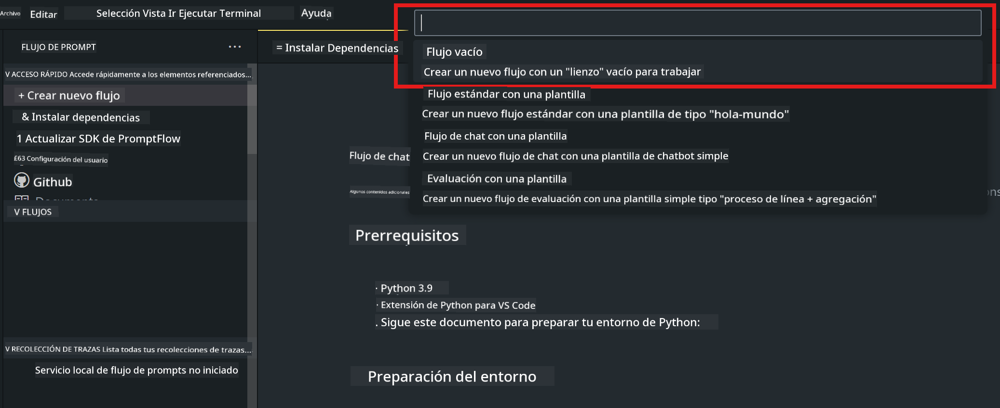
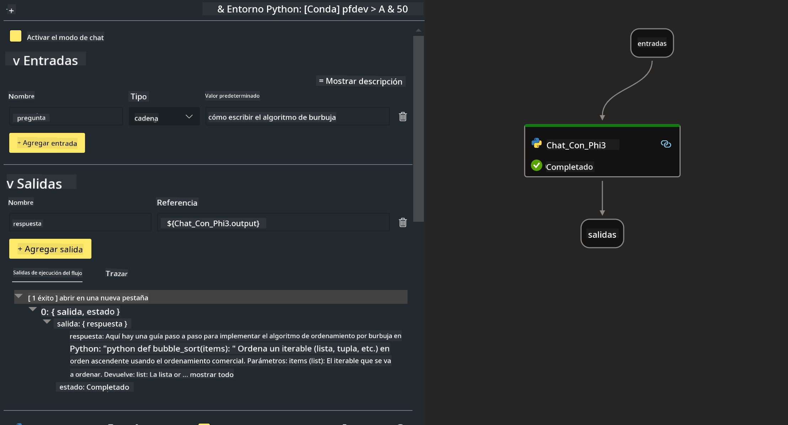

<!--
CO_OP_TRANSLATOR_METADATA:
{
  "original_hash": "3dbbf568625b1ee04b354c2dc81d3248",
  "translation_date": "2025-03-27T12:17:58+00:00",
  "source_file": "md\\02.Application\\02.Code\\Phi3\\VSCodeExt\\HOL\\Apple\\02.PromptflowWithMLX.md",
  "language_code": "es"
}
-->
# **Lab 2 - Ejecutar Prompt flow con Phi-3-mini en AIPC**

## **¿Qué es Prompt flow?**

Prompt flow es un conjunto de herramientas de desarrollo diseñadas para simplificar el ciclo completo de desarrollo de aplicaciones de IA basadas en LLM, desde la ideación, prototipado, pruebas, evaluación hasta el despliegue en producción y monitoreo. Facilita la ingeniería de prompts y te permite construir aplicaciones LLM con calidad de producción.

Con Prompt flow, podrás:

- Crear flujos que conecten LLMs, prompts, código Python y otras herramientas en un flujo de trabajo ejecutable.

- Depurar e iterar tus flujos, especialmente la interacción con los LLMs, de manera sencilla.

- Evaluar tus flujos, calcular métricas de calidad y rendimiento con conjuntos de datos más amplios.

- Integrar las pruebas y evaluaciones en tu sistema CI/CD para garantizar la calidad de tu flujo.

- Desplegar tus flujos en la plataforma de servicio que elijas o integrarlos fácilmente en la base de código de tu aplicación.

- (Opcional pero altamente recomendado) Colaborar con tu equipo aprovechando la versión en la nube de Prompt flow en Azure AI.


## **Construcción de flujos de generación de código en Apple Silicon**

***Nota*** ：Si no has completado la instalación del entorno, visita [Lab 0 - Instalaciones](./01.Installations.md)

1. Abre la extensión Prompt flow en Visual Studio Code y crea un proyecto de flujo vacío.



2. Agrega parámetros de entrada y salida, y añade código Python como un nuevo flujo.




Puedes referirte a esta estructura (flow.dag.yaml) para construir tu flujo.

```yaml

inputs:
  prompt:
    type: string
    default: Write python code for Fibonacci serie. Please use markdown as output
outputs:
  result:
    type: string
    reference: ${gen_code_by_phi3.output}
nodes:
- name: gen_code_by_phi3
  type: python
  source:
    type: code
    path: gen_code_by_phi3.py
  inputs:
    prompt: ${inputs.prompt}


```

3. Cuantificar phi-3-mini

Queremos ejecutar SLM mejor en dispositivos locales. Generalmente, cuantificamos el modelo (INT4, FP16, FP32).


```bash

python -m mlx_lm.convert --hf-path microsoft/Phi-3-mini-4k-instruct

```

**Nota:** la carpeta predeterminada es mlx_model 

4. Agrega código en ***Chat_With_Phi3.py***


```python


from promptflow import tool

from mlx_lm import load, generate


# The inputs section will change based on the arguments of the tool function, after you save the code
# Adding type to arguments and return value will help the system show the types properly
# Please update the function name/signature per need
@tool
def my_python_tool(prompt: str) -> str:

    model_id = './mlx_model_phi3_mini'

    model, tokenizer = load(model_id)

    # <|user|>\nWrite python code for Fibonacci serie. Please use markdown as output<|end|>\n<|assistant|>

    response = generate(model, tokenizer, prompt="<|user|>\n" + prompt  + "<|end|>\n<|assistant|>", max_tokens=2048, verbose=True)

    return response


```

4. Puedes probar el flujo desde Debug o Run para verificar si la generación de código funciona correctamente.


5. Ejecuta el flujo como una API de desarrollo en el terminal.

```

pf flow serve --source ./ --port 8080 --host localhost   

```

Puedes probarlo en Postman / Thunder Client.


### **Nota**

1. La primera ejecución toma mucho tiempo. Se recomienda descargar el modelo phi-3 desde Hugging Face CLI.

2. Considerando la limitada capacidad de cómputo del Intel NPU, se recomienda usar Phi-3-mini-4k-instruct.

3. Utilizamos la aceleración de Intel NPU para convertir a INT4, pero si vuelves a ejecutar el servicio, necesitas eliminar la caché y las carpetas nc_workshop.


## **Recursos**

1. Aprende Promptflow [https://microsoft.github.io/promptflow/](https://microsoft.github.io/promptflow/)

2. Aprende Aceleración Intel NPU [https://github.com/intel/intel-npu-acceleration-library](https://github.com/intel/intel-npu-acceleration-library)

3. Código de ejemplo, descarga [Código de Ejemplo del Agente NPU Local](../../../../../../../../../code/07.Lab/01/AIPC/local-npu-agent)

**Descargo de responsabilidad**:  
Este documento ha sido traducido utilizando el servicio de traducción por IA [Co-op Translator](https://github.com/Azure/co-op-translator). Si bien nos esforzamos por lograr precisión, tenga en cuenta que las traducciones automáticas pueden contener errores o imprecisiones. El documento original en su idioma nativo debe considerarse como la fuente autorizada. Para información crítica, se recomienda una traducción profesional realizada por humanos. No nos hacemos responsables de malentendidos o interpretaciones erróneas que puedan surgir del uso de esta traducción.