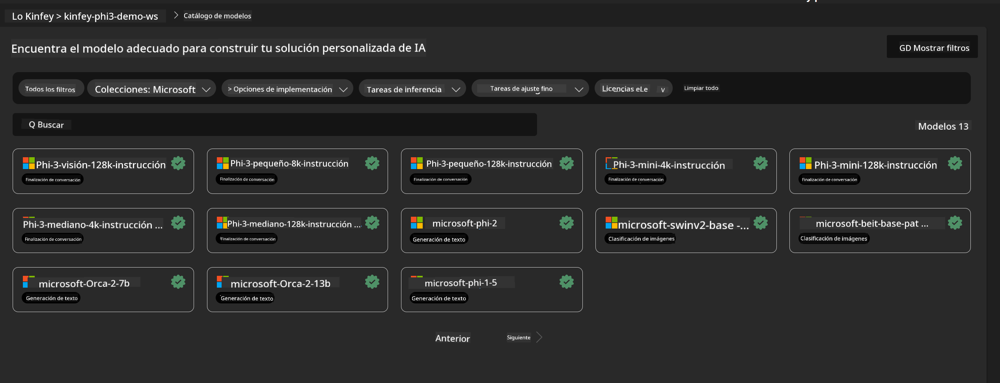
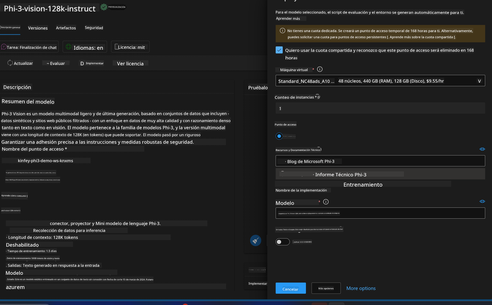
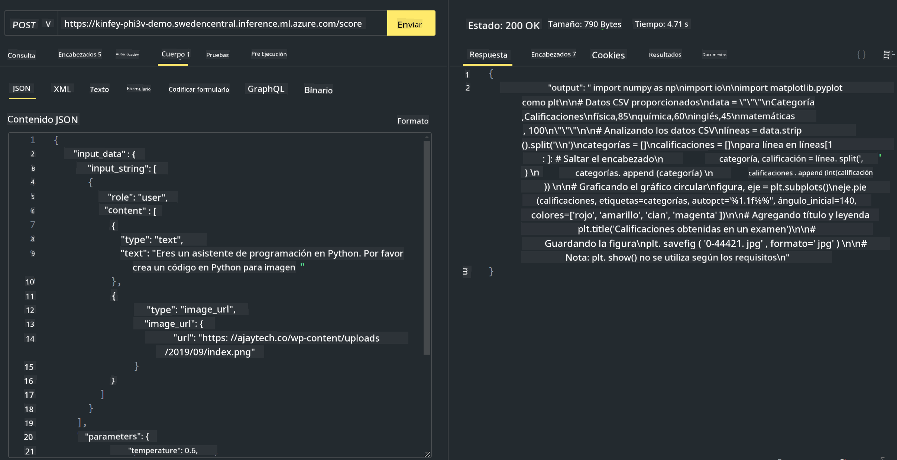

<!--
CO_OP_TRANSLATOR_METADATA:
{
  "original_hash": "20cb4e6ac1686248e8be913ccf6c2bc2",
  "translation_date": "2025-03-27T12:23:59+00:00",
  "source_file": "md\\02.Application\\02.Code\\Phi3\\VSCodeExt\\HOL\\Apple\\03.DeployPhi3VisionOnAzure.md",
  "language_code": "es"
}
-->
# **Lab 3 - Implementar Phi-3-Vision en Azure Machine Learning Service**

Usamos NPU para completar el despliegue de código local en producción, y luego queremos introducir la capacidad de utilizar PHI-3-VISION para lograr generar código a partir de imágenes.

En esta introducción, podemos construir rápidamente un servicio Phi-3 Vision como modelo-as-a-service en Azure Machine Learning Service.

***Nota***: Phi-3 Vision requiere potencia de cómputo para generar contenido a mayor velocidad. Necesitamos la capacidad de cómputo en la nube para ayudarnos a lograr esto.

### **1. Crear Azure Machine Learning Service**

Necesitamos crear un Azure Machine Learning Service en el portal de Azure. Si quieres aprender cómo hacerlo, por favor visita este enlace: [https://learn.microsoft.com/azure/machine-learning/quickstart-create-resources?view=azureml-api-2](https://learn.microsoft.com/azure/machine-learning/quickstart-create-resources?view=azureml-api-2)

### **2. Elegir Phi-3 Vision en Azure Machine Learning Service**



### **3. Implementar Phi-3-Vision en Azure**



### **4. Probar el Endpoint en Postman**



***Nota***

1. Los parámetros que se deben transmitir deben incluir Authorization, azureml-model-deployment y Content-Type. Necesitas revisar la información del despliegue para obtenerlos.

2. Para transmitir parámetros, Phi-3-Vision requiere enviar un enlace de imagen. Por favor, consulta el método de GPT-4-Vision para transmitir parámetros, como en el siguiente ejemplo:

```json

{
  "input_data":{
    "input_string":[
      {
        "role":"user",
        "content":[ 
          {
            "type": "text",
            "text": "You are a Python coding assistant.Please create Python code for image "
          },
          {
              "type": "image_url",
              "image_url": {
                "url": "https://ajaytech.co/wp-content/uploads/2019/09/index.png"
              }
          }
        ]
      }
    ],
    "parameters":{
          "temperature": 0.6,
          "top_p": 0.9,
          "do_sample": false,
          "max_new_tokens": 2048
    }
  }
}

```

3. Llama a **/score** utilizando el método Post.

**¡Felicidades!** Has completado el despliegue rápido de PHI-3-VISION y probado cómo usar imágenes para generar código. A continuación, podemos construir aplicaciones combinando NPUs y la nube.

**Descargo de responsabilidad**:  
Este documento ha sido traducido utilizando el servicio de traducción automática [Co-op Translator](https://github.com/Azure/co-op-translator). Si bien nos esforzamos por lograr precisión, tenga en cuenta que las traducciones automatizadas pueden contener errores o imprecisiones. El documento original en su idioma nativo debe considerarse como la fuente autorizada. Para información crítica, se recomienda una traducción profesional realizada por humanos. No nos hacemos responsables de malentendidos o interpretaciones erróneas que surjan del uso de esta traducción.