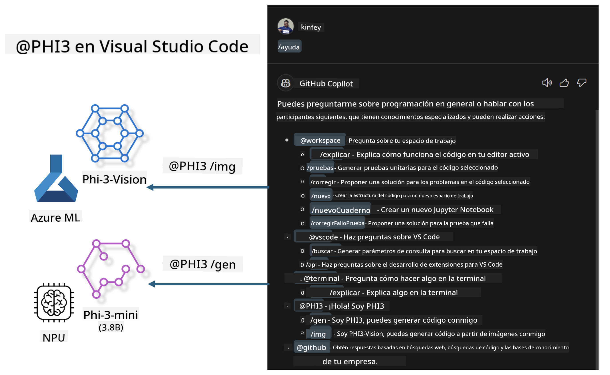

<!--
CO_OP_TRANSLATOR_METADATA:
{
  "original_hash": "00b7a699de8ac405fa821f4c0f7fc0ab",
  "translation_date": "2025-03-27T11:35:52+00:00",
  "source_file": "md\\02.Application\\02.Code\\Phi3\\VSCodeExt\\README.md",
  "language_code": "es"
}
-->
# **Crea tu propio Chat de GitHub Copilot en Visual Studio Code con la familia Microsoft Phi-3**

¿Has usado el agente de espacio de trabajo en GitHub Copilot Chat? ¿Quieres crear un agente de código para tu equipo? Este laboratorio práctico busca combinar el modelo de código abierto para construir un agente empresarial especializado en código.

## **Fundamentos**

### **¿Por qué elegir Microsoft Phi-3?**

Phi-3 es una serie de modelos que incluye phi-3-mini, phi-3-small y phi-3-medium, diseñados con diferentes parámetros de entrenamiento para generación de texto, finalización de diálogos y generación de código. También está phi-3-vision basado en Vision. Es ideal para que empresas o equipos creen soluciones de IA generativa offline.

Recomendado leer este enlace [https://github.com/microsoft/PhiCookBook/blob/main/md/01.Introduction/01/01.PhiFamily.md](https://github.com/microsoft/PhiCookBook/blob/main/md/01.Introduction/01/01.PhiFamily.md)

### **Microsoft GitHub Copilot Chat**

La extensión de GitHub Copilot Chat te ofrece una interfaz de chat que permite interactuar con GitHub Copilot y recibir respuestas a preguntas relacionadas con la programación directamente en VS Code, sin necesidad de consultar documentación o buscar en foros en línea.

Copilot Chat puede usar resaltado de sintaxis, indentación y otras características de formato para dar claridad a las respuestas generadas. Dependiendo del tipo de pregunta del usuario, el resultado puede incluir enlaces al contexto que Copilot utilizó para generar una respuesta, como archivos de código fuente o documentación, o botones para acceder a funcionalidades de VS Code.

- Copilot Chat se integra en tu flujo de desarrollo y te asiste donde lo necesitas:

- Inicia una conversación de chat directamente desde el editor o la terminal para obtener ayuda mientras programas.

- Usa la vista de Chat para tener un asistente de IA al lado que te ayude en cualquier momento.

- Lanza el Quick Chat para hacer una pregunta rápida y volver a lo que estabas haciendo.

Puedes usar GitHub Copilot Chat en varios escenarios, como:

- Responder preguntas de programación sobre cómo resolver mejor un problema.

- Explicar el código de otra persona y sugerir mejoras.

- Proponer correcciones de código.

- Generar casos de prueba unitarios.

- Generar documentación de código.

Recomendado leer este enlace [https://code.visualstudio.com/docs/copilot/copilot-chat](https://code.visualstudio.com/docs/copilot/copilot-chat?WT.mc_id=aiml-137032-kinfeylo)

### **Microsoft GitHub Copilot Chat @workspace**

Referenciar **@workspace** en Copilot Chat te permite hacer preguntas sobre todo tu código base. Según la pregunta, Copilot recupera de manera inteligente archivos y símbolos relevantes, que luego referencia en su respuesta como enlaces y ejemplos de código.

Para responder a tu pregunta, **@workspace** busca en las mismas fuentes que un desarrollador usaría al navegar por un código base en VS Code:

- Todos los archivos en el espacio de trabajo, excepto los ignorados por un archivo .gitignore.

- Estructura de directorios con carpetas y nombres de archivos anidados.

- Índice de búsqueda de código de GitHub, si el espacio de trabajo es un repositorio de GitHub e indexado por búsqueda de código.

- Símbolos y definiciones en el espacio de trabajo.

- Texto seleccionado actualmente o texto visible en el editor activo.

Nota: .gitignore se omite si tienes un archivo abierto o texto seleccionado dentro de un archivo ignorado.

Recomendado leer este enlace [[https://code.visualstudio.com/docs/copilot/copilot-chat](https://code.visualstudio.com/docs/copilot/workspace-context?WT.mc_id=aiml-137032-kinfeylo)]

## **Conoce más sobre este laboratorio**

GitHub Copilot ha mejorado enormemente la eficiencia de programación en las empresas, y cada una de ellas desea personalizar las funciones relacionadas con GitHub Copilot. Muchas empresas han creado extensiones similares a GitHub Copilot basadas en sus propios escenarios empresariales y modelos de código abierto. Para las empresas, las extensiones personalizadas son más fáciles de controlar, pero esto también puede afectar la experiencia del usuario. Después de todo, GitHub Copilot tiene funciones más avanzadas para manejar escenarios generales y profesionales. Si se puede mantener una experiencia consistente, sería ideal personalizar la extensión de la empresa. GitHub Copilot Chat ofrece APIs relevantes para que las empresas amplíen la experiencia de Chat. Mantener una experiencia consistente y tener funciones personalizadas mejora la experiencia del usuario.

Este laboratorio utiliza principalmente el modelo Phi-3 combinado con el NPU local y el híbrido de Azure para construir un agente personalizado en GitHub Copilot Chat ***@PHI3*** que asista a los desarrolladores empresariales en la generación de código ***(@PHI3 /gen)*** y en la generación de código basado en imágenes ***(@PHI3 /img)***.

### ***Nota:*** 

Este laboratorio está implementado actualmente en el AIPC de CPU Intel y Apple Silicon. Seguiremos actualizando la versión de NPU para Qualcomm.

## **Laboratorio**

| Nombre | Descripción | AIPC | Apple |
| ------------ | ----------- | -------- |-------- |
| Lab0 - Instalaciones(✅) | Configura e instala entornos y herramientas relacionadas | [Ir](./HOL/AIPC/01.Installations.md) |[Ir](./HOL/Apple/01.Installations.md) |
| Lab1 - Ejecuta Prompt flow con Phi-3-mini (✅) | Combinado con AIPC / Apple Silicon, usando NPU local para crear generación de código a través de Phi-3-mini | [Ir](./HOL/AIPC/02.PromptflowWithNPU.md) |  [Ir](./HOL/Apple/02.PromptflowWithMLX.md) |
| Lab2 - Despliega Phi-3-vision en Azure Machine Learning Service(✅) | Genera código desplegando Phi-3-vision en el Catálogo de Modelos de Azure Machine Learning Service | [Ir](./HOL/AIPC/03.DeployPhi3VisionOnAzure.md) |[Ir](./HOL/Apple/03.DeployPhi3VisionOnAzure.md) |
| Lab3 - Crea un agente @phi-3 en GitHub Copilot Chat(✅)  | Crea un agente personalizado Phi-3 en GitHub Copilot Chat para completar generación de código, generación de gráficos, RAG, etc. | [Ir](./HOL/AIPC/04.CreatePhi3AgentInVSCode.md) | [Ir](./HOL/Apple/04.CreatePhi3AgentInVSCode.md) |
| Código de Ejemplo (✅)  | Descarga el código de ejemplo | [Ir](../../../../../../../code/07.Lab/01/AIPC) | [Ir](../../../../../../../code/07.Lab/01/Apple) |

## **Recursos**

1. Phi-3 Cookbook [https://github.com/microsoft/Phi-3CookBook](https://github.com/microsoft/Phi-3CookBook)

2. Aprende más sobre GitHub Copilot [https://learn.microsoft.com/training/paths/copilot/](https://learn.microsoft.com/training/paths/copilot/?WT.mc_id=aiml-137032-kinfeylo)

3. Aprende más sobre GitHub Copilot Chat [https://learn.microsoft.com/training/paths/accelerate-app-development-using-github-copilot/](https://learn.microsoft.com/training/paths/accelerate-app-development-using-github-copilot/?WT.mc_id=aiml-137032-kinfeylo)

4. Aprende más sobre la API de GitHub Copilot Chat [https://code.visualstudio.com/api/extension-guides/chat](https://code.visualstudio.com/api/extension-guides/chat?WT.mc_id=aiml-137032-kinfeylo)

5. Aprende más sobre Azure AI Foundry [https://learn.microsoft.com/training/paths/create-custom-copilots-ai-studio/](https://learn.microsoft.com/training/paths/create-custom-copilots-ai-studio/?WT.mc_id=aiml-137032-kinfeylo)

6. Aprende más sobre el Catálogo de Modelos de Azure AI Foundry [https://learn.microsoft.com/azure/ai-studio/how-to/model-catalog-overview](https://learn.microsoft.com/azure/ai-studio/how-to/model-catalog-overview)

**Descargo de responsabilidad**:  
Este documento ha sido traducido utilizando el servicio de traducción por IA [Co-op Translator](https://github.com/Azure/co-op-translator). Aunque nos esforzamos por lograr la precisión, tenga en cuenta que las traducciones automatizadas pueden contener errores o imprecisiones. El documento original en su idioma nativo debe considerarse como la fuente autorizada. Para información crítica, se recomienda una traducción profesional realizada por humanos. No nos hacemos responsables de malentendidos o interpretaciones erróneas que puedan surgir del uso de esta traducción.