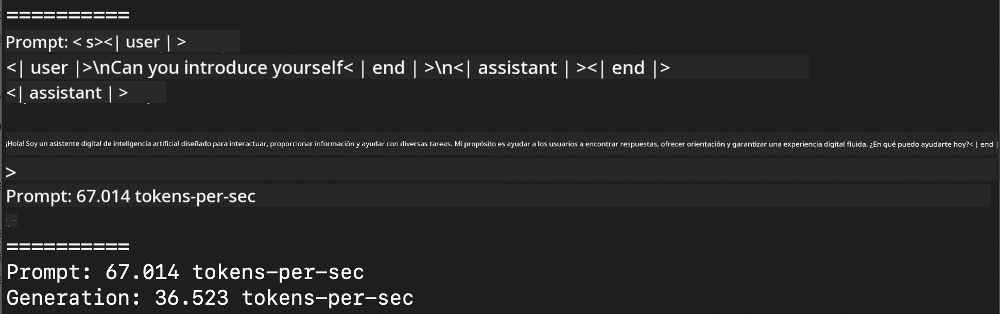
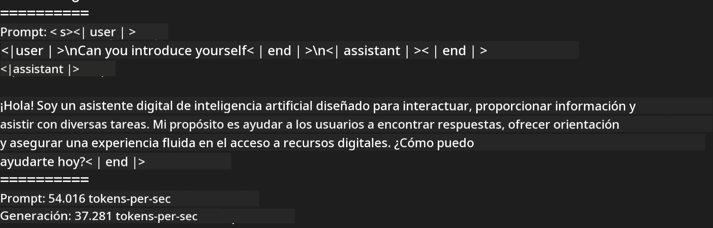
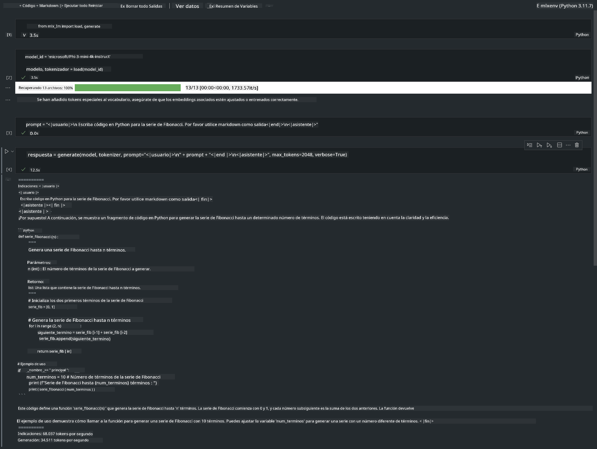

<!--
CO_OP_TRANSLATOR_METADATA:
{
  "original_hash": "dcb656f3d206fc4968e236deec5d4384",
  "translation_date": "2025-03-27T16:05:01+00:00",
  "source_file": "md\\03.FineTuning\\03.Inference\\MLX_Inference.md",
  "language_code": "es"
}
-->
# **Inferencia de Phi-3 con el Framework Apple MLX**

## **¿Qué es el Framework MLX?**

MLX es un framework de arrays para investigación en aprendizaje automático en dispositivos con Apple silicon, desarrollado por el equipo de investigación en aprendizaje automático de Apple.

MLX está diseñado por investigadores de aprendizaje automático para investigadores de aprendizaje automático. El framework busca ser fácil de usar, pero eficiente para entrenar y desplegar modelos. Su diseño conceptual también es sencillo. Nuestro objetivo es facilitar que los investigadores extiendan y mejoren MLX para explorar nuevas ideas rápidamente.

Los LLMs pueden ser acelerados en dispositivos con Apple Silicon mediante MLX, y los modelos pueden ejecutarse localmente de manera muy conveniente.

## **Usando MLX para inferencia con Phi-3-mini**

### **1. Configura tu entorno MLX**

1. Python 3.11.x  
2. Instalar la biblioteca MLX  

```bash

pip install mlx-lm

```

### **2. Ejecutando Phi-3-mini en la terminal con MLX**

```bash

python -m mlx_lm.generate --model microsoft/Phi-3-mini-4k-instruct --max-token 2048 --prompt  "<|user|>\nCan you introduce yourself<|end|>\n<|assistant|>"

```

El resultado (mi entorno es Apple M1 Max, 64GB) es:



### **3. Cuantizando Phi-3-mini con MLX en la terminal**

```bash

python -m mlx_lm.convert --hf-path microsoft/Phi-3-mini-4k-instruct

```

***Nota:*** El modelo puede ser cuantizado mediante mlx_lm.convert, y la cuantización predeterminada es INT4. Este ejemplo cuantiza Phi-3-mini a INT4.

El modelo puede ser cuantizado mediante mlx_lm.convert, y la cuantización predeterminada es INT4. Este ejemplo cuantiza Phi-3-mini a INT4. Después de la cuantización, se almacenará en el directorio predeterminado ./mlx_model.

Podemos probar el modelo cuantizado con MLX desde la terminal.

```bash

python -m mlx_lm.generate --model ./mlx_model/ --max-token 2048 --prompt  "<|user|>\nCan you introduce yourself<|end|>\n<|assistant|>"

```

El resultado es:



### **4. Ejecutando Phi-3-mini con MLX en Jupyter Notebook**



***Nota:*** Por favor, revisa este ejemplo [haz clic en este enlace](../../../../../code/03.Inference/MLX/MLX_DEMO.ipynb)

## **Recursos**

1. Aprende sobre el Framework Apple MLX [https://ml-explore.github.io](https://ml-explore.github.io/mlx/build/html/index.html)

2. Repositorio de GitHub de Apple MLX [https://github.com/ml-explore](https://github.com/ml-explore)

**Descargo de responsabilidad**:  
Este documento ha sido traducido utilizando el servicio de traducción automática [Co-op Translator](https://github.com/Azure/co-op-translator). Si bien nos esforzamos por lograr precisión, tenga en cuenta que las traducciones automáticas pueden contener errores o imprecisiones. El documento original en su idioma nativo debe considerarse como la fuente autorizada. Para información crítica, se recomienda una traducción profesional realizada por humanos. No nos hacemos responsables de malentendidos o interpretaciones erróneas que surjan del uso de esta traducción.