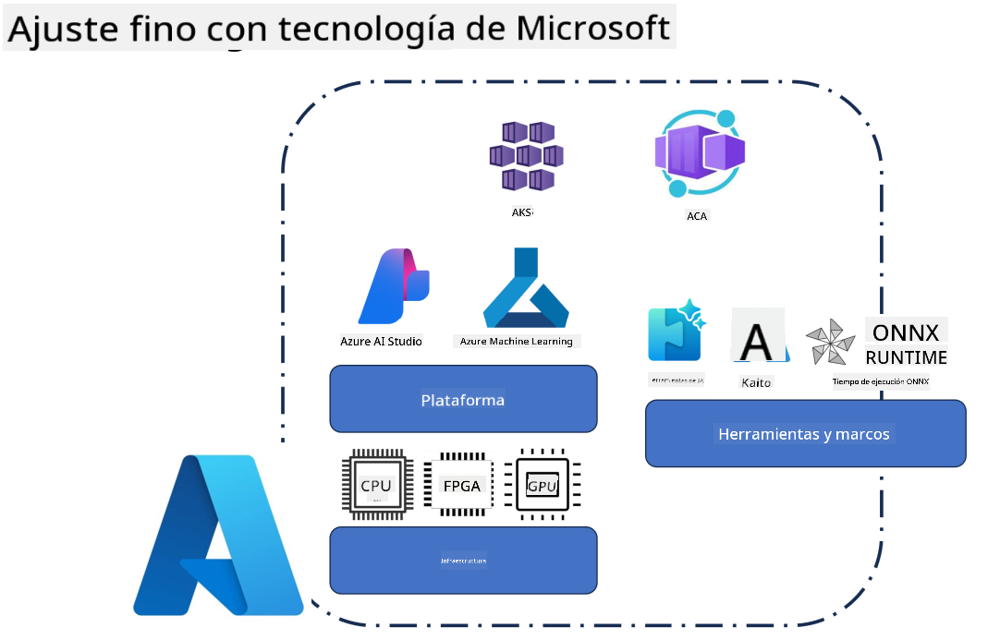
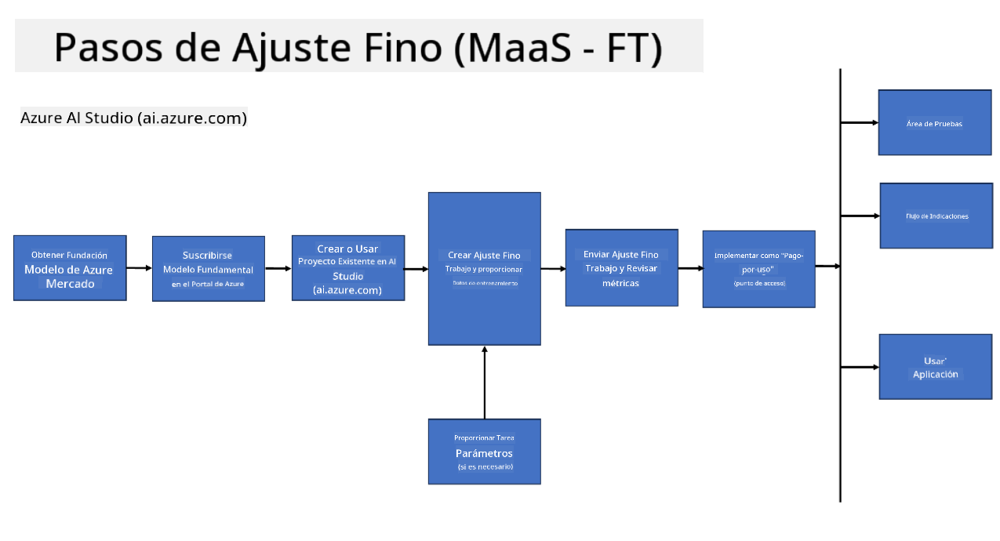
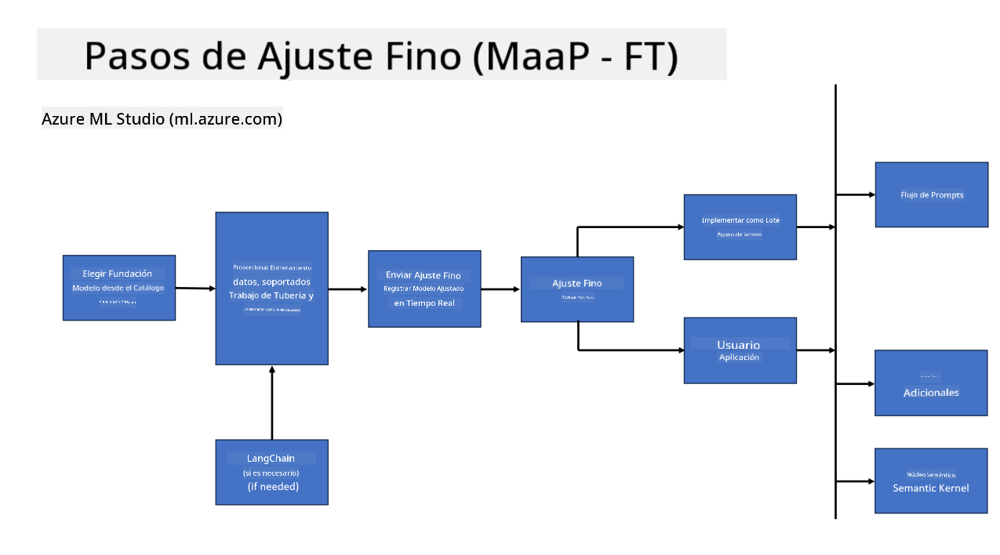
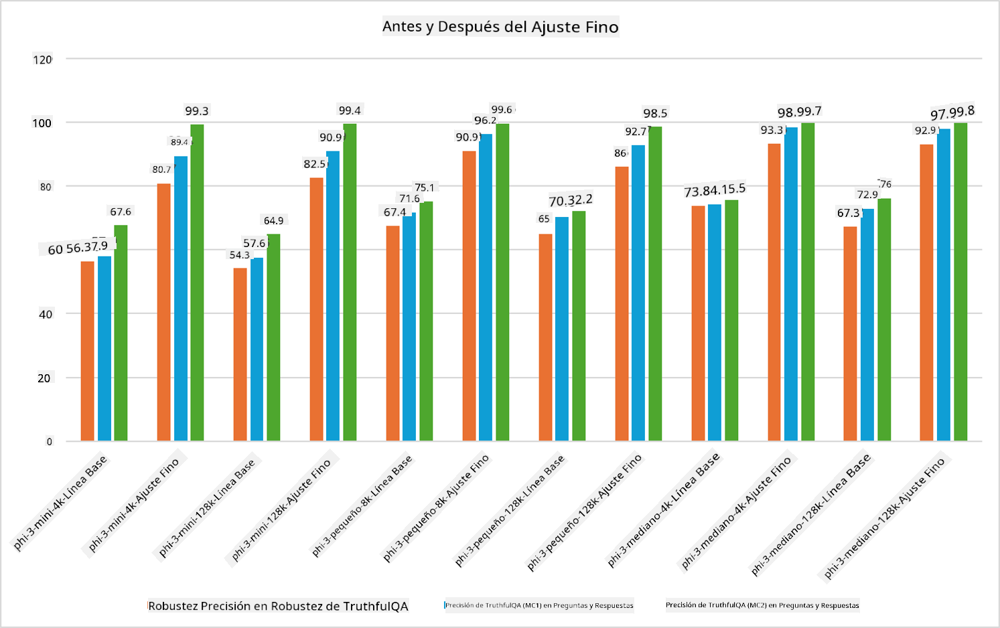

<!--
CO_OP_TRANSLATOR_METADATA:
{
  "original_hash": "cb5648935f63edc17e95ce38f23adc32",
  "translation_date": "2025-03-27T15:13:02+00:00",
  "source_file": "md\\03.FineTuning\\FineTuning_Scenarios.md",
  "language_code": "es"
}
-->
## Escenarios de Ajuste Fino

**Plataforma** Esto incluye diversas tecnologías como Azure AI Foundry, Azure Machine Learning, AI Tools, Kaito y ONNX Runtime.

**Infraestructura** Esto incluye la CPU y FPGA, que son esenciales para el proceso de ajuste fino. Permíteme mostrarte los íconos de cada una de estas tecnologías.

**Herramientas y Frameworks** Esto incluye ONNX Runtime y ONNX Runtime. Permíteme mostrarte los íconos de cada una de estas tecnologías.  
[Insertar íconos para ONNX Runtime y ONNX Runtime]

El proceso de ajuste fino con tecnologías de Microsoft involucra diversos componentes y herramientas. Al comprender y utilizar estas tecnologías, podemos ajustar eficazmente nuestras aplicaciones y crear mejores soluciones.

## Modelo como Servicio

Ajusta el modelo utilizando ajuste fino alojado, sin necesidad de crear ni gestionar recursos computacionales.

El ajuste fino sin servidor está disponible para los modelos Phi-3-mini y Phi-3-medium, lo que permite a los desarrolladores personalizar rápida y fácilmente los modelos para escenarios en la nube y en el edge, sin tener que organizar recursos computacionales. También hemos anunciado que Phi-3-small ahora está disponible a través de nuestra oferta de Modelos-como-Servicio, para que los desarrolladores puedan comenzar rápidamente con el desarrollo de IA sin necesidad de gestionar la infraestructura subyacente.

## Modelo como Plataforma

Los usuarios gestionan sus propios recursos computacionales para ajustar sus modelos.

[Muestra de Ajuste Fino](https://github.com/Azure/azureml-examples/blob/main/sdk/python/foundation-models/system/finetune/chat-completion/chat-completion.ipynb)

## Escenarios de Ajuste Fino

| | | | | | | |
|-|-|-|-|-|-|-|
|Escenario|LoRA|QLoRA|PEFT|DeepSpeed|ZeRO|DORA|
|Adaptación de LLMs preentrenados a tareas o dominios específicos|Sí|Sí|Sí|Sí|Sí|Sí|
|Ajuste fino para tareas de PLN como clasificación de texto, reconocimiento de entidades nombradas y traducción automática|Sí|Sí|Sí|Sí|Sí|Sí|
|Ajuste fino para tareas de preguntas y respuestas|Sí|Sí|Sí|Sí|Sí|Sí|
|Ajuste fino para generar respuestas humanas en chatbots|Sí|Sí|Sí|Sí|Sí|Sí|
|Ajuste fino para generar música, arte u otras formas de creatividad|Sí|Sí|Sí|Sí|Sí|Sí|
|Reducción de costos computacionales y financieros|Sí|Sí|No|Sí|Sí|No|
|Reducción del uso de memoria|No|Sí|No|Sí|Sí|Sí|
|Uso de menos parámetros para un ajuste fino eficiente|No|Sí|Sí|No|No|Sí|
|Forma eficiente de paralelismo de datos en memoria que da acceso a la memoria agregada de todas las GPU disponibles|No|No|No|Sí|Sí|Sí|

## Ejemplos de Rendimiento de Ajuste Fino

**Descargo de responsabilidad**:  
Este documento ha sido traducido utilizando el servicio de traducción automática [Co-op Translator](https://github.com/Azure/co-op-translator). Si bien nos esforzamos por lograr precisión, tenga en cuenta que las traducciones automatizadas pueden contener errores o imprecisiones. El documento original en su idioma nativo debe considerarse la fuente autorizada. Para información crítica, se recomienda una traducción profesional realizada por humanos. No nos hacemos responsables de malentendidos o interpretaciones erróneas que puedan surgir del uso de esta traducción.