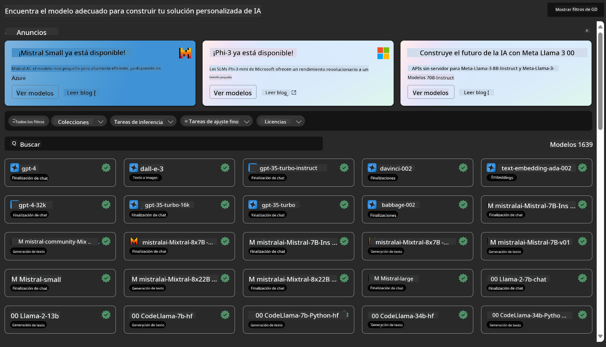
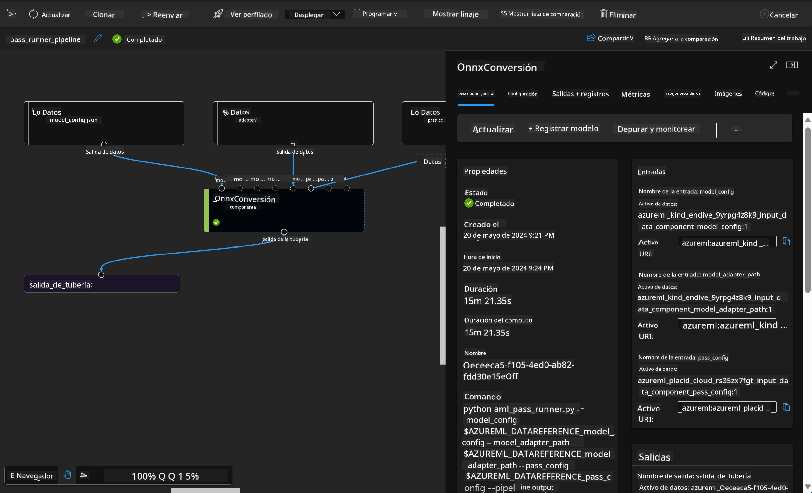

<!--
CO_OP_TRANSLATOR_METADATA:
{
  "original_hash": "7fe541373802e33568e94e13226d463c",
  "translation_date": "2025-03-27T15:45:27+00:00",
  "source_file": "md\\03.FineTuning\\Introduce_AzureML.md",
  "language_code": "es"
}
-->
# **Introducción al Servicio de Azure Machine Learning**

[Azure Machine Learning](https://ml.azure.com?WT.mc_id=aiml-138114-kinfeylo) es un servicio en la nube diseñado para acelerar y gestionar el ciclo de vida de los proyectos de aprendizaje automático (ML).

Los profesionales de ML, científicos de datos e ingenieros pueden usarlo en sus flujos de trabajo diarios para:

- Entrenar y desplegar modelos.
- Gestionar las operaciones de aprendizaje automático (MLOps).
- Puedes crear un modelo en Azure Machine Learning o usar un modelo desarrollado en una plataforma de código abierto, como PyTorch, TensorFlow o scikit-learn.
- Las herramientas de MLOps te ayudan a monitorear, reentrenar y volver a desplegar modelos.

## ¿Para quién es Azure Machine Learning?

**Científicos de Datos e Ingenieros de ML**

Pueden usar herramientas para acelerar y automatizar sus flujos de trabajo diarios.  
Azure ML ofrece características para garantizar equidad, explicabilidad, seguimiento y auditoría.

**Desarrolladores de Aplicaciones**

Pueden integrar modelos en aplicaciones o servicios de manera fluida.

**Desarrolladores de Plataformas**

Tienen acceso a un conjunto robusto de herramientas respaldadas por APIs confiables de Azure Resource Manager.  
Estas herramientas permiten construir herramientas avanzadas de ML.

**Empresas**

Al trabajar en la nube de Microsoft Azure, las empresas se benefician de controles de seguridad y acceso basados en roles que ya conocen.  
Configura proyectos para controlar el acceso a datos protegidos y operaciones específicas.

## Productividad para Todo el Equipo

Los proyectos de ML suelen requerir un equipo con habilidades variadas para desarrollarlos y mantenerlos.

Azure ML proporciona herramientas que permiten:

- Colaborar con tu equipo a través de notebooks compartidos, recursos de cómputo, cómputo sin servidor, datos y entornos.
- Desarrollar modelos con equidad, explicabilidad, seguimiento y auditoría para cumplir con los requisitos de linaje y cumplimiento de auditorías.
- Desplegar modelos de ML rápida y fácilmente a escala, y gestionarlos y gobernarlos de manera eficiente con MLOps.
- Ejecutar cargas de trabajo de aprendizaje automático en cualquier lugar con gobernanza, seguridad y cumplimiento integrados.

## Herramientas de Plataforma Compatibles

Cualquier miembro de un equipo de ML puede usar las herramientas que prefiera para realizar su trabajo.  
Ya sea que estés ejecutando experimentos rápidos, ajustando hiperparámetros, construyendo pipelines o gestionando inferencias, puedes usar interfaces conocidas, como:

- Azure Machine Learning Studio
- Python SDK (v2)
- Azure CLI (v2)
- APIs REST de Azure Resource Manager

A medida que refinas modelos y colaboras durante el ciclo de desarrollo, puedes compartir y encontrar activos, recursos y métricas dentro de la interfaz de usuario de Azure Machine Learning Studio.

## **LLM/SLM en Azure ML**

Azure ML ha incorporado muchas funciones relacionadas con LLM/SLM, combinando LLMOps y SLMOps para crear una plataforma tecnológica de inteligencia artificial generativa a nivel empresarial.

### **Catálogo de Modelos**

Los usuarios empresariales pueden desplegar diferentes modelos según los distintos escenarios de negocio a través del Catálogo de Modelos, y proporcionar servicios como Model as a Service para que los desarrolladores o usuarios empresariales accedan.

El Catálogo de Modelos en Azure Machine Learning Studio es el centro para descubrir y usar una amplia variedad de modelos que te permiten construir aplicaciones de IA generativa. El catálogo de modelos incluye cientos de modelos de proveedores como Azure OpenAI Service, Mistral, Meta, Cohere, Nvidia, Hugging Face, incluidos modelos entrenados por Microsoft. Los modelos de proveedores distintos a Microsoft son Productos No Microsoft, tal como se define en los Términos de Producto de Microsoft, y están sujetos a los términos proporcionados con el modelo.

### **Pipeline de Tareas**

El núcleo de un pipeline de aprendizaje automático es dividir una tarea completa de ML en un flujo de trabajo de múltiples pasos.  
Cada paso es un componente manejable que puede desarrollarse, optimizarse, configurarse y automatizarse individualmente. Los pasos están conectados mediante interfaces bien definidas. El servicio de pipelines de Azure Machine Learning orquesta automáticamente todas las dependencias entre los pasos del pipeline.

En el ajuste fino de SLM / LLM, podemos gestionar nuestros procesos de datos, entrenamiento y generación a través de Pipeline.

### **Flujo de Prompts**

Beneficios de usar el flujo de prompts de Azure Machine Learning  
El flujo de prompts de Azure Machine Learning ofrece una variedad de beneficios que ayudan a los usuarios a pasar de la idea a la experimentación y, finalmente, a aplicaciones listas para producción basadas en LLM:

**Agilidad en ingeniería de prompts**

- Experiencia de autoría interactiva: El flujo de prompts de Azure Machine Learning proporciona una representación visual de la estructura del flujo, permitiendo a los usuarios comprender y navegar fácilmente por sus proyectos. También ofrece una experiencia de codificación similar a un notebook para un desarrollo y depuración eficientes del flujo.
- Variantes para ajuste de prompts: Los usuarios pueden crear y comparar múltiples variantes de prompts, facilitando un proceso iterativo de refinamiento.
- Evaluación: Los flujos de evaluación integrados permiten a los usuarios evaluar la calidad y efectividad de sus prompts y flujos.
- Recursos completos: El flujo de prompts de Azure Machine Learning incluye una biblioteca de herramientas integradas, muestras y plantillas que sirven como punto de partida para el desarrollo, inspirando creatividad y acelerando el proceso.

**Preparación empresarial para aplicaciones basadas en LLM**

- Colaboración: El flujo de prompts de Azure Machine Learning admite la colaboración en equipo, permitiendo que múltiples usuarios trabajen juntos en proyectos de ingeniería de prompts, compartan conocimientos y mantengan control de versiones.
- Plataforma todo-en-uno: El flujo de prompts de Azure Machine Learning simplifica todo el proceso de ingeniería de prompts, desde el desarrollo y evaluación hasta el despliegue y monitoreo. Los usuarios pueden desplegar fácilmente sus flujos como endpoints de Azure Machine Learning y monitorear su rendimiento en tiempo real, asegurando una operación óptima y mejora continua.
- Soluciones empresariales de Azure Machine Learning: El flujo de prompts aprovecha las robustas soluciones empresariales de Azure Machine Learning, proporcionando una base segura, escalable y confiable para el desarrollo, experimentación y despliegue de flujos.

Con el flujo de prompts de Azure Machine Learning, los usuarios pueden maximizar su agilidad en ingeniería de prompts, colaborar de manera efectiva y aprovechar soluciones empresariales de alto nivel para el desarrollo y despliegue exitoso de aplicaciones basadas en LLM.

Combinando la potencia de cómputo, los datos y los diferentes componentes de Azure ML, los desarrolladores empresariales pueden construir fácilmente sus propias aplicaciones de inteligencia artificial.

**Descargo de responsabilidad**:  
Este documento ha sido traducido utilizando el servicio de traducción automática [Co-op Translator](https://github.com/Azure/co-op-translator). Aunque nos esforzamos por garantizar la precisión, tenga en cuenta que las traducciones automáticas pueden contener errores o imprecisiones. El documento original en su idioma nativo debe considerarse la fuente autorizada. Para información crítica, se recomienda una traducción profesional realizada por humanos. No nos hacemos responsables de malentendidos o interpretaciones erróneas que puedan surgir del uso de esta traducción.