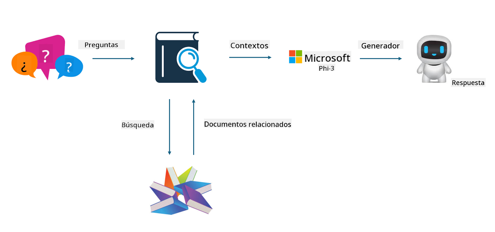
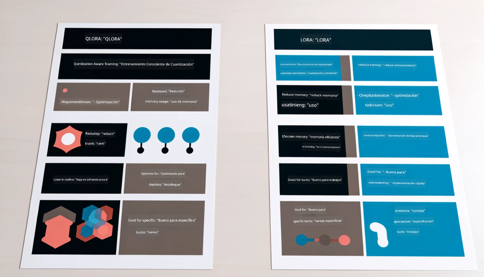

<!--
CO_OP_TRANSLATOR_METADATA:
{
  "original_hash": "743d7e9cb9c4e8ea642d77bee657a7fa",
  "translation_date": "2025-03-27T15:58:53+00:00",
  "source_file": "md\\03.FineTuning\\LetPhi3gotoIndustriy.md",
  "language_code": "es"
}
-->
# **Convierta Phi-3 en un experto de la industria**

Para integrar el modelo Phi-3 en una industria, es necesario añadir datos empresariales específicos al modelo Phi-3. Tenemos dos opciones diferentes: la primera es RAG (Generación Aumentada por Recuperación) y la segunda es Fine Tuning.

## **RAG vs Fine-Tuning**

### **Generación Aumentada por Recuperación**

RAG combina recuperación de datos + generación de texto. Los datos estructurados y no estructurados de la empresa se almacenan en una base de datos vectorial. Al buscar contenido relevante, se encuentra el resumen y contenido relacionados para formar un contexto, y se combina con la capacidad de generación de texto de LLM/SLM para producir contenido.

### **Fine-tuning**

Fine-tuning se basa en la mejora de un modelo específico. No necesita comenzar desde el algoritmo del modelo, pero requiere acumulación continua de datos. Si deseas terminología más precisa y expresiones específicas para aplicaciones industriales, Fine-tuning es tu mejor opción. Sin embargo, si tus datos cambian con frecuencia, Fine-tuning puede volverse complicado.

### **Cómo elegir**

1. Si nuestra respuesta necesita incorporar datos externos, RAG es la mejor opción.

2. Si necesitas generar conocimientos industriales estables y precisos, Fine-tuning será una buena elección. RAG prioriza obtener contenido relevante, pero puede no capturar siempre los matices especializados.

3. Fine-tuning requiere un conjunto de datos de alta calidad; si solo se trata de un pequeño rango de datos, la diferencia será mínima. RAG es más flexible.

4. Fine-tuning es una "caja negra", una especie de metafísica, y es difícil entender su mecanismo interno. En cambio, RAG facilita identificar la fuente de los datos, ajustando alucinaciones o errores en el contenido y ofreciendo mayor transparencia.

### **Escenarios**

1. Industrias verticales que requieren vocabulario y expresiones profesionales específicas: ***Fine-tuning*** será la mejor opción.

2. Sistemas de preguntas y respuestas que implican la síntesis de diferentes puntos de conocimiento: ***RAG*** será la mejor opción.

3. Combinación de flujo de negocios automatizado: ***RAG + Fine-tuning*** es la mejor opción.

## **Cómo usar RAG**

Una base de datos vectorial es un conjunto de datos almacenados en forma matemática. Las bases de datos vectoriales facilitan que los modelos de aprendizaje automático recuerden entradas anteriores, permitiendo su uso en casos como búsqueda, recomendaciones y generación de texto. Los datos pueden identificarse según métricas de similitud en lugar de coincidencias exactas, lo que permite a los modelos computacionales entender el contexto de los datos.

La base de datos vectorial es clave para implementar RAG. Podemos convertir los datos en almacenamiento vectorial mediante modelos vectoriales como text-embedding-3, jina-ai-embedding, entre otros.

Aprende más sobre cómo crear aplicaciones RAG [https://github.com/microsoft/Phi-3CookBook](https://github.com/microsoft/Phi-3CookBook?WT.mc_id=aiml-138114-kinfeylo)

## **Cómo usar Fine-tuning**

Los algoritmos más comunes en Fine-tuning son Lora y QLora. ¿Cómo elegir?
- [Aprende más con este notebook de ejemplo](../../../../code/04.Finetuning/Phi_3_Inference_Finetuning.ipynb)
- [Ejemplo de script en Python para Fine-tuning](../../../../code/04.Finetuning/FineTrainingScript.py)

### **Lora y QLora**

LoRA (Adaptación de Bajo Rango) y QLoRA (Adaptación de Bajo Rango Cuantificada) son técnicas utilizadas para ajustar grandes modelos de lenguaje (LLMs) mediante Fine Tuning Eficiente en Parámetros (PEFT). Las técnicas PEFT están diseñadas para entrenar modelos de manera más eficiente que los métodos tradicionales.

LoRA es una técnica de ajuste independiente que reduce el uso de memoria aplicando una aproximación de bajo rango a la matriz de actualización de pesos. Ofrece tiempos de entrenamiento rápidos y mantiene un rendimiento cercano a los métodos tradicionales de ajuste fino.

QLoRA es una versión extendida de LoRA que incorpora técnicas de cuantificación para reducir aún más el uso de memoria. QLoRA cuantifica la precisión de los parámetros de peso en el modelo preentrenado LLM a una precisión de 4 bits, siendo más eficiente en memoria que LoRA. Sin embargo, el entrenamiento de QLoRA es aproximadamente un 30% más lento que el de LoRA debido a los pasos adicionales de cuantificación y descuantificación.

QLoRA utiliza LoRA como complemento para corregir los errores introducidos durante la cuantificación. QLoRA permite ajustar modelos masivos con miles de millones de parámetros en GPUs relativamente pequeñas y disponibles. Por ejemplo, QLoRA puede ajustar un modelo de 70B parámetros que normalmente requeriría 36 GPUs utilizando solo 2.

**Descargo de responsabilidad**:  
Este documento ha sido traducido utilizando el servicio de traducción automática [Co-op Translator](https://github.com/Azure/co-op-translator). Si bien nos esforzamos por garantizar la precisión, tenga en cuenta que las traducciones automatizadas pueden contener errores o imprecisiones. El documento original en su idioma nativo debe considerarse como la fuente autorizada. Para información crítica, se recomienda una traducción profesional realizada por humanos. No nos hacemos responsables de malentendidos o interpretaciones erróneas que puedan surgir del uso de esta traducción.