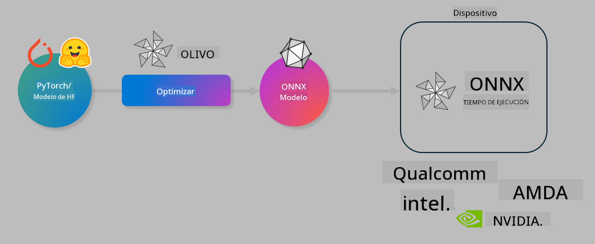

<!--
CO_OP_TRANSLATOR_METADATA:
{
  "original_hash": "6bbe47de3b974df7eea29dfeccf6032b",
  "translation_date": "2025-03-27T16:12:12+00:00",
  "source_file": "md\\03.FineTuning\\olive-lab\\readme.md",
  "language_code": "es"
}
-->
# Lab. Optimiza modelos de IA para inferencia en dispositivos

## Introducción 

> [!IMPORTANT]
> Este laboratorio requiere una **GPU Nvidia A10 o A100** con los controladores asociados y el kit de herramientas CUDA (versión 12+) instalados.

> [!NOTE]
> Este es un laboratorio de **35 minutos** que te dará una introducción práctica a los conceptos básicos de optimización de modelos para inferencia en dispositivos utilizando OLIVE.

## Objetivos de aprendizaje

Al finalizar este laboratorio, podrás usar OLIVE para:

- Cuantizar un modelo de IA utilizando el método de cuantización AWQ.
- Ajustar un modelo de IA para una tarea específica.
- Generar adaptadores LoRA (modelo ajustado) para una inferencia eficiente en dispositivos utilizando ONNX Runtime.

### ¿Qué es Olive?

Olive (*O*NNX *live*) es un conjunto de herramientas para la optimización de modelos con una interfaz CLI que te permite implementar modelos para ONNX Runtime +++https://onnxruntime.ai+++ con calidad y rendimiento.



El input para Olive suele ser un modelo de PyTorch o Hugging Face, y el output es un modelo ONNX optimizado que se ejecuta en un dispositivo (objetivo de implementación) utilizando ONNX Runtime. Olive optimiza el modelo para el acelerador de IA del objetivo de implementación (NPU, GPU, CPU) proporcionado por un proveedor de hardware como Qualcomm, AMD, Nvidia o Intel.

Olive ejecuta un *flujo de trabajo*, que es una secuencia ordenada de tareas individuales de optimización de modelos llamadas *pases*. Ejemplos de pases incluyen: compresión de modelos, captura de gráficos, cuantización, optimización de gráficos. Cada pase tiene un conjunto de parámetros que pueden ajustarse para lograr las mejores métricas, como precisión y latencia, que son evaluadas por el evaluador correspondiente. Olive emplea una estrategia de búsqueda que utiliza un algoritmo de búsqueda para autoajustar cada pase uno por uno o un conjunto de pases juntos.

#### Beneficios de Olive

- **Reduce la frustración y el tiempo** de experimentar manualmente con diferentes técnicas de optimización de gráficos, compresión y cuantización. Define tus restricciones de calidad y rendimiento y deja que Olive encuentre automáticamente el mejor modelo para ti.
- **Más de 40 componentes integrados de optimización de modelos** que cubren técnicas avanzadas de cuantización, compresión, optimización de gráficos y ajuste fino.
- **CLI fácil de usar** para tareas comunes de optimización de modelos. Por ejemplo, olive quantize, olive auto-opt, olive finetune.
- Empaquetado e implementación de modelos integrados.
- Soporte para generar modelos para **servicio Multi LoRA**.
- Construcción de flujos de trabajo utilizando YAML/JSON para orquestar tareas de optimización e implementación de modelos.
- Integración con **Hugging Face** y **Azure AI**.
- Mecanismo de **caché integrado** para **reducir costos**.

## Instrucciones del laboratorio
> [!NOTE]
> Asegúrate de haber configurado tu Azure AI Hub, tu proyecto y tu entorno de cómputo A100 según el Laboratorio 1.

### Paso 0: Conéctate a tu entorno de cómputo de Azure AI

Te conectarás al entorno de cómputo de Azure AI utilizando la función remota en **VS Code.**

1. Abre tu aplicación de escritorio **VS Code**:
1. Abre la **paleta de comandos** usando **Shift+Ctrl+P**.
1. En la paleta de comandos, busca **AzureML - remote: Connect to compute instance in New Window**.
1. Sigue las instrucciones en pantalla para conectarte al entorno de cómputo. Esto implicará seleccionar tu suscripción de Azure, grupo de recursos, proyecto y el nombre del entorno de cómputo que configuraste en el Laboratorio 1.
1. Una vez conectado a tu nodo de cómputo de Azure ML, esto se mostrará en la **esquina inferior izquierda de Visual Code** `><Azure ML: Compute Name`.

### Paso 1: Clona este repositorio

En VS Code, puedes abrir una nueva terminal con **Ctrl+J** y clonar este repositorio:

En la terminal deberías ver el siguiente mensaje:

```
azureuser@computername:~/cloudfiles/code$ 
```
Clona la solución 

```bash
cd ~/localfiles
git clone https://github.com/microsoft/phi-3cookbook.git
```

### Paso 2: Abre la carpeta en VS Code

Para abrir VS Code en la carpeta relevante, ejecuta el siguiente comando en la terminal, lo cual abrirá una nueva ventana:

```bash
code phi-3cookbook/code/04.Finetuning/Olive-lab
```

Alternativamente, puedes abrir la carpeta seleccionando **Archivo** > **Abrir carpeta**.

### Paso 3: Dependencias

Abre una ventana de terminal en VS Code en tu entorno de cómputo de Azure AI (consejo: **Ctrl+J**) y ejecuta los siguientes comandos para instalar las dependencias:

```bash
conda create -n olive-ai python=3.11 -y
conda activate olive-ai
pip install -r requirements.txt
az extension remove -n azure-cli-ml
az extension add -n ml
```

> [!NOTE]
> Tomará aproximadamente ~5 minutos instalar todas las dependencias.

En este laboratorio, descargarás y cargarás modelos en el catálogo de modelos de Azure AI. Para que puedas acceder al catálogo de modelos, necesitarás iniciar sesión en Azure utilizando:

```bash
az login
```

> [!NOTE]
> Al iniciar sesión, se te pedirá que selecciones tu suscripción. Asegúrate de configurar la suscripción proporcionada para este laboratorio.

### Paso 4: Ejecuta comandos de Olive

Abre una ventana de terminal en VS Code en tu entorno de cómputo de Azure AI (consejo: **Ctrl+J**) y asegúrate de que el entorno `olive-ai` de conda esté activado:

```bash
conda activate olive-ai
```

A continuación, ejecuta los siguientes comandos de Olive en la línea de comandos.

1. **Inspecciona los datos:** En este ejemplo, ajustarás el modelo Phi-3.5-Mini para que se especialice en responder preguntas relacionadas con viajes. El código a continuación muestra los primeros registros del conjunto de datos, que están en formato JSON lines:
   
    ```bash
    head data/data_sample_travel.jsonl
    ```
1. **Cuantiza el modelo:** Antes de entrenar el modelo, primero lo cuantizas con el siguiente comando que utiliza una técnica llamada Cuantización Activa Consciente (AWQ) +++https://arxiv.org/abs/2306.00978+++. AWQ cuantiza los pesos de un modelo considerando las activaciones producidas durante la inferencia. Esto significa que el proceso de cuantización tiene en cuenta la distribución real de datos en las activaciones, lo que lleva a una mejor preservación de la precisión del modelo en comparación con los métodos tradicionales de cuantización de pesos.
    
    ```bash
    olive quantize \
       --model_name_or_path microsoft/Phi-3.5-mini-instruct \
       --trust_remote_code \
       --algorithm awq \
       --output_path models/phi/awq \
       --log_level 1
    ```
    
    Este proceso toma **~8 minutos** y **reduce el tamaño del modelo de ~7.5GB a ~2.5GB**.
   
   En este laboratorio, te mostramos cómo usar modelos de Hugging Face (por ejemplo: `microsoft/Phi-3.5-mini-instruct`). However, Olive also allows you to input models from the Azure AI catalog by updating the `model_name_or_path` argument to an Azure AI asset ID (for example:  `azureml://registries/azureml/models/Phi-3.5-mini-instruct/versions/4`). 

1. **Train the model:** Next, the `olive finetune` ajusta el modelo cuantizado. Cuantizar el modelo *antes* del ajuste fino, en lugar de después, proporciona mejor precisión ya que el proceso de ajuste fino recupera parte de la pérdida de la cuantización.
    
    ```bash
    olive finetune \
        --method lora \
        --model_name_or_path models/phi/awq \
        --data_files "data/data_sample_travel.jsonl" \
        --data_name "json" \
        --text_template "<|user|>\n{prompt}<|end|>\n<|assistant|>\n{response}<|end|>" \
        --max_steps 100 \
        --output_path ./models/phi/ft \
        --log_level 1
    ```
    
    Este proceso toma **~6 minutos** con 100 pasos de ajuste fino.

1. **Optimiza:** Con el modelo entrenado, ahora optimizas el modelo utilizando el comando `auto-opt` command, which will capture the ONNX graph and automatically perform a number of optimizations to improve the model performance for CPU by compressing the model and doing fusions. It should be noted, that you can also optimize for other devices such as NPU or GPU by just updating the `--device` and `--provider` de Olive, pero para los propósitos de este laboratorio usaremos CPU.

    ```bash
    olive auto-opt \
       --model_name_or_path models/phi/ft/model \
       --adapter_path models/phi/ft/adapter \
       --device cpu \
       --provider CPUExecutionProvider \
       --use_ort_genai \
       --output_path models/phi/onnx-ao \
       --log_level 1
    ```
    
    Este proceso toma **~5 minutos** para completar la optimización.

### Paso 5: Prueba rápida de inferencia del modelo

Para probar la inferencia del modelo, crea un archivo Python en tu carpeta llamado **app.py** y copia y pega el siguiente código:

```python
import onnxruntime_genai as og
import numpy as np

print("loading model and adapters...", end="", flush=True)
model = og.Model("models/phi/onnx-ao/model")
adapters = og.Adapters(model)
adapters.load("models/phi/onnx-ao/model/adapter_weights.onnx_adapter", "travel")
print("DONE!")

tokenizer = og.Tokenizer(model)
tokenizer_stream = tokenizer.create_stream()

params = og.GeneratorParams(model)
params.set_search_options(max_length=100, past_present_share_buffer=False)
user_input = "what is the best thing to see in chicago"
params.input_ids = tokenizer.encode(f"<|user|>\n{user_input}<|end|>\n<|assistant|>\n")

generator = og.Generator(model, params)

generator.set_active_adapter(adapters, "travel")

print(f"{user_input}")

while not generator.is_done():
    generator.compute_logits()
    generator.generate_next_token()

    new_token = generator.get_next_tokens()[0]
    print(tokenizer_stream.decode(new_token), end='', flush=True)

print("\n")
```

Ejecuta el código utilizando:

```bash
python app.py
```

### Paso 6: Carga el modelo en Azure AI

Subir el modelo a un repositorio de modelos de Azure AI permite compartirlo con otros miembros de tu equipo de desarrollo y también manejar el control de versiones del modelo. Para cargar el modelo, ejecuta el siguiente comando:

> [!NOTE]
> Actualiza los valores de `{}` placeholders with the name of your resource group and Azure AI Project Name. 

To find your resource group `"resourceGroup"` y el nombre del proyecto de Azure AI, y ejecuta el siguiente comando:

```
az ml workspace show
```

O accede a +++ai.azure.com+++ y selecciona **centro de administración** **proyecto** **visión general**.

Actualiza los valores `{}` con el nombre de tu grupo de recursos y el nombre de tu proyecto de Azure AI.

```bash
az ml model create \
    --name ft-for-travel \
    --version 1 \
    --path ./models/phi/onnx-ao \
    --resource-group {RESOURCE_GROUP_NAME} \
    --workspace-name {PROJECT_NAME}
```
Luego podrás ver tu modelo cargado y desplegarlo en https://ml.azure.com/model/list

**Descargo de responsabilidad**:  
Este documento ha sido traducido utilizando el servicio de traducción por IA [Co-op Translator](https://github.com/Azure/co-op-translator). Si bien nos esforzamos por garantizar la precisión, tenga en cuenta que las traducciones automáticas pueden contener errores o imprecisiones. El documento original en su idioma nativo debe considerarse la fuente autorizada. Para información crítica, se recomienda una traducción profesional realizada por humanos. No nos hacemos responsables de malentendidos o interpretaciones erróneas que surjan del uso de esta traducción.