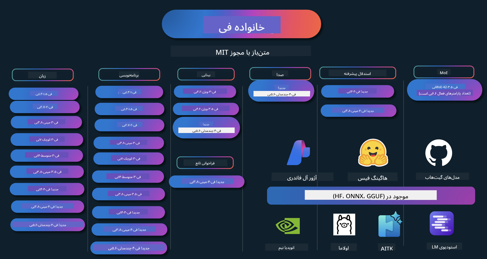

<!--
CO_OP_TRANSLATOR_METADATA:
{
  "original_hash": "1377ae1b0bc9daeaa6a989f750977aeb",
  "translation_date": "2025-03-27T03:13:41+00:00",
  "source_file": "README.md",
  "language_code": "fa"
}
-->
# کتاب آشپزی فی: نمونه‌های عملی با مدل‌های فی مایکروسافت

فی مجموعه‌ای از مدل‌های هوش مصنوعی متن‌باز است که توسط مایکروسافت توسعه داده شده است.

فی در حال حاضر قدرتمندترین و مقرون‌به‌صرفه‌ترین مدل زبان کوچک (SLM) است که در معیارهای چندزبانه، استدلال، تولید متن/چت، کدنویسی، تصاویر، صوت و سایر سناریوها عملکرد بسیار خوبی دارد.

شما می‌توانید فی را در فضای ابری یا دستگاه‌های لبه‌ای مستقر کنید و به راحتی با قدرت محاسباتی محدود برنامه‌های هوش مصنوعی تولیدی بسازید.

برای شروع استفاده از این منابع مراحل زیر را دنبال کنید:
1. **مخزن را فورک کنید**: کلیک کنید 
2. **مخزن را کلون کنید**:   `git clone https://github.com/microsoft/PhiCookBook.git`
3. [**به جامعه دیسکورد هوش مصنوعی مایکروسافت بپیوندید و با متخصصان و توسعه‌دهندگان دیگر ملاقات کنید**](https://discord.com/invite/ByRwuEEgH4?WT.mc_id=aiml-137032-kinfeylo)

## 🌐 پشتیبانی چندزبانه
[فرانسوی](../fr/README.md) | [اسپانیایی](../es/README.md) | [آلمانی](../de/README.md) | [روسی](../ru/README.md) | [عربی](../ar/README.md) | [فارسی](./README.md) | [اردو](../ur/README.md) | [چینی (ساده‌شده)](../zh/README.md) | [چینی (سنتی، ماکائو)](../mo/README.md) | [چینی (سنتی، هنگ‌کنگ)](../hk/README.md) | [چینی (سنتی، تایوان)](../tw/README.md) | [ژاپنی](../ja/README.md) | [کره‌ای](../ko/README.md) | [هندی](../hi/README.md) | [بنگالی](../bn/README.md) | [مراتی](../mr/README.md) | [نپالی](../ne/README.md) | [پنجابی (گرمکهی)](../pa/README.md) | [پرتغالی (پرتغال)](../pt/README.md) | [پرتغالی (برزیل)](../br/README.md) | [ایتالیایی](../it/README.md) | [لهستانی](../pl/README.md) | [ترکی](../tr/README.md) | [یونانی](../el/README.md) | [تایلندی](../th/README.md) | [سوئدی](../sv/README.md) | [دانمارکی](../da/README.md) | [نروژی](../no/README.md) | [فنلاندی](../fi/README.md) | [هلندی](../nl/README.md) | [عبری](../he/README.md) | [ویتنامی](../vi/README.md) | [اندونزیایی](../id/README.md) | [مالایی](../ms/README.md) | [تاگالوگ (فیلیپینی)](../tl/README.md) | [سواحیلی](../sw/README.md) | [مجاری](../hu/README.md) | [چکی](../cs/README.md) | [اسلواکی](../sk/README.md) | [رومانیایی](../ro/README.md) | [بلغاری](../bg/README.md) | [صربی (سیریلیک)](../sr/README.md) | [کرواسی](../hr/README.md) | [اسلوونیایی](../sl/README.md)
## فهرست مطالب

- مقدمه  
  - [خوش‌آمدید به خانواده فی](./md/01.Introduction/01/01.PhiFamily.md)  
  - [راه‌اندازی محیط کاری شما](./md/01.Introduction/01/01.EnvironmentSetup.md)  
  - [درک فناوری‌های کلیدی](./md/01.Introduction/01/01.Understandingtech.md)  
  - [ایمنی هوش مصنوعی برای مدل‌های فی](./md/01.Introduction/01/01.AISafety.md)  
  - [پشتیبانی سخت‌افزاری فی](./md/01.Introduction/01/01.Hardwaresupport.md)  
  - [مدل‌های فی و دسترسی آن‌ها در پلتفرم‌های مختلف](./md/01.Introduction/01/01.Edgeandcloud.md)  
  - [استفاده از Guidance-ai و فی](./md/01.Introduction/01/01.Guidance.md)  
  - [مدل‌های موجود در GitHub Marketplace](https://github.com/marketplace/models)  
  - [کاتالوگ مدل‌های Azure AI](https://ai.azure.com)  

- استنتاج فی در محیط‌های مختلف  
    - [Hugging face](./md/01.Introduction/02/01.HF.md)  
    - [مدل‌های GitHub](./md/01.Introduction/02/02.GitHubModel.md)  
    - [کاتالوگ مدل‌های Azure AI Foundry](./md/01.Introduction/02/03.AzureAIFoundry.md)  
    - [Ollama](./md/01.Introduction/02/04.Ollama.md)  
    - [AI Toolkit VSCode (AITK)](./md/01.Introduction/02/05.AITK.md)  
    - [NVIDIA NIM](./md/01.Introduction/02/06.NVIDIA.md)  

- استنتاج خانواده فی  
    - [استنتاج فی در iOS](./md/01.Introduction/03/iOS_Inference.md)  
    - [استنتاج فی در اندروید](./md/01.Introduction/03/Android_Inference.md)  
    - [استنتاج فی در Jetson](./md/01.Introduction/03/Jetson_Inference.md)  
    - [استنتاج فی در AI PC](./md/01.Introduction/03/AIPC_Inference.md)  
    - [استنتاج فی با استفاده از چارچوب Apple MLX](./md/01.Introduction/03/MLX_Inference.md)  
    - [استنتاج فی در سرور محلی](./md/01.Introduction/03/Local_Server_Inference.md)  
    - [استنتاج فی در سرور از راه دور با استفاده از AI Toolkit](./md/01.Introduction/03/Remote_Interence.md)  
    - [استنتاج فی با استفاده از Rust](./md/01.Introduction/03/Rust_Inference.md)  
    - [استنتاج فی-ویژن به صورت محلی](./md/01.Introduction/03/Vision_Inference.md)  
    - [استنتاج فی با Kaito AKS، کانتینرهای Azure (پشتیبانی رسمی)](./md/01.Introduction/03/Kaito_Inference.md)  

- [کوانتایز کردن خانواده فی](./md/01.Introduction/04/QuantifyingPhi.md)  
    - [کوانتایز کردن Phi-3.5 / 4 با استفاده از llama.cpp](./md/01.Introduction/04/UsingLlamacppQuantifyingPhi.md)  
    - [کوانتایز کردن Phi-3.5 / 4 با استفاده از افزونه‌های هوش مصنوعی مولد برای onnxruntime](./md/01.Introduction/04/UsingORTGenAIQuantifyingPhi.md)  
    - [کوانتایز کردن Phi-3.5 / 4 با استفاده از Intel OpenVINO](./md/01.Introduction/04/UsingIntelOpenVINOQuantifyingPhi.md)  
    - [کوانتایز کردن Phi-3.5 / 4 با استفاده از چارچوب Apple MLX](./md/01.Introduction/04/UsingAppleMLXQuantifyingPhi.md)  

- ارزیابی فی  
- [هوش مصنوعی مسئول](./md/01.Introduction/05/ResponsibleAI.md)  
    - [Azure AI Foundry برای ارزیابی](./md/01.Introduction/05/AIFoundry.md)  
    - [استفاده از Promptflow برای ارزیابی](./md/01.Introduction/05/Promptflow.md)  

- RAG با Azure AI Search  
    - [چگونه از Phi-4-mini و Phi-4-multimodal (RAG) با Azure AI Search استفاده کنیم](https://github.com/microsoft/PhiCookBook/blob/main/code/06.E2E/E2E_Phi-4-RAG-Azure-AI-Search.ipynb)  

- نمونه‌های توسعه برنامه‌های Phi  
  - برنامه‌های متنی و چت  
    - نمونه‌های Phi-4 🆕  
      - [📓] [چت با مدل ONNX Phi-4-mini](./md/02.Application/01.TextAndChat/Phi4/ChatWithPhi4ONNX/README.md)  
      - [چت با مدل ONNX محلی Phi-4 در .NET](../../md/04.HOL/dotnet/src/LabsPhi4-Chat-01OnnxRuntime)  
      - [برنامه کنسول چت .NET با Phi-4 ONNX با استفاده از Semantic Kernel](../../md/04.HOL/dotnet/src/LabsPhi4-Chat-02SK)  
    - نمونه‌های Phi-3 / 3.5  
      - [چت‌بات محلی در مرورگر با استفاده از Phi3، ONNX Runtime Web و WebGPU](https://github.com/microsoft/onnxruntime-inference-examples/tree/main/js/chat)  
      - [چت OpenVino](./md/02.Application/01.TextAndChat/Phi3/E2E_OpenVino_Chat.md)  
      - [مدل چندگانه - تعامل Phi-3-mini و OpenAI Whisper](./md/02.Application/01.TextAndChat/Phi3/E2E_Phi-3-mini_with_whisper.md)  
      - [MLFlow - ساخت یک wrapper و استفاده از Phi-3 با MLFlow](./md//02.Application/01.TextAndChat/Phi3/E2E_Phi-3-MLflow.md)  
      - [بهینه‌سازی مدل - چگونه مدل Phi-3-min را برای ONNX Runtime Web با Olive بهینه کنیم](https://github.com/microsoft/Olive/tree/main/examples/phi3)  
      - [برنامه WinUI3 با Phi-3 mini-4k-instruct-onnx](https://github.com/microsoft/Phi3-Chat-WinUI3-Sample/)  
      - [نمونه برنامه یادداشت‌های هوشمند WinUI3 با مدل‌های چندگانه](https://github.com/microsoft/ai-powered-notes-winui3-sample)  
      - [تنظیم دقیق و ادغام مدل‌های سفارشی Phi-3 با Prompt flow](./md/02.Application/01.TextAndChat/Phi3/E2E_Phi-3-FineTuning_PromptFlow_Integration.md)  
      - [تنظیم دقیق و ادغام مدل‌های سفارشی Phi-3 با Prompt flow در Azure AI Foundry](./md/02.Application/01.TextAndChat/Phi3/E2E_Phi-3-FineTuning_PromptFlow_Integration_AIFoundry.md)  
      - [ارزیابی مدل تنظیم‌شده Phi-3 / Phi-3.5 در Azure AI Foundry با تمرکز بر اصول مسئولیت‌پذیری هوش مصنوعی مایکروسافت](./md/02.Application/01.TextAndChat/Phi3/E2E_Phi-3-Evaluation_AIFoundry.md)  
      - [📓] [نمونه پیش‌بینی زبان Phi-3.5-mini-instruct (چینی/انگلیسی)](../../md/02.Application/01.TextAndChat/Phi3/phi3-instruct-demo.ipynb)  
      - [چت‌بات WebGPU RAG با Phi-3.5-Instruct](./md/02.Application/01.TextAndChat/Phi3/WebGPUWithPhi35Readme.md)  
      - [استفاده از GPU ویندوز برای ایجاد راه‌حل Prompt flow با Phi-3.5-Instruct ONNX](./md/02.Application/01.TextAndChat/Phi3/UsingPromptFlowWithONNX.md)  
      - [استفاده از Microsoft Phi-3.5 tflite برای ایجاد برنامه اندروید](./md/02.Application/01.TextAndChat/Phi3/UsingPhi35TFLiteCreateAndroidApp.md)  
      - [مثال پرسش و پاسخ .NET با استفاده از مدل ONNX محلی Phi-3 با Microsoft.ML.OnnxRuntime](../../md/04.HOL/dotnet/src/LabsPhi301)  
      - [برنامه کنسول چت .NET با Semantic Kernel و Phi-3](../../md/04.HOL/dotnet/src/LabsPhi302)  

  - نمونه‌های کدنویسی با Azure AI Inference SDK  
    - نمونه‌های Phi-4 🆕  
      - [📓] [تولید کد پروژه با استفاده از Phi-4-multimodal](./md/02.Application/02.Code/Phi4/GenProjectCode/README.md)  
    - نمونه‌های Phi-3 / 3.5  
      - [ساخت چت GitHub Copilot خود در Visual Studio Code با استفاده از خانواده Phi-3 مایکروسافت](./md/02.Application/02.Code/Phi3/VSCodeExt/README.md)  
      - [ایجاد عامل چت Visual Studio Code خود با Phi-3.5 و مدل‌های GitHub](/md/02.Application/02.Code/Phi3/CreateVSCodeChatAgentWithGitHubModels.md)  

  - نمونه‌های استدلال پیشرفته  
    - نمونه‌های Phi-4 🆕  
      - [📓] [نمونه‌های استدلال Phi-4-mini](./md/02.Application/03.AdvancedReasoning/Phi4/AdvancedResoningPhi4mini/README.md)  

  - دموها  
      - [دموهای Phi-4-mini میزبانی شده در Hugging Face Spaces](https://huggingface.co/spaces/microsoft/phi-4-mini?WT.mc_id=aiml-137032-kinfeylo)  
      - [دموهای Phi-4-multimodal میزبانی شده در Hugging Face Spaces](https://huggingface.co/spaces/microsoft/phi-4-multimodal?WT.mc_id=aiml-137032-kinfeylo)  
  - نمونه‌های بینایی  
    - نمونه‌های Phi-4 🆕  
      - [📓] [استفاده از Phi-4-multimodal برای خواندن تصاویر و تولید کد](./md/02.Application/04.Vision/Phi4/CreateFrontend/README.md)  
    - نمونه‌های Phi-3 / 3.5  
-  [📓][Phi-3-vision-Image text to text](../../md/02.Application/04.Vision/Phi3/E2E_Phi-3-vision-image-text-to-text-online-endpoint.ipynb)
      - [Phi-3-vision-ONNX](https://onnxruntime.ai/docs/genai/tutorials/phi3-v.html)
      - [📓][Phi-3-vision CLIP Embedding](../../md/02.Application/04.Vision/Phi3/E2E_Phi-3-vision-image-text-to-text-online-endpoint.ipynb)
      - [دموی: Phi-3 بازیافت](https://github.com/jennifermarsman/PhiRecycling/)
      - [Phi-3-vision - دستیار بصری زبان - با Phi3-Vision و OpenVINO](https://docs.openvino.ai/nightly/notebooks/phi-3-vision-with-output.html)
      - [Phi-3 Vision Nvidia NIM](./md/02.Application/04.Vision/Phi3/E2E_Nvidia_NIM_Vision.md)
      - [Phi-3 Vision OpenVino](./md/02.Application/04.Vision/Phi3/E2E_OpenVino_Phi3Vision.md)
      - [📓][نمونه چند فریم یا چند تصویر Phi-3.5 Vision](../../md/02.Application/04.Vision/Phi3/phi3-vision-demo.ipynb)
      - [Phi-3 Vision مدل محلی ONNX با استفاده از Microsoft.ML.OnnxRuntime .NET](../../md/04.HOL/dotnet/src/LabsPhi303)
      - [مدل محلی ONNX Phi-3 Vision بر اساس منو با استفاده از Microsoft.ML.OnnxRuntime .NET](../../md/04.HOL/dotnet/src/LabsPhi304)

  - نمونه‌های صوتی
    - نمونه‌های Phi-4 🆕
      - [📓] [استخراج متن‌های صوتی با استفاده از Phi-4-multimodal](./md/02.Application/05.Audio/Phi4/Transciption/README.md)
      - [📓] [نمونه صوتی Phi-4-multimodal](../../md/02.Application/05.Audio/Phi4/Siri/demo.ipynb)
      - [📓] [نمونه ترجمه گفتار Phi-4-multimodal](../../md/02.Application/05.Audio/Phi4/Translate/demo.ipynb)
      - [.NET برنامه کنسول با استفاده از Phi-4-multimodal برای تحلیل فایل صوتی و تولید متن](../../md/04.HOL/dotnet/src/LabsPhi4-MultiModal-02Audio)

  - نمونه‌های MOE
    - نمونه‌های Phi-3 / 3.5
      - [📓] [مدل‌های ترکیب متخصصین Phi-3.5 (MoEs) نمونه شبکه‌های اجتماعی](../../md/02.Application/06.MoE/Phi3/phi3_moe_demo.ipynb)
      - [📓] [ساخت یک خط لوله بازیابی-افزایش تولید (RAG) با NVIDIA NIM Phi-3 MOE، Azure AI Search، و LlamaIndex](../../md/02.Application/06.MoE/Phi3/azure-ai-search-nvidia-rag.ipynb)
  - نمونه‌های فراخوانی توابع
    - نمونه‌های Phi-4 🆕
      -  [📓] [استفاده از فراخوانی توابع با Phi-4-mini](./md/02.Application/07.FunctionCalling/Phi4/FunctionCallingBasic/README.md)
      -  [📓] [استفاده از فراخوانی توابع برای ایجاد چند عامل با Phi-4-mini](../../md/02.Application/07.FunctionCalling/Phi4/Multiagents/Phi_4_mini_multiagent.ipynb)
      -  [📓] [استفاده از فراخوانی توابع با Ollama](../../md/02.Application/07.FunctionCalling/Phi4/Ollama/ollama_functioncalling.ipynb)
  - نمونه‌های ترکیب چندمدلی
    - نمونه‌های Phi-4 🆕
      -  [📓] [استفاده از Phi-4-multimodal به عنوان یک خبرنگار فناوری](../../md/02.Application/08.Multimodel/Phi4/TechJournalist/phi_4_mm_audio_text_publish_news.ipynb)
      - [.NET برنامه کنسول با استفاده از Phi-4-multimodal برای تحلیل تصاویر](../../md/04.HOL/dotnet/src/LabsPhi4-MultiModal-01Images)

- نمونه‌های تنظیم دقیق Phi
  - [سناریوهای تنظیم دقیق](./md/03.FineTuning/FineTuning_Scenarios.md)
  - [تنظیم دقیق در مقابل RAG](./md/03.FineTuning/FineTuning_vs_RAG.md)
  - [تنظیم دقیق: اجازه دهید Phi-3 یک متخصص صنعتی شود](./md/03.FineTuning/LetPhi3gotoIndustriy.md)
  - [تنظیم دقیق Phi-3 با ابزار هوش مصنوعی برای VS Code](./md/03.FineTuning/Finetuning_VSCodeaitoolkit.md)
  - [تنظیم دقیق Phi-3 با سرویس یادگیری ماشین Azure](./md/03.FineTuning/Introduce_AzureML.md)
  - [تنظیم دقیق Phi-3 با Lora](./md/03.FineTuning/FineTuning_Lora.md)
  - [تنظیم دقیق Phi-3 با QLora](./md/03.FineTuning/FineTuning_Qlora.md)
  - [تنظیم دقیق Phi-3 با Azure AI Foundry](./md/03.FineTuning/FineTuning_AIFoundry.md)
  - [تنظیم دقیق Phi-3 با CLI/SDK یادگیری ماشین Azure](./md/03.FineTuning/FineTuning_MLSDK.md)
- [تنظیم دقیق با Microsoft Olive](./md/03.FineTuning/FineTuning_MicrosoftOlive.md)
  - [کارگاه عملی تنظیم دقیق با Microsoft Olive](./md/03.FineTuning/olive-lab/readme.md)
  - [تنظیم دقیق Phi-3-vision با Weights and Bias](./md/03.FineTuning/FineTuning_Phi-3-visionWandB.md)
  - [تنظیم دقیق Phi-3 با چارچوب Apple MLX](./md/03.FineTuning/FineTuning_MLX.md)
  - [تنظیم دقیق Phi-3-vision (پشتیبانی رسمی)](./md/03.FineTuning/FineTuning_Vision.md)
  - [تنظیم دقیق Phi-3 با Kaito AKS و Azure Containers (پشتیبانی رسمی)](./md/03.FineTuning/FineTuning_Kaito.md)
  - [تنظیم دقیق Phi-3 و 3.5 Vision](https://github.com/2U1/Phi3-Vision-Finetune)

- کارگاه عملی
  - [کاوش مدل‌های پیشرفته: LLMs، SLMs، توسعه محلی و موارد دیگر](https://github.com/microsoft/aitour-exploring-cutting-edge-models)
  - [باز کردن پتانسیل NLP: تنظیم دقیق با Microsoft Olive](https://github.com/azure/Ignite_FineTuning_workshop)

- مقالات پژوهشی و انتشارات علمی
  - [کتاب‌های درسی تمام چیزی هستند که نیاز دارید II: گزارش فنی phi-1.5](https://arxiv.org/abs/2309.05463)
  - [گزارش فنی Phi-3: یک مدل زبان قدرتمند به‌صورت محلی روی گوشی شما](https://arxiv.org/abs/2404.14219)
  - [گزارش فنی Phi-4](https://arxiv.org/abs/2412.08905)
  - [گزارش فنی Phi-4-Mini: مدل‌های زبان چندوجهی فشرده اما قدرتمند با استفاده از Mixture-of-LoRAs](https://arxiv.org/abs/2503.01743)
  - [بهینه‌سازی مدل‌های زبان کوچک برای فراخوانی عملکرد داخل خودرو](https://arxiv.org/abs/2501.02342)
  - [(WhyPHI) تنظیم دقیق PHI-3 برای پاسخ‌گویی به سوالات چندگزینه‌ای: روش‌شناسی، نتایج و چالش‌ها](https://arxiv.org/abs/2501.01588)

## استفاده از مدل‌های Phi

### Phi در Azure AI Foundry

می‌توانید یاد بگیرید چگونه از Microsoft Phi استفاده کنید و چگونه راه‌حل‌های انتها به انتها را در دستگاه‌های سخت‌افزاری مختلف خود بسازید. برای تجربه Phi، ابتدا با مدل‌ها کار کنید و Phi را برای سناریوهای خود سفارشی کنید با استفاده از [کاتالوگ مدل Azure AI Foundry Azure AI](https://aka.ms/phi3-azure-ai). می‌توانید اطلاعات بیشتری را در بخش شروع کار با [Azure AI Foundry](/md/02.QuickStart/AzureAIFoundry_QuickStart.md) بیابید.

**محیط آزمایش**
هر مدل دارای یک محیط آزمایش اختصاصی برای تست مدل است [Azure AI Playground](https://aka.ms/try-phi3).

### Phi در مدل‌های GitHub

می‌توانید یاد بگیرید چگونه از Microsoft Phi استفاده کنید و چگونه راه‌حل‌های انتها به انتها را در دستگاه‌های سخت‌افزاری مختلف خود بسازید. برای تجربه Phi، ابتدا با مدل‌ها کار کنید و Phi را برای سناریوهای خود سفارشی کنید با استفاده از [کاتالوگ مدل GitHub](https://github.com/marketplace/models?WT.mc_id=aiml-137032-kinfeylo). می‌توانید اطلاعات بیشتری را در بخش شروع کار با [کاتالوگ مدل GitHub](/md/02.QuickStart/GitHubModel_QuickStart.md) بیابید.

**محیط آزمایش**
هر مدل دارای یک [محیط آزمایش اختصاصی برای تست مدل](/md/02.QuickStart/GitHubModel_QuickStart.md) است.

### Phi در Hugging Face

می‌توانید مدل را در [Hugging Face](https://huggingface.co/microsoft) نیز پیدا کنید.

**محیط آزمایش**
[محیط آزمایش Hugging Chat](https://huggingface.co/chat/models/microsoft/Phi-3-mini-4k-instruct)

## هوش مصنوعی مسئولانه

مایکروسافت متعهد است که به مشتریان خود کمک کند تا از محصولات هوش مصنوعی ما به‌طور مسئولانه استفاده کنند، تجربیات خود را به اشتراک بگذارند، و از طریق ابزارهایی مانند یادداشت‌های شفافیت و ارزیابی تأثیر، مشارکت‌های مبتنی بر اعتماد ایجاد کنند. بسیاری از این منابع را می‌توانید در [https://aka.ms/RAI](https://aka.ms/RAI) پیدا کنید. رویکرد مایکروسافت به هوش مصنوعی مسئولانه بر اساس اصول هوش مصنوعی ما از جمله انصاف، قابلیت اطمینان و ایمنی، حفظ حریم خصوصی و امنیت، شمول، شفافیت و مسئولیت‌پذیری است.

مدل‌های بزرگ مقیاس طبیعی زبان، تصویر و گفتار - مانند مدل‌هایی که در این نمونه استفاده می‌شوند - ممکن است به شیوه‌هایی غیرمنصفانه، غیرقابل اعتماد یا توهین‌آمیز رفتار کنند که می‌تواند آسیب‌هایی ایجاد کند. لطفاً [یادداشت شفافیت سرویس Azure OpenAI](https://learn.microsoft.com/legal/cognitive-services/openai/transparency-note?tabs=text) را برای اطلاع از خطرات و محدودیت‌ها بررسی کنید.

رویکرد توصیه‌شده برای کاهش این خطرات، شامل یک سیستم ایمنی در معماری شماست که می‌تواند رفتارهای مضر را تشخیص داده و جلوگیری کند. [ایمنی محتوای Azure AI](https://learn.microsoft.com/azure/ai-services/content-safety/overview) یک لایه محافظتی مستقل ارائه می‌دهد که قادر به تشخیص محتوای مضر تولید شده توسط کاربران و هوش مصنوعی در برنامه‌ها و خدمات است. ایمنی محتوای Azure AI شامل API‌های متن و تصویر است که به شما امکان می‌دهد مواد مضر را شناسایی کنید. در Azure AI Foundry، سرویس ایمنی محتوای به شما اجازه می‌دهد تا کد نمونه‌ای را برای شناسایی محتوای مضر در حالت‌های مختلف مشاهده، کاوش و امتحان کنید. [مستندات شروع سریع](https://learn.microsoft.com/azure/ai-services/content-safety/quickstart-text?tabs=visual-studio%2Clinux&pivots=programming-language-rest) شما را در ارسال درخواست به این سرویس راهنمایی می‌کند.

جنبه دیگری که باید در نظر گرفته شود عملکرد کلی برنامه است. در برنامه‌های چندوجهی و چندمدلی، عملکرد به معنای این است که سیستم همانطور که شما و کاربران انتظار دارید عمل کند، از جمله تولید نکردن خروجی‌های مضر. ارزیابی عملکرد برنامه کلی خود با استفاده از [ارزیاب‌های عملکرد و کیفیت و ارزیاب‌های خطر و ایمنی](https://learn.microsoft.com/azure/ai-studio/concepts/evaluation-metrics-built-in) مهم است. همچنین شما توانایی ایجاد و ارزیابی با [ارزیاب‌های سفارشی](https://learn.microsoft.com/azure/ai-studio/how-to/develop/evaluate-sdk#custom-evaluators) را دارید.
شما می‌توانید برنامه کاربردی هوش مصنوعی خود را در محیط توسعه خود با استفاده از [Azure AI Evaluation SDK](https://microsoft.github.io/promptflow/index.html) ارزیابی کنید. با داشتن یک مجموعه داده آزمایشی یا یک هدف، تولیدات برنامه کاربردی هوش مصنوعی شما به‌صورت کمی با استفاده از ارزیاب‌های داخلی یا ارزیاب‌های سفارشی که خود انتخاب می‌کنید، اندازه‌گیری می‌شوند. برای شروع کار با azure ai evaluation sdk جهت ارزیابی سیستم خود، می‌توانید از [راهنمای شروع سریع](https://learn.microsoft.com/azure/ai-studio/how-to/develop/flow-evaluate-sdk) پیروی کنید. پس از اجرای یک دوره ارزیابی، می‌توانید [نتایج را در Azure AI Foundry مشاهده کنید](https://learn.microsoft.com/azure/ai-studio/how-to/evaluate-flow-results).

## علائم تجاری

این پروژه ممکن است شامل علائم تجاری یا لوگوهایی برای پروژه‌ها، محصولات یا خدمات باشد. استفاده مجاز از علائم تجاری یا لوگوهای مایکروسافت باید مطابق با [راهنمای علائم تجاری و برند مایکروسافت](https://www.microsoft.com/legal/intellectualproperty/trademarks/usage/general) باشد. استفاده از علائم تجاری یا لوگوهای مایکروسافت در نسخه‌های اصلاح‌شده این پروژه نباید باعث سردرگمی یا دلالت بر حمایت مایکروسافت شود. هرگونه استفاده از علائم تجاری یا لوگوهای شخص ثالث مشمول سیاست‌های آن‌هاست.

**سلب مسئولیت**:  
این سند با استفاده از سرویس ترجمه هوش مصنوعی [Co-op Translator](https://github.com/Azure/co-op-translator) ترجمه شده است. در حالی که تلاش می‌کنیم دقت را حفظ کنیم، لطفاً توجه داشته باشید که ترجمه‌های خودکار ممکن است شامل خطاها یا نادرستی‌هایی باشند. سند اصلی به زبان اصلی آن باید به عنوان منبع معتبر در نظر گرفته شود. برای اطلاعات حیاتی، توصیه می‌شود از ترجمه حرفه‌ای انسانی استفاده کنید. ما هیچ مسئولیتی در قبال سوء تفاهم‌ها یا برداشت‌های نادرست ناشی از استفاده از این ترجمه نداریم.