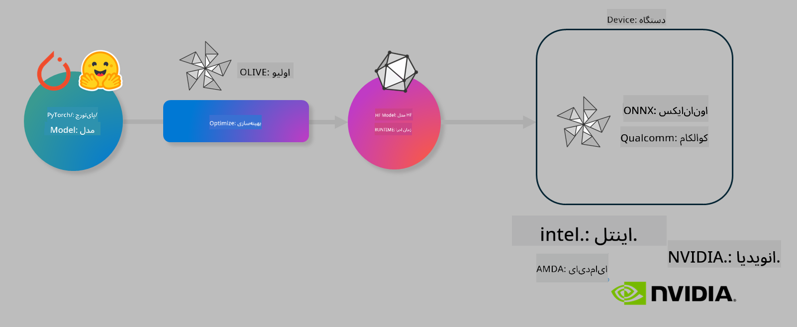

<!--
CO_OP_TRANSLATOR_METADATA:
{
  "original_hash": "6bbe47de3b974df7eea29dfeccf6032b",
  "translation_date": "2025-03-27T03:37:21+00:00",
  "source_file": "code\\03.Finetuning\\olive-lab\\readme.md",
  "language_code": "fa"
}
-->
# آزمایشگاه: بهینه‌سازی مدل‌های هوش مصنوعی برای استنتاج در دستگاه

## مقدمه

> [!IMPORTANT]
> این آزمایشگاه به یک **Nvidia A10 یا A100 GPU** با درایورها و ابزار CUDA (نسخه 12+) نیاز دارد.

> [!NOTE]
> این آزمایشگاه **35 دقیقه‌ای** شما را به مفاهیم اصلی بهینه‌سازی مدل‌ها برای استنتاج در دستگاه با استفاده از OLIVE آشنا می‌کند.

## اهداف آموزشی

در پایان این آزمایشگاه، شما قادر خواهید بود با استفاده از OLIVE:

- یک مدل هوش مصنوعی را با روش کوانت‌سازی AWQ کوانت‌سازی کنید.
- یک مدل هوش مصنوعی را برای یک وظیفه خاص تنظیم دقیق کنید.
- آداپتورهای LoRA (مدل تنظیم‌شده) را برای استنتاج کارآمد در دستگاه روی ONNX Runtime ایجاد کنید.

### OLIVE چیست؟

Olive (*O*NNX *live*) یک ابزار بهینه‌سازی مدل با رابط خط فرمان است که به شما امکان می‌دهد مدل‌ها را برای ONNX Runtime +++https://onnxruntime.ai+++ با کیفیت و عملکرد بالا ارائه دهید.



ورودی Olive معمولاً یک مدل PyTorch یا Hugging Face است و خروجی آن یک مدل ONNX بهینه‌شده است که روی یک دستگاه (هدف استقرار) با اجرای ONNX Runtime اجرا می‌شود. Olive مدل را برای شتاب‌دهنده هوش مصنوعی هدف استقرار (NPU، GPU، CPU) که توسط فروشنده سخت‌افزار مانند Qualcomm، AMD، Nvidia یا Intel ارائه شده است، بهینه‌سازی می‌کند.

Olive یک *گردش کار* را اجرا می‌کند که یک ترتیب منظم از وظایف بهینه‌سازی مدل به نام *پاس‌ها* است - نمونه‌هایی از پاس‌ها شامل فشرده‌سازی مدل، ضبط گراف، کوانت‌سازی و بهینه‌سازی گراف هستند. هر پاس مجموعه‌ای از پارامترها دارد که می‌توان آنها را تنظیم کرد تا بهترین معیارها مانند دقت و تأخیر که توسط ارزیاب مربوطه ارزیابی می‌شوند، به دست آید. Olive از یک استراتژی جستجو استفاده می‌کند که با استفاده از یک الگوریتم جستجو هر پاس را به صورت جداگانه یا مجموعه‌ای از پاس‌ها را به صورت گروهی تنظیم می‌کند.

#### مزایای Olive

- **کاهش ناامیدی و زمان** ناشی از آزمایش‌های دستی و خطا با تکنیک‌های مختلف برای بهینه‌سازی گراف، فشرده‌سازی و کوانت‌سازی. محدودیت‌های کیفیت و عملکرد خود را تعریف کنید و اجازه دهید Olive بهترین مدل را برای شما پیدا کند.
- **بیش از 40 جزء بهینه‌سازی مدل داخلی** که تکنیک‌های پیشرفته در کوانت‌سازی، فشرده‌سازی، بهینه‌سازی گراف و تنظیم دقیق را پوشش می‌دهند.
- **رابط خط فرمان آسان برای استفاده** برای وظایف رایج بهینه‌سازی مدل. به عنوان مثال: olive quantize، olive auto-opt، olive finetune.
- بسته‌بندی و استقرار مدل داخلی.
- پشتیبانی از ایجاد مدل‌ها برای **Multi LoRA serving**.
- ایجاد گردش کار با استفاده از YAML/JSON برای هماهنگی وظایف بهینه‌سازی و استقرار مدل.
- یکپارچگی با **Hugging Face** و **Azure AI**.
- مکانیزم **ذخیره‌سازی داخلی** برای **کاهش هزینه‌ها**.

## دستورالعمل‌های آزمایشگاه
> [!NOTE]
> لطفاً مطمئن شوید که Azure AI Hub و پروژه خود را آماده کرده و محاسبات A100 خود را مطابق آزمایشگاه 1 تنظیم کرده‌اید.

### مرحله 0: اتصال به محاسبه Azure AI

شما با استفاده از قابلیت ریموت در **VS Code** به محاسبه Azure AI متصل خواهید شد.

1. برنامه دسکتاپ **VS Code** خود را باز کنید:
1. از **Shift+Ctrl+P** برای باز کردن **command palette** استفاده کنید.
1. در command palette جستجو کنید **AzureML - remote: Connect to compute instance in New Window**.
1. دستورالعمل‌های روی صفحه را دنبال کنید تا به Compute متصل شوید. این شامل انتخاب اشتراک Azure، گروه منابع، پروژه و نام Compute شما که در آزمایشگاه 1 تنظیم کرده‌اید، خواهد بود.
1. پس از اتصال به گره محاسبه Azure ML، این اتصال در **پایین سمت چپ Visual Code** نمایش داده خواهد شد `><Azure ML: Compute Name`

### مرحله 1: کلون کردن این مخزن

در VS Code، می‌توانید با **Ctrl+J** یک ترمینال جدید باز کنید و این مخزن را کلون کنید:

در ترمینال باید این اعلان را مشاهده کنید

```
azureuser@computername:~/cloudfiles/code$ 
```
کلون کردن راه‌حل 

```bash
cd ~/localfiles
git clone https://github.com/microsoft/phi-3cookbook.git
```

### مرحله 2: باز کردن پوشه در VS Code

برای باز کردن VS Code در پوشه مربوطه، دستور زیر را در ترمینال اجرا کنید، که یک پنجره جدید باز خواهد کرد:

```bash
code phi-3cookbook/code/04.Finetuning/Olive-lab
```

همچنین می‌توانید پوشه را با انتخاب **File** > **Open Folder** باز کنید.

### مرحله 3: وابستگی‌ها

یک پنجره ترمینال در VS Code در نمونه محاسبه Azure AI خود باز کنید (نکته: **Ctrl+J**) و دستورات زیر را برای نصب وابستگی‌ها اجرا کنید:

```bash
conda create -n olive-ai python=3.11 -y
conda activate olive-ai
pip install -r requirements.txt
az extension remove -n azure-cli-ml
az extension add -n ml
```

> [!NOTE]
> نصب تمام وابستگی‌ها حدود ~5 دقیقه طول می‌کشد.

در این آزمایشگاه شما مدل‌ها را از کاتالوگ مدل Azure AI دانلود و آپلود خواهید کرد. برای دسترسی به کاتالوگ مدل، باید با استفاده از دستور زیر به Azure وارد شوید:

```bash
az login
```

> [!NOTE]
> هنگام ورود از شما خواسته می‌شود اشتراک خود را انتخاب کنید. مطمئن شوید که اشتراک را به همان اشتراکی که برای این آزمایشگاه ارائه شده است تنظیم کنید.

### مرحله 4: اجرای دستورات Olive

یک پنجره ترمینال در VS Code در نمونه محاسبه Azure AI خود باز کنید (نکته: **Ctrl+J**) و مطمئن شوید که محیط `olive-ai` conda فعال شده است:

```bash
conda activate olive-ai
```

سپس دستورات زیر را در خط فرمان اجرا کنید.

1. **بررسی داده‌ها:** در این مثال، شما مدل Phi-3.5-Mini را تنظیم دقیق می‌کنید تا در پاسخ به سوالات مرتبط با سفر تخصصی شود. کد زیر اولین چند رکورد از مجموعه داده را که در قالب خطوط JSON هستند، نمایش می‌دهد:
   
    ```bash
    head data/data_sample_travel.jsonl
    ```
1. **کوانت‌سازی مدل:** قبل از آموزش مدل، ابتدا با دستور زیر که از تکنیکی به نام کوانت‌سازی فعال آگاه (AWQ) استفاده می‌کند، کوانت‌سازی کنید +++https://arxiv.org/abs/2306.00978+++. AWQ وزن‌های مدل را با در نظر گرفتن فعال‌سازی‌های تولید شده در طول استنتاج کوانت‌سازی می‌کند. این به این معنی است که فرآیند کوانت‌سازی توزیع داده واقعی در فعال‌سازی‌ها را در نظر می‌گیرد، که منجر به حفظ بهتر دقت مدل در مقایسه با روش‌های سنتی کوانت‌سازی وزن می‌شود.
    
    ```bash
    olive quantize \
       --model_name_or_path microsoft/Phi-3.5-mini-instruct \
       --trust_remote_code \
       --algorithm awq \
       --output_path models/phi/awq \
       --log_level 1
    ```
    
    انجام کوانت‌سازی AWQ حدود **~8 دقیقه** طول می‌کشد که **اندازه مدل را از ~7.5GB به ~2.5GB کاهش می‌دهد**.
   
   در این آزمایشگاه، ما به شما نشان می‌دهیم که چگونه مدل‌ها را از Hugging Face وارد کنید (به عنوان مثال: `microsoft/Phi-3.5-mini-instruct`). However, Olive also allows you to input models from the Azure AI catalog by updating the `model_name_or_path` argument to an Azure AI asset ID (for example:  `azureml://registries/azureml/models/Phi-3.5-mini-instruct/versions/4`). 

1. **Train the model:** Next, the `olive finetune` دستور تنظیم دقیق مدل کوانت‌سازی‌شده. کوانت‌سازی مدل *قبل از* تنظیم دقیق به جای بعد از آن دقت بهتری را ارائه می‌دهد زیرا فرآیند تنظیم دقیق برخی از ضررهای ناشی از کوانت‌سازی را جبران می‌کند.
    
    ```bash
    olive finetune \
        --method lora \
        --model_name_or_path models/phi/awq \
        --data_files "data/data_sample_travel.jsonl" \
        --data_name "json" \
        --text_template "<|user|>\n{prompt}<|end|>\n<|assistant|>\n{response}<|end|>" \
        --max_steps 100 \
        --output_path ./models/phi/ft \
        --log_level 1
    ```
    
    انجام تنظیم دقیق حدود **~6 دقیقه** طول می‌کشد (با 100 مرحله).

1. **بهینه‌سازی:** با آموزش مدل، اکنون مدل را با استفاده از دستور `auto-opt` command, which will capture the ONNX graph and automatically perform a number of optimizations to improve the model performance for CPU by compressing the model and doing fusions. It should be noted, that you can also optimize for other devices such as NPU or GPU by just updating the `--device` and `--provider` Olive بهینه‌سازی کنید - اما برای اهداف این آزمایشگاه از CPU استفاده خواهیم کرد.

    ```bash
    olive auto-opt \
       --model_name_or_path models/phi/ft/model \
       --adapter_path models/phi/ft/adapter \
       --device cpu \
       --provider CPUExecutionProvider \
       --use_ort_genai \
       --output_path models/phi/onnx-ao \
       --log_level 1
    ```
    
    انجام بهینه‌سازی حدود **~5 دقیقه** طول می‌کشد.

### مرحله 5: آزمایش سریع استنتاج مدل

برای آزمایش استنتاج مدل، یک فایل Python در پوشه خود ایجاد کنید به نام **app.py** و کد زیر را کپی و جایگذاری کنید:

```python
import onnxruntime_genai as og
import numpy as np

print("loading model and adapters...", end="", flush=True)
model = og.Model("models/phi/onnx-ao/model")
adapters = og.Adapters(model)
adapters.load("models/phi/onnx-ao/model/adapter_weights.onnx_adapter", "travel")
print("DONE!")

tokenizer = og.Tokenizer(model)
tokenizer_stream = tokenizer.create_stream()

params = og.GeneratorParams(model)
params.set_search_options(max_length=100, past_present_share_buffer=False)
user_input = "what is the best thing to see in chicago"
params.input_ids = tokenizer.encode(f"<|user|>\n{user_input}<|end|>\n<|assistant|>\n")

generator = og.Generator(model, params)

generator.set_active_adapter(adapters, "travel")

print(f"{user_input}")

while not generator.is_done():
    generator.compute_logits()
    generator.generate_next_token()

    new_token = generator.get_next_tokens()[0]
    print(tokenizer_stream.decode(new_token), end='', flush=True)

print("\n")
```

کد را با استفاده از دستور زیر اجرا کنید:

```bash
python app.py
```

### مرحله 6: آپلود مدل به Azure AI

آپلود مدل در یک مخزن مدل Azure AI باعث می‌شود که مدل با سایر اعضای تیم توسعه شما قابل اشتراک‌گذاری باشد و همچنین کنترل نسخه مدل را مدیریت کند. برای آپلود مدل دستور زیر را اجرا کنید:

> [!NOTE]
> `{}` placeholders with the name of your resource group and Azure AI Project Name. 

To find your resource group `"resourceGroup"و نام پروژه Azure AI را به‌روزرسانی کنید و دستور زیر را اجرا کنید 

```
az ml workspace show
```

یا با رفتن به +++ai.azure.com+++ و انتخاب **management center** **project** **overview**

`{}` مکان‌های خالی را با نام گروه منابع و نام پروژه Azure AI خود به‌روزرسانی کنید.

```bash
az ml model create \
    --name ft-for-travel \
    --version 1 \
    --path ./models/phi/onnx-ao \
    --resource-group {RESOURCE_GROUP_NAME} \
    --workspace-name {PROJECT_NAME}
```
شما سپس می‌توانید مدل آپلود‌شده خود را مشاهده کنید و مدل خود را در https://ml.azure.com/model/list مستقر کنید.

**سلب مسئولیت**:  
این سند با استفاده از سرویس ترجمه هوش مصنوعی [Co-op Translator](https://github.com/Azure/co-op-translator) ترجمه شده است. در حالی که ما تلاش می‌کنیم دقت ترجمه را حفظ کنیم، لطفاً توجه داشته باشید که ترجمه‌های خودکار ممکن است شامل خطاها یا نادرستی‌ها باشند. سند اصلی به زبان مادری باید به عنوان منبع معتبر در نظر گرفته شود. برای اطلاعات حساس، ترجمه حرفه‌ای انسانی توصیه می‌شود. ما مسئولیت هرگونه سوء تفاهم یا تفسیر نادرست ناشی از استفاده از این ترجمه را نمی‌پذیریم.