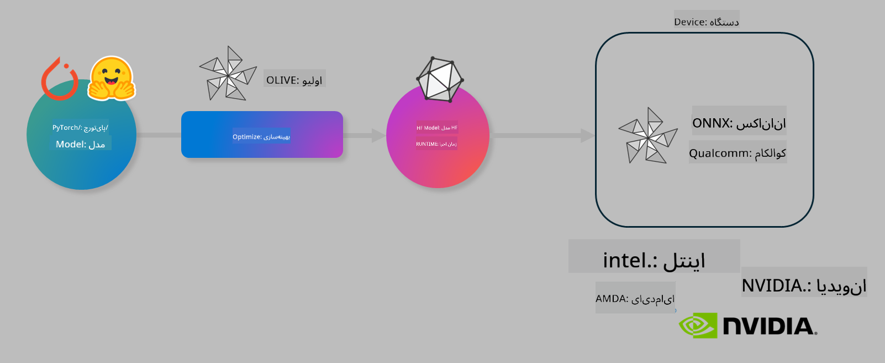

<!--
CO_OP_TRANSLATOR_METADATA:
{
  "original_hash": "6bbe47de3b974df7eea29dfeccf6032b",
  "translation_date": "2025-03-27T03:55:45+00:00",
  "source_file": "code\\04.Finetuning\\olive-lab\\readme.md",
  "language_code": "fa"
}
-->
# آزمایشگاه: بهینه‌سازی مدل‌های هوش مصنوعی برای استنتاج روی دستگاه

## مقدمه

> [!IMPORTANT]
> این آزمایشگاه نیاز به **GPU Nvidia A10 یا A100** با درایورها و ابزار CUDA (نسخه 12 به بالا) نصب شده دارد.

> [!NOTE]
> این آزمایشگاه **35 دقیقه‌ای** شما را با مفاهیم اصلی بهینه‌سازی مدل‌ها برای استنتاج روی دستگاه با استفاده از OLIVE آشنا می‌کند.

## اهداف یادگیری

در پایان این آزمایشگاه، شما قادر خواهید بود با استفاده از OLIVE:

- یک مدل هوش مصنوعی را با استفاده از روش کوانتایز AWQ کوانتایز کنید.
- یک مدل هوش مصنوعی را برای یک وظیفه خاص تنظیم کنید.
- آداپتورهای LoRA (مدل تنظیم‌شده) را برای استنتاج کارآمد روی دستگاه با استفاده از ONNX Runtime تولید کنید.

### Olive چیست؟

Olive (*O*NNX *live*) یک ابزار بهینه‌سازی مدل به همراه CLI است که به شما امکان می‌دهد مدل‌ها را برای ONNX Runtime +++https://onnxruntime.ai+++ با کیفیت و عملکرد مناسب ارائه دهید.



ورودی Olive معمولاً یک مدل PyTorch یا Hugging Face است و خروجی آن یک مدل بهینه‌شده ONNX است که روی دستگاهی (هدف استقرار) که ONNX Runtime را اجرا می‌کند، اجرا می‌شود. Olive مدل را برای شتاب‌دهنده هوش مصنوعی هدف استقرار (NPU، GPU، CPU) که توسط یک فروشنده سخت‌افزار مانند Qualcomm، AMD، Nvidia یا Intel ارائه شده است، بهینه می‌کند.

Olive یک *جریان کاری* را اجرا می‌کند، که یک توالی مرتب از وظایف بهینه‌سازی مدل به نام *گذرها* است - نمونه‌هایی از گذرها شامل: فشرده‌سازی مدل، ضبط گراف، کوانتایز، و بهینه‌سازی گراف. هر گذر مجموعه‌ای از پارامترها دارد که می‌توان آن‌ها را برای دستیابی به بهترین معیارها، مانند دقت و تأخیر، تنظیم کرد که توسط ارزیاب مربوطه ارزیابی می‌شوند. Olive از یک استراتژی جستجو استفاده می‌کند که با استفاده از یک الگوریتم جستجو، هر گذر را یکی‌یکی یا مجموعه‌ای از گذرها را با هم تنظیم می‌کند.

#### مزایای Olive

- **کاهش ناامیدی و زمان** ناشی از آزمایش دستی و آزمون و خطا با تکنیک‌های مختلف برای بهینه‌سازی گراف، فشرده‌سازی و کوانتایز. محدودیت‌های کیفیت و عملکرد خود را تعریف کنید و اجازه دهید Olive بهترین مدل را برای شما پیدا کند.
- **بیش از 40 مؤلفه داخلی بهینه‌سازی مدل** که تکنیک‌های پیشرفته‌ای در زمینه کوانتایز، فشرده‌سازی، بهینه‌سازی گراف و تنظیم ارائه می‌دهند.
- **CLI ساده برای استفاده** برای وظایف رایج بهینه‌سازی مدل. به عنوان مثال، کوانتایز Olive، Auto-opt Olive، تنظیم Olive.
- بسته‌بندی و استقرار مدل به صورت داخلی.
- پشتیبانی از تولید مدل‌ها برای **ارائه چندگانه LoRA**.
- ساخت جریان‌های کاری با استفاده از YAML/JSON برای هماهنگی وظایف بهینه‌سازی مدل و استقرار.
- یکپارچگی با **Hugging Face** و **Azure AI**.
- مکانیزم **کش داخلی** برای **صرفه‌جویی در هزینه‌ها**.

## دستورالعمل‌های آزمایشگاه
> [!NOTE]
> لطفاً مطمئن شوید که Azure AI Hub و پروژه خود را تنظیم کرده و محاسبات A100 خود را مطابق با آزمایشگاه 1 پیکربندی کرده‌اید.

### مرحله 0: اتصال به محاسبات Azure AI

شما از ویژگی ریموت در **VS Code** برای اتصال به محاسبات Azure AI استفاده خواهید کرد.

1. برنامه دسکتاپ **VS Code** خود را باز کنید:
1. **پالت دستورات** را با استفاده از **Shift+Ctrl+P** باز کنید.
1. در پالت دستورات، **AzureML - remote: Connect to compute instance in New Window** را جستجو کنید.
1. دستورالعمل‌های روی صفحه را دنبال کنید تا به محاسبات متصل شوید. این شامل انتخاب اشتراک Azure، گروه منابع، پروژه و نام محاسباتی است که در آزمایشگاه 1 تنظیم کرده‌اید.
1. پس از اتصال به گره محاسبات Azure ML، این اتصال در **پایین سمت چپ Visual Code** نمایش داده خواهد شد `><Azure ML: Compute Name`

### مرحله 1: کلون کردن این مخزن

در VS Code، می‌توانید یک ترمینال جدید با **Ctrl+J** باز کنید و این مخزن را کلون کنید:

در ترمینال باید اعلان زیر را ببینید:

```
azureuser@computername:~/cloudfiles/code$ 
```
کلون کردن راه‌حل 

```bash
cd ~/localfiles
git clone https://github.com/microsoft/phi-3cookbook.git
```

### مرحله 2: باز کردن پوشه در VS Code

برای باز کردن VS Code در پوشه مربوطه، دستور زیر را در ترمینال اجرا کنید، که یک پنجره جدید باز می‌کند:

```bash
code phi-3cookbook/code/04.Finetuning/Olive-lab
```

همچنین می‌توانید پوشه را با انتخاب **File** > **Open Folder** باز کنید.

### مرحله 3: وابستگی‌ها

یک پنجره ترمینال در VS Code در نمونه محاسبات Azure AI خود باز کنید (نکته: **Ctrl+J**) و دستورات زیر را برای نصب وابستگی‌ها اجرا کنید:

```bash
conda create -n olive-ai python=3.11 -y
conda activate olive-ai
pip install -r requirements.txt
az extension remove -n azure-cli-ml
az extension add -n ml
```

> [!NOTE]
> نصب تمام وابستگی‌ها حدود **5 دقیقه** طول می‌کشد.

در این آزمایشگاه، شما مدل‌ها را به کاتالوگ مدل Azure AI دانلود و آپلود خواهید کرد. برای دسترسی به کاتالوگ مدل، باید با استفاده از دستور زیر به Azure وارد شوید:

```bash
az login
```

> [!NOTE]
> در زمان ورود، از شما خواسته می‌شود اشتراک خود را انتخاب کنید. اطمینان حاصل کنید که اشتراک ارائه‌شده برای این آزمایشگاه را تنظیم کرده‌اید.

### مرحله 4: اجرای دستورات Olive

یک پنجره ترمینال در VS Code در نمونه محاسبات Azure AI خود باز کنید (نکته: **Ctrl+J**) و اطمینان حاصل کنید که محیط `olive-ai` conda فعال است:

```bash
conda activate olive-ai
```

سپس دستورات زیر Olive را در خط فرمان اجرا کنید.

1. **بازبینی داده‌ها:** در این مثال، شما مدل Phi-3.5-Mini را برای پاسخ به سؤالات مرتبط با سفر تنظیم خواهید کرد. کد زیر چند رکورد اول مجموعه داده را که در قالب JSON lines است، نمایش می‌دهد:
   
    ```bash
    head data/data_sample_travel.jsonl
    ```
1. **کوانتایز کردن مدل:** قبل از آموزش مدل، ابتدا آن را با دستور زیر کوانتایز کنید که از تکنیکی به نام کوانتایز آگاه به فعال‌سازی (AWQ) +++https://arxiv.org/abs/2306.00978+++ استفاده می‌کند. AWQ وزن‌های مدل را با در نظر گرفتن فعال‌سازی‌های تولید شده در طول استنتاج کوانتایز می‌کند. این بدان معناست که فرآیند کوانتایز توزیع واقعی داده‌ها در فعال‌سازی‌ها را در نظر می‌گیرد و منجر به حفظ بهتر دقت مدل در مقایسه با روش‌های سنتی کوانتایز وزن می‌شود.
    
    ```bash
    olive quantize \
       --model_name_or_path microsoft/Phi-3.5-mini-instruct \
       --trust_remote_code \
       --algorithm awq \
       --output_path models/phi/awq \
       --log_level 1
    ```
    
    این فرآیند حدود **8 دقیقه** طول می‌کشد و **اندازه مدل را از حدود 7.5GB به حدود 2.5GB** کاهش می‌دهد.
   
   در این آزمایشگاه، به شما نشان می‌دهیم که چگونه مدل‌ها را از Hugging Face وارد کنید (به عنوان مثال: `microsoft/Phi-3.5-mini-instruct`). However, Olive also allows you to input models from the Azure AI catalog by updating the `model_name_or_path` argument to an Azure AI asset ID (for example:  `azureml://registries/azureml/models/Phi-3.5-mini-instruct/versions/4`). 

1. **Train the model:** Next, the `olive finetune` دستور تنظیم مدل کوانتایز شده را انجام می‌دهد. کوانتایز کردن مدل *قبل از* تنظیم آن به جای بعد از آن، دقت بهتری می‌دهد زیرا فرآیند تنظیم برخی از افت‌های ناشی از کوانتایز را جبران می‌کند.
    
    ```bash
    olive finetune \
        --method lora \
        --model_name_or_path models/phi/awq \
        --data_files "data/data_sample_travel.jsonl" \
        --data_name "json" \
        --text_template "<|user|>\n{prompt}<|end|>\n<|assistant|>\n{response}<|end|>" \
        --max_steps 100 \
        --output_path ./models/phi/ft \
        --log_level 1
    ```
    
    تنظیم مدل حدود **6 دقیقه** طول می‌کشد (با 100 گام).

1. **بهینه‌سازی:** با آموزش مدل، اکنون مدل را با استفاده از دستور `auto-opt` command, which will capture the ONNX graph and automatically perform a number of optimizations to improve the model performance for CPU by compressing the model and doing fusions. It should be noted, that you can also optimize for other devices such as NPU or GPU by just updating the `--device` and `--provider` Olive بهینه کنید - اما برای اهداف این آزمایشگاه از CPU استفاده خواهیم کرد.

    ```bash
    olive auto-opt \
       --model_name_or_path models/phi/ft/model \
       --adapter_path models/phi/ft/adapter \
       --device cpu \
       --provider CPUExecutionProvider \
       --use_ort_genai \
       --output_path models/phi/onnx-ao \
       --log_level 1
    ```
    
    بهینه‌سازی حدود **5 دقیقه** طول می‌کشد.

### مرحله 5: آزمایش سریع استنتاج مدل

برای آزمایش استنتاج مدل، یک فایل پایتون به نام **app.py** در پوشه خود ایجاد کنید و کد زیر را کپی و جای‌گذاری کنید:

```python
import onnxruntime_genai as og
import numpy as np

print("loading model and adapters...", end="", flush=True)
model = og.Model("models/phi/onnx-ao/model")
adapters = og.Adapters(model)
adapters.load("models/phi/onnx-ao/model/adapter_weights.onnx_adapter", "travel")
print("DONE!")

tokenizer = og.Tokenizer(model)
tokenizer_stream = tokenizer.create_stream()

params = og.GeneratorParams(model)
params.set_search_options(max_length=100, past_present_share_buffer=False)
user_input = "what is the best thing to see in chicago"
params.input_ids = tokenizer.encode(f"<|user|>\n{user_input}<|end|>\n<|assistant|>\n")

generator = og.Generator(model, params)

generator.set_active_adapter(adapters, "travel")

print(f"{user_input}")

while not generator.is_done():
    generator.compute_logits()
    generator.generate_next_token()

    new_token = generator.get_next_tokens()[0]
    print(tokenizer_stream.decode(new_token), end='', flush=True)

print("\n")
```

کد را با استفاده از دستور زیر اجرا کنید:

```bash
python app.py
```

### مرحله 6: آپلود مدل به Azure AI

آپلود مدل به یک مخزن مدل Azure AI، مدل را با سایر اعضای تیم توسعه شما قابل اشتراک می‌کند و همچنین نسخه‌گذاری مدل را مدیریت می‌کند. برای آپلود مدل، دستور زیر را اجرا کنید:

> [!NOTE]
> `{}` placeholders with the name of your resource group and Azure AI Project Name. 

To find your resource group `"resourceGroup"` و نام پروژه Azure AI را به‌روزرسانی کرده و دستور زیر را اجرا کنید:

```
az ml workspace show
```

یا با رفتن به +++ai.azure.com+++ و انتخاب **مدیریت مرکز** > **پروژه** > **نمای کلی**

جای‌گذاری‌های `{}` را با نام گروه منابع و نام پروژه Azure AI خود به‌روزرسانی کنید.

```bash
az ml model create \
    --name ft-for-travel \
    --version 1 \
    --path ./models/phi/onnx-ao \
    --resource-group {RESOURCE_GROUP_NAME} \
    --workspace-name {PROJECT_NAME}
```
سپس می‌توانید مدل آپلود شده خود را مشاهده کرده و مدل خود را در https://ml.azure.com/model/list مستقر کنید.

**سلب مسئولیت**:  
این سند با استفاده از سرویس ترجمه هوش مصنوعی [Co-op Translator](https://github.com/Azure/co-op-translator) ترجمه شده است. در حالی که ما تلاش می‌کنیم دقت را حفظ کنیم، لطفاً توجه داشته باشید که ترجمه‌های خودکار ممکن است شامل خطاها یا نادرستی‌ها باشد. سند اصلی به زبان اصلی آن باید به عنوان منبع معتبر در نظر گرفته شود. برای اطلاعات حیاتی، توصیه می‌شود از ترجمه انسانی حرفه‌ای استفاده شود. ما هیچ مسئولیتی در قبال سوء تفاهم‌ها یا تفسیرهای اشتباه ناشی از استفاده از این ترجمه نداریم.