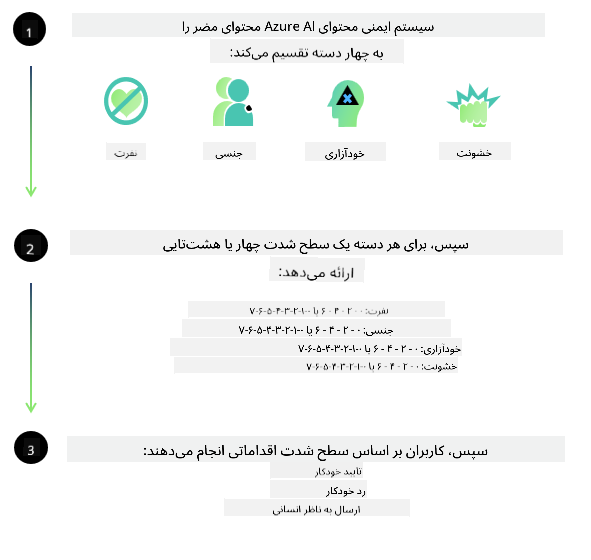
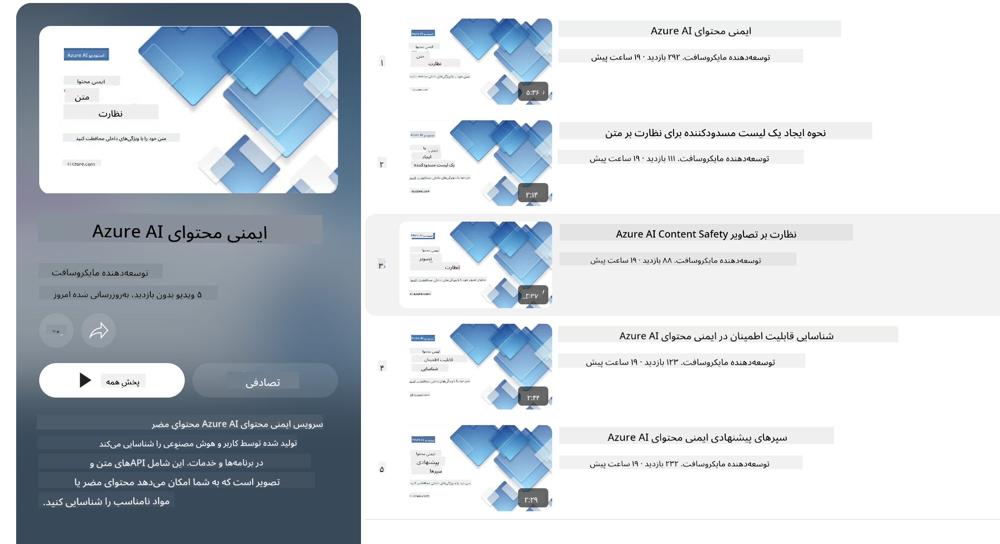

<!--
CO_OP_TRANSLATOR_METADATA:
{
  "original_hash": "c8273672cc57df2be675407a1383aaf0",
  "translation_date": "2025-03-27T05:26:45+00:00",
  "source_file": "md\\01.Introduction\\01\\01.AISafety.md",
  "language_code": "fa"
}
-->
# ایمنی هوش مصنوعی برای مدل‌های Phi  
خانواده مدل‌های Phi مطابق با [استاندارد هوش مصنوعی مسئولانه مایکروسافت](https://query.prod.cms.rt.microsoft.com/cms/api/am/binary/RE5cmFl) توسعه داده شده‌اند، که مجموعه‌ای از الزامات شرکت بر اساس شش اصل زیر است: مسئولیت‌پذیری، شفافیت، عدالت، قابلیت اطمینان و ایمنی، حفظ حریم خصوصی و امنیت، و فراگیری که اصول [هوش مصنوعی مسئولانه مایکروسافت](https://www.microsoft.com/ai/responsible-ai) را تشکیل می‌دهند.  

مانند مدل‌های قبلی Phi، ارزیابی چندجانبه ایمنی و روش آموزش ایمنی پس از تولید اتخاذ شده است، با اقدامات اضافی برای در نظر گرفتن قابلیت‌های چندزبانه این نسخه. رویکرد ما برای آموزش و ارزیابی ایمنی، شامل آزمایش در زبان‌ها و دسته‌های مختلف ریسک، در [مقاله ایمنی پس از تولید Phi](https://arxiv.org/abs/2407.13833) شرح داده شده است. در حالی که مدل‌های Phi از این رویکرد بهره‌مند می‌شوند، توسعه‌دهندگان باید بهترین روش‌های هوش مصنوعی مسئولانه را به کار گیرند، از جمله نقشه‌برداری، اندازه‌گیری و کاهش خطرات مرتبط با مورد استفاده خاص و زمینه فرهنگی و زبانی.  

## بهترین روش‌ها  

مانند سایر مدل‌ها، خانواده مدل‌های Phi ممکن است به گونه‌ای رفتار کنند که ناعادلانه، غیرقابل اعتماد یا توهین‌آمیز باشد.  

برخی از رفتارهای محدودکننده SLM و LLM که باید از آن‌ها آگاه باشید شامل موارد زیر است:  

- **کیفیت خدمات:** مدل‌های Phi عمدتاً بر اساس متن انگلیسی آموزش داده شده‌اند. زبان‌هایی غیر از انگلیسی عملکرد ضعیف‌تری خواهند داشت. گونه‌های زبان انگلیسی که کمتر در داده‌های آموزشی نمایان شده‌اند ممکن است عملکرد ضعیف‌تری نسبت به انگلیسی استاندارد آمریکایی داشته باشند.  
- **نمایش آسیب‌ها و تقویت کلیشه‌ها:** این مدل‌ها ممکن است گروه‌های خاصی از افراد را بیش از حد یا کمتر از حد نشان دهند، نمایش برخی گروه‌ها را حذف کنند، یا کلیشه‌های تحقیرآمیز یا منفی را تقویت کنند. با وجود آموزش ایمنی پس از تولید، این محدودیت‌ها ممکن است همچنان وجود داشته باشند، به دلیل سطوح مختلف نمایندگی گروه‌های مختلف یا فراوانی نمونه‌های کلیشه‌های منفی در داده‌های آموزشی که الگوهای واقعی جهان و تعصبات اجتماعی را منعکس می‌کنند.  
- **محتوای نامناسب یا توهین‌آمیز:** این مدل‌ها ممکن است انواع دیگری از محتوای نامناسب یا توهین‌آمیز تولید کنند که ممکن است استفاده از آن‌ها را برای زمینه‌های حساس بدون کاهش‌های اضافی خاص مورد استفاده نامناسب کند.  
- **قابلیت اطمینان اطلاعات:** مدل‌های زبانی ممکن است محتوای بی‌معنی تولید کنند یا محتوایی بسازند که ممکن است منطقی به نظر برسد اما نادرست یا قدیمی باشد.  
- **دامنه محدود برای کدنویسی:** بیشتر داده‌های آموزشی Phi-3 بر اساس پایتون است و از بسته‌های رایج مانند "typing، math، random، collections، datetime، itertools" استفاده می‌کند. اگر مدل اسکریپت‌های پایتون تولید کند که از بسته‌های دیگر یا اسکریپت‌هایی در زبان‌های دیگر استفاده کنند، به شدت توصیه می‌کنیم کاربران همه استفاده‌های API را به صورت دستی بررسی کنند.  

توسعه‌دهندگان باید بهترین روش‌های هوش مصنوعی مسئولانه را به کار گیرند و مسئولیت اطمینان از انطباق مورد استفاده خاص با قوانین و مقررات مربوطه (مانند حفظ حریم خصوصی، تجارت، و غیره) را بر عهده دارند.  

## ملاحظات هوش مصنوعی مسئولانه  

مانند سایر مدل‌های زبانی، مدل‌های سری Phi ممکن است به گونه‌ای رفتار کنند که ناعادلانه، غیرقابل اعتماد یا توهین‌آمیز باشد. برخی از رفتارهای محدودکننده که باید از آن‌ها آگاه باشید شامل موارد زیر است:  

**کیفیت خدمات:** مدل‌های Phi عمدتاً بر اساس متن انگلیسی آموزش داده شده‌اند. زبان‌هایی غیر از انگلیسی عملکرد ضعیف‌تری خواهند داشت. گونه‌های زبان انگلیسی که کمتر در داده‌های آموزشی نمایان شده‌اند ممکن است عملکرد ضعیف‌تری نسبت به انگلیسی استاندارد آمریکایی داشته باشند.  

**نمایش آسیب‌ها و تقویت کلیشه‌ها:** این مدل‌ها ممکن است گروه‌های خاصی از افراد را بیش از حد یا کمتر از حد نشان دهند، نمایش برخی گروه‌ها را حذف کنند، یا کلیشه‌های تحقیرآمیز یا منفی را تقویت کنند. با وجود آموزش ایمنی پس از تولید، این محدودیت‌ها ممکن است همچنان وجود داشته باشند، به دلیل سطوح مختلف نمایندگی گروه‌های مختلف یا فراوانی نمونه‌های کلیشه‌های منفی در داده‌های آموزشی که الگوهای واقعی جهان و تعصبات اجتماعی را منعکس می‌کنند.  

**محتوای نامناسب یا توهین‌آمیز:** این مدل‌ها ممکن است انواع دیگری از محتوای نامناسب یا توهین‌آمیز تولید کنند که ممکن است استفاده از آن‌ها را برای زمینه‌های حساس بدون کاهش‌های اضافی خاص مورد استفاده نامناسب کند.  

**قابلیت اطمینان اطلاعات:** مدل‌های زبانی ممکن است محتوای بی‌معنی تولید کنند یا محتوایی بسازند که ممکن است منطقی به نظر برسد اما نادرست یا قدیمی باشد.  

**دامنه محدود برای کدنویسی:** بیشتر داده‌های آموزشی Phi-3 بر اساس پایتون است و از بسته‌های رایج مانند "typing، math، random، collections، datetime، itertools" استفاده می‌کند. اگر مدل اسکریپت‌های پایتون تولید کند که از بسته‌های دیگر یا اسکریپت‌هایی در زبان‌های دیگر استفاده کنند، به شدت توصیه می‌کنیم کاربران همه استفاده‌های API را به صورت دستی بررسی کنند.  

توسعه‌دهندگان باید بهترین روش‌های هوش مصنوعی مسئولانه را به کار گیرند و مسئولیت اطمینان از انطباق مورد استفاده خاص با قوانین و مقررات مربوطه (مانند حفظ حریم خصوصی، تجارت، و غیره) را بر عهده دارند. حوزه‌های مهم برای بررسی شامل موارد زیر است:  

**تخصیص:** مدل‌ها ممکن است برای سناریوهایی که می‌توانند تأثیر قابل توجهی بر وضعیت قانونی یا تخصیص منابع یا فرصت‌های زندگی داشته باشند (مانند مسکن، اشتغال، اعتبار و غیره) مناسب نباشند، مگر اینکه ارزیابی‌های بیشتر و تکنیک‌های کاهش تعصب اضافی انجام شود.  

**سناریوهای پرخطر:** توسعه‌دهندگان باید مناسب بودن استفاده از مدل‌ها در سناریوهای پرخطری که خروجی‌های ناعادلانه، غیرقابل اعتماد یا توهین‌آمیز ممکن است بسیار پرهزینه یا منجر به آسیب شوند را ارزیابی کنند. این شامل ارائه مشاوره در زمینه‌های حساس یا تخصصی است که دقت و قابلیت اطمینان در آن‌ها حیاتی است (مانند مشاوره حقوقی یا بهداشتی). کاهش‌های اضافی باید در سطح برنامه و بر اساس زمینه استقرار اجرا شوند.  

**اطلاعات غلط:** مدل‌ها ممکن است اطلاعات نادرست تولید کنند. توسعه‌دهندگان باید بهترین روش‌های شفافیت را دنبال کنند و به کاربران نهایی اطلاع دهند که در حال تعامل با یک سیستم هوش مصنوعی هستند. در سطح برنامه، توسعه‌دهندگان می‌توانند مکانیسم‌های بازخورد و خطوط لوله‌ای برای پایه‌گذاری پاسخ‌ها در اطلاعات زمینه‌ای خاص مورد استفاده، تکنیکی که به عنوان تولید افزوده بازیابی (RAG) شناخته می‌شود، ایجاد کنند.  

**تولید محتوای مضر:** توسعه‌دهندگان باید خروجی‌ها را برای زمینه‌شان ارزیابی کنند و از طبقه‌بندی‌کننده‌های ایمنی موجود یا راه‌حل‌های سفارشی مناسب برای مورد استفاده خود استفاده کنند.  

**سوءاستفاده:** سایر اشکال سوءاستفاده مانند کلاهبرداری، اسپم یا تولید بدافزار ممکن است ممکن باشد، و توسعه‌دهندگان باید اطمینان حاصل کنند که برنامه‌های آن‌ها قوانین و مقررات قابل اجرا را نقض نمی‌کنند.  

### تنظیم دقیق و ایمنی محتوای هوش مصنوعی  

پس از تنظیم دقیق یک مدل، به شدت توصیه می‌کنیم از اقدامات [ایمنی محتوای Azure AI](https://learn.microsoft.com/azure/ai-services/content-safety/overview) برای نظارت بر محتوای تولید شده توسط مدل‌ها، شناسایی و مسدود کردن خطرات، تهدیدها، و مشکلات کیفیت احتمالی استفاده کنید.  

  

[ایمنی محتوای Azure AI](https://learn.microsoft.com/azure/ai-services/content-safety/overview) از محتوای متنی و تصویری پشتیبانی می‌کند. این قابلیت می‌تواند در فضای ابری، کانتینرهای جدا شده، و دستگاه‌های لبه/تعبیه شده مستقر شود.  

## نمای کلی ایمنی محتوای Azure AI  

ایمنی محتوای Azure AI یک راه‌حل یکسان برای همه نیست؛ این قابلیت می‌تواند برای هماهنگی با سیاست‌های خاص کسب‌وکار‌ها سفارشی شود. علاوه بر این، مدل‌های چندزبانه آن امکان درک زبان‌های مختلف به طور همزمان را فراهم می‌کنند.  

  

- **ایمنی محتوای Azure AI**  
- **توسعه‌دهنده مایکروسافت**  
- **۵ ویدیو**  

خدمات ایمنی محتوای Azure AI محتوای تولید شده توسط کاربران و هوش مصنوعی را در برنامه‌ها و خدمات شناسایی می‌کند. این شامل API‌های متنی و تصویری است که امکان شناسایی مواد مضر یا نامناسب را فراهم می‌کنند.  

[لیست پخش ایمنی محتوای AI](https://www.youtube.com/playlist?list=PLlrxD0HtieHjaQ9bJjyp1T7FeCbmVcPkQ)  

**سلب مسئولیت**:  
این سند با استفاده از سرویس ترجمه هوش مصنوعی [Co-op Translator](https://github.com/Azure/co-op-translator) ترجمه شده است. در حالی که ما تلاش می‌کنیم دقت را حفظ کنیم، لطفاً توجه داشته باشید که ترجمه‌های خودکار ممکن است شامل خطاها یا نادرستی‌ها باشد. سند اصلی به زبان اصلی باید به عنوان منبع معتبر در نظر گرفته شود. برای اطلاعات حیاتی، ترجمه حرفه‌ای انسانی توصیه می‌شود. ما هیچ مسئولیتی در قبال سوءتفاهم‌ها یا تفسیرهای اشتباه ناشی از استفاده از این ترجمه نداریم.