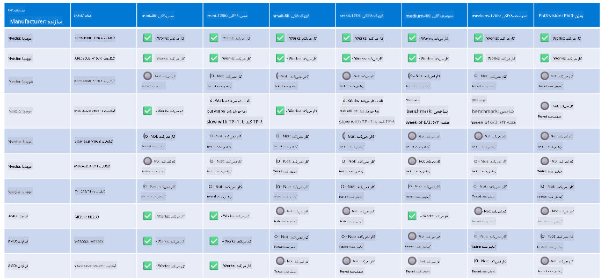

<!--
CO_OP_TRANSLATOR_METADATA:
{
  "original_hash": "8cdc17ce0f10535da30b53d23fe1a795",
  "translation_date": "2025-03-27T05:55:25+00:00",
  "source_file": "md\\01.Introduction\\01\\01.Hardwaresupport.md",
  "language_code": "fa"
}
-->
# پشتیبانی از سخت‌افزار Phi

مایکروسافت Phi برای ONNX Runtime بهینه شده است و از Windows DirectML پشتیبانی می‌کند. این فناوری به خوبی بر روی انواع مختلف سخت‌افزار، از جمله GPUها، CPUها و حتی دستگاه‌های موبایل، کار می‌کند.

## سخت‌افزار دستگاه  
به طور خاص، سخت‌افزارهای پشتیبانی‌شده شامل موارد زیر هستند:

- مدل GPU: RTX 4090 (DirectML)
- مدل GPU: 1 A100 80GB (CUDA)
- مدل CPU: Standard F64s v2 (64 vCPUs، 128 گیگابایت حافظه)

## مدل‌های موبایل

- اندروید - Samsung Galaxy S21
- اپل آیفون 14 یا بالاتر با پردازنده A16/A17

## مشخصات سخت‌افزار Phi

- حداقل پیکربندی مورد نیاز:
- ویندوز: GPU سازگار با DirectX 12 و حداقل 4 گیگابایت حافظه ترکیبی

CUDA: کارت گرافیک NVIDIA با قابلیت محاسباتی >= 7.02



## اجرای onnxruntime بر روی چندین GPU

مدل‌های فعلی Phi ONNX فقط برای 1 GPU موجود هستند. امکان پشتیبانی از چند GPU برای مدل Phi وجود دارد، اما استفاده از ORT با 2 GPU تضمین نمی‌کند که بازده بیشتری نسبت به اجرای 2 نمونه ORT داشته باشد. لطفاً برای آخرین به‌روزرسانی‌ها به [ONNX Runtime](https://onnxruntime.ai/) مراجعه کنید.

در [Build 2024 تیم GenAI ONNX](https://youtu.be/WLW4SE8M9i8?si=EtG04UwDvcjunyfC) اعلام کرد که به جای استفاده از چند GPU، قابلیت چند نمونه‌ای را برای مدل‌های Phi فعال کرده‌اند.

در حال حاضر، این قابلیت به شما اجازه می‌دهد یک نمونه از onnxruntime یا onnxruntime-genai را با متغیر محیطی CUDA_VISIBLE_DEVICES به این شکل اجرا کنید:

```Python
CUDA_VISIBLE_DEVICES=0 python infer.py
CUDA_VISIBLE_DEVICES=1 python infer.py
```

می‌توانید اطلاعات بیشتری درباره Phi را در [Azure AI Foundry](https://ai.azure.com) بررسی کنید.

**سلب مسئولیت**:  
این سند با استفاده از خدمات ترجمه هوش مصنوعی [Co-op Translator](https://github.com/Azure/co-op-translator) ترجمه شده است. در حالی که ما تلاش می‌کنیم تا دقت را حفظ کنیم، لطفاً توجه داشته باشید که ترجمه‌های خودکار ممکن است حاوی خطاها یا نادقتی‌هایی باشند. سند اصلی به زبان اصلی آن باید به عنوان منبع معتبر در نظر گرفته شود. برای اطلاعات حساس، توصیه می‌شود از ترجمه حرفه‌ای انسانی استفاده کنید. ما هیچ مسئولیتی در قبال سوءتفاهم‌ها یا تفسیرهای نادرست ناشی از استفاده از این ترجمه نداریم.