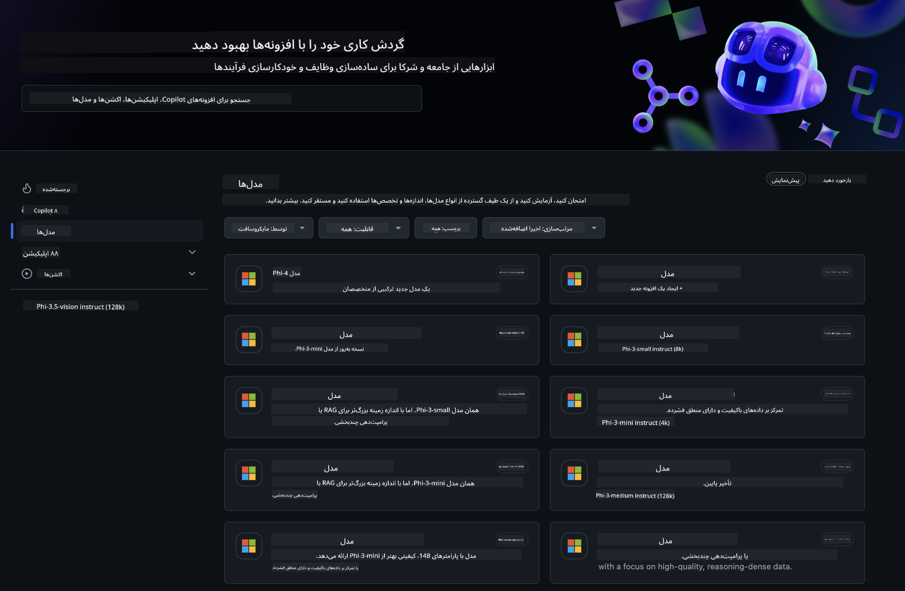
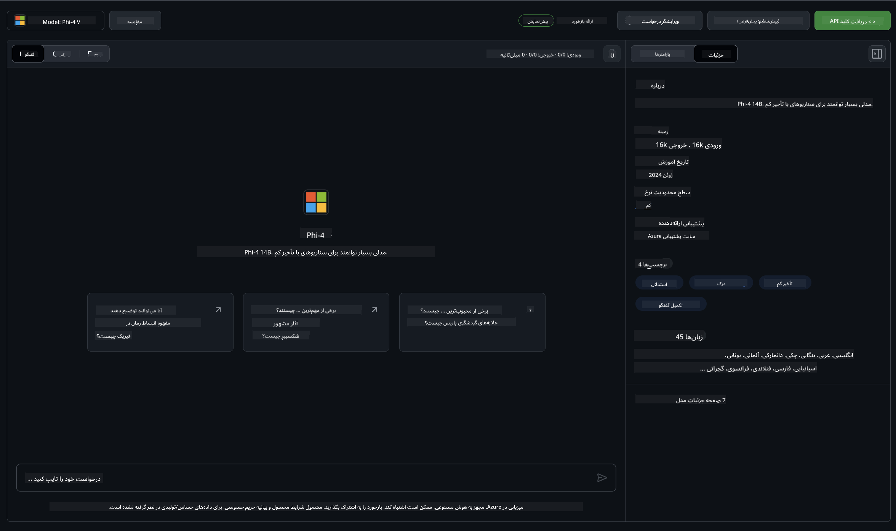
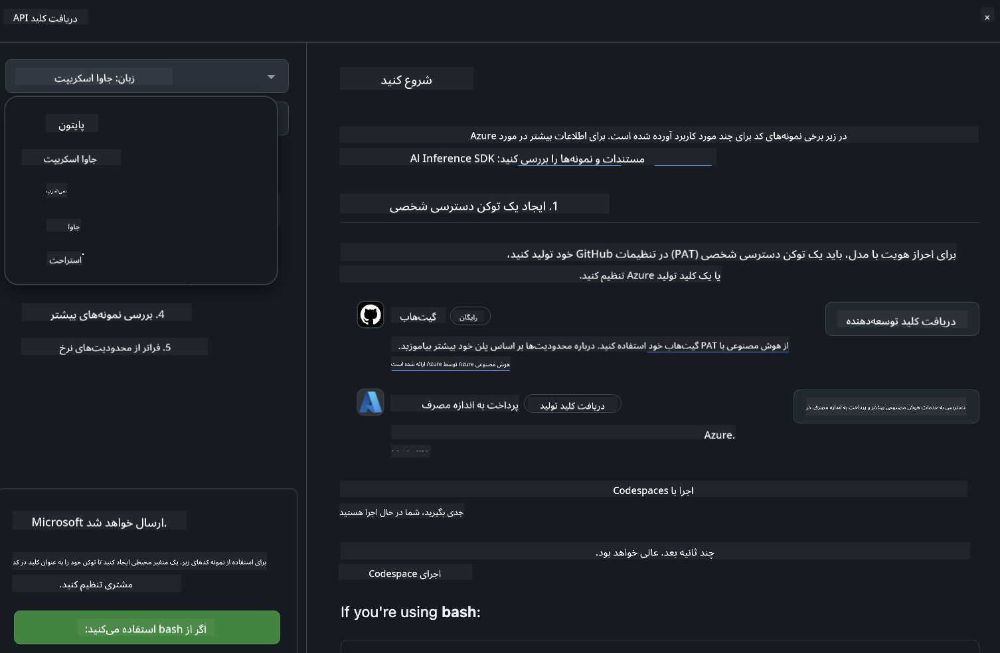
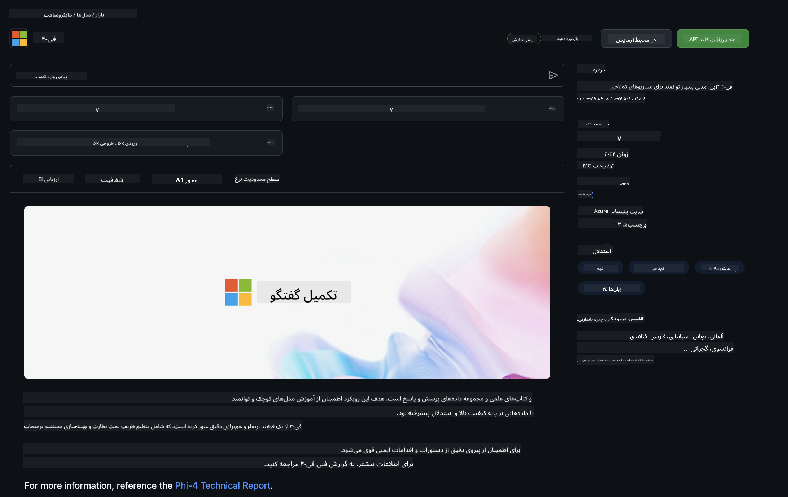

<!--
CO_OP_TRANSLATOR_METADATA:
{
  "original_hash": "fb67a08b9fc911a10ed58081fadef416",
  "translation_date": "2025-03-27T06:20:05+00:00",
  "source_file": "md\\01.Introduction\\02\\02.GitHubModel.md",
  "language_code": "fa"
}
-->
## خانواده Phi در مدل‌های GitHub

به [مدل‌های GitHub](https://github.com/marketplace/models) خوش آمدید! همه چیز آماده است تا مدل‌های هوش مصنوعی میزبانی‌شده در Azure AI را کشف کنید.



برای اطلاعات بیشتر درباره مدل‌های موجود در GitHub Models، به [بازار مدل‌های GitHub](https://github.com/marketplace/models) مراجعه کنید.

## مدل‌های موجود

هر مدل دارای محیط آزمایش اختصاصی و کد نمونه است.



### خانواده Phi در کاتالوگ مدل‌های GitHub

- [Phi-4](https://github.com/marketplace/models/azureml/Phi-4)

- [Phi-3.5-MoE instruct (128k)](https://github.com/marketplace/models/azureml/Phi-3-5-MoE-instruct)

- [Phi-3.5-vision instruct (128k)](https://github.com/marketplace/models/azureml/Phi-3-5-vision-instruct)

- [Phi-3.5-mini instruct (128k)](https://github.com/marketplace/models/azureml/Phi-3-5-mini-instruct)

- [Phi-3-Medium-128k-Instruct](https://github.com/marketplace/models/azureml/Phi-3-medium-128k-instruct)

- [Phi-3-medium-4k-instruct](https://github.com/marketplace/models/azureml/Phi-3-medium-4k-instruct)

- [Phi-3-mini-128k-instruct](https://github.com/marketplace/models/azureml/Phi-3-mini-128k-instruct)

- [Phi-3-mini-4k-instruct](https://github.com/marketplace/models/azureml/Phi-3-mini-4k-instruct)

- [Phi-3-small-128k-instruct](https://github.com/marketplace/models/azureml/Phi-3-small-128k-instruct)

- [Phi-3-small-8k-instruct](https://github.com/marketplace/models/azureml/Phi-3-small-8k-instruct)

## شروع به کار

چند مثال پایه آماده اجرا برای شما وجود دارد. می‌توانید آن‌ها را در پوشه نمونه‌ها پیدا کنید. اگر می‌خواهید مستقیماً به زبان مورد علاقه خود بروید، نمونه‌ها در زبان‌های زیر موجود هستند:

- Python  
- JavaScript  
- C#  
- Java  
- cURL  

همچنین یک محیط Codespaces اختصاصی برای اجرای نمونه‌ها و مدل‌ها وجود دارد.



## کد نمونه

در ادامه نمونه کدهایی برای چند مورد استفاده ارائه شده است. برای اطلاعات بیشتر درباره Azure AI Inference SDK، به مستندات کامل و نمونه‌ها مراجعه کنید.

## تنظیمات اولیه

1. ایجاد یک توکن دسترسی شخصی  
برای این توکن نیازی به اعطای هیچ مجوزی ندارید. توجه داشته باشید که توکن به یک سرویس Microsoft ارسال خواهد شد.

برای استفاده از کدهای زیر، یک متغیر محیطی ایجاد کنید تا توکن خود را به عنوان کلید برای کد کلاینت تنظیم کنید.

اگر از bash استفاده می‌کنید:  
```
export GITHUB_TOKEN="<your-github-token-goes-here>"
```  
اگر در powershell هستید:  
```
$Env:GITHUB_TOKEN="<your-github-token-goes-here>"
```  
اگر از Windows command prompt استفاده می‌کنید:  
```
set GITHUB_TOKEN=<your-github-token-goes-here>
```  

## نمونه Python

### نصب وابستگی‌ها  
Azure AI Inference SDK را با استفاده از pip نصب کنید (نیازمند: Python >=3.8):  
```
pip install azure-ai-inference
```  

### اجرای یک نمونه کد پایه  

این نمونه یک فراخوانی پایه به API تکمیل چت را نشان می‌دهد. این فراخوانی از نقطه انتهایی استنتاج مدل GitHub AI و توکن GitHub شما استفاده می‌کند. فراخوانی به صورت هم‌زمان انجام می‌شود.  
```python
import os
from azure.ai.inference import ChatCompletionsClient
from azure.ai.inference.models import SystemMessage, UserMessage
from azure.core.credentials import AzureKeyCredential

endpoint = "https://models.inference.ai.azure.com"
model_name = "Phi-4"
token = os.environ["GITHUB_TOKEN"]

client = ChatCompletionsClient(
    endpoint=endpoint,
    credential=AzureKeyCredential(token),
)

response = client.complete(
    messages=[
        UserMessage(content="I have $20,000 in my savings account, where I receive a 4% profit per year and payments twice a year. Can you please tell me how long it will take for me to become a millionaire? Also, can you please explain the math step by step as if you were explaining it to an uneducated person?"),
    ],
    temperature=0.4,
    top_p=1.0,
    max_tokens=2048,
    model=model_name
)

print(response.choices[0].message.content)
```  

### اجرای مکالمه چند مرحله‌ای  

این نمونه یک مکالمه چند مرحله‌ای با API تکمیل چت را نشان می‌دهد. هنگام استفاده از مدل برای یک برنامه چت، باید تاریخچه مکالمه را مدیریت کرده و پیام‌های جدید را به مدل ارسال کنید.  
```
import os
from azure.ai.inference import ChatCompletionsClient
from azure.ai.inference.models import AssistantMessage, SystemMessage, UserMessage
from azure.core.credentials import AzureKeyCredential

token = os.environ["GITHUB_TOKEN"]
endpoint = "https://models.inference.ai.azure.com"
# Replace Model_Name
model_name = "Phi-4"

client = ChatCompletionsClient(
    endpoint=endpoint,
    credential=AzureKeyCredential(token),
)

messages = [
    SystemMessage(content="You are a helpful assistant."),
    UserMessage(content="What is the capital of France?"),
    AssistantMessage(content="The capital of France is Paris."),
    UserMessage(content="What about Spain?"),
]

response = client.complete(messages=messages, model=model_name)

print(response.choices[0].message.content)
```  

### جریان خروجی  

برای تجربه بهتر کاربر، بهتر است پاسخ مدل را به صورت جریان دریافت کنید تا اولین توکن زودتر ظاهر شود و از انتظار طولانی برای پاسخ جلوگیری کنید.  
```
import os
from azure.ai.inference import ChatCompletionsClient
from azure.ai.inference.models import SystemMessage, UserMessage
from azure.core.credentials import AzureKeyCredential

token = os.environ["GITHUB_TOKEN"]
endpoint = "https://models.inference.ai.azure.com"
# Replace Model_Name
model_name = "Phi-4"

client = ChatCompletionsClient(
    endpoint=endpoint,
    credential=AzureKeyCredential(token),
)

response = client.complete(
    stream=True,
    messages=[
        SystemMessage(content="You are a helpful assistant."),
        UserMessage(content="Give me 5 good reasons why I should exercise every day."),
    ],
    model=model_name,
)

for update in response:
    if update.choices:
        print(update.choices[0].delta.content or "", end="")

client.close()
```  

## استفاده رایگان و محدودیت‌های نرخ برای مدل‌های GitHub  



[محدودیت‌های نرخ برای محیط آزمایش و استفاده رایگان از API](https://docs.github.com/en/github-models/prototyping-with-ai-models#rate-limits) به شما کمک می‌کند تا مدل‌ها را آزمایش کنید و برنامه هوش مصنوعی خود را نمونه‌سازی کنید. برای استفاده فراتر از این محدودیت‌ها و به منظور مقیاس‌بندی برنامه خود، باید منابعی از یک حساب Azure تهیه کنید و از آنجا احراز هویت کنید، به جای استفاده از توکن دسترسی شخصی GitHub. نیازی به تغییر چیز دیگری در کد خود ندارید. از این لینک استفاده کنید تا درباره فراتر رفتن از محدودیت‌های سطح رایگان در Azure AI اطلاعات کسب کنید.

### موارد افشا

به یاد داشته باشید هنگام تعامل با یک مدل، شما در حال آزمایش هوش مصنوعی هستید، بنابراین احتمال اشتباه در محتوا وجود دارد.

این ویژگی تحت محدودیت‌های مختلف (از جمله درخواست‌ها در هر دقیقه، درخواست‌ها در هر روز، توکن‌ها در هر درخواست و درخواست‌های هم‌زمان) قرار دارد و برای موارد استفاده تولیدی طراحی نشده است.

مدل‌های GitHub از Azure AI Content Safety استفاده می‌کنند. این فیلترها نمی‌توانند به عنوان بخشی از تجربه مدل‌های GitHub خاموش شوند. اگر تصمیم به استفاده از مدل‌ها از طریق یک سرویس پولی دارید، لطفاً فیلترهای محتوای خود را برای برآورده کردن نیازهای خود تنظیم کنید.

این سرویس تحت شرایط پیش‌انتشار GitHub قرار دارد.  

**سلب مسئولیت**:  
این سند با استفاده از سرویس ترجمه هوش مصنوعی [Co-op Translator](https://github.com/Azure/co-op-translator) ترجمه شده است. در حالی که ما برای دقت تلاش می‌کنیم، لطفاً توجه داشته باشید که ترجمه‌های خودکار ممکن است شامل خطاها یا نادرستی‌هایی باشد. سند اصلی به زبان اصلی آن باید به عنوان منبع معتبر در نظر گرفته شود. برای اطلاعات حیاتی، ترجمه حرفه‌ای انسانی توصیه می‌شود. ما مسئولیت هرگونه سوءتفاهم یا تفسیر نادرست ناشی از استفاده از این ترجمه را نمی‌پذیریم.