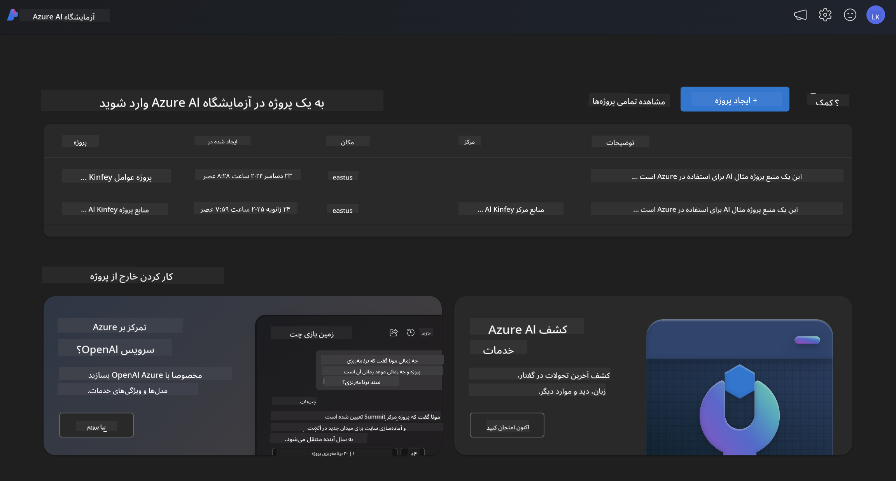
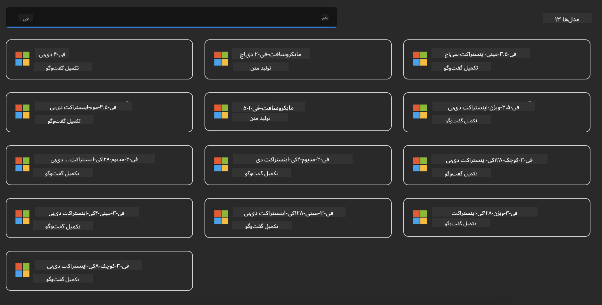
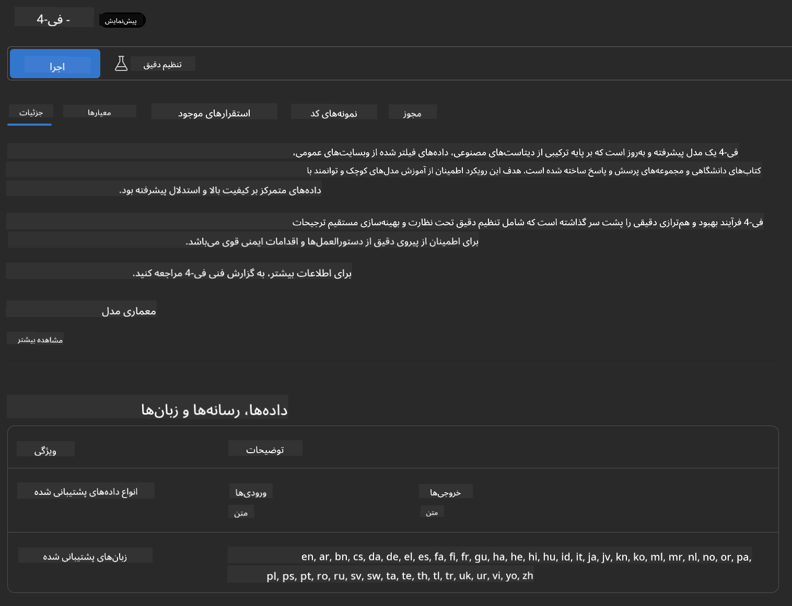
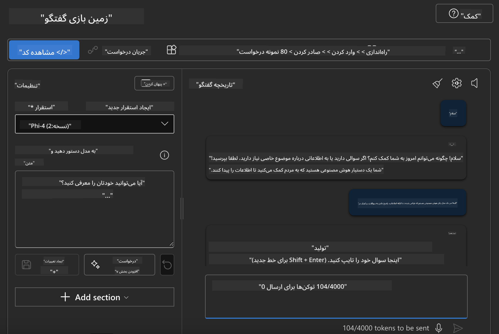

<!--
CO_OP_TRANSLATOR_METADATA:
{
  "original_hash": "e0855ebac4b4d8a402c75ddc0c7588c5",
  "translation_date": "2025-03-27T06:26:13+00:00",
  "source_file": "md\\01.Introduction\\02\\03.AzureAIFoundry.md",
  "language_code": "fa"
}
-->
## خانواده فی در Azure AI Foundry

[Azure AI Foundry](https://ai.azure.com) یک پلتفرم قابل اعتماد است که به توسعه‌دهندگان این امکان را می‌دهد تا با استفاده از هوش مصنوعی به شکلی امن، ایمن و مسئولانه نوآوری کرده و آینده را شکل دهند.

[Azure AI Foundry](https://ai.azure.com) برای توسعه‌دهندگان طراحی شده است تا:

- برنامه‌های هوش مصنوعی تولیدی را روی یک پلتفرم در سطح سازمانی بسازند.
- با استفاده از ابزارهای پیشرفته هوش مصنوعی و مدل‌های یادگیری ماشین، در چارچوب اصول هوش مصنوعی مسئولانه، کاوش، ساخت، آزمایش و استقرار انجام دهند.
- برای چرخه کامل توسعه برنامه با یک تیم همکاری کنند.

با استفاده از Azure AI Foundry، می‌توانید انواع مدل‌ها، خدمات و قابلیت‌ها را بررسی کرده و برنامه‌های هوش مصنوعی را که بهترین خدمت را به اهداف شما ارائه می‌دهند، بسازید. پلتفرم Azure AI Foundry مقیاس‌پذیری لازم را برای تبدیل نمونه‌های اولیه به برنامه‌های تولیدی کامل با سهولت فراهم می‌کند. نظارت و بهبود مستمر از موفقیت طولانی‌مدت پشتیبانی می‌کند.



علاوه بر استفاده از سرویس Azure AOAI در Azure AI Foundry، می‌توانید از مدل‌های شخص ثالث در Azure AI Foundry Model Catalog نیز استفاده کنید. این یک انتخاب مناسب است اگر می‌خواهید Azure AI Foundry را به‌عنوان پلتفرم راه‌حل هوش مصنوعی خود استفاده کنید.

ما می‌توانیم مدل‌های خانواده فی را به‌سرعت از طریق Model Catalog در Azure AI Foundry مستقر کنیم.



### **استقرار Phi-4 در Azure AI Foundry**



### **آزمایش Phi-4 در Azure AI Foundry Playground**



### **اجرای کد پایتون برای فراخوانی Azure AI Foundry Phi-4**

```python

import os  
import base64
from openai import AzureOpenAI  
from azure.identity import DefaultAzureCredential, get_bearer_token_provider  
        
endpoint = os.getenv("ENDPOINT_URL", "Your Azure AOAI Service Endpoint")  
deployment = os.getenv("DEPLOYMENT_NAME", "Phi-4")  
      
token_provider = get_bearer_token_provider(  
    DefaultAzureCredential(),  
    "https://cognitiveservices.azure.com/.default"  
)  
  
client = AzureOpenAI(  
    azure_endpoint=endpoint,  
    azure_ad_token_provider=token_provider,  
    api_version="2024-05-01-preview",  
)  
  

chat_prompt = [
    {
        "role": "system",
        "content": "You are an AI assistant that helps people find information."
    },
    {
        "role": "user",
        "content": "can you introduce yourself"
    }
] 
    
# Include speech result if speech is enabled  
messages = chat_prompt 

completion = client.chat.completions.create(  
    model=deployment,  
    messages=messages,
    max_tokens=800,  
    temperature=0.7,  
    top_p=0.95,  
    frequency_penalty=0,  
    presence_penalty=0,
    stop=None,  
    stream=False  
)  
  
print(completion.to_json())  

```

**سلب مسئولیت**:  
این سند با استفاده از سرویس ترجمه هوش مصنوعی [Co-op Translator](https://github.com/Azure/co-op-translator) ترجمه شده است. در حالی که ما تلاش می‌کنیم دقت را حفظ کنیم، لطفاً توجه داشته باشید که ترجمه‌های خودکار ممکن است شامل خطاها یا نادرستی‌ها باشند. سند اصلی به زبان اصلی آن باید به عنوان منبع معتبر در نظر گرفته شود. برای اطلاعات حیاتی، توصیه می‌شود از ترجمه انسانی حرفه‌ای استفاده شود. ما مسئولیتی در قبال سوءتفاهم‌ها یا تفسیرهای اشتباه ناشی از استفاده از این ترجمه نداریم.