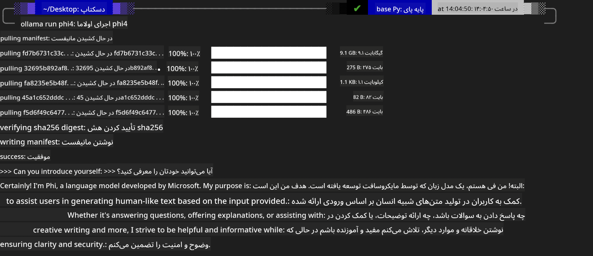
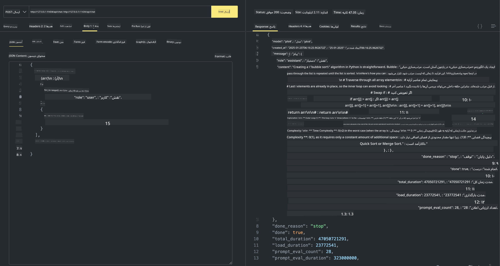

<!--
CO_OP_TRANSLATOR_METADATA:
{
  "original_hash": "0b38834693bb497f96bf53f0d941f9a1",
  "translation_date": "2025-03-27T06:32:23+00:00",
  "source_file": "md\\01.Introduction\\02\\04.Ollama.md",
  "language_code": "fa"
}
-->
## خانواده Phi در Ollama

[Ollama](https://ollama.com) به افراد بیشتری امکان می‌دهد که مدل‌های منبع باز LLM یا SLM را به‌صورت مستقیم از طریق اسکریپت‌های ساده اجرا کنند و همچنین API‌هایی بسازند تا به سناریوهای کاربردی Copilot محلی کمک کنند.

## **1. نصب**

Ollama از اجرا روی ویندوز، macOS و لینوکس پشتیبانی می‌کند. می‌توانید Ollama را از طریق این لینک نصب کنید ([https://ollama.com/download](https://ollama.com/download)). پس از نصب موفقیت‌آمیز، می‌توانید از اسکریپت Ollama برای فراخوانی Phi-3 از طریق یک پنجره ترمینال استفاده کنید. تمامی [کتابخانه‌های موجود در Ollama](https://ollama.com/library) را می‌توانید مشاهده کنید. اگر این مخزن را در یک Codespace باز کنید، Ollama از پیش نصب شده است.

```bash

ollama run phi4

```

> [!NOTE]
> مدل برای اولین بار هنگام اجرا دانلود خواهد شد. البته، می‌توانید مدل Phi-4 دانلود شده را مستقیماً مشخص کنید. ما اجرای دستور را با WSL به‌عنوان مثال در نظر می‌گیریم. پس از دانلود موفقیت‌آمیز مدل، می‌توانید به‌طور مستقیم در ترمینال تعامل داشته باشید.



## **2. فراخوانی API phi-4 از Ollama**

اگر می‌خواهید API تولید شده توسط Ollama برای Phi-4 را فراخوانی کنید، می‌توانید از این دستور در ترمینال برای راه‌اندازی سرور Ollama استفاده کنید.

```bash

ollama serve

```

> [!NOTE]
> اگر از macOS یا لینوکس استفاده می‌کنید، توجه داشته باشید که ممکن است با خطای زیر مواجه شوید **"Error: listen tcp 127.0.0.1:11434: bind: address already in use"**. ممکن است هنگام اجرای دستور این خطا را دریافت کنید. می‌توانید این خطا را نادیده بگیرید، زیرا معمولاً نشان می‌دهد که سرور از پیش در حال اجرا است، یا می‌توانید Ollama را متوقف کرده و دوباره راه‌اندازی کنید:

**macOS**

```bash

brew services restart ollama

```

**Linux**

```bash

sudo systemctl stop ollama

```

Ollama از دو API پشتیبانی می‌کند: generate و chat. می‌توانید بر اساس نیاز خود، API مدل ارائه شده توسط Ollama را با ارسال درخواست به سرویس محلی که روی پورت 11434 اجرا می‌شود، فراخوانی کنید.

**Chat**

```bash

curl http://127.0.0.1:11434/api/chat -d '{
  "model": "phi3",
  "messages": [
    {
      "role": "system",
      "content": "Your are a python developer."
    },
    {
      "role": "user",
      "content": "Help me generate a bubble algorithm"
    }
  ],
  "stream": false
  
}'

This is the result in Postman



## Additional Resources

Check the list of available models in Ollama in [their library](https://ollama.com/library).

Pull your model from the Ollama server using this command

```bash
ollama pull phi4
```

Run the model using this command

```bash
ollama run phi4
```

***Note:*** Visit this link [https://github.com/ollama/ollama/blob/main/docs/api.md](https://github.com/ollama/ollama/blob/main/docs/api.md) to learn more

## Calling Ollama from Python

You can use `requests` or `urllib3` to make requests to the local server endpoints used above. However, a popular way to use Ollama in Python is via the [openai](https://pypi.org/project/openai/) SDK, since Ollama provides OpenAI-compatible server endpoints as well.

Here is an example for phi3-mini:

```python
import openai

client = openai.OpenAI(
    base_url="http://localhost:11434/v1",
    api_key="nokeyneeded",
)

response = client.chat.completions.create(
    model="phi4",
    temperature=0.7,
    n=1,
    messages=[
        {"role": "system", "content": "You are a helpful assistant."},
        {"role": "user", "content": "Write a haiku about a hungry cat"},
    ],
)

print("Response:")
print(response.choices[0].message.content)
```

## Calling Ollama from JavaScript 

```javascript
// مثال خلاصه کردن یک فایل با Phi-4
script({
    model: "ollama:phi4",
    title: "Summarize with Phi-4",
    system: ["system"],
})

// مثال خلاصه کردن
const file = def("FILE", env.files)
$`Summarize ${file} in a single paragraph.`
```

## Calling Ollama from C#

Create a new C# Console application and add the following NuGet package:

```bash
dotnet add package Microsoft.SemanticKernel --version 1.34.0
```

Then replace this code in the `Program.cs` file

```csharp
using Microsoft.SemanticKernel;
using Microsoft.SemanticKernel.ChatCompletion;

// افزودن سرویس تکمیل چت با استفاده از نقطه پایانی سرور محلی Ollama
#pragma warning disable SKEXP0001, SKEXP0003, SKEXP0010, SKEXP0011, SKEXP0050, SKEXP0052
builder.AddOpenAIChatCompletion(
    modelId: "phi4",
    endpoint: new Uri("http://localhost:11434/"),
    apiKey: "non required");

// ارسال یک درخواست ساده به سرویس چت
string prompt = "Write a joke about kittens";
var response = await kernel.InvokePromptAsync(prompt);
Console.WriteLine(response.GetValue<string>());
```

Run the app with the command:

```bash
dotnet run
```

**سلب مسئولیت**:  
این سند با استفاده از سرویس ترجمه هوش مصنوعی [Co-op Translator](https://github.com/Azure/co-op-translator) ترجمه شده است. در حالی که ما تلاش می‌کنیم دقت ترجمه را حفظ کنیم، لطفاً توجه داشته باشید که ترجمه‌های خودکار ممکن است حاوی خطاها یا نادقتی‌هایی باشند. سند اصلی به زبان مادری آن باید به عنوان منبع معتبر در نظر گرفته شود. برای اطلاعات حساس، ترجمه حرفه‌ای انسانی توصیه می‌شود. ما هیچ مسئولیتی در قبال سوءتفاهم‌ها یا تفسیرهای نادرست ناشی از استفاده از این ترجمه نداریم.