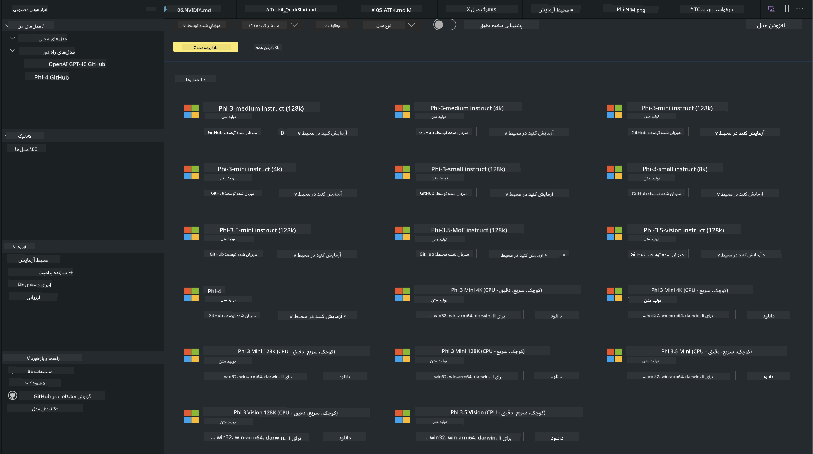
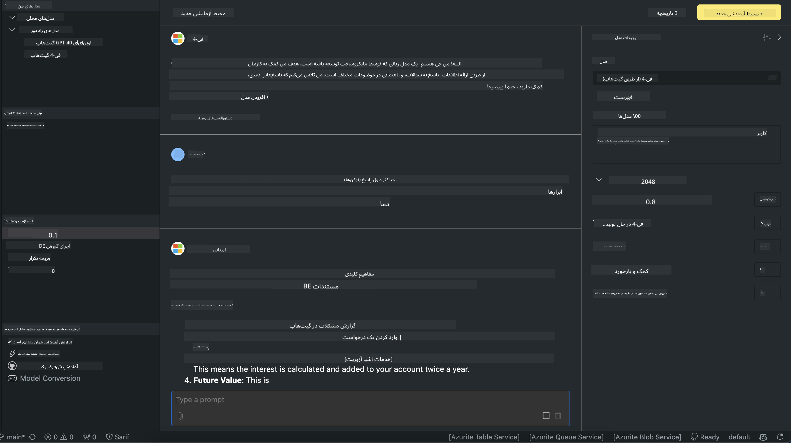

<!--
CO_OP_TRANSLATOR_METADATA:
{
  "original_hash": "4951d458c0b60c02cd1e751b40903877",
  "translation_date": "2025-03-27T06:43:39+00:00",
  "source_file": "md\\01.Introduction\\02\\05.AITK.md",
  "language_code": "fa"
}
-->
# خانواده Phi در AITK

[AI Toolkit برای VS Code](https://marketplace.visualstudio.com/items?itemName=ms-windows-ai-studio.windows-ai-studio) توسعه برنامه‌های هوش مصنوعی مولد را با گردآوری ابزارهای پیشرفته توسعه هوش مصنوعی و مدل‌های موجود در کاتالوگ Azure AI Foundry و دیگر کاتالوگ‌ها مانند Hugging Face ساده می‌کند. شما می‌توانید کاتالوگ مدل‌های هوش مصنوعی که توسط GitHub Models و Azure AI Foundry Model Catalogs پشتیبانی می‌شود را مرور کنید، آنها را به‌صورت محلی یا از راه دور دانلود کنید، تنظیم دقیق انجام دهید، آزمایش کنید و در برنامه خود استفاده کنید.

پیش‌نمایش AI Toolkit به‌صورت محلی اجرا خواهد شد. اجرای محلی یا تنظیم دقیق به مدل انتخابی شما بستگی دارد، ممکن است نیاز به GPU مانند NVIDIA CUDA GPU داشته باشید. همچنین می‌توانید مدل‌های GitHub را مستقیماً با AITK اجرا کنید.

## شروع کار

[درباره نصب زیرسیستم ویندوز برای لینوکس بیشتر بیاموزید](https://learn.microsoft.com/windows/wsl/install?WT.mc_id=aiml-137032-kinfeylo)

و [تغییر توزیع پیش‌فرض](https://learn.microsoft.com/windows/wsl/install#change-the-default-linux-distribution-installed).

[مخزن GitHub AI Toolkit](https://github.com/microsoft/vscode-ai-toolkit/)

- ویندوز، لینوکس، macOS
  
- برای تنظیم دقیق در ویندوز و لینوکس، به یک GPU Nvidia نیاز دارید. علاوه بر این، **ویندوز** نیاز به زیرسیستم لینوکس با توزیع Ubuntu نسخه 18.4 یا بالاتر دارد. [درباره نصب زیرسیستم ویندوز برای لینوکس بیشتر بیاموزید](https://learn.microsoft.com/windows/wsl/install) و [تغییر توزیع پیش‌فرض](https://learn.microsoft.com/windows/wsl/install#change-the-default-linux-distribution-installed).

### نصب AI Toolkit

AI Toolkit به‌صورت [افزونه Visual Studio Code](https://code.visualstudio.com/docs/setup/additional-components#_vs-code-extensions) ارائه می‌شود، بنابراین ابتدا باید [VS Code](https://code.visualstudio.com/docs/setup/windows?WT.mc_id=aiml-137032-kinfeylo) را نصب کنید و AI Toolkit را از [VS Marketplace](https://marketplace.visualstudio.com/items?itemName=ms-windows-ai-studio.windows-ai-studio) دانلود کنید.
[AI Toolkit در Visual Studio Marketplace موجود است](https://marketplace.visualstudio.com/items?itemName=ms-windows-ai-studio.windows-ai-studio) و مانند هر افزونه دیگر VS Code قابل نصب است.

اگر با نصب افزونه‌های VS Code آشنا نیستید، مراحل زیر را دنبال کنید:

### ورود به سیستم

1. در نوار فعالیت در VS Code گزینه **Extensions** را انتخاب کنید.
1. در نوار جستجوی افزونه‌ها عبارت "AI Toolkit" را تایپ کنید.
1. گزینه "AI Toolkit for Visual Studio code" را انتخاب کنید.
1. روی **Install** کلیک کنید.

اکنون آماده استفاده از افزونه هستید!

از شما خواسته می‌شود وارد GitHub شوید، لطفاً روی "Allow" کلیک کنید تا ادامه دهید. شما به صفحه ورود GitHub هدایت خواهید شد.

لطفاً وارد شوید و مراحل فرآیند را دنبال کنید. پس از اتمام موفقیت‌آمیز، به VS Code هدایت خواهید شد.

پس از نصب افزونه، آیکون AI Toolkit در نوار فعالیت ظاهر می‌شود.

بیایید اقدامات موجود را بررسی کنیم!

### اقدامات موجود

نوار کناری اصلی AI Toolkit شامل  

- **مدل‌ها**
- **منابع**
- **زمین بازی**  
- **تنظیم دقیق**
- **ارزیابی**

در بخش منابع موجود است. برای شروع، **Model Catalog** را انتخاب کنید.

### دانلود یک مدل از کاتالوگ

پس از راه‌اندازی AI Toolkit از نوار کناری VS Code، می‌توانید از گزینه‌های زیر انتخاب کنید:



- یافتن یک مدل پشتیبانی‌شده از **Model Catalog** و دانلود به‌صورت محلی
- آزمایش استنتاج مدل در **Model Playground**
- تنظیم دقیق مدل به‌صورت محلی یا از راه دور در **Model Fine-tuning**
- استقرار مدل‌های تنظیم‌شده در ابر از طریق Command Palette برای AI Toolkit
- ارزیابی مدل‌ها

> [!NOTE]
>
> **GPU در مقابل CPU**
>
> خواهید دید که کارت‌های مدل اندازه مدل، پلتفرم و نوع شتاب‌دهنده (CPU، GPU) را نشان می‌دهند. برای عملکرد بهینه در **دستگاه‌های ویندوز که حداقل یک GPU دارند**، نسخه‌های مدل را انتخاب کنید که فقط ویندوز را هدف قرار می‌دهند.
>
> این کار تضمین می‌کند که شما مدلی بهینه برای شتاب‌دهنده DirectML دارید.
>
> نام مدل‌ها به شکل
>
> - `{model_name}-{accelerator}-{quantization}-{format}`.
>
>برای بررسی اینکه آیا دستگاه ویندوز شما دارای GPU است، **Task Manager** را باز کنید و سپس تب **Performance** را انتخاب کنید. اگر GPU دارید، آنها تحت نام‌هایی مانند "GPU 0" یا "GPU 1" فهرست شده‌اند.

### اجرای مدل در زمین بازی

پس از تنظیم تمام پارامترها، روی **Generate Project** کلیک کنید.

وقتی مدل شما دانلود شد، گزینه **Load in Playground** را در کارت مدل در کاتالوگ انتخاب کنید:

- دانلود مدل را آغاز کنید
- تمام پیش‌نیازها و وابستگی‌ها را نصب کنید
- فضای کاری VS Code ایجاد کنید



### استفاده از REST API در برنامه خود 

AI Toolkit با یک سرور وب REST API محلی **در پورت 5272** ارائه می‌شود که از [فرمت تکمیل چت OpenAI](https://platform.openai.com/docs/api-reference/chat/create) استفاده می‌کند. 

این امکان را فراهم می‌کند که برنامه خود را به‌صورت محلی آزمایش کنید بدون اینکه به سرویس مدل هوش مصنوعی ابری وابسته باشید. برای مثال، فایل JSON زیر نشان می‌دهد که چگونه می‌توانید بدنه درخواست را پیکربندی کنید:

```json
{
    "model": "Phi-4",
    "messages": [
        {
            "role": "user",
            "content": "what is the golden ratio?"
        }
    ],
    "temperature": 0.7,
    "top_p": 1,
    "top_k": 10,
    "max_tokens": 100,
    "stream": true
}
```

شما می‌توانید REST API را با استفاده از ابزارهایی مانند [Postman](https://www.postman.com/) یا ابزار CURL (Client URL) آزمایش کنید:

```bash
curl -vX POST http://127.0.0.1:5272/v1/chat/completions -H 'Content-Type: application/json' -d @body.json
```

### استفاده از کتابخانه کلاینت OpenAI برای پایتون

```python
from openai import OpenAI

client = OpenAI(
    base_url="http://127.0.0.1:5272/v1/", 
    api_key="x" # required for the API but not used
)

chat_completion = client.chat.completions.create(
    messages=[
        {
            "role": "user",
            "content": "what is the golden ratio?",
        }
    ],
    model="Phi-4",
)

print(chat_completion.choices[0].message.content)
```

### استفاده از کتابخانه کلاینت Azure OpenAI برای .NET

با استفاده از NuGet، [کتابخانه کلاینت Azure OpenAI برای .NET](https://www.nuget.org/packages/Azure.AI.OpenAI/) را به پروژه خود اضافه کنید:

```bash
dotnet add {project_name} package Azure.AI.OpenAI --version 1.0.0-beta.17
```

یک فایل C# به نام **OverridePolicy.cs** به پروژه خود اضافه کنید و کد زیر را در آن قرار دهید:

```csharp
// OverridePolicy.cs
using Azure.Core.Pipeline;
using Azure.Core;

internal partial class OverrideRequestUriPolicy(Uri overrideUri)
    : HttpPipelineSynchronousPolicy
{
    private readonly Uri _overrideUri = overrideUri;

    public override void OnSendingRequest(HttpMessage message)
    {
        message.Request.Uri.Reset(_overrideUri);
    }
}
```

سپس کد زیر را در فایل **Program.cs** خود قرار دهید:

```csharp
// Program.cs
using Azure.AI.OpenAI;

Uri localhostUri = new("http://localhost:5272/v1/chat/completions");

OpenAIClientOptions clientOptions = new();
clientOptions.AddPolicy(
    new OverrideRequestUriPolicy(localhostUri),
    Azure.Core.HttpPipelinePosition.BeforeTransport);
OpenAIClient client = new(openAIApiKey: "unused", clientOptions);

ChatCompletionsOptions options = new()
{
    DeploymentName = "Phi-4",
    Messages =
    {
        new ChatRequestSystemMessage("You are a helpful assistant. Be brief and succinct."),
        new ChatRequestUserMessage("What is the golden ratio?"),
    }
};

StreamingResponse<StreamingChatCompletionsUpdate> streamingChatResponse
    = await client.GetChatCompletionsStreamingAsync(options);

await foreach (StreamingChatCompletionsUpdate chatChunk in streamingChatResponse)
{
    Console.Write(chatChunk.ContentUpdate);
}
```


## تنظیم دقیق با AI Toolkit

- با کشف مدل‌ها و زمین بازی شروع کنید.
- تنظیم دقیق مدل و استنتاج با استفاده از منابع محاسباتی محلی.
- تنظیم دقیق و استنتاج از راه دور با استفاده از منابع Azure

[تنظیم دقیق با AI Toolkit](../../03.FineTuning/Finetuning_VSCodeaitoolkit.md)

## منابع پرسش و پاسخ AI Toolkit

لطفاً به [صفحه پرسش و پاسخ ما](https://github.com/microsoft/vscode-ai-toolkit/blob/main/archive/QA.md) مراجعه کنید برای رایج‌ترین مسائل و راه‌حل‌ها.

**سلب مسئولیت**:  
این سند با استفاده از سرویس ترجمه هوش مصنوعی [Co-op Translator](https://github.com/Azure/co-op-translator) ترجمه شده است. در حالی که ما تلاش می‌کنیم دقت را رعایت کنیم، لطفاً توجه داشته باشید که ترجمه‌های خودکار ممکن است شامل خطاها یا نادرستی‌ها باشند. سند اصلی به زبان اصلی آن باید به عنوان منبع معتبر در نظر گرفته شود. برای اطلاعات حیاتی، ترجمه حرفه‌ای انسانی توصیه می‌شود. ما مسئولیتی در قبال سوءتفاهم‌ها یا برداشت‌های نادرست ناشی از استفاده از این ترجمه نداریم.