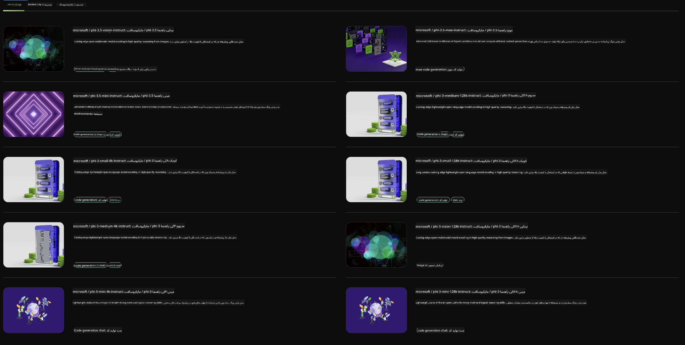

<!--
CO_OP_TRANSLATOR_METADATA:
{
  "original_hash": "7b08e277df2a9307f861ae54bc30c772",
  "translation_date": "2025-03-27T06:50:48+00:00",
  "source_file": "md\\01.Introduction\\02\\06.NVIDIA.md",
  "language_code": "fa"
}
-->
## خانواده فی در NVIDIA NIM

NVIDIA NIM مجموعه‌ای از میکروسرویس‌های ساده و کارآمد است که برای تسریع استقرار مدل‌های هوش مصنوعی مولد در فضای ابری، دیتاسنترها و ورک‌استیشن‌ها طراحی شده است. NIM‌ها بر اساس خانواده مدل و به صورت مدل به مدل دسته‌بندی می‌شوند. به عنوان مثال، NVIDIA NIM برای مدل‌های زبانی بزرگ (LLMs) قدرت مدل‌های پیشرفته زبانی را به برنامه‌های سازمانی می‌آورد و قابلیت‌های بی‌نظیری در پردازش و درک زبان طبیعی ارائه می‌دهد.

NIM به تیم‌های IT و DevOps این امکان را می‌دهد که مدل‌های زبانی بزرگ (LLMs) را در محیط‌های مدیریت‌شده خود میزبانی کنند، در حالی که همچنان به توسعه‌دهندگان API‌های استاندارد صنعتی ارائه می‌دهد تا بتوانند دستیارهای هوشمند، چت‌بات‌ها و ابزارهای AI قدرتمند بسازند که می‌توانند کسب‌وکارشان را متحول کنند. با بهره‌گیری از شتاب‌دهی پیشرفته GPU شرکت NVIDIA و استقرار مقیاس‌پذیر، NIM سریع‌ترین مسیر برای استنتاج با عملکردی بی‌نظیر را فراهم می‌کند.

شما می‌توانید از NVIDIA NIM برای استنتاج مدل‌های خانواده فی استفاده کنید.



### **نمونه‌ها - Phi-3-Vision در NVIDIA NIM**

تصور کنید تصویری (`demo.png`) دارید و می‌خواهید کدی به زبان پایتون تولید کنید که این تصویر را پردازش کرده و نسخه جدیدی از آن را ذخیره کند (`phi-3-vision.jpg`).

کد بالا این فرآیند را به صورت زیر خودکار می‌کند:

1. تنظیم محیط و پیکربندی‌های لازم.
2. ایجاد یک پرامپت که به مدل دستور می‌دهد کد پایتون موردنیاز را تولید کند.
3. ارسال پرامپت به مدل و دریافت کد تولیدشده.
4. استخراج و اجرای کد تولیدشده.
5. نمایش تصویر اصلی و تصویر پردازش‌شده.

این روش با بهره‌گیری از قدرت هوش مصنوعی، وظایف پردازش تصویر را خودکار می‌کند و دستیابی به اهداف شما را آسان‌تر و سریع‌تر می‌سازد.

[نمونه کد راه‌حل](../../../../../code/06.E2E/E2E_Nvidia_NIM_Phi3_Vision.ipynb)

بیایید ببینیم کل کد مرحله به مرحله چه کاری انجام می‌دهد:

1. **نصب بسته موردنیاز**:
   ```python
    !pip install langchain_nvidia_ai_endpoints -U
    ```
   این دستور بسته `langchain_nvidia_ai_endpoints` را نصب می‌کند و اطمینان حاصل می‌کند که آخرین نسخه باشد.

2. **وارد کردن ماژول‌های ضروری**:
   ```python
    from langchain_nvidia_ai_endpoints import ChatNVIDIA
    import getpass
    import os
    import base64
    ```
   این واردات، ماژول‌های ضروری برای تعامل با نقاط پایانی NVIDIA AI، مدیریت ایمن رمزها، تعامل با سیستم عامل، و رمزگذاری/رمزگشایی داده‌ها به فرمت base64 را فراهم می‌کند.

3. **تنظیم کلید API**:
   ```python
    if not os.getenv("NVIDIA_API_KEY"):
        os.environ["NVIDIA_API_KEY"] = getpass.getpass("Enter your NVIDIA API key: ")
    ```
   این کد بررسی می‌کند که آیا متغیر محیطی `NVIDIA_API_KEY` تنظیم شده است یا نه. اگر نه، از کاربر می‌خواهد که کلید API خود را به صورت ایمن وارد کند.

4. **تعریف مدل و مسیر تصویر**:
   ```python
    model = 'microsoft/phi-3-vision-128k-instruct'
    chat = ChatNVIDIA(model=model)
    img_path = './imgs/demo.png'
    ```
   این بخش مدل مورد استفاده را تنظیم می‌کند، یک نمونه از `ChatNVIDIA` با مدل مشخص ایجاد می‌کند و مسیر فایل تصویر را تعریف می‌کند.

5. **ایجاد پرامپت متنی**:
   ```python
    text = "Please create Python code for image, and use plt to save the new picture under imgs/ and name it phi-3-vision.jpg."
    ```
   این بخش یک پرامپت متنی تعریف می‌کند که به مدل دستور می‌دهد کد پایتون برای پردازش یک تصویر تولید کند.

6. **رمزگذاری تصویر به فرمت Base64**:
   ```python
    with open(img_path, "rb") as f:
        image_b64 = base64.b64encode(f.read()).decode()
    image = f''
    ```
   این کد فایل تصویر را می‌خواند، آن را به فرمت base64 رمزگذاری می‌کند و یک تگ HTML تصویر با داده‌های رمزگذاری‌شده ایجاد می‌کند.

7. **ترکیب متن و تصویر در یک پرامپت**:
   ```python
    prompt = f"{text} {image}"
    ```
   این بخش متن پرامپت و تگ HTML تصویر را در یک رشته واحد ترکیب می‌کند.

8. **تولید کد با استفاده از ChatNVIDIA**:
   ```python
    code = ""
    for chunk in chat.stream(prompt):
        print(chunk.content, end="")
        code += chunk.content
    ```
   این کد پرامپت را به `ChatNVIDIA` model and collects the generated code in chunks, printing and appending each chunk to the `code` ارسال می‌کند.

9. **استخراج کد پایتون از محتوای تولیدشده**:
   ```python
    begin = code.index('```python') + 9
   code = code[begin:]
   end = code.index('```')
    code = code[:end]
    ```
   این بخش کد پایتون واقعی را از محتوای تولیدشده استخراج می‌کند و فرمت مارک‌داون را حذف می‌کند.

10. **اجرای کد تولیدشده**:
    ```python
    import subprocess
    result = subprocess.run(["python", "-c", code], capture_output=True)
    ```
    این کد پایتون استخراج‌شده را به‌عنوان یک زیرفرآیند اجرا می‌کند و خروجی آن را ثبت می‌کند.

11. **نمایش تصاویر**:
    ```python
    from IPython.display import Image, display
    display(Image(filename='./imgs/phi-3-vision.jpg'))
    display(Image(filename='./imgs/demo.png'))
    ```
    این خطوط تصاویر را با استفاده از ماژول `IPython.display` نمایش می‌دهند.

**سلب مسئولیت**:  
این سند با استفاده از سرویس ترجمه هوش مصنوعی [Co-op Translator](https://github.com/Azure/co-op-translator) ترجمه شده است. در حالی که ما تلاش می‌کنیم دقت را رعایت کنیم، لطفاً توجه داشته باشید که ترجمه‌های خودکار ممکن است شامل خطاها یا نادرستی‌هایی باشد. سند اصلی به زبان مادری باید به عنوان منبع معتبر در نظر گرفته شود. برای اطلاعات حساس، ترجمه حرفه‌ای انسانی توصیه می‌شود. ما هیچ مسئولیتی در قبال سوءتفاهم‌ها یا تفسیرهای نادرست ناشی از استفاده از این ترجمه نداریم.