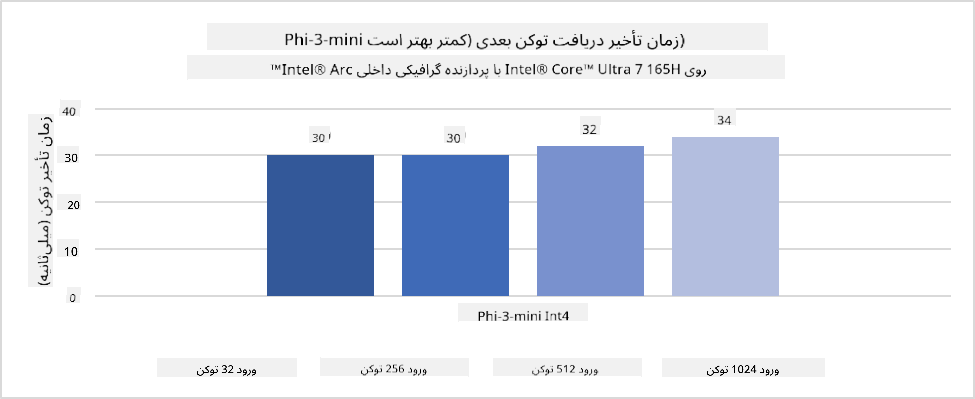
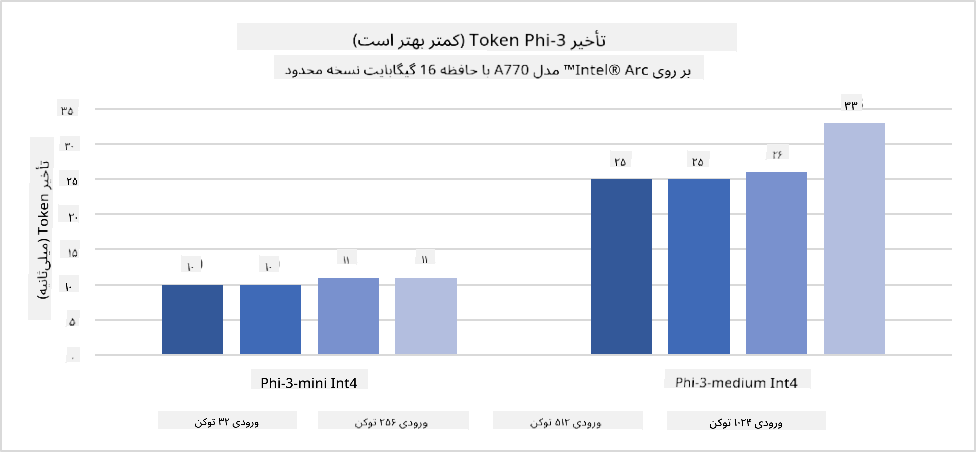
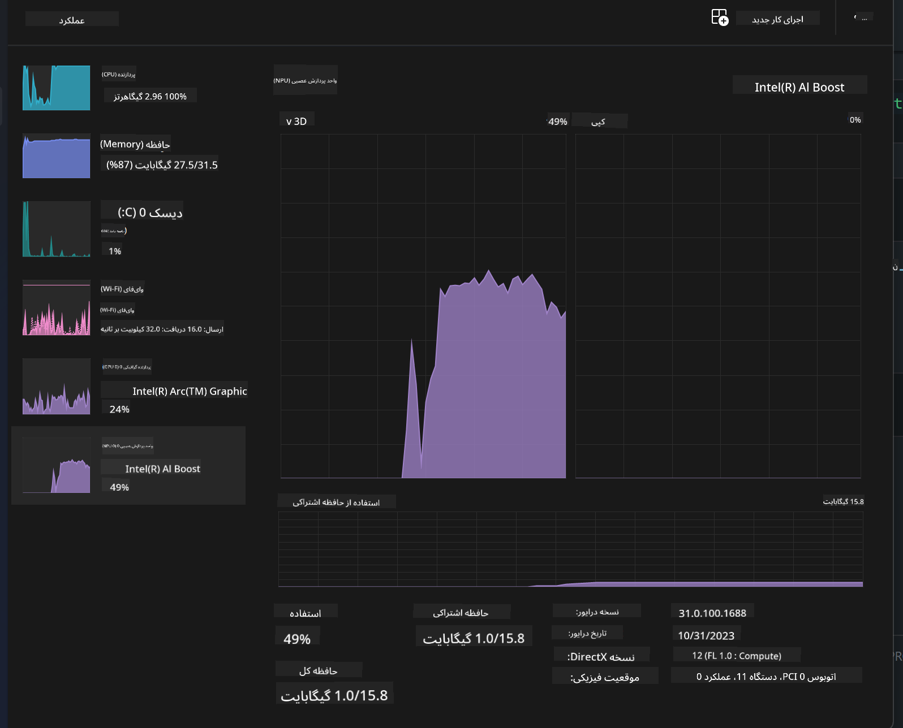
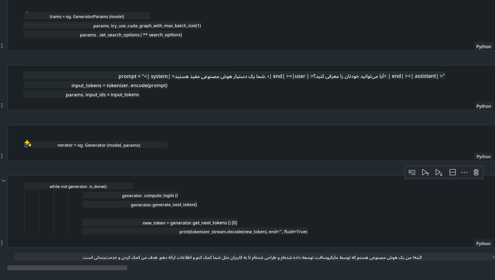
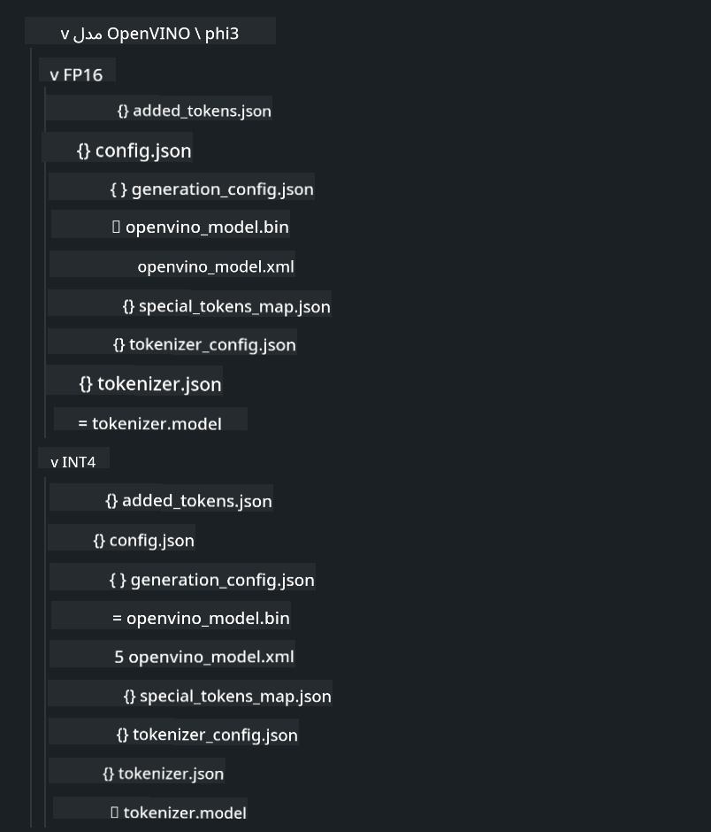
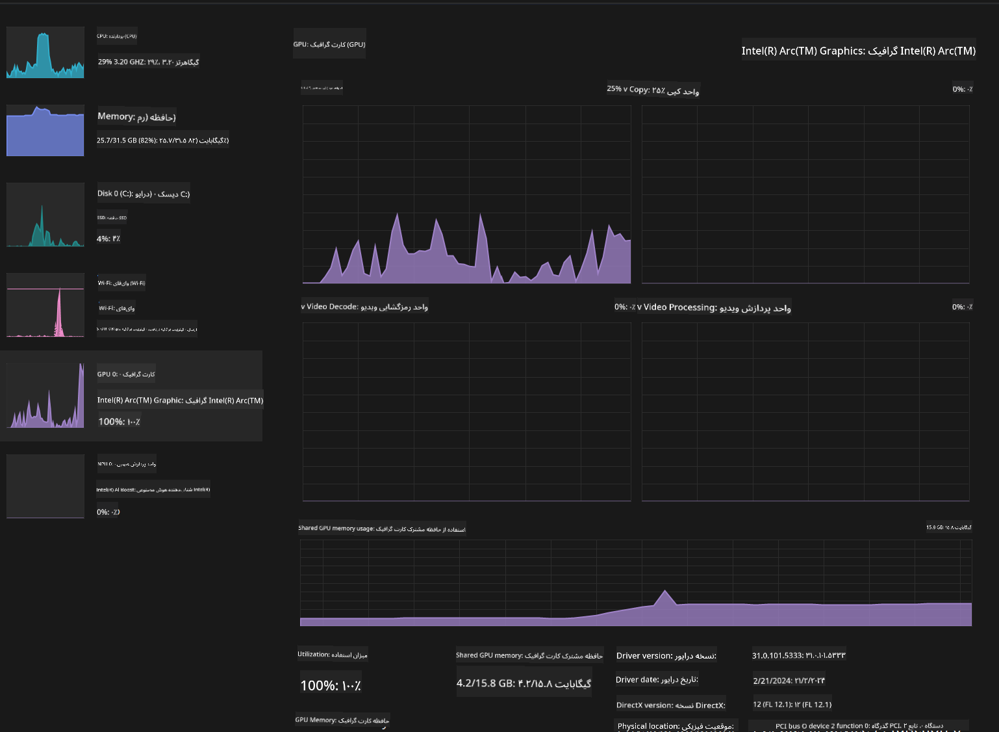

<!--
CO_OP_TRANSLATOR_METADATA:
{
  "original_hash": "e08ce816e23ad813244a09ca34ebb8ac",
  "translation_date": "2025-03-27T07:02:04+00:00",
  "source_file": "md\\01.Introduction\\03\\AIPC_Inference.md",
  "language_code": "fa"
}
-->
# **استنتاج Phi-3 در کامپیوترهای هوش مصنوعی**

با پیشرفت هوش مصنوعی مولد و بهبود قابلیت‌های سخت‌افزاری دستگاه‌های لبه، تعداد بیشتری از مدل‌های هوش مصنوعی مولد اکنون می‌توانند در دستگاه‌های شخصی کاربران (BYOD) ادغام شوند. کامپیوترهای هوش مصنوعی یکی از این مدل‌ها هستند. از سال 2024، اینتل، AMD، و Qualcomm با تولیدکنندگان کامپیوتر همکاری کرده‌اند تا کامپیوترهای هوش مصنوعی را معرفی کنند که امکان اجرای مدل‌های هوش مصنوعی مولد محلی را از طریق تغییرات سخت‌افزاری فراهم می‌کنند. در این بحث، ما بر کامپیوترهای هوش مصنوعی اینتل تمرکز می‌کنیم و بررسی می‌کنیم که چگونه می‌توان Phi-3 را روی کامپیوتر هوش مصنوعی اینتل اجرا کرد.

### NPU چیست؟

NPU (واحد پردازش عصبی) یک پردازنده اختصاصی یا واحد پردازشی در یک SoC بزرگ‌تر است که به طور خاص برای تسریع عملیات شبکه‌های عصبی و وظایف هوش مصنوعی طراحی شده است. برخلاف پردازنده‌های مرکزی (CPU) و پردازنده‌های گرافیکی (GPU) عمومی، NPU‌ها برای محاسبات موازی داده‌محور بهینه‌سازی شده‌اند و در پردازش حجم عظیمی از داده‌های چندرسانه‌ای مانند ویدیوها و تصاویر و همچنین داده‌های شبکه‌های عصبی بسیار کارآمد هستند. آنها به ویژه در انجام وظایف مرتبط با هوش مصنوعی، مانند تشخیص گفتار، محو کردن پس‌زمینه در تماس‌های ویدیویی، و فرآیندهای ویرایش عکس یا ویدیو مانند تشخیص اشیاء، مهارت دارند.

## NPU در مقابل GPU

در حالی که بسیاری از وظایف هوش مصنوعی و یادگیری ماشین روی GPU‌ها اجرا می‌شوند، تفاوت مهمی بین GPU‌ها و NPU‌ها وجود دارد.  
GPU‌ها به خاطر قابلیت‌های محاسبات موازی‌شان شناخته شده‌اند، اما همه GPU‌ها در پردازش وظایف غیر گرافیکی به یک اندازه کارآمد نیستند. از سوی دیگر، NPU‌ها به طور خاص برای محاسبات پیچیده‌ای که در عملیات شبکه‌های عصبی دخیل هستند طراحی شده‌اند، و آنها را برای وظایف هوش مصنوعی بسیار مؤثر می‌سازد.  

به طور خلاصه، NPU‌ها ریاضی‌دانان خبره‌ای هستند که محاسبات هوش مصنوعی را به شدت تسریع می‌کنند و نقش کلیدی در عصر جدید کامپیوترهای هوش مصنوعی دارند!

***این مثال بر اساس آخرین پردازنده Intel Core Ultra اینتل است.***

## **1. استفاده از NPU برای اجرای مدل Phi-3**

دستگاه Intel® NPU یک شتاب‌دهنده استنتاج هوش مصنوعی است که با پردازنده‌های مرکزی مشتری اینتل ادغام شده است و از نسل پردازنده‌های Intel® Core™ Ultra (که قبلاً به عنوان Meteor Lake شناخته می‌شدند) آغاز می‌شود. این دستگاه امکان اجرای کارآمد وظایف شبکه‌های عصبی مصنوعی را فراهم می‌کند.





**کتابخانه شتاب‌دهنده NPU اینتل**

کتابخانه شتاب‌دهنده NPU اینتل [https://github.com/intel/intel-npu-acceleration-library](https://github.com/intel/intel-npu-acceleration-library) یک کتابخانه پایتون است که برای افزایش کارایی برنامه‌های شما طراحی شده است. این کتابخانه از قدرت واحد پردازش عصبی (NPU) اینتل برای انجام محاسبات پرسرعت روی سخت‌افزارهای سازگار استفاده می‌کند.

مثالی از Phi-3-mini روی کامپیوتر هوش مصنوعی مجهز به پردازنده‌های Intel® Core™ Ultra.


نصب کتابخانه پایتون با pip

```bash

   pip install intel-npu-acceleration-library

```

***توجه*** این پروژه هنوز در حال توسعه است، اما مدل مرجع از هم‌اکنون بسیار کامل است.

### **اجرای Phi-3 با کتابخانه شتاب‌دهنده NPU اینتل**

با استفاده از شتاب‌دهنده NPU اینتل، این کتابخانه فرآیند کدگذاری سنتی را تحت تأثیر قرار نمی‌دهد. تنها کافی است از این کتابخانه برای کمینه‌سازی مدل اصلی Phi-3 استفاده کنید، مانند FP16، INT8، INT4، مانند 

```python
from transformers import AutoTokenizer, pipeline,TextStreamer
from intel_npu_acceleration_library import NPUModelForCausalLM, int4
from intel_npu_acceleration_library.compiler import CompilerConfig
import warnings

model_id = "microsoft/Phi-3-mini-4k-instruct"

compiler_conf = CompilerConfig(dtype=int4)
model = NPUModelForCausalLM.from_pretrained(
    model_id, use_cache=True, config=compiler_conf, attn_implementation="sdpa"
).eval()

tokenizer = AutoTokenizer.from_pretrained(model_id)

text_streamer = TextStreamer(tokenizer, skip_prompt=True)
```

پس از موفقیت‌آمیز بودن کمینه‌سازی، اجرای کد را ادامه دهید تا NPU برای اجرای مدل Phi-3 فراخوانی شود.

```python
generation_args = {
   "max_new_tokens": 1024,
   "return_full_text": False,
   "temperature": 0.3,
   "do_sample": False,
   "streamer": text_streamer,
}

pipe = pipeline(
   "text-generation",
   model=model,
   tokenizer=tokenizer,
)

query = "<|system|>You are a helpful AI assistant.<|end|><|user|>Can you introduce yourself?<|end|><|assistant|>"

with warnings.catch_warnings():
    warnings.simplefilter("ignore")
    pipe(query, **generation_args)
```

هنگام اجرای کد، می‌توانیم وضعیت اجرای NPU را از طریق Task Manager مشاهده کنیم.



***نمونه‌ها*** : [AIPC_NPU_DEMO.ipynb](../../../../../code/03.Inference/AIPC/AIPC_NPU_DEMO.ipynb)

## **2. استفاده از DirectML + ONNX Runtime برای اجرای مدل Phi-3**

### **DirectML چیست**

[DirectML](https://github.com/microsoft/DirectML) یک کتابخانه DirectX 12 با عملکرد بالا و شتاب‌دهی سخت‌افزاری برای یادگیری ماشین است. DirectML شتاب‌دهی GPU برای وظایف یادگیری ماشین رایج را در طیف گسترده‌ای از سخت‌افزارها و درایورهای پشتیبانی‌شده، از جمله تمام GPU‌های سازگار با DirectX 12 از فروشندگانی مانند AMD، Intel، NVIDIA، و Qualcomm ارائه می‌دهد.

هنگامی که به صورت مستقل استفاده شود، API DirectML یک کتابخانه سطح پایین DirectX 12 است و برای برنامه‌های با عملکرد بالا و تأخیر کم مانند چارچوب‌ها، بازی‌ها، و دیگر برنامه‌های زمان واقعی مناسب است. سازگاری یکپارچه DirectML با Direct3D 12 و همچنین سربار کم و انطباق آن در سخت‌افزار، DirectML را برای شتاب‌دهی یادگیری ماشین در مواردی که هم عملکرد بالا مورد نظر است و هم قابلیت اطمینان و پیش‌بینی‌پذیری نتایج در سخت‌افزار حیاتی است، ایده‌آل می‌کند.

***توجه*** : آخرین نسخه DirectML از NPU نیز پشتیبانی می‌کند(https://devblogs.microsoft.com/directx/introducing-neural-processor-unit-npu-support-in-directml-developer-preview/)

### DirectML و CUDA از نظر قابلیت‌ها و عملکرد:

**DirectML** کتابخانه‌ای برای یادگیری ماشین است که توسط مایکروسافت توسعه داده شده است. این کتابخانه برای تسریع وظایف یادگیری ماشین در دستگاه‌های ویندوزی، از جمله دسکتاپ‌ها، لپ‌تاپ‌ها، و دستگاه‌های لبه طراحی شده است.
- مبتنی بر DX12: DirectML بر پایه DirectX 12 (DX12) ساخته شده است که پشتیبانی گسترده‌ای از سخت‌افزارهای GPU ارائه می‌دهد، از جمله NVIDIA و AMD.
- پشتیبانی گسترده‌تر: از آنجا که از DX12 استفاده می‌کند، DirectML می‌تواند با هر GPU‌ای که DX12 را پشتیبانی می‌کند، حتی GPU‌های مجتمع کار کند.
- پردازش تصویر: DirectML تصاویر و داده‌های دیگر را با استفاده از شبکه‌های عصبی پردازش می‌کند، که آن را برای وظایفی مانند تشخیص تصویر، شناسایی اشیاء، و موارد دیگر مناسب می‌سازد.
- سهولت در راه‌اندازی: راه‌اندازی DirectML ساده است و نیاز به SDK‌ها یا کتابخانه‌های خاص از سازندگان GPU ندارد.
- عملکرد: در برخی موارد، DirectML عملکرد خوبی دارد و می‌تواند سریع‌تر از CUDA باشد، به خصوص برای برخی وظایف.
- محدودیت‌ها: با این حال، در مواردی ممکن است DirectML کندتر باشد، به ویژه برای اندازه‌های دسته‌بندی بزرگ float16.

**CUDA** پلتفرم محاسبات موازی و مدل برنامه‌نویسی NVIDIA است. این پلتفرم به توسعه‌دهندگان اجازه می‌دهد تا قدرت GPU‌های NVIDIA را برای محاسبات عمومی، از جمله یادگیری ماشین و شبیه‌سازی‌های علمی، به کار گیرند.
- اختصاصی NVIDIA: CUDA به طور خاص با GPU‌های NVIDIA یکپارچه شده و برای آنها طراحی شده است.
- بهینه‌سازی بالا: عملکرد عالی برای وظایف شتاب‌دهی GPU ارائه می‌دهد، به ویژه هنگامی که از GPU‌های NVIDIA استفاده می‌شود.
- استفاده گسترده: بسیاری از چارچوب‌ها و کتابخانه‌های یادگیری ماشین (مانند TensorFlow و PyTorch) از CUDA پشتیبانی می‌کنند.
- سفارشی‌سازی: توسعه‌دهندگان می‌توانند تنظیمات CUDA را برای وظایف خاص تنظیم کنند، که می‌تواند منجر به عملکرد بهینه شود.
- محدودیت‌ها: با این حال، وابستگی CUDA به سخت‌افزار NVIDIA می‌تواند محدودیت‌هایی ایجاد کند اگر بخواهید سازگاری گسترده‌تری در GPU‌های مختلف داشته باشید.

### انتخاب بین DirectML و CUDA

انتخاب بین DirectML و CUDA به مورد استفاده خاص شما، دسترسی به سخت‌افزار، و ترجیحات شما بستگی دارد.  
اگر به دنبال سازگاری گسترده‌تر و سهولت در راه‌اندازی هستید، DirectML ممکن است انتخاب خوبی باشد. با این حال، اگر GPU‌های NVIDIA دارید و به عملکرد بهینه نیاز دارید، CUDA همچنان یک گزینه قوی است.  
به طور خلاصه، هر دو DirectML و CUDA نقاط قوت و ضعف خود را دارند، بنابراین نیازها و سخت‌افزار موجود خود را هنگام تصمیم‌گیری در نظر بگیرید.

### **هوش مصنوعی مولد با ONNX Runtime**

در عصر هوش مصنوعی، قابلیت حمل مدل‌های هوش مصنوعی بسیار مهم است. ONNX Runtime می‌تواند به راحتی مدل‌های آموزش‌دیده را در دستگاه‌های مختلف اجرا کند. توسعه‌دهندگان نیازی به توجه به چارچوب استنتاج ندارند و می‌توانند با استفاده از یک API یکپارچه، استنتاج مدل را کامل کنند.  
در عصر هوش مصنوعی مولد، ONNX Runtime نیز بهینه‌سازی کد را انجام داده است (https://onnxruntime.ai/docs/genai/). از طریق ONNX Runtime بهینه‌شده، مدل هوش مصنوعی مولد کمینه‌سازی‌شده می‌تواند در ترمینال‌های مختلف استنتاج شود.  
در هوش مصنوعی مولد با ONNX Runtime، می‌توانید API مدل هوش مصنوعی را از طریق Python، C#، C / C++ استنتاج کنید. البته، اجرای آن در آیفون می‌تواند از API هوش مصنوعی مولد C++ ONNX Runtime استفاده کند.

[نمونه کد](https://github.com/Azure-Samples/Phi-3MiniSamples/tree/main/onnx)

***کامپایل هوش مصنوعی مولد با کتابخانه ONNX Runtime***

```bash

winget install --id=Kitware.CMake  -e

git clone https://github.com/microsoft/onnxruntime.git

cd .\onnxruntime\

./build.bat --build_shared_lib --skip_tests --parallel --use_dml --config Release

cd ../

git clone https://github.com/microsoft/onnxruntime-genai.git

cd .\onnxruntime-genai\

mkdir ort

cd ort

mkdir include

mkdir lib

copy ..\onnxruntime\include\onnxruntime\core\providers\dml\dml_provider_factory.h ort\include

copy ..\onnxruntime\include\onnxruntime\core\session\onnxruntime_c_api.h ort\include

copy ..\onnxruntime\build\Windows\Release\Release\*.dll ort\lib

copy ..\onnxruntime\build\Windows\Release\Release\onnxruntime.lib ort\lib

python build.py --use_dml


```

**نصب کتابخانه**

```bash

pip install .\onnxruntime_genai_directml-0.3.0.dev0-cp310-cp310-win_amd64.whl

```

این نتیجه اجرا است:



***نمونه‌ها*** : [AIPC_DirectML_DEMO.ipynb](../../../../../code/03.Inference/AIPC/AIPC_DirectML_DEMO.ipynb)

## **3. استفاده از Intel OpenVino برای اجرای مدل Phi-3**

### **OpenVINO چیست**

[OpenVINO](https://github.com/openvinotoolkit/openvino) یک ابزار متن‌باز برای بهینه‌سازی و اجرای مدل‌های یادگیری عمیق است. این ابزار عملکرد یادگیری عمیق را برای مدل‌های بینایی، صوتی، و زبانی از چارچوب‌های محبوب مانند TensorFlow، PyTorch، و موارد دیگر افزایش می‌دهد. با OpenVINO شروع کنید. OpenVINO همچنین می‌تواند همراه با CPU و GPU برای اجرای مدل Phi-3 استفاده شود.

***توجه***: در حال حاضر، OpenVINO از NPU پشتیبانی نمی‌کند.

### **نصب کتابخانه OpenVINO**

```bash

 pip install git+https://github.com/huggingface/optimum-intel.git

 pip install git+https://github.com/openvinotoolkit/nncf.git

 pip install openvino-nightly

```

### **اجرای Phi-3 با OpenVINO**

مانند NPU، OpenVINO فراخوانی مدل‌های هوش مصنوعی مولد را با اجرای مدل‌های کمینه‌سازی‌شده کامل می‌کند. ما ابتدا باید مدل Phi-3 را کمینه‌سازی کنیم و کمینه‌سازی مدل را از طریق خط فرمان با استفاده از optimum-cli کامل کنیم.

**INT4**

```bash

optimum-cli export openvino --model "microsoft/Phi-3-mini-4k-instruct" --task text-generation-with-past --weight-format int4 --group-size 128 --ratio 0.6  --sym  --trust-remote-code ./openvinomodel/phi3/int4

```

**FP16**

```bash

optimum-cli export openvino --model "microsoft/Phi-3-mini-4k-instruct" --task text-generation-with-past --weight-format fp16 --trust-remote-code ./openvinomodel/phi3/fp16

```

فرمت تبدیل‌شده، مانند این:



مسیرهای مدل (model_dir)، تنظیمات مرتبط (ov_config = {"PERFORMANCE_HINT": "LATENCY", "NUM_STREAMS": "1", "CACHE_DIR": ""}) و دستگاه‌های شتاب‌دهی سخت‌افزاری (GPU.0) را از طریق OVModelForCausalLM بارگذاری کنید.

```python

ov_model = OVModelForCausalLM.from_pretrained(
     model_dir,
     device='GPU.0',
     ov_config=ov_config,
     config=AutoConfig.from_pretrained(model_dir, trust_remote_code=True),
     trust_remote_code=True,
)

```

هنگام اجرای کد، می‌توانیم وضعیت اجرای GPU را از طریق Task Manager مشاهده کنیم.



***نمونه‌ها*** : [AIPC_OpenVino_Demo.ipynb](../../../../../code/03.Inference/AIPC/AIPC_OpenVino_Demo.ipynb)

### ***توجه*** : هر سه روش فوق مزایای خود را دارند، اما توصیه می‌شود از شتاب‌دهی NPU برای استنتاج در کامپیوترهای هوش مصنوعی استفاده شود.

**سلب مسئولیت**:  
این سند با استفاده از سرویس ترجمه هوش مصنوعی [Co-op Translator](https://github.com/Azure/co-op-translator) ترجمه شده است. در حالی که ما برای دقت تلاش می‌کنیم، لطفاً توجه داشته باشید که ترجمه‌های خودکار ممکن است حاوی اشتباهات یا نادرستی‌هایی باشند. سند اصلی به زبان بومی آن باید به عنوان منبع معتبر در نظر گرفته شود. برای اطلاعات حساس، ترجمه حرفه‌ای انسانی توصیه می‌شود. ما هیچ مسئولیتی در قبال سوءتفاهم‌ها یا برداشت‌های نادرست ناشی از استفاده از این ترجمه نداریم.