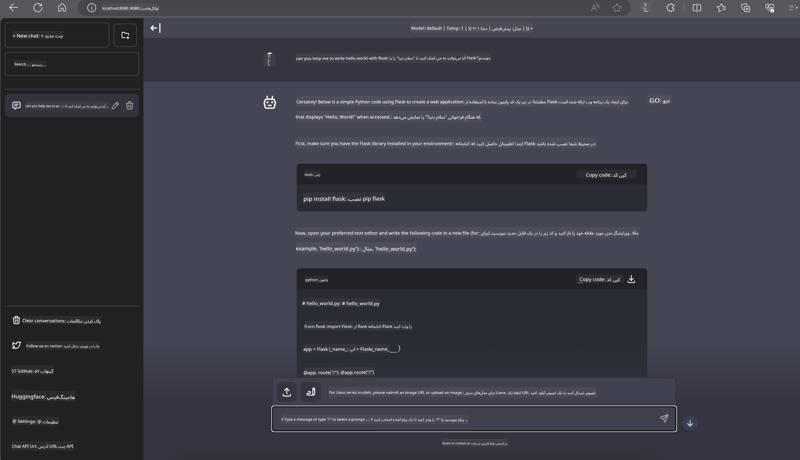

<!--
CO_OP_TRANSLATOR_METADATA:
{
  "original_hash": "be4101a30d98e95a71d42c276e8bcd37",
  "translation_date": "2025-03-27T07:27:39+00:00",
  "source_file": "md\\01.Introduction\\03\\Jetson_Inference.md",
  "language_code": "fa"
}
-->
# **استنتاج Phi-3 در Nvidia Jetson**

Nvidia Jetson مجموعه‌ای از بردهای محاسباتی توکار از شرکت Nvidia است. مدل‌های Jetson TK1، TX1 و TX2 همگی دارای پردازنده Tegra (یا SoC) از Nvidia هستند که یک واحد پردازش مرکزی (CPU) با معماری ARM را ادغام می‌کند. Jetson یک سیستم کم‌مصرف است و برای تسریع برنامه‌های یادگیری ماشین طراحی شده است. Nvidia Jetson توسط توسعه‌دهندگان حرفه‌ای برای ایجاد محصولات هوش مصنوعی پیشگام در تمام صنایع و توسط دانشجویان و علاقه‌مندان برای یادگیری عملی هوش مصنوعی و ساخت پروژه‌های شگفت‌انگیز استفاده می‌شود. SLM در دستگاه‌های لبه مانند Jetson مستقر می‌شود، که اجرای بهتر سناریوهای کاربردی هوش مصنوعی مولد صنعتی را ممکن می‌سازد.

## استقرار در NVIDIA Jetson:
توسعه‌دهندگانی که روی رباتیک خودمختار و دستگاه‌های توکار کار می‌کنند می‌توانند از Phi-3 Mini بهره ببرند. اندازه نسبتاً کوچک Phi-3 آن را برای استقرار در لبه ایده‌آل می‌سازد. پارامترها با دقت در طول آموزش تنظیم شده‌اند تا دقت بالایی در پاسخ‌ها تضمین شود.

### بهینه‌سازی TensorRT-LLM:
کتابخانه [TensorRT-LLM](https://github.com/NVIDIA/TensorRT-LLM?WT.mc_id=aiml-138114-kinfeylo) از NVIDIA، استنتاج مدل‌های زبانی بزرگ را بهینه می‌کند. این کتابخانه از پنجره طولانی متن در Phi-3 Mini پشتیبانی کرده و همزمان بازدهی و تأخیر را بهبود می‌بخشد. بهینه‌سازی‌ها شامل تکنیک‌هایی مانند LongRoPE، FP8 و دسته‌بندی در حین اجرا هستند.

### دسترسی و استقرار:
توسعه‌دهندگان می‌توانند Phi-3 Mini را با پنجره متن 128K در [NVIDIA's AI](https://www.nvidia.com/en-us/ai-data-science/generative-ai/) بررسی کنند. این محصول به صورت یک NVIDIA NIM ارائه شده است، یک میکروسرویس با یک API استاندارد که می‌تواند در هر جایی مستقر شود. همچنین، [پیاده‌سازی‌های TensorRT-LLM در GitHub](https://github.com/NVIDIA/TensorRT-LLM) موجود است.

## **1. آماده‌سازی**

الف. Jetson Orin NX / Jetson NX

ب. JetPack 5.1.2+
   
ج. Cuda 11.8
   
د. Python 3.8+

## **2. اجرای Phi-3 در Jetson**

ما می‌توانیم [Ollama](https://ollama.com) یا [LlamaEdge](https://llamaedge.com) را انتخاب کنیم.

اگر می‌خواهید gguf را همزمان در فضای ابری و دستگاه‌های لبه استفاده کنید، LlamaEdge را می‌توان به عنوان WasmEdge درک کرد (WasmEdge یک محیط اجرایی WebAssembly سبک، با کارایی بالا و مقیاس‌پذیر است که برای برنامه‌های بومی ابری، لبه‌ای و غیرمتمرکز مناسب است. این محیط از برنامه‌های بدون سرور، توابع توکار، میکروسرویس‌ها، قراردادهای هوشمند و دستگاه‌های اینترنت اشیا پشتیبانی می‌کند. می‌توانید مدل کمی‌شده gguf را از طریق LlamaEdge به دستگاه‌های لبه و فضای ابری مستقر کنید).


مراحل استفاده به شرح زیر است:

1. نصب و دانلود کتابخانه‌ها و فایل‌های مرتبط

```bash

curl -sSf https://raw.githubusercontent.com/WasmEdge/WasmEdge/master/utils/install.sh | bash -s -- --plugin wasi_nn-ggml

curl -LO https://github.com/LlamaEdge/LlamaEdge/releases/latest/download/llama-api-server.wasm

curl -LO https://github.com/LlamaEdge/chatbot-ui/releases/latest/download/chatbot-ui.tar.gz

tar xzf chatbot-ui.tar.gz

```

**توجه**: فایل‌های llama-api-server.wasm و chatbot-ui باید در یک پوشه باشند.

2. اجرای اسکریپت‌ها در ترمینال

```bash

wasmedge --dir .:. --nn-preload default:GGML:AUTO:{Your gguf path} llama-api-server.wasm -p phi-3-chat

```

در اینجا نتیجه اجرا را مشاهده می‌کنید:



***کد نمونه*** [دفترچه نمونه Phi-3 mini WASM](https://github.com/Azure-Samples/Phi-3MiniSamples/tree/main/wasm)

به طور خلاصه، Phi-3 Mini نمایانگر یک پیشرفت بزرگ در مدل‌سازی زبان است که کارایی، آگاهی از متن و قدرت بهینه‌سازی NVIDIA را با هم ترکیب می‌کند. چه در حال ساخت ربات‌ها باشید و چه برنامه‌های لبه‌ای، Phi-3 Mini ابزاری قدرتمند است که باید به آن توجه کرد.

**سلب مسئولیت**:  
این سند با استفاده از سرویس ترجمه هوش مصنوعی [Co-op Translator](https://github.com/Azure/co-op-translator) ترجمه شده است. در حالی که ما برای دقت تلاش می‌کنیم، لطفاً توجه داشته باشید که ترجمه‌های خودکار ممکن است حاوی خطاها یا نادرستی‌هایی باشند. سند اصلی به زبان اصلی آن باید به عنوان منبع معتبر در نظر گرفته شود. برای اطلاعات حیاتی، ترجمه حرفه‌ای انسانی توصیه می‌شود. ما هیچ مسئولیتی در قبال سوءتفاهم‌ها یا تفسیرهای نادرست ناشی از استفاده از این ترجمه نداریم.