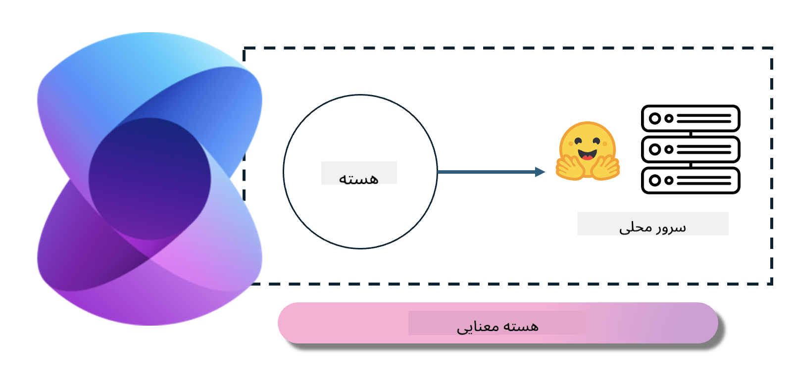
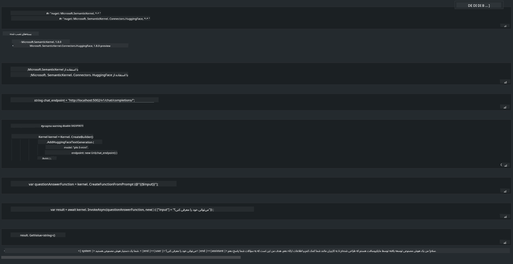

<!--
CO_OP_TRANSLATOR_METADATA:
{
  "original_hash": "bcf5dd7031db0031abdb9dd0c05ba118",
  "translation_date": "2025-03-27T07:45:00+00:00",
  "source_file": "md\\01.Introduction\\03\\Local_Server_Inference.md",
  "language_code": "fa"
}
-->
# **استنتاج Phi-3 در سرور محلی**

ما می‌توانیم Phi-3 را روی یک سرور محلی مستقر کنیم. کاربران می‌توانند از راهکارهای [Ollama](https://ollama.com) یا [LM Studio](https://llamaedge.com) استفاده کنند، یا کد خودشان را بنویسند. شما می‌توانید از طریق [Semantic Kernel](https://github.com/microsoft/semantic-kernel?WT.mc_id=aiml-138114-kinfeylo) یا [Langchain](https://www.langchain.com/) به خدمات محلی Phi-3 متصل شوید تا برنامه‌های Copilot بسازید.

## **استفاده از Semantic Kernel برای دسترسی به Phi-3-mini**

در برنامه Copilot، ما از طریق Semantic Kernel / LangChain برنامه‌ها را ایجاد می‌کنیم. این نوع چارچوب برنامه معمولاً با Azure OpenAI Service / مدل‌های OpenAI سازگار است و همچنین می‌تواند از مدل‌های متن‌باز روی Hugging Face و مدل‌های محلی پشتیبانی کند. اگر بخواهیم از Semantic Kernel برای دسترسی به Phi-3-mini استفاده کنیم، چه کاری باید انجام دهیم؟ با استفاده از .NET به‌عنوان مثال، می‌توانیم آن را با Hugging Face Connector در Semantic Kernel ترکیب کنیم. به‌طور پیش‌فرض، این اتصال می‌تواند با شناسه مدل در Hugging Face تطبیق یابد (اولین باری که از آن استفاده می‌کنید، مدل از Hugging Face دانلود می‌شود که زمان زیادی می‌برد). همچنین می‌توانید به سرویس محلی ساخته‌شده متصل شوید. در مقایسه بین این دو، ما استفاده از گزینه دوم را توصیه می‌کنیم زیرا درجه بالاتری از استقلال دارد، به‌ویژه در برنامه‌های سازمانی.

همان‌طور که در تصویر مشاهده می‌شود، دسترسی به خدمات محلی از طریق Semantic Kernel می‌تواند به‌راحتی به سرور مدل Phi-3-mini ساخته‌شده متصل شود. در اینجا نتیجه اجرای آن آمده است:

***نمونه کد*** https://github.com/kinfey/Phi3MiniSamples/tree/main/semantickernel

**سلب مسئولیت**:  
این سند با استفاده از سرویس ترجمه هوش مصنوعی [Co-op Translator](https://github.com/Azure/co-op-translator) ترجمه شده است. در حالی که ما تلاش می‌کنیم دقت را حفظ کنیم، لطفاً توجه داشته باشید که ترجمه‌های خودکار ممکن است شامل خطاها یا نادرستی‌ها باشند. سند اصلی به زبان مادری آن باید به عنوان منبع معتبر در نظر گرفته شود. برای اطلاعات حساس، ترجمه حرفه‌ای انسانی توصیه می‌شود. ما مسئولیتی در قبال سوء تفاهم‌ها یا تفسیرهای اشتباه ناشی از استفاده از این ترجمه نداریم.