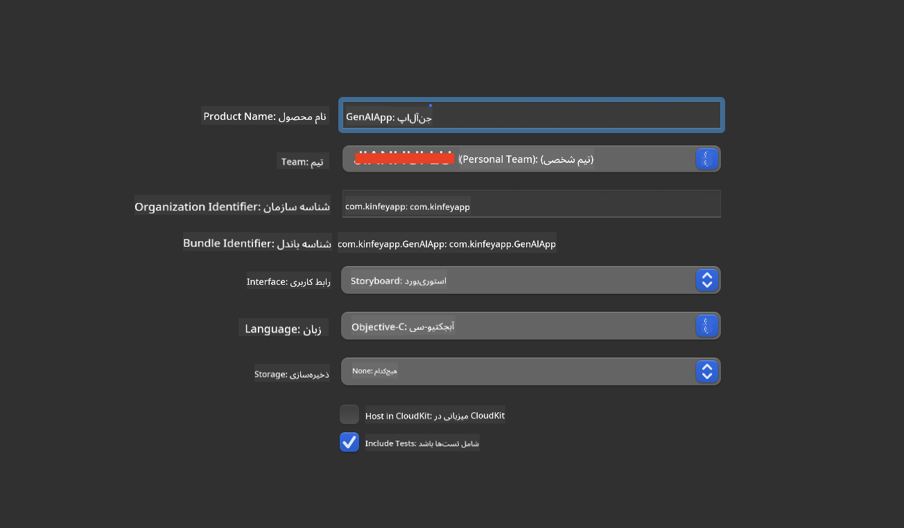
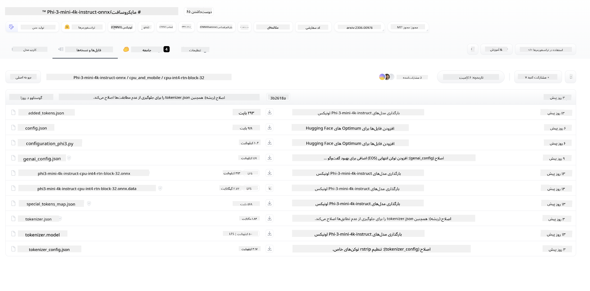
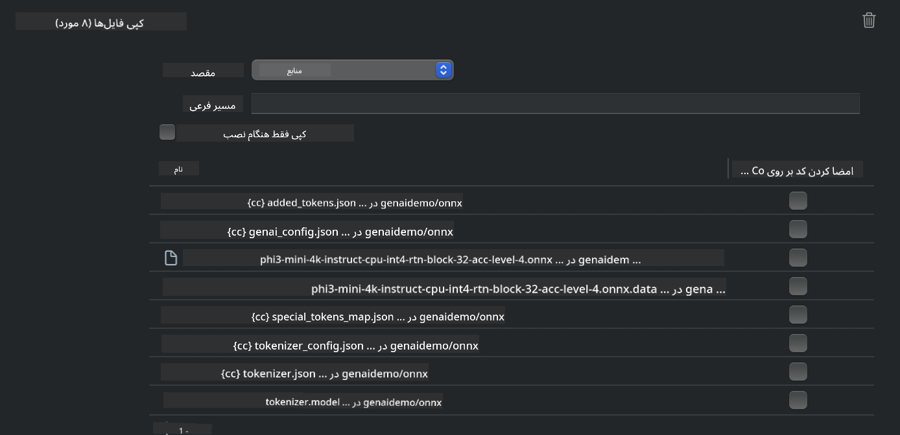
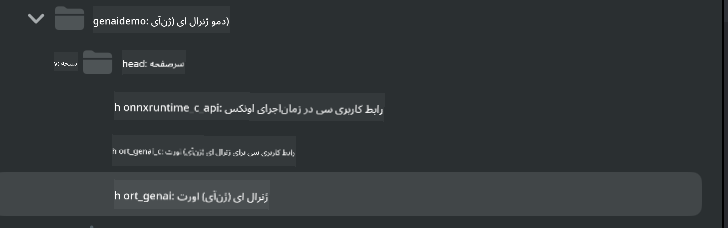
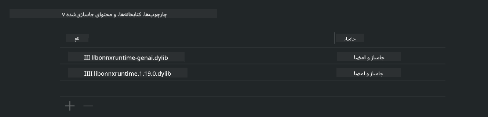
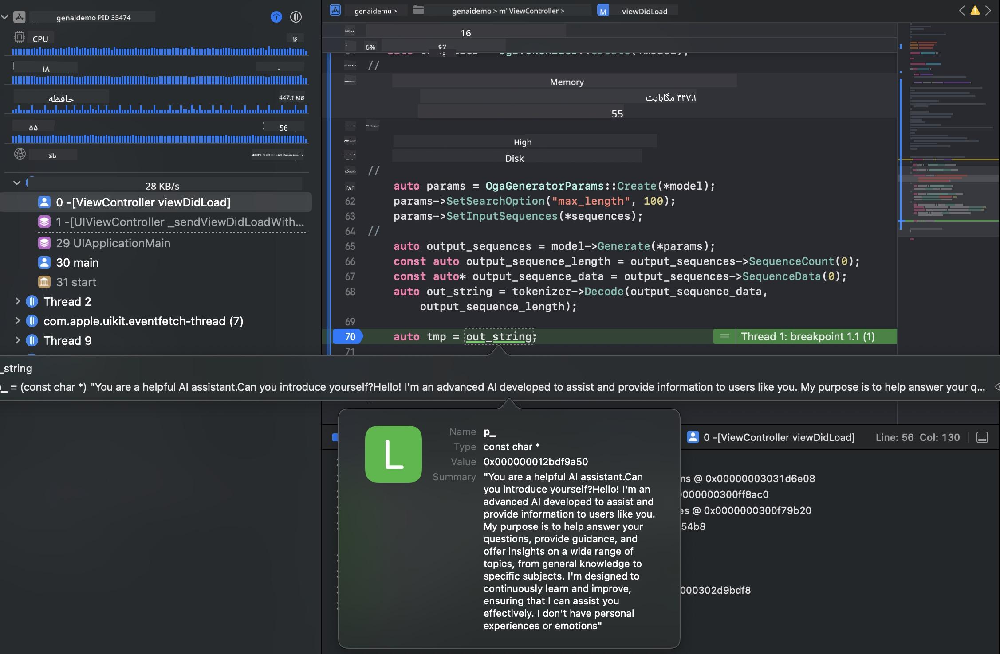

<!--
CO_OP_TRANSLATOR_METADATA:
{
  "original_hash": "82af197df38d25346a98f1f0e84d1698",
  "translation_date": "2025-03-27T07:15:22+00:00",
  "source_file": "md\\01.Introduction\\03\\iOS_Inference.md",
  "language_code": "fa"
}
-->
# **استنتاج Phi-3 در iOS**

Phi-3-mini یک سری جدید از مدل‌ها توسط Microsoft است که امکان اجرای مدل‌های زبان بزرگ (LLMs) را بر روی دستگاه‌های لبه و دستگاه‌های IoT فراهم می‌کند. Phi-3-mini برای iOS، Android، و استقرار در دستگاه‌های لبه در دسترس است و اجازه می‌دهد هوش مصنوعی مولد در محیط‌های BYOD مستقر شود. مثال زیر نشان می‌دهد که چگونه می‌توان Phi-3-mini را در iOS مستقر کرد.

## **1. آماده‌سازی**

- **الف.** macOS 14 یا بالاتر  
- **ب.** Xcode 15 یا بالاتر  
- **ج.** iOS SDK نسخه 17.x (آیفون 14 با A16 یا بالاتر)  
- **د.** نصب Python 3.10 یا بالاتر (Conda توصیه می‌شود)  
- **ه.** نصب کتابخانه پایتون: `python-flatbuffers`  
- **و.** نصب CMake  

### Semantic Kernel و استنتاج

Semantic Kernel یک چارچوب برنامه‌نویسی است که به شما امکان می‌دهد برنامه‌هایی سازگار با Azure OpenAI Service، مدل‌های OpenAI، و حتی مدل‌های محلی ایجاد کنید. دسترسی به سرویس‌های محلی از طریق Semantic Kernel ادغام آسان با سرور مدل Phi-3-mini خود میزبان را فراهم می‌کند.

### فراخوانی مدل‌های کمینه‌سازی‌شده با Ollama یا LlamaEdge

بسیاری از کاربران ترجیح می‌دهند از مدل‌های کمینه‌سازی‌شده برای اجرای مدل‌ها به صورت محلی استفاده کنند. [Ollama](https://ollama.com) و [LlamaEdge](https://llamaedge.com) به کاربران اجازه می‌دهند مدل‌های مختلف کمینه‌سازی‌شده را فراخوانی کنند:

#### **Ollama**

شما می‌توانید `ollama run phi3` را مستقیماً اجرا کنید یا آن را به صورت آفلاین پیکربندی کنید. یک Modelfile ایجاد کنید و مسیر فایل `gguf` خود را مشخص کنید. نمونه کد برای اجرای مدل کمینه‌سازی‌شده Phi-3-mini:

```gguf
FROM {Add your gguf file path}
TEMPLATE \"\"\"<|user|> .Prompt<|end|> <|assistant|>\"\"\"
PARAMETER stop <|end|>
PARAMETER num_ctx 4096
```

#### **LlamaEdge**

اگر می‌خواهید `gguf` را به طور همزمان در دستگاه‌های ابری و لبه استفاده کنید، LlamaEdge گزینه بسیار خوبی است.

## **2. کامپایل ONNX Runtime برای iOS**

```bash

git clone https://github.com/microsoft/onnxruntime.git

cd onnxruntime

./build.sh --build_shared_lib --ios --skip_tests --parallel --build_dir ./build_ios --ios --apple_sysroot iphoneos --osx_arch arm64 --apple_deploy_target 17.5 --cmake_generator Xcode --config Release

cd ../

```

### **توجه**

- **الف.** قبل از کامپایل، مطمئن شوید که Xcode به درستی تنظیم شده و آن را به عنوان دایرکتوری توسعه‌دهنده فعال در ترمینال تنظیم کنید:

    ```bash
    sudo xcode-select -switch /Applications/Xcode.app/Contents/Developer
    ```

- **ب.** ONNX Runtime باید برای پلتفرم‌های مختلف کامپایل شود. برای iOS، می‌توانید برای `arm64` or `x86_64` کامپایل کنید.

- **ج.** توصیه می‌شود از آخرین نسخه iOS SDK برای کامپایل استفاده کنید. با این حال، می‌توانید از نسخه قدیمی‌تر نیز برای سازگاری با SDK‌های قبلی استفاده کنید.

## **3. کامپایل هوش مصنوعی مولد با ONNX Runtime برای iOS**

> **توجه:** از آنجایی که هوش مصنوعی مولد با ONNX Runtime در حالت پیش‌نمایش است، لطفاً به تغییرات احتمالی توجه داشته باشید.

```bash

git clone https://github.com/microsoft/onnxruntime-genai
 
cd onnxruntime-genai
 
mkdir ort
 
cd ort
 
mkdir include
 
mkdir lib
 
cd ../
 
cp ../onnxruntime/include/onnxruntime/core/session/onnxruntime_c_api.h ort/include
 
cp ../onnxruntime/build_ios/Release/Release-iphoneos/libonnxruntime*.dylib* ort/lib
 
export OPENCV_SKIP_XCODEBUILD_FORCE_TRYCOMPILE_DEBUG=1
 
python3 build.py --parallel --build_dir ./build_ios --ios --ios_sysroot iphoneos --ios_arch arm64 --ios_deployment_target 17.5 --cmake_generator Xcode --cmake_extra_defines CMAKE_XCODE_ATTRIBUTE_CODE_SIGNING_ALLOWED=NO

```

## **4. ایجاد یک برنامه در Xcode**

من Objective-C را به عنوان روش توسعه برنامه انتخاب کردم، زیرا استفاده از هوش مصنوعی مولد با ONNX Runtime C++ API سازگاری بهتری با Objective-C دارد. البته، شما می‌توانید فراخوانی‌های مربوطه را از طریق Swift bridging نیز انجام دهید.



## **5. کپی کردن مدل INT4 کمینه‌سازی‌شده ONNX به پروژه برنامه**

ما نیاز داریم مدل کمینه‌سازی‌شده INT4 در فرمت ONNX را وارد کنیم که ابتدا باید دانلود شود.



پس از دانلود، باید آن را به دایرکتوری Resources پروژه در Xcode اضافه کنید.



## **6. افزودن C++ API در ViewControllers**

> **توجه:**

- **الف.** فایل‌های هدر C++ مربوطه را به پروژه اضافه کنید.

  

- **ب.** `onnxruntime-genai` dynamic library in Xcode.

  

- **c.** Use the C Samples code for testing. You can also add additional features like ChatUI for more functionality.

- **d.** Since you need to use C++ in your project, rename `ViewController.m` to `ViewController.mm` را برای فعال کردن پشتیبانی Objective-C++ وارد کنید.

```objc

    NSString *llmPath = [[NSBundle mainBundle] resourcePath];
    char const *modelPath = llmPath.cString;

    auto model =  OgaModel::Create(modelPath);

    auto tokenizer = OgaTokenizer::Create(*model);

    const char* prompt = "<|system|>You are a helpful AI assistant.<|end|><|user|>Can you introduce yourself?<|end|><|assistant|>";

    auto sequences = OgaSequences::Create();
    tokenizer->Encode(prompt, *sequences);

    auto params = OgaGeneratorParams::Create(*model);
    params->SetSearchOption("max_length", 100);
    params->SetInputSequences(*sequences);

    auto output_sequences = model->Generate(*params);
    const auto output_sequence_length = output_sequences->SequenceCount(0);
    const auto* output_sequence_data = output_sequences->SequenceData(0);
    auto out_string = tokenizer->Decode(output_sequence_data, output_sequence_length);
    
    auto tmp = out_string;

```

## **7. اجرای برنامه**

پس از تکمیل تنظیمات، می‌توانید برنامه را اجرا کنید و نتایج استنتاج مدل Phi-3-mini را مشاهده کنید.



برای نمونه کدهای بیشتر و دستورالعمل‌های دقیق، به [مخزن نمونه‌های Phi-3 Mini](https://github.com/Azure-Samples/Phi-3MiniSamples/tree/main/ios) مراجعه کنید.

**سلب مسئولیت**:  
این سند با استفاده از سرویس ترجمه هوش مصنوعی [Co-op Translator](https://github.com/Azure/co-op-translator) ترجمه شده است. در حالی که ما برای دقت تلاش می‌کنیم، لطفاً توجه داشته باشید که ترجمه‌های خودکار ممکن است شامل خطاها یا نواقصی باشند. سند اصلی به زبان اصلی آن باید به عنوان منبع معتبر در نظر گرفته شود. برای اطلاعات حساس، ترجمه حرفه‌ای توسط انسان توصیه می‌شود. ما مسئولیتی در قبال سوء تفاهم‌ها یا تفسیرهای نادرست ناشی از استفاده از این ترجمه نداریم.