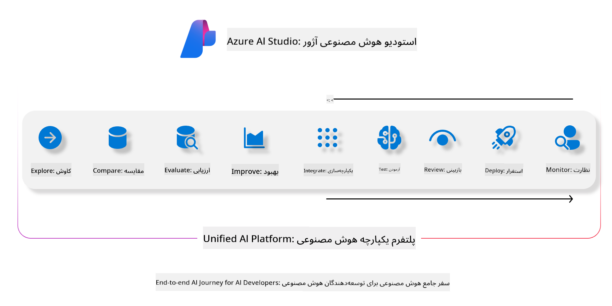
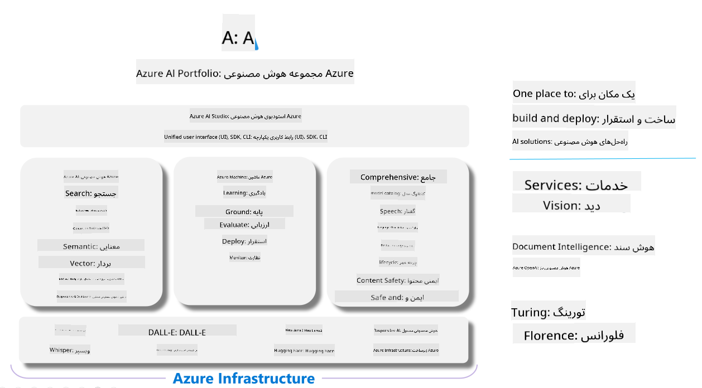

<!--
CO_OP_TRANSLATOR_METADATA:
{
  "original_hash": "7b4235159486df4000e16b7b46ddfec3",
  "translation_date": "2025-03-27T08:53:44+00:00",
  "source_file": "md\\01.Introduction\\05\\AIFoundry.md",
  "language_code": "fa"
}
-->
# **ارزیابی با استفاده از Azure AI Foundry**

چگونه برنامه هوش مصنوعی تولیدی خود را با استفاده از [Azure AI Foundry](https://ai.azure.com?WT.mc_id=aiml-138114-kinfeylo) ارزیابی کنیم. چه در حال ارزیابی مکالمات تک‌مرحله‌ای باشید و چه چندمرحله‌ای، Azure AI Foundry ابزارهایی برای ارزیابی عملکرد و ایمنی مدل ارائه می‌دهد.

## نحوه ارزیابی برنامه‌های هوش مصنوعی تولیدی با Azure AI Foundry  
برای دستورالعمل‌های کامل، به [مستندات Azure AI Foundry](https://learn.microsoft.com/azure/ai-studio/how-to/evaluate-generative-ai-app?WT.mc_id=aiml-138114-kinfeylo) مراجعه کنید.

مراحل شروع کار به شرح زیر است:

## ارزیابی مدل‌های هوش مصنوعی تولیدی در Azure AI Foundry  

**پیش‌نیازها**

- یک مجموعه داده آزمایشی در فرمت CSV یا JSON.
- یک مدل هوش مصنوعی تولیدی مستقر (مانند Phi-3، GPT 3.5، GPT 4، یا مدل‌های Davinci).
- یک محیط اجرایی با نمونه محاسباتی برای اجرای ارزیابی.

## معیارهای ارزیابی داخلی  

Azure AI Foundry امکان ارزیابی مکالمات تک‌مرحله‌ای و پیچیده چندمرحله‌ای را فراهم می‌کند.  
برای سناریوهای تولید مبتنی بر بازیابی (RAG)، جایی که مدل بر اساس داده‌های خاص پایه‌گذاری شده است، می‌توانید عملکرد را با استفاده از معیارهای ارزیابی داخلی بررسی کنید.  
علاوه بر این، می‌توانید سناریوهای عمومی پرسش و پاسخ تک‌مرحله‌ای (غیر RAG) را ارزیابی کنید.

## ایجاد یک اجرای ارزیابی  

از رابط کاربری Azure AI Foundry، به صفحه Evaluate یا صفحه Prompt Flow بروید.  
از جادوگر ایجاد ارزیابی برای تنظیم اجرای ارزیابی استفاده کنید. یک نام اختیاری برای ارزیابی خود ارائه دهید.  
سناریویی را انتخاب کنید که با اهداف برنامه شما همسو باشد.  
یک یا چند معیار ارزیابی را برای بررسی خروجی مدل انتخاب کنید.

## جریان ارزیابی سفارشی (اختیاری)  

برای انعطاف‌پذیری بیشتر، می‌توانید یک جریان ارزیابی سفارشی تنظیم کنید. فرآیند ارزیابی را بر اساس نیازهای خاص خود سفارشی کنید.

## مشاهده نتایج  

پس از اجرای ارزیابی، معیارهای ارزیابی دقیق را در Azure AI Foundry ثبت، مشاهده و تحلیل کنید. بینش‌هایی درباره قابلیت‌ها و محدودیت‌های برنامه خود کسب کنید.

**توجه** Azure AI Foundry در حال حاضر در پیش‌نمایش عمومی قرار دارد، بنابراین از آن برای آزمایش و اهداف توسعه استفاده کنید. برای بارهای کاری تولیدی، گزینه‌های دیگری را در نظر بگیرید. مستندات رسمی [AI Foundry](https://learn.microsoft.com/azure/ai-studio/?WT.mc_id=aiml-138114-kinfeylo) را برای جزئیات بیشتر و دستورالعمل‌های گام به گام بررسی کنید.

**سلب مسئولیت**:  
این سند با استفاده از سرویس ترجمه هوش مصنوعی [Co-op Translator](https://github.com/Azure/co-op-translator) ترجمه شده است. در حالی که ما تلاش می‌کنیم دقت را حفظ کنیم، لطفاً توجه داشته باشید که ترجمه‌های خودکار ممکن است حاوی اشتباهات یا نادقتی‌هایی باشند. سند اصلی به زبان بومی آن باید به عنوان منبع معتبر در نظر گرفته شود. برای اطلاعات حساس، توصیه می‌شود از ترجمه حرفه‌ای انسانی استفاده کنید. ما هیچ مسئولیتی در قبال سوءتفاهم‌ها یا تفسیرهای نادرست ناشی از استفاده از این ترجمه نداریم.