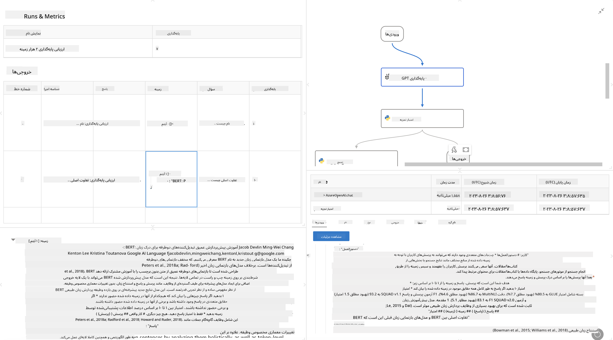

<!--
CO_OP_TRANSLATOR_METADATA:
{
  "original_hash": "3cbe7629d254f1043193b7fe22524d55",
  "translation_date": "2025-03-27T09:03:54+00:00",
  "source_file": "md\\01.Introduction\\05\\Promptflow.md",
  "language_code": "fa"
}
-->
# **معرفی Promptflow**

[Microsoft Prompt Flow](https://microsoft.github.io/promptflow/index.html?WT.mc_id=aiml-138114-kinfeylo) یک ابزار اتوماسیون گردش کار بصری است که به کاربران اجازه می‌دهد گردش‌های کاری خودکار را با استفاده از قالب‌های آماده و اتصال‌دهنده‌های سفارشی ایجاد کنند. این ابزار برای توسعه‌دهندگان و تحلیل‌گران کسب‌وکار طراحی شده است تا بتوانند فرآیندهای خودکار برای وظایفی مانند مدیریت داده‌ها، همکاری، و بهینه‌سازی فرآیندها را به سرعت بسازند. با استفاده از Prompt Flow، کاربران می‌توانند به راحتی سرویس‌ها، برنامه‌ها و سیستم‌های مختلف را متصل کرده و فرآیندهای پیچیده کسب‌وکار را خودکار کنند.

Microsoft Prompt Flow برای ساده‌سازی چرخه توسعه انتها به انتهای برنامه‌های هوش مصنوعی مبتنی بر مدل‌های زبان بزرگ (LLMs) طراحی شده است. چه در حال ایده‌پردازی، نمونه‌سازی، آزمایش، ارزیابی یا استقرار برنامه‌های مبتنی بر LLM باشید، Prompt Flow فرآیند را ساده می‌کند و به شما امکان می‌دهد برنامه‌های LLM با کیفیت تولید بسازید.

## ویژگی‌ها و مزایای کلیدی استفاده از Microsoft Prompt Flow:

**تجربه نویسندگی تعاملی**

Prompt Flow نمای بصری از ساختار جریان شما ارائه می‌دهد که درک و پیمایش پروژه‌ها را آسان می‌کند.
این ابزار تجربه کدنویسی مشابه دفترچه یادداشت را برای توسعه و اشکال‌زدایی جریان‌ها بهینه ارائه می‌دهد.

**تنوع و تنظیم پرامپت‌ها**

ایجاد و مقایسه چندین نسخه پرامپت برای تسهیل فرآیند اصلاح تدریجی. عملکرد پرامپت‌های مختلف را ارزیابی کنید و مؤثرترین آنها را انتخاب کنید.

**جریان‌های ارزیابی داخلی**
کیفیت و اثربخشی پرامپت‌ها و جریان‌های خود را با ابزارهای ارزیابی داخلی بررسی کنید.
درک کنید که برنامه‌های مبتنی بر LLM شما چقدر خوب عمل می‌کنند.

**منابع جامع**

Prompt Flow شامل کتابخانه‌ای از ابزارهای داخلی، نمونه‌ها و قالب‌ها است. این منابع به‌عنوان نقطه شروع توسعه عمل می‌کنند، خلاقیت را الهام می‌بخشند و فرآیند را تسریع می‌کنند.

**همکاری و آمادگی برای سازمان‌ها**

از همکاری تیمی با امکان کار چندین کاربر بر روی پروژه‌های مهندسی پرامپت پشتیبانی کنید.
کنترل نسخه را حفظ کرده و دانش را به طور مؤثر به اشتراک بگذارید. فرآیند مهندسی پرامپت را از توسعه و ارزیابی تا استقرار و نظارت ساده کنید.

## ارزیابی در Prompt Flow 

در Microsoft Prompt Flow، ارزیابی نقش حیاتی در بررسی عملکرد مدل‌های هوش مصنوعی ایفا می‌کند. بیایید بررسی کنیم که چگونه می‌توانید جریان‌ها و معیارهای ارزیابی را در Prompt Flow سفارشی کنید:

**درک ارزیابی در Prompt Flow**

در Prompt Flow، یک جریان نمایانگر دنباله‌ای از گره‌ها است که ورودی را پردازش کرده و خروجی تولید می‌کنند. جریان‌های ارزیابی نوع خاصی از جریان‌ها هستند که برای بررسی عملکرد یک اجرا بر اساس معیارها و اهداف خاص طراحی شده‌اند.

**ویژگی‌های کلیدی جریان‌های ارزیابی**

این جریان‌ها معمولاً پس از جریان آزمایش‌شده اجرا می‌شوند و از خروجی‌های آن استفاده می‌کنند. آنها امتیازات یا معیارهایی را برای اندازه‌گیری عملکرد جریان آزمایش‌شده محاسبه می‌کنند. معیارها می‌توانند شامل دقت، امتیازات مرتبط بودن یا هر اندازه‌گیری مرتبط دیگری باشند.

### سفارشی‌سازی جریان‌های ارزیابی

**تعریف ورودی‌ها**

جریان‌های ارزیابی نیاز دارند که خروجی‌های اجرای آزمایش‌شده را دریافت کنند. ورودی‌ها را مشابه جریان‌های استاندارد تعریف کنید.
به عنوان مثال، اگر جریان پرسش و پاسخ را ارزیابی می‌کنید، یک ورودی به نام "پاسخ" تعریف کنید. اگر جریان دسته‌بندی را ارزیابی می‌کنید، یک ورودی به نام "دسته‌بندی" تعریف کنید. ورودی‌های حقیقت زمینی (مانند برچسب‌های واقعی) نیز ممکن است مورد نیاز باشند.

**خروجی‌ها و معیارها**

جریان‌های ارزیابی نتایجی تولید می‌کنند که عملکرد جریان آزمایش‌شده را اندازه‌گیری می‌کنند. معیارها می‌توانند با استفاده از Python یا LLM (مدل‌های زبان بزرگ) محاسبه شوند. از تابع log_metric() برای ثبت معیارهای مرتبط استفاده کنید.

**استفاده از جریان‌های ارزیابی سفارشی**

جریان ارزیابی خود را مطابق با وظایف و اهداف خاص خود توسعه دهید. معیارها را بر اساس اهداف ارزیابی خود سفارشی کنید.
این جریان ارزیابی سفارشی را برای اجراهای دسته‌ای در آزمایش‌های بزرگ‌مقیاس اعمال کنید.

## روش‌های ارزیابی داخلی

Prompt Flow همچنین روش‌های ارزیابی داخلی ارائه می‌دهد.
می‌توانید اجراهای دسته‌ای را ارسال کرده و از این روش‌ها برای ارزیابی عملکرد جریان خود با مجموعه داده‌های بزرگ استفاده کنید.
نتایج ارزیابی را مشاهده کنید، معیارها را مقایسه کنید و در صورت نیاز تکرار کنید.
به یاد داشته باشید، ارزیابی برای اطمینان از اینکه مدل‌های هوش مصنوعی شما معیارها و اهداف مورد نظر را برآورده می‌کنند ضروری است. برای دستورالعمل‌های دقیق در مورد توسعه و استفاده از جریان‌های ارزیابی در Microsoft Prompt Flow، مستندات رسمی را بررسی کنید.

به طور خلاصه، Microsoft Prompt Flow به توسعه‌دهندگان امکان می‌دهد برنامه‌های LLM با کیفیت بالا ایجاد کنند و فرآیند مهندسی پرامپت را ساده می‌کند و محیط توسعه قدرتمندی فراهم می‌آورد. اگر با LLM‌ها کار می‌کنید، Prompt Flow ابزاری ارزشمند برای بررسی است. مستندات [Prompt Flow Evaluation Documents](https://learn.microsoft.com/azure/machine-learning/prompt-flow/how-to-develop-an-evaluation-flow?view=azureml-api-2?WT.mc_id=aiml-138114-kinfeylo) را برای دستورالعمل‌های دقیق در مورد توسعه و استفاده از جریان‌های ارزیابی در Microsoft Prompt Flow بررسی کنید.

**سلب مسئولیت**:  
این سند با استفاده از سرویس ترجمه هوش مصنوعی [Co-op Translator](https://github.com/Azure/co-op-translator) ترجمه شده است. در حالی که ما برای دقت تلاش می‌کنیم، لطفاً توجه داشته باشید که ترجمه‌های خودکار ممکن است شامل خطاها یا نادرستی‌هایی باشند. سند اصلی به زبان اصلی خود باید به عنوان منبع معتبر در نظر گرفته شود. برای اطلاعات حساس، ترجمه حرفه‌ای انسانی توصیه می‌شود. ما مسئولیتی در قبال سوءتفاهم‌ها یا تفسیرهای نادرست ناشی از استفاده از این ترجمه نداریم.