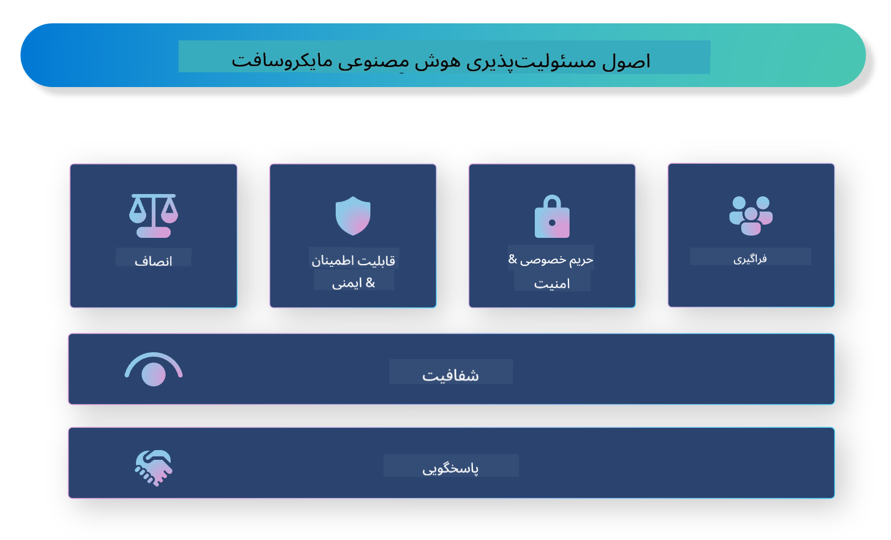

<!--
CO_OP_TRANSLATOR_METADATA:
{
  "original_hash": "805b96b20152936d8f4c587d90d6e06e",
  "translation_date": "2025-03-27T09:15:22+00:00",
  "source_file": "md\\01.Introduction\\05\\ResponsibleAI.md",
  "language_code": "fa"
}
-->
# **معرفی هوش مصنوعی مسئولانه**

[Microsoft Responsible AI](https://www.microsoft.com/ai/responsible-ai?WT.mc_id=aiml-138114-kinfeylo) یک ابتکار است که هدف آن کمک به توسعه‌دهندگان و سازمان‌ها برای ساخت سیستم‌های هوش مصنوعی شفاف، قابل اعتماد و پاسخگو است. این ابتکار راهنماها و منابعی را برای توسعه راه‌حل‌های هوش مصنوعی مسئولانه ارائه می‌دهد که با اصول اخلاقی مانند حفظ حریم خصوصی، عدالت و شفافیت هماهنگ هستند. همچنین، به بررسی برخی از چالش‌ها و بهترین شیوه‌ها در ساخت سیستم‌های هوش مصنوعی مسئولانه خواهیم پرداخت.

## مروری بر هوش مصنوعی مسئولانه مایکروسافت

**اصول اخلاقی**

هوش مصنوعی مسئولانه مایکروسافت بر اساس مجموعه‌ای از اصول اخلاقی هدایت می‌شود، از جمله حفظ حریم خصوصی، عدالت، شفافیت، پاسخگویی و ایمنی. این اصول طراحی شده‌اند تا اطمینان حاصل شود که سیستم‌های هوش مصنوعی به شیوه‌ای اخلاقی و مسئولانه توسعه داده می‌شوند.

**هوش مصنوعی شفاف**

هوش مصنوعی مسئولانه مایکروسافت بر اهمیت شفافیت در سیستم‌های هوش مصنوعی تأکید دارد. این شامل ارائه توضیحات واضح در مورد نحوه عملکرد مدل‌های هوش مصنوعی و همچنین اطمینان از در دسترس بودن منابع داده و الگوریتم‌ها است.

**هوش مصنوعی پاسخگو**

[Microsoft Responsible AI](https://www.microsoft.com/ai/responsible-ai?WT.mc_id=aiml-138114-kinfeylo) توسعه سیستم‌های هوش مصنوعی پاسخگو را ترویج می‌دهد که می‌توانند بینش‌هایی درباره نحوه تصمیم‌گیری مدل‌های هوش مصنوعی ارائه دهند. این می‌تواند به کاربران کمک کند تا خروجی‌های سیستم‌های هوش مصنوعی را درک کرده و به آن‌ها اعتماد کنند.

**شمولیت**

سیستم‌های هوش مصنوعی باید به گونه‌ای طراحی شوند که به نفع همه باشند. مایکروسافت هدف دارد هوش مصنوعی فراگیر ایجاد کند که دیدگاه‌های متنوع را در نظر بگیرد و از تعصب یا تبعیض جلوگیری کند.

**قابلیت اطمینان و ایمنی**

اطمینان از اینکه سیستم‌های هوش مصنوعی قابل اعتماد و ایمن هستند، بسیار مهم است. مایکروسافت بر ساخت مدل‌های مقاوم تمرکز دارد که عملکردی پایدار داشته و از نتایج مضر جلوگیری کنند.

**عدالت در هوش مصنوعی**

هوش مصنوعی مسئولانه مایکروسافت اذعان دارد که سیستم‌های هوش مصنوعی می‌توانند تعصبات را تداوم بخشند اگر با داده‌ها یا الگوریتم‌های متعصب آموزش داده شوند. این ابتکار راهنماهایی برای توسعه سیستم‌های هوش مصنوعی عادلانه ارائه می‌دهد که بر اساس عواملی مانند نژاد، جنسیت یا سن تبعیض قائل نمی‌شوند.

**حریم خصوصی و امنیت**

هوش مصنوعی مسئولانه مایکروسافت بر اهمیت حفاظت از حریم خصوصی کاربران و امنیت داده‌ها در سیستم‌های هوش مصنوعی تأکید دارد. این شامل اجرای رمزگذاری قوی داده‌ها و کنترل‌های دسترسی، و همچنین بررسی منظم سیستم‌های هوش مصنوعی برای آسیب‌پذیری‌ها است.

**پاسخگویی و مسئولیت**

هوش مصنوعی مسئولانه مایکروسافت پاسخگویی و مسئولیت‌پذیری را در توسعه و استقرار هوش مصنوعی ترویج می‌دهد. این شامل اطمینان از آگاهی توسعه‌دهندگان و سازمان‌ها از خطرات بالقوه مرتبط با سیستم‌های هوش مصنوعی و اتخاذ تدابیری برای کاهش این خطرات است.

## بهترین شیوه‌ها برای ساخت سیستم‌های هوش مصنوعی مسئولانه

**توسعه مدل‌های هوش مصنوعی با استفاده از مجموعه داده‌های متنوع**

برای جلوگیری از تعصب در سیستم‌های هوش مصنوعی، استفاده از مجموعه داده‌های متنوع که طیف گسترده‌ای از دیدگاه‌ها و تجربیات را نمایندگی کنند، ضروری است.

**استفاده از تکنیک‌های هوش مصنوعی قابل توضیح**

تکنیک‌های هوش مصنوعی قابل توضیح می‌توانند به کاربران کمک کنند نحوه تصمیم‌گیری مدل‌های هوش مصنوعی را درک کنند، که این امر می‌تواند اعتماد به سیستم را افزایش دهد.

**بررسی منظم سیستم‌های هوش مصنوعی برای آسیب‌پذیری‌ها**

بررسی‌های منظم سیستم‌های هوش مصنوعی می‌تواند به شناسایی خطرات و آسیب‌پذیری‌های بالقوه‌ای که نیاز به رسیدگی دارند کمک کند.

**اجرای رمزگذاری قوی داده‌ها و کنترل‌های دسترسی**

رمزگذاری داده‌ها و کنترل‌های دسترسی می‌توانند به حفاظت از حریم خصوصی و امنیت کاربران در سیستم‌های هوش مصنوعی کمک کنند.

**پیروی از اصول اخلاقی در توسعه هوش مصنوعی**

پیروی از اصول اخلاقی، مانند عدالت، شفافیت و پاسخگویی، می‌تواند به ایجاد اعتماد در سیستم‌های هوش مصنوعی و اطمینان از توسعه مسئولانه آن‌ها کمک کند.

## استفاده از AI Foundry برای هوش مصنوعی مسئولانه

[Azure AI Foundry](https://ai.azure.com?WT.mc_id=aiml-138114-kinfeylo) یک پلتفرم قدرتمند است که به توسعه‌دهندگان و سازمان‌ها امکان می‌دهد به سرعت برنامه‌های هوشمند، پیشرفته، آماده بازار و مسئولانه ایجاد کنند. در اینجا برخی از ویژگی‌ها و قابلیت‌های کلیدی Azure AI Foundry آورده شده است:

**API‌ها و مدل‌های آماده استفاده**

Azure AI Foundry API‌ها و مدل‌های از پیش ساخته شده و قابل تنظیم ارائه می‌دهد. این موارد طیف گسترده‌ای از وظایف هوش مصنوعی، از جمله هوش مصنوعی مولد، پردازش زبان طبیعی برای مکالمات، جستجو، نظارت، ترجمه، گفتار، بینایی و تصمیم‌گیری را پوشش می‌دهند.

**Prompt Flow**

Prompt Flow در Azure AI Foundry به شما امکان می‌دهد تجربه‌های هوش مصنوعی مکالمه‌ای ایجاد کنید. این ویژگی به شما اجازه می‌دهد جریان‌های مکالمه‌ای طراحی و مدیریت کنید و ساخت چت‌بات‌ها، دستیارهای مجازی و برنامه‌های تعاملی دیگر را آسان‌تر کنید.

**تولید افزوده بازیابی (RAG)**

RAG تکنیکی است که رویکردهای مبتنی بر بازیابی و مبتنی بر تولید را ترکیب می‌کند. این تکنیک کیفیت پاسخ‌های تولید شده را با استفاده از دانش موجود (بازیابی) و تولید خلاقانه (تولید) افزایش می‌دهد.

**معیارهای ارزیابی و نظارت برای هوش مصنوعی مولد**

Azure AI Foundry ابزارهایی برای ارزیابی و نظارت بر مدل‌های هوش مصنوعی مولد فراهم می‌کند. شما می‌توانید عملکرد، عدالت و سایر معیارهای مهم را ارزیابی کنید تا از استقرار مسئولانه اطمینان حاصل کنید. علاوه بر این، اگر داشبوردی ایجاد کرده‌اید، می‌توانید از رابط کاربری بدون کدنویسی در Azure Machine Learning Studio برای سفارشی‌سازی و ایجاد داشبورد هوش مصنوعی مسئولانه و کارت امتیاز مرتبط بر اساس کتابخانه‌های پایتون [Responsible AI Toolbox](https://responsibleaitoolbox.ai/?WT.mc_id=aiml-138114-kinfeylo) استفاده کنید. این کارت امتیاز به شما کمک می‌کند تا بینش‌های کلیدی مرتبط با عدالت، اهمیت ویژگی‌ها و سایر ملاحظات استقرار مسئولانه را با ذینفعان فنی و غیر فنی به اشتراک بگذارید.

برای استفاده از AI Foundry با هوش مصنوعی مسئولانه، می‌توانید این بهترین شیوه‌ها را دنبال کنید:

**تعریف مسئله و اهداف سیستم هوش مصنوعی**

قبل از شروع فرآیند توسعه، مهم است که مسئله یا هدفی که سیستم هوش مصنوعی شما قصد دارد حل کند را به وضوح تعریف کنید. این امر به شما کمک می‌کند داده‌ها، الگوریتم‌ها و منابع مورد نیاز برای ساخت مدل مؤثر را شناسایی کنید.

**جمع‌آوری و پیش‌پردازش داده‌های مرتبط**

کیفیت و کمیت داده‌های مورد استفاده در آموزش سیستم هوش مصنوعی می‌تواند تأثیر قابل توجهی بر عملکرد آن داشته باشد. بنابراین، مهم است که داده‌های مرتبط جمع‌آوری، پاکسازی، پیش‌پردازش و اطمینان حاصل شود که نماینده جمعیت یا مسئله‌ای که قصد حل آن را دارید، باشد.

**انتخاب ارزیابی مناسب**

الگوریتم‌های ارزیابی مختلفی وجود دارند. انتخاب مناسب‌ترین الگوریتم بر اساس داده‌ها و مسئله شما اهمیت دارد.

**ارزیابی و تفسیر مدل**

پس از ساخت مدل هوش مصنوعی، مهم است که عملکرد آن را با استفاده از معیارهای مناسب ارزیابی کرده و نتایج را به صورت شفاف تفسیر کنید. این امر به شما کمک می‌کند هر گونه تعصب یا محدودیت در مدل را شناسایی کرده و در صورت نیاز بهبودهایی اعمال کنید.

**اطمینان از شفافیت و قابلیت توضیح**

سیستم‌های هوش مصنوعی باید شفاف و قابل توضیح باشند تا کاربران بتوانند نحوه عملکرد آن‌ها و چگونگی تصمیم‌گیری‌ها را درک کنند. این امر به ویژه برای برنامه‌هایی که تأثیرات قابل توجهی بر زندگی انسان دارند، مانند مراقبت‌های بهداشتی، امور مالی و سیستم‌های حقوقی، مهم است.

**نظارت و به‌روزرسانی مدل**

سیستم‌های هوش مصنوعی باید به صورت مداوم نظارت و به‌روزرسانی شوند تا اطمینان حاصل شود که با گذشت زمان دقیق و مؤثر باقی می‌مانند. این امر نیازمند نگهداری، آزمایش و آموزش مجدد مدل به طور مداوم است.

در نتیجه، هوش مصنوعی مسئولانه مایکروسافت یک ابتکار است که هدف آن کمک به توسعه‌دهندگان و سازمان‌ها برای ساخت سیستم‌های هوش مصنوعی شفاف، قابل اعتماد و پاسخگو است. به یاد داشته باشید که اجرای هوش مصنوعی مسئولانه بسیار مهم است و Azure AI Foundry تلاش می‌کند تا آن را برای سازمان‌ها عملی کند. با پیروی از اصول اخلاقی و بهترین شیوه‌ها، می‌توانیم اطمینان حاصل کنیم که سیستم‌های هوش مصنوعی به شیوه‌ای مسئولانه توسعه و استقرار یافته‌اند که به نفع جامعه به عنوان یک کل باشد.

**سلب مسئولیت**:  
این سند با استفاده از سرویس ترجمه هوش مصنوعی [Co-op Translator](https://github.com/Azure/co-op-translator) ترجمه شده است. در حالی که ما تلاش می‌کنیم دقت را حفظ کنیم، لطفاً توجه داشته باشید که ترجمه‌های خودکار ممکن است شامل خطاها یا نواقصی باشند. سند اصلی به زبان اصلی آن باید به عنوان منبع معتبر در نظر گرفته شود. برای اطلاعات حساس، توصیه می‌شود از ترجمه حرفه‌ای انسانی استفاده کنید. ما مسئولیتی در قبال سوء تفاهم‌ها یا برداشت‌های نادرست ناشی از استفاده از این ترجمه نداریم.