<!--
CO_OP_TRANSLATOR_METADATA:
{
  "original_hash": "ecbd9179a21edbaafaf114d47f09f3e3",
  "translation_date": "2025-03-27T10:41:00+00:00",
  "source_file": "md\\02.Application\\01.TextAndChat\\Phi3\\E2E_Phi-3-FineTuning_PromptFlow_Integration_AIFoundry.md",
  "language_code": "fa"
}
-->
# تنظیم و ادغام مدل‌های سفارشی Phi-3 با جریان پرسش در Azure AI Foundry

این نمونه کامل (E2E) بر اساس راهنمای "[تنظیم و ادغام مدل‌های سفارشی Phi-3 با جریان پرسش در Azure AI Foundry](https://techcommunity.microsoft.com/t5/educator-developer-blog/fine-tune-and-integrate-custom-phi-3-models-with-prompt-flow-in/ba-p/4191726?WT.mc_id=aiml-137032-kinfeylo)" از جامعه فنی مایکروسافت است. این آموزش فرآیندهای تنظیم دقیق، استقرار و ادغام مدل‌های سفارشی Phi-3 با جریان پرسش در Azure AI Foundry را معرفی می‌کند. برخلاف نمونه E2E "[تنظیم و ادغام مدل‌های سفارشی Phi-3 با جریان پرسش](./E2E_Phi-3-FineTuning_PromptFlow_Integration.md)" که شامل اجرای کد به صورت محلی بود، این آموزش به طور کامل بر تنظیم دقیق و ادغام مدل شما در Azure AI / ML Studio تمرکز دارد.

## نمای کلی

در این نمونه کامل، شما یاد خواهید گرفت که چگونه مدل Phi-3 را تنظیم دقیق کنید و آن را با جریان پرسش در Azure AI Foundry ادغام کنید. با استفاده از Azure AI / ML Studio، شما یک جریان کاری برای استقرار و استفاده از مدل‌های هوش مصنوعی سفارشی ایجاد خواهید کرد. این نمونه کامل به سه سناریو تقسیم شده است:

**سناریو 1: تنظیم منابع Azure و آماده‌سازی برای تنظیم دقیق**

**سناریو 2: تنظیم دقیق مدل Phi-3 و استقرار آن در Azure Machine Learning Studio**

**سناریو 3: ادغام با جریان پرسش و گفتگو با مدل سفارشی خود در Azure AI Foundry**

در اینجا نمای کلی این نمونه کامل آمده است.

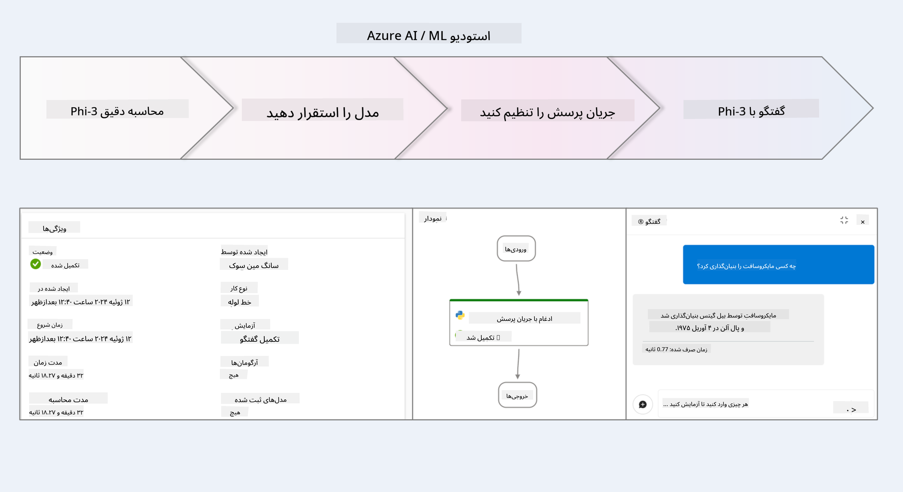

### فهرست مطالب

1. **[سناریو 1: تنظیم منابع Azure و آماده‌سازی برای تنظیم دقیق](../../../../../../md/02.Application/01.TextAndChat/Phi3)**
    - [ایجاد فضای کاری Azure Machine Learning](../../../../../../md/02.Application/01.TextAndChat/Phi3)
    - [درخواست سهمیه GPU در اشتراک Azure](../../../../../../md/02.Application/01.TextAndChat/Phi3)
    - [افزودن تخصیص نقش](../../../../../../md/02.Application/01.TextAndChat/Phi3)
    - [تنظیم پروژه](../../../../../../md/02.Application/01.TextAndChat/Phi3)
    - [آماده‌سازی مجموعه داده برای تنظیم دقیق](../../../../../../md/02.Application/01.TextAndChat/Phi3)

1. **[سناریو 2: تنظیم دقیق مدل Phi-3 و استقرار در Azure Machine Learning Studio](../../../../../../md/02.Application/01.TextAndChat/Phi3)**
    - [تنظیم دقیق مدل Phi-3](../../../../../../md/02.Application/01.TextAndChat/Phi3)
    - [استقرار مدل تنظیم شده Phi-3](../../../../../../md/02.Application/01.TextAndChat/Phi3)

1. **[سناریو 3: ادغام با جریان پرسش و گفتگو با مدل سفارشی خود در Azure AI Foundry](../../../../../../md/02.Application/01.TextAndChat/Phi3)**
    - [ادغام مدل سفارشی Phi-3 با جریان پرسش](../../../../../../md/02.Application/01.TextAndChat/Phi3)
    - [گفتگو با مدل سفارشی Phi-3](../../../../../../md/02.Application/01.TextAndChat/Phi3)

## سناریو 1: تنظیم منابع Azure و آماده‌سازی برای تنظیم دقیق

### ایجاد فضای کاری Azure Machine Learning

1. عبارت *azure machine learning* را در **نوار جستجو** بالای صفحه پورتال تایپ کنید و **Azure Machine Learning** را از گزینه‌های نمایش داده شده انتخاب کنید.

    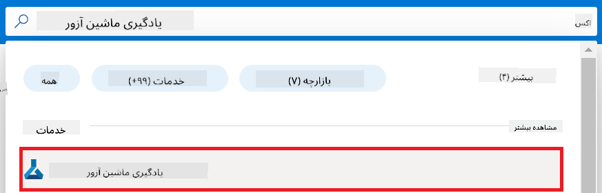

2. از منوی ناوبری **+ Create** را انتخاب کنید.

3. از منوی ناوبری **New workspace** را انتخاب کنید.

    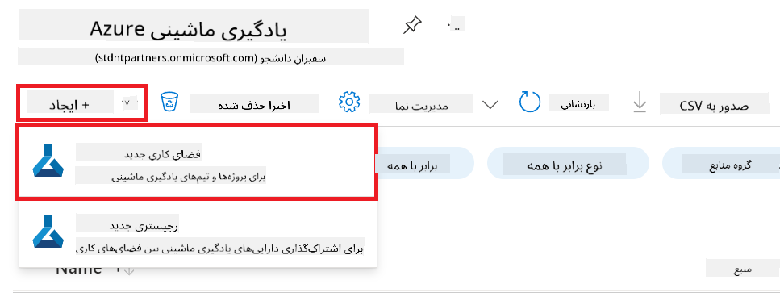

4. وظایف زیر را انجام دهید:

    - اشتراک Azure **Subscription** خود را انتخاب کنید.
    - گروه منابع **Resource group** را انتخاب کنید (در صورت نیاز یک گروه جدید ایجاد کنید).
    - نام فضای کاری **Workspace Name** را وارد کنید. باید یک مقدار منحصر به فرد باشد.
    - منطقه **Region** مورد نظر خود را انتخاب کنید.
    - حساب ذخیره‌سازی **Storage account** مورد نظر خود را انتخاب کنید (در صورت نیاز یک حساب جدید ایجاد کنید).
    - خزانه کلید **Key vault** مورد نظر خود را انتخاب کنید (در صورت نیاز یک خزانه جدید ایجاد کنید).
    - بینش‌های برنامه **Application insights** مورد نظر خود را انتخاب کنید (در صورت نیاز یک بینش جدید ایجاد کنید).
    - رجیستری کانتینر **Container registry** مورد نظر خود را انتخاب کنید (در صورت نیاز یک رجیستری جدید ایجاد کنید).

    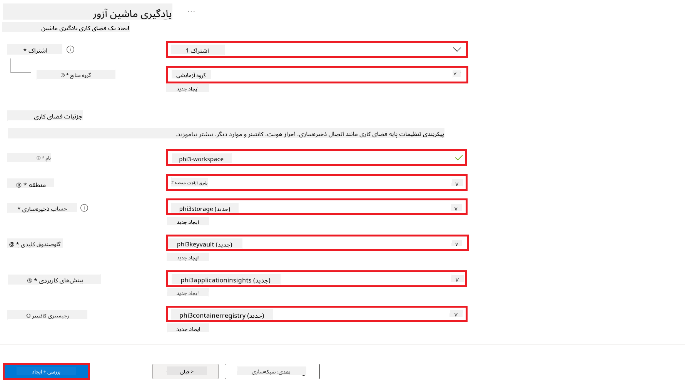

5. **Review + Create** را انتخاب کنید.

6. **Create** را انتخاب کنید.

### درخواست سهمیه GPU در اشتراک Azure

در این آموزش، شما یاد خواهید گرفت که چگونه یک مدل Phi-3 را تنظیم دقیق کرده و استقرار دهید، با استفاده از GPUها. برای تنظیم دقیق، از GPU *Standard_NC24ads_A100_v4* استفاده خواهید کرد که نیاز به درخواست سهمیه دارد. برای استقرار، از GPU *Standard_NC6s_v3* استفاده خواهید کرد که همچنین نیاز به درخواست سهمیه دارد.

> [!NOTE]
>
> فقط اشتراک‌های Pay-As-You-Go (نوع اشتراک استاندارد) واجد شرایط تخصیص GPU هستند؛ اشتراک‌های مزیتی در حال حاضر پشتیبانی نمی‌شوند.
>

1. به [Azure ML Studio](https://ml.azure.com/home?wt.mc_id=studentamb_279723) مراجعه کنید.

1. وظایف زیر را برای درخواست سهمیه *Standard NCADSA100v4 Family* انجام دهید:

    - از تب سمت چپ **Quota** را انتخاب کنید.
    - خانواده ماشین مجازی **Virtual machine family** مورد نظر را انتخاب کنید. به عنوان مثال، **Standard NCADSA100v4 Family Cluster Dedicated vCPUs** را انتخاب کنید که شامل GPU *Standard_NC24ads_A100_v4* می‌شود.
    - از منوی ناوبری **Request quota** را انتخاب کنید.

        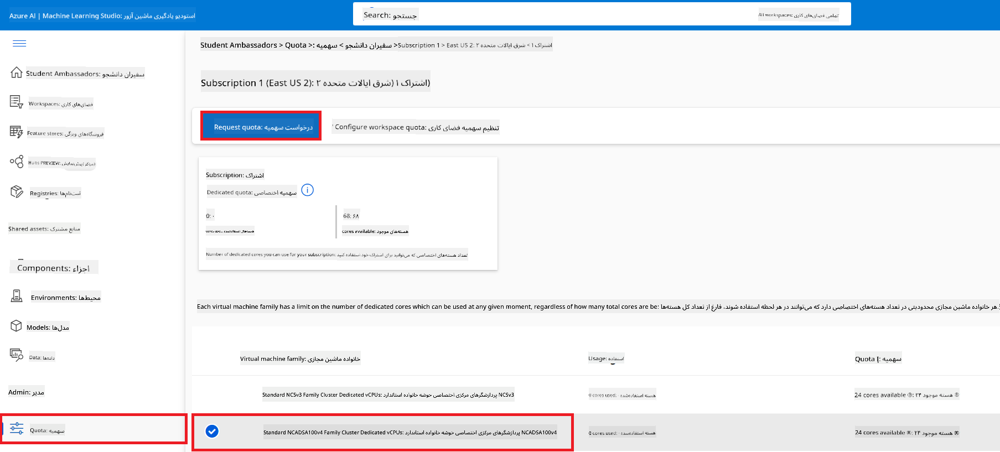

    - در صفحه درخواست سهمیه، حد جدید هسته‌ها **New cores limit** مورد نظر خود را وارد کنید. به عنوان مثال، 24.
    - در صفحه درخواست سهمیه، **Submit** را انتخاب کنید تا سهمیه GPU درخواست شود.

1. وظایف زیر را برای درخواست سهمیه *Standard NCSv3 Family* انجام دهید:

    - از تب سمت چپ **Quota** را انتخاب کنید.
    - خانواده ماشین مجازی **Virtual machine family** مورد نظر را انتخاب کنید. به عنوان مثال، **Standard NCSv3 Family Cluster Dedicated vCPUs** را انتخاب کنید که شامل GPU *Standard_NC6s_v3* می‌شود.
    - از منوی ناوبری **Request quota** را انتخاب کنید.
    - در صفحه درخواست سهمیه، حد جدید هسته‌ها **New cores limit** مورد نظر خود را وارد کنید. به عنوان مثال، 24.
    - در صفحه درخواست سهمیه، **Submit** را انتخاب کنید تا سهمیه GPU درخواست شود.

### افزودن تخصیص نقش

برای تنظیم دقیق و استقرار مدل‌های خود، ابتدا باید یک هویت مدیریت شده اختصاصی کاربر (UAI) ایجاد کرده و مجوزهای مناسب را به آن اختصاص دهید. این UAI برای احراز هویت در طول فرآیند استقرار استفاده خواهد شد.

#### ایجاد هویت مدیریت شده اختصاصی کاربر (UAI)

1. عبارت *managed identities* را در **نوار جستجو** بالای صفحه پورتال تایپ کنید و **Managed Identities** را از گزینه‌های نمایش داده شده انتخاب کنید.

    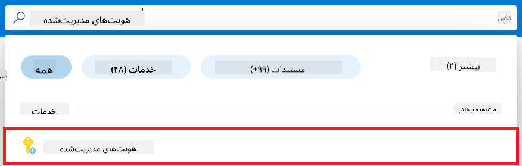

1. **+ Create** را انتخاب کنید.

    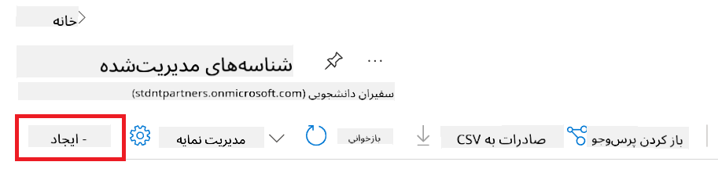

1. وظایف زیر را انجام دهید:

    - اشتراک Azure **Subscription** خود را انتخاب کنید.
    - گروه منابع **Resource group** مورد نظر را انتخاب کنید (در صورت نیاز یک گروه جدید ایجاد کنید).
    - منطقه **Region** مورد نظر خود را انتخاب کنید.
    - نام **Name** را وارد کنید. باید یک مقدار منحصر به فرد باشد.

    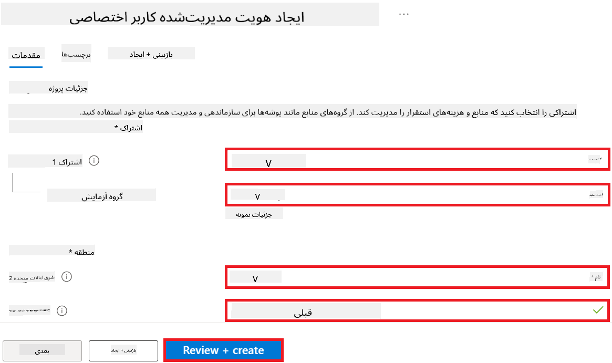

1. **Review + create** را انتخاب کنید.

1. **+ Create** را انتخاب کنید.

#### افزودن تخصیص نقش Contributor به هویت مدیریت شده

1. به منبع هویت مدیریت شده که ایجاد کرده‌اید بروید.

1. از تب سمت چپ **Azure role assignments** را انتخاب کنید.

1. از منوی ناوبری **+Add role assignment** را انتخاب کنید.

1. در صفحه افزودن تخصیص نقش، وظایف زیر را انجام دهید:
    - **Scope** را به **Resource group** تنظیم کنید.
    - اشتراک Azure **Subscription** خود را انتخاب کنید.
    - گروه منابع **Resource group** مورد نظر را انتخاب کنید.
    - **Role** را به **Contributor** تنظیم کنید.

    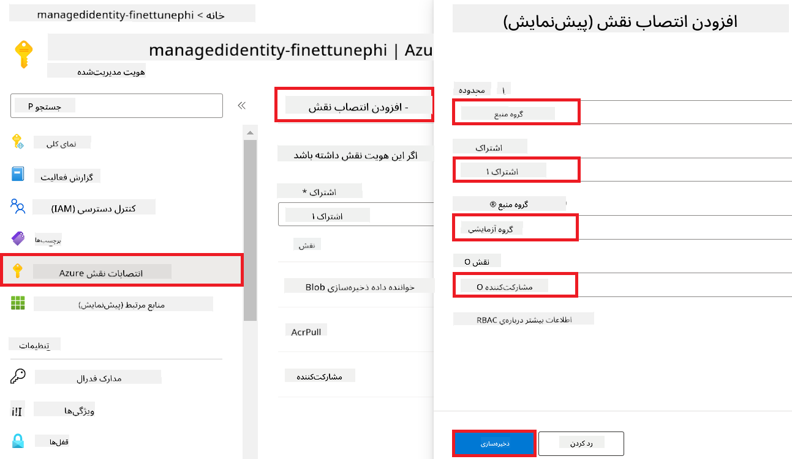

2. **Save** را انتخاب کنید.

#### افزودن تخصیص نقش Storage Blob Data Reader به هویت مدیریت شده

1. عبارت *storage accounts* را در **نوار جستجو** بالای صفحه پورتال تایپ کنید و **Storage accounts** را از گزینه‌های نمایش داده شده انتخاب کنید.

    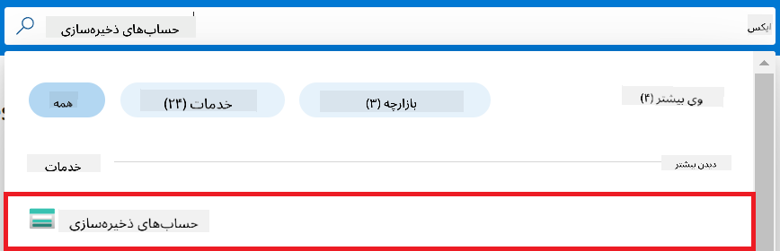

1. حساب ذخیره‌سازی مرتبط با فضای کاری Azure Machine Learning که ایجاد کرده‌اید را انتخاب کنید. به عنوان مثال، *finetunephistorage*.

1. وظایف زیر را برای رفتن به صفحه افزودن تخصیص نقش انجام دهید:

    - به حساب ذخیره‌سازی Azure که ایجاد کرده‌اید بروید.
    - از تب سمت چپ **Access Control (IAM)** را انتخاب کنید.
    - از منوی ناوبری **+ Add** را انتخاب کنید.
    - از منوی ناوبری **Add role assignment** را انتخاب کنید.

    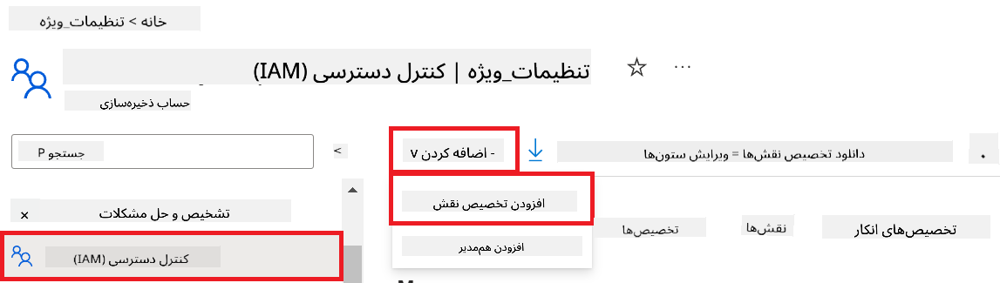

1. در صفحه افزودن تخصیص نقش، وظایف زیر را انجام دهید:

    - در صفحه نقش، عبارت *Storage Blob Data Reader* را در **نوار جستجو** تایپ کنید و **Storage Blob Data Reader** را از گزینه‌های نمایش داده شده انتخاب کنید.
    - در صفحه نقش، **Next** را انتخاب کنید.
    - در صفحه اعضا، **Assign access to** را به **Managed identity** تنظیم کنید.
    - در صفحه اعضا، **+ Select members** را انتخاب کنید.
    - در صفحه انتخاب هویت‌های مدیریت شده، اشتراک Azure **Subscription** خود را انتخاب کنید.
    - در صفحه انتخاب هویت‌های مدیریت شده، **Managed identity** را به **Manage Identity** تنظیم کنید.
    - در صفحه انتخاب هویت‌های مدیریت شده، هویت مدیریت شده‌ای که ایجاد کرده‌اید را انتخاب کنید. به عنوان مثال، *finetunephi-managedidentity*.
    - در صفحه انتخاب هویت‌های مدیریت شده، **Select** را انتخاب کنید.

    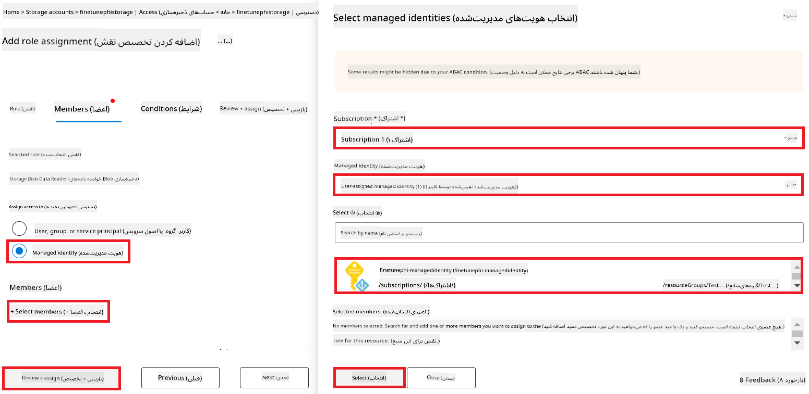

1. **Review + assign** را انتخاب کنید.

#### افزودن تخصیص نقش AcrPull به هویت مدیریت شده

1. عبارت *container registries* را در **نوار جستجو** بالای صفحه پورتال تایپ کنید و **Container registries** را از گزینه‌های نمایش داده شده انتخاب کنید.

    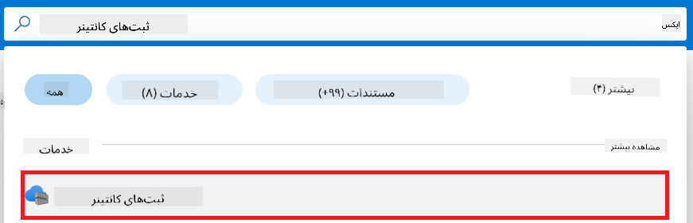

1. رجیستری کانتینر مرتبط با فضای کاری Azure Machine Learning را انتخاب کنید. به عنوان مثال، *finetunephicontainerregistry*

1. وظایف زیر را برای رفتن به صفحه افزودن تخصیص نقش انجام دهید:

    - از تب سمت چپ **Access Control (IAM)** را انتخاب کنید.
    - از منوی ناوبری **+ Add** را انتخاب کنید.
    - از منوی ناوبری **Add role assignment** را انتخاب کنید.

1. در صفحه افزودن تخصیص نقش، وظایف زیر را انجام دهید:

    - در صفحه نقش، عبارت *AcrPull* را در **نوار جستجو** تایپ کنید و **AcrPull** را از گزینه‌های نمایش داده شده انتخاب کنید.
    - در صفحه نقش، **Next** را انتخاب کنید.
    - در صفحه اعضا، **Assign access to** را به **Managed identity** تنظیم کنید.
    - در صفحه اعضا، **+ Select members** را انتخاب کنید.
    - در صفحه انتخاب هویت‌های مدیریت شده، اشتراک Azure **Subscription** خود را انتخاب کنید.
    - در صفحه انتخاب هویت‌های مدیریت شده، **Managed identity** را به **Manage Identity** تنظیم کنید.
    - در صفحه انتخاب هویت‌های مدیریت شده، هویت مدیریت شده‌ای که ایجاد کرده‌اید را انتخاب کنید. به عنوان مثال، *finetunephi-managedidentity*.
    - در صفحه انتخاب هویت‌های مدیریت شده، **Select** را انتخاب کنید.
    - **Review + assign** را انتخاب کنید.

### تنظیم پروژه

برای دانلود مجموعه داده‌های مورد نیاز برای تنظیم دقیق، شما باید یک محیط محلی تنظیم کنید.

در این تمرین، شما:

- یک پوشه ایجاد خواهید کرد تا در آن کار کنید.
- یک محیط مجازی ایجاد خواهید کرد.
- بسته‌های مورد نیاز را نصب خواهید کرد.
- یک فایل *download_dataset.py* ایجاد خواهید کرد تا مجموعه داده‌ها را دانلود کند.

#### ایجاد یک پوشه برای کار در آن

1. یک پنجره ترمینال باز کنید و دستور زیر را برای ایجاد یک پوشه به نام *finetune-phi* در مسیر پیش‌فرض وارد کنید.

    ```console
    mkdir finetune-phi
    ```

2. دستور زیر را در ترمینال خود وارد کنید تا به پوشه *finetune-phi* که ایجاد کرده‌اید بروید.

    ```console
    cd finetune-phi
    ```

#### ایجاد یک محیط مجازی

1. دستور زیر را در ترمینال خود وارد کنید تا یک محیط مجازی به نام *.venv* ایجاد کنید.

    ```console
    python -m venv .venv
    ```

2. دستور زیر را در ترمینال خود وارد کنید تا محیط مجازی را فعال کنید.

    ```console
    .venv\Scripts\activate.bat
    ```

> [!NOTE]
> اگر موفقیت‌آمیز بود، باید *(.venv)* را قبل از خط فرمان مشاهده کنید.

#### نصب بسته‌های مورد نیاز

1. دستورات زیر را در ترمینال خود وارد کنید تا بسته‌های مورد نیاز نصب شوند.

    ```console
    pip install datasets==2.19.1
    ```

#### ایجاد فایل `download_dataset.py`

> [!NOTE]
> ساختار کامل پوشه:
>
> ```text
> └── YourUserName
> .    └── finetune-phi
> .        └── download_dataset.py
> ```

1. **Visual Studio Code** را باز کنید.

1. از نوار منو **File** را انتخاب کنید.

1. **Open Folder** را انتخاب کنید.

1. پوشه *finetune-phi* که ایجاد کرده‌اید را انتخاب کنید، که در مسیر *C:\Users\yourUserName\finetune-phi* قرار دارد.

    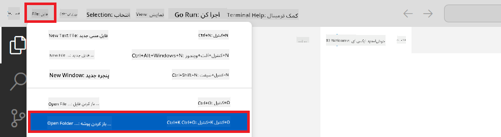

1. در پانل سمت چپ Visual Studio Code، کلیک راست کرده و **New File** را انتخاب کنید تا یک فایل جدید به نام *download_dataset.py* ایجاد کنید.

    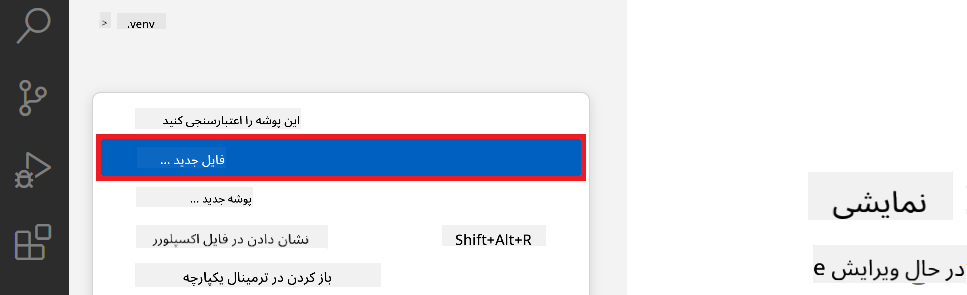

### آماده‌سازی مجموعه داده برای تنظیم دقیق

در این تمرین، فایل *download_dataset.py* را اجرا خواهید کرد تا مجموعه داده‌های *ultrachat_200k* را به محیط محلی خود دانلود کنید. سپس از این مجموعه داده‌ها برای تنظیم دقیق مدل Phi-3 در Azure Machine Learning استفاده خواهید کرد.

در این تمرین، شما:

- کد را به فایل *download_dataset.py* اضافه خواهید کرد تا مجموعه داده‌ها را دانلود کند.
- فایل *download_dataset.py* را اجرا خواهید کرد تا مجموعه داده‌ها به محیط محلی شما دانلود شوند.

#### دانلود مجموعه داده با استفاده از فایل *download_dataset.py*

1. فایل *download_dataset.py* را در Visual Studio Code باز کنید.

1. کد زیر را به فایل *download_dataset.py* اضافه کنید.

    ```python
    import json
    import os
    from datasets import load_dataset

    def load_and_split_dataset(dataset_name, config_name, split_ratio):
        """
        Load and split a dataset.
        """
        # Load the dataset with the specified name, configuration, and split ratio
        dataset = load_dataset(dataset_name, config_name, split=split_ratio)
        print(f"Original dataset size: {len(dataset)}")
        
        # Split the dataset into train and test sets (80% train, 20% test)
        split_dataset = dataset.train_test_split(test_size=0.2)
        print(f"Train dataset size: {len(split_dataset['train'])}")
        print(f"Test dataset size: {len(split_dataset['test'])}")
        
        return split_dataset

    def save_dataset_to_jsonl(dataset, filepath):
        """
        Save a dataset to a JSONL file.
        """
        # Create the directory if it does not exist
        os.makedirs(os.path.dirname(filepath), exist_ok=True)
        
        # Open the file in write mode
        with open(filepath, 'w', encoding='utf-8') as f:
            # Iterate over each record in the dataset
            for record in dataset:
                # Dump the record as a JSON object and write it to the file
                json.dump(record, f)
                # Write a newline character to separate records
                f.write('\n')
        
        print(f"Dataset saved to {filepath}")

    def main():
        """
        Main function to load, split, and save the dataset.
        """
        # Load and split the ULTRACHAT_200k dataset with a specific configuration and split ratio
        dataset = load_and_split_dataset("HuggingFaceH4/ultrachat_200k", 'default', 'train_sft[:1%]')
        
        # Extract the train and test datasets from the split
        train_dataset = dataset['train']
        test_dataset = dataset['test']

        # Save the train dataset to a JSONL file
        save_dataset_to_jsonl(train_dataset, "data/train_data.jsonl")
        
        # Save the test dataset to a separate JSONL file
        save_dataset_to_jsonl(test_dataset, "data/test_data.jsonl")

    if __name__ == "__main__":
        main()

    ```

1. دستور زیر را در ترمینال خود وارد کنید تا اسکریپت اجرا شود و مجموعه داده به محیط محلی شما دانلود شود.

    ```console
    python download_dataset.py
    ```

1. اطمینان حاصل کنید که مجموعه داده‌ها به درستی در دایرکتوری محلی *finetune-phi/data* ذخیره شده‌اند.

> [!NOTE]
>
> #### نکته‌ای درباره اندازه مجموعه داده و زمان تنظیم دقیق
>
> در این آموزش، شما فقط از 1٪ مجموعه داده (`split='train[:1%]'`) استفاده می‌کنید. این به طور قابل توجهی مقدار داده را کاهش می‌دهد و فرآیندهای آپلود و تنظیم دقیق را سرعت می‌بخشد. شما می‌توانید درصد را تنظیم کنید تا تعادل مناسب بین زمان آموزش و عملکرد مدل را پیدا کنید. استفاده از یک زیرمجموعه کوچک‌تر از مجموعه داده، زمان مورد نیاز برای تنظیم دقیق را کاهش می‌دهد و فرآیند را برای یک آموزش ساده‌تر قابل مدیریت می‌کند.

## سناریو 2: تنظیم دقیق مدل Phi-3 و استقرار در
1. به [Azure ML Studio](https://ml.azure.com/home?wt.mc_id=studentamb_279723) مراجعه کنید.

1. از تب سمت چپ **Compute** را انتخاب کنید.

1. از منوی ناوبری **Compute clusters** را انتخاب کنید.

1. روی **+ New** کلیک کنید.

    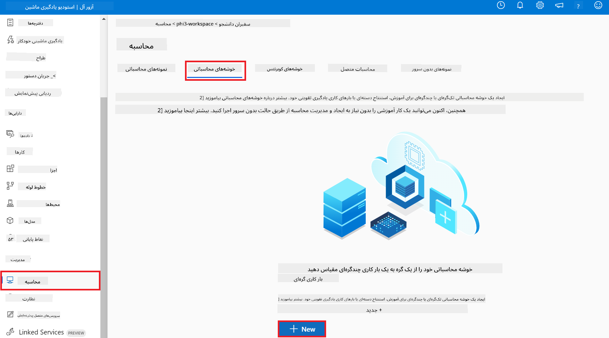

1. وظایف زیر را انجام دهید:

    - **Region** مورد نظر خود را انتخاب کنید.
    - **Virtual machine tier** را به **Dedicated** تنظیم کنید.
    - **Virtual machine type** را به **GPU** تنظیم کنید.
    - فیلتر **Virtual machine size** را به **Select from all options** تنظیم کنید.
    - **Virtual machine size** را به **Standard_NC24ads_A100_v4** انتخاب کنید.

    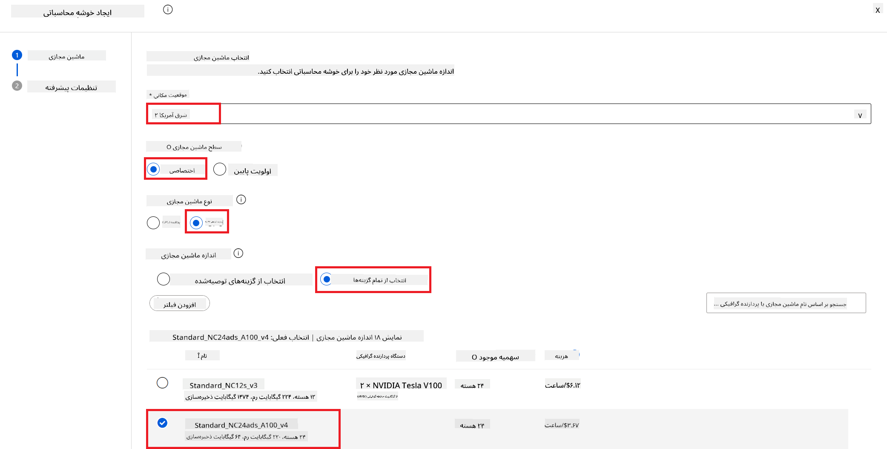

1. روی **Next** کلیک کنید.

1. وظایف زیر را انجام دهید:

    - **Compute name** وارد کنید. این مقدار باید منحصر به فرد باشد.
    - **Minimum number of nodes** را به **0** تنظیم کنید.
    - **Maximum number of nodes** را به **1** تنظیم کنید.
    - **Idle seconds before scale down** را به **120** تنظیم کنید.

    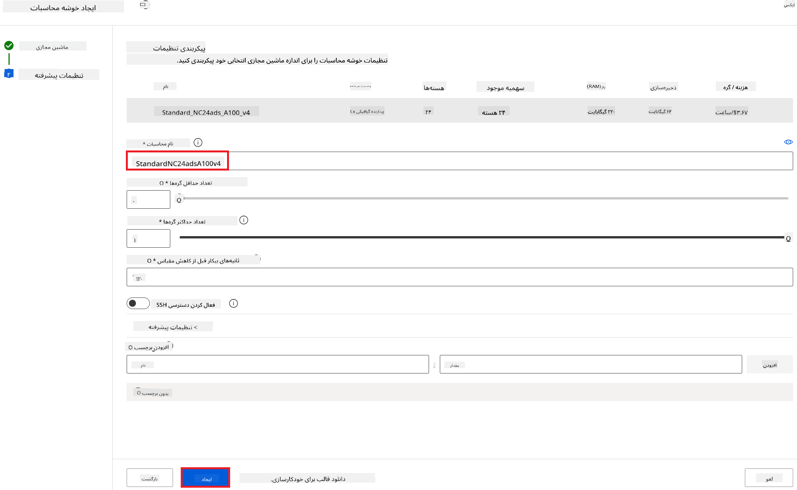

1. روی **Create** کلیک کنید.

#### تنظیم مدل Phi-3

1. به [Azure ML Studio](https://ml.azure.com/home?wt.mc_id=studentamb_279723) مراجعه کنید.

1. فضای کاری Azure Machine Learning که ایجاد کرده‌اید را انتخاب کنید.

    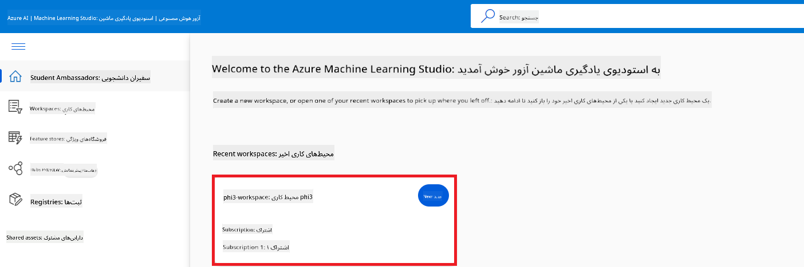

1. وظایف زیر را انجام دهید:

    - از تب سمت چپ **Model catalog** را انتخاب کنید.
    - در **search bar** عبارت *phi-3-mini-4k* را تایپ کنید و از گزینه‌های ظاهر شده **Phi-3-mini-4k-instruct** را انتخاب کنید.

    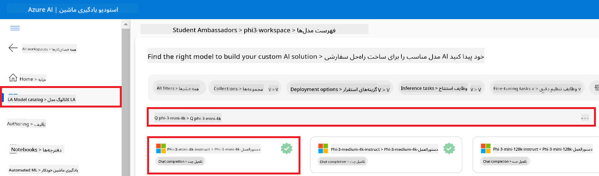

1. از منوی ناوبری **Fine-tune** را انتخاب کنید.

    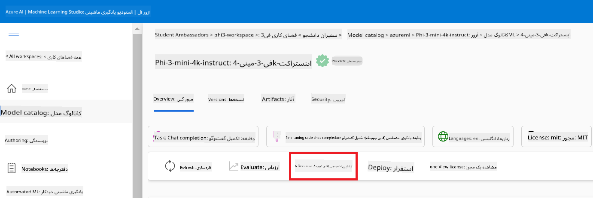

1. وظایف زیر را انجام دهید:

    - **Select task type** را به **Chat completion** تنظیم کنید.
    - روی **+ Select data** کلیک کنید تا **Training data** را آپلود کنید.
    - نوع آپلود داده‌های اعتبارسنجی را به **Provide different validation data** تنظیم کنید.
    - روی **+ Select data** کلیک کنید تا **Validation data** را آپلود کنید.

    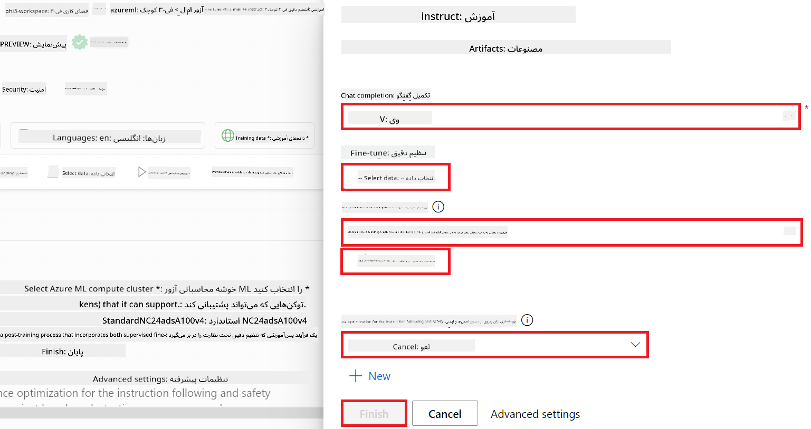

    > [!TIP]
    >
    > می‌توانید **Advanced settings** را انتخاب کنید تا تنظیماتی مانند **learning_rate** و **lr_scheduler_type** را سفارشی‌سازی کنید و فرآیند تنظیم دقیق را بر اساس نیازهای خاص خود بهینه کنید.

1. روی **Finish** کلیک کنید.

1. در این تمرین، شما با موفقیت مدل Phi-3 را با استفاده از Azure Machine Learning تنظیم کردید. توجه داشته باشید که فرآیند تنظیم ممکن است زمان زیادی ببرد. پس از اجرای کار تنظیم، باید منتظر بمانید تا کامل شود. می‌توانید وضعیت کار تنظیم را با مراجعه به تب Jobs در سمت چپ فضای کاری Azure Machine Learning خود مشاهده کنید. در سری بعدی، مدل تنظیم‌شده را مستقر کرده و آن را با Prompt flow یکپارچه خواهید کرد.

    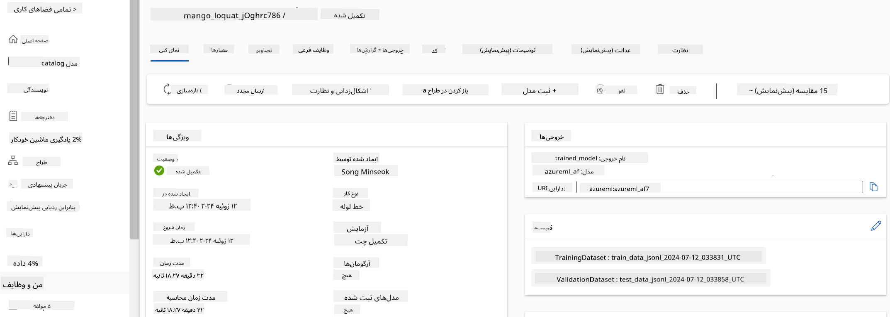

### استقرار مدل تنظیم‌شده Phi-3

برای یکپارچه‌سازی مدل تنظیم‌شده Phi-3 با Prompt flow، باید مدل را مستقر کنید تا برای استنتاج بلادرنگ قابل دسترس باشد. این فرآیند شامل ثبت مدل، ایجاد یک نقطه پایانی آنلاین و استقرار مدل می‌شود.

در این تمرین، شما:

- مدل تنظیم‌شده را در فضای کاری Azure Machine Learning ثبت می‌کنید.
- یک نقطه پایانی آنلاین ایجاد می‌کنید.
- مدل تنظیم‌شده Phi-3 ثبت‌شده را مستقر می‌کنید.

#### ثبت مدل تنظیم‌شده

1. به [Azure ML Studio](https://ml.azure.com/home?wt.mc_id=studentamb_279723) مراجعه کنید.

1. فضای کاری Azure Machine Learning که ایجاد کرده‌اید را انتخاب کنید.

    

1. از تب سمت چپ **Models** را انتخاب کنید.
1. روی **+ Register** کلیک کنید.
1. **From a job output** را انتخاب کنید.

    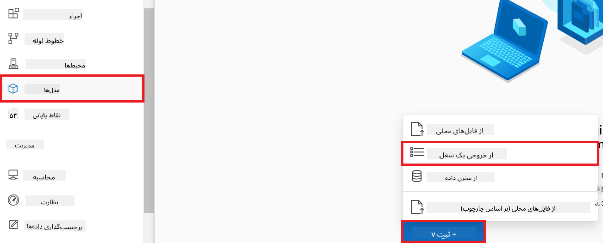

1. کار ایجاد شده را انتخاب کنید.

    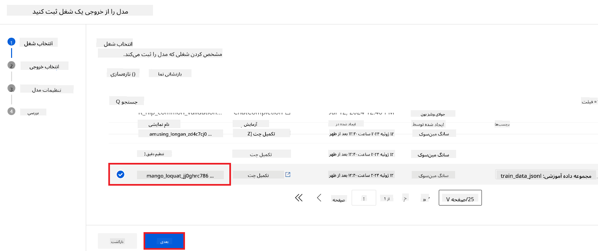

1. روی **Next** کلیک کنید.

1. **Model type** را به **MLflow** تنظیم کنید.

1. اطمینان حاصل کنید که **Job output** انتخاب شده باشد؛ باید به طور خودکار انتخاب شود.

    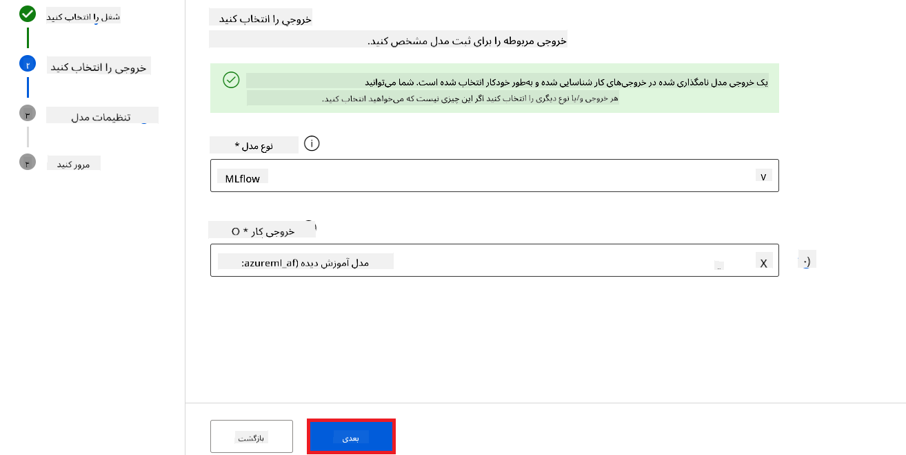

2. روی **Next** کلیک کنید.

3. روی **Register** کلیک کنید.

    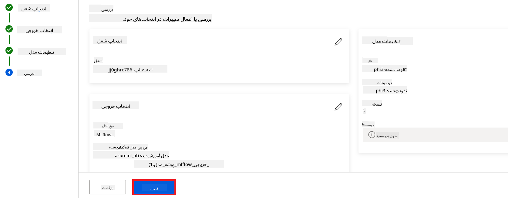

4. می‌توانید مدل ثبت‌شده خود را با مراجعه به منوی **Models** از تب سمت چپ مشاهده کنید.

    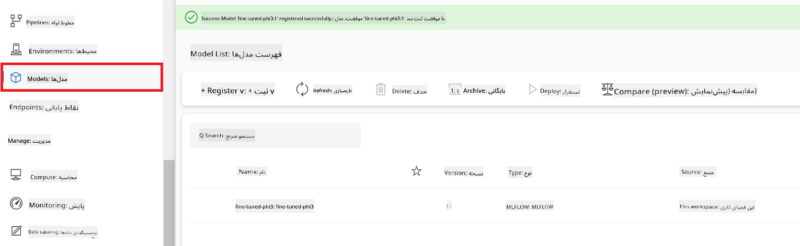

#### استقرار مدل تنظیم‌شده

1. به فضای کاری Azure Machine Learning که ایجاد کرده‌اید مراجعه کنید.

1. از تب سمت چپ **Endpoints** را انتخاب کنید.

1. از منوی ناوبری **Real-time endpoints** را انتخاب کنید.

    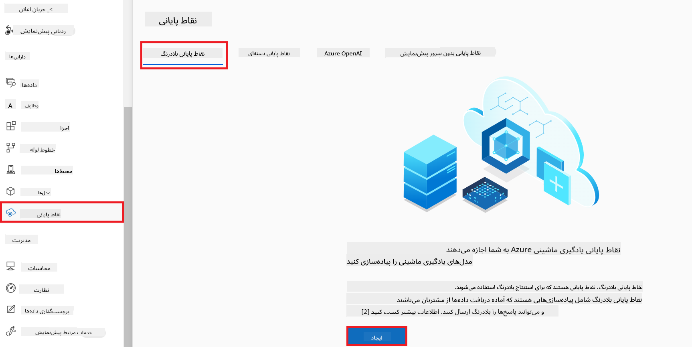

1. روی **Create** کلیک کنید.

1. مدل ثبت‌شده‌ای که ایجاد کرده‌اید را انتخاب کنید.

    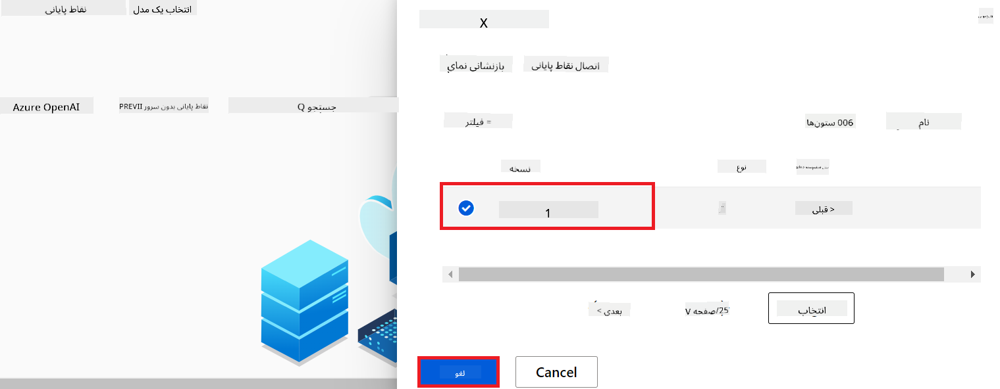

1. روی **Select** کلیک کنید.

1. وظایف زیر را انجام دهید:

    - **Virtual machine** را به *Standard_NC6s_v3* تنظیم کنید.
    - **Instance count** مورد نظر خود را انتخاب کنید. برای مثال، *1*.
    - **Endpoint** را به **New** تنظیم کنید تا یک نقطه پایانی ایجاد کنید.
    - **Endpoint name** وارد کنید. این مقدار باید منحصر به فرد باشد.
    - **Deployment name** وارد کنید. این مقدار باید منحصر به فرد باشد.

    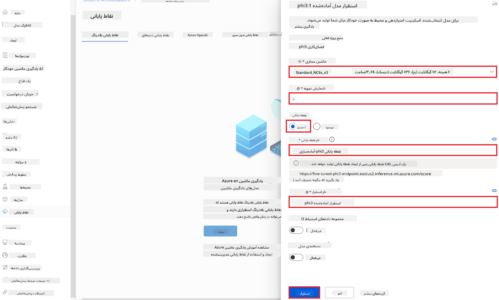

1. روی **Deploy** کلیک کنید.

> [!WARNING]
> برای جلوگیری از هزینه‌های اضافی، مطمئن شوید که نقطه پایانی ایجاد شده را در فضای کاری Azure Machine Learning حذف کنید.
>

#### بررسی وضعیت استقرار در فضای کاری Azure Machine Learning

1. به فضای کاری Azure Machine Learning که ایجاد کرده‌اید مراجعه کنید.

1. از تب سمت چپ **Endpoints** را انتخاب کنید.

1. نقطه پایانی ایجاد شده را انتخاب کنید.

    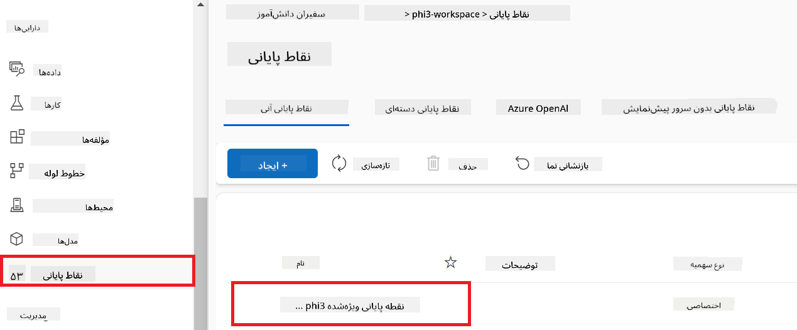

1. در این صفحه، می‌توانید نقاط پایانی را در طول فرآیند استقرار مدیریت کنید.

> [!NOTE]
> پس از تکمیل استقرار، اطمینان حاصل کنید که **Live traffic** به **100%** تنظیم شده باشد. اگر اینطور نیست، روی **Update traffic** کلیک کنید تا تنظیمات ترافیک را تغییر دهید. توجه داشته باشید که نمی‌توانید مدل را آزمایش کنید اگر ترافیک به 0% تنظیم شده باشد.
>
> 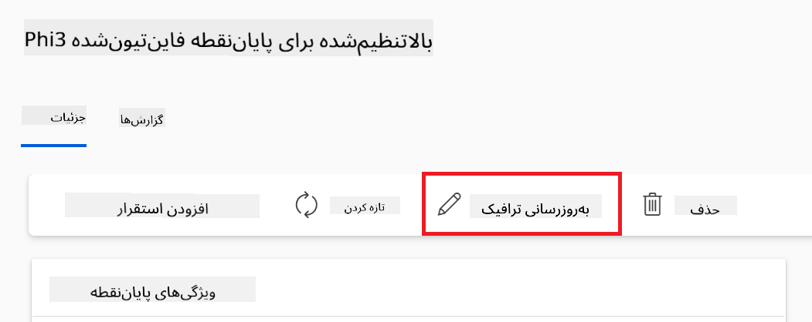
>

## سناریو ۳: یکپارچه‌سازی با Prompt flow و گفتگو با مدل سفارشی خود در Azure AI Foundry

### یکپارچه‌سازی مدل سفارشی Phi-3 با Prompt flow

پس از استقرار موفقیت‌آمیز مدل تنظیم‌شده، اکنون می‌توانید آن را با Prompt Flow یکپارچه کنید تا از مدل خود در برنامه‌های بلادرنگ استفاده کنید و انواع وظایف تعاملی را با مدل سفارشی Phi-3 خود انجام دهید.

در این تمرین، شما:

- یک Hub در Azure AI Foundry ایجاد می‌کنید.
- یک پروژه در Azure AI Foundry ایجاد می‌کنید.
- Prompt flow ایجاد می‌کنید.
- یک اتصال سفارشی برای مدل تنظیم‌شده Phi-3 اضافه می‌کنید.
- Prompt flow را تنظیم می‌کنید تا با مدل سفارشی Phi-3 خود گفتگو کنید.

> [!NOTE]
> همچنین می‌توانید با استفاده از Azure ML Studio با Promptflow یکپارچه شوید. همین فرآیند یکپارچه‌سازی را می‌توان در Azure ML Studio اعمال کرد.

#### ایجاد Hub در Azure AI Foundry

قبل از ایجاد پروژه، باید یک Hub ایجاد کنید. Hub مانند یک گروه منابع عمل می‌کند و به شما امکان می‌دهد چندین پروژه را در Azure AI Foundry سازماندهی و مدیریت کنید.

1. به [Azure AI Foundry](https://ai.azure.com/?WT.mc_id=aiml-137032-kinfeylo) مراجعه کنید.

1. از تب سمت چپ **All hubs** را انتخاب کنید.

1. از منوی ناوبری **+ New hub** را انتخاب کنید.

    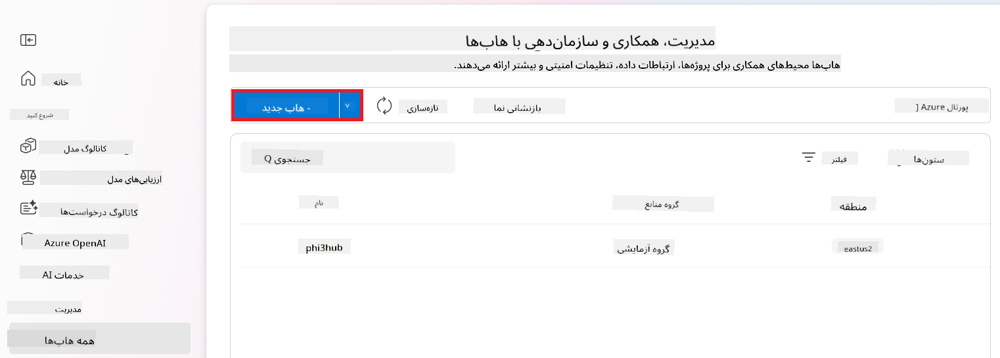

1. وظایف زیر را انجام دهید:

    - **Hub name** وارد کنید. این مقدار باید منحصر به فرد باشد.
    - **Subscription** Azure خود را انتخاب کنید.
    - **Resource group** مورد نظر خود را انتخاب کنید (در صورت نیاز یک مورد جدید ایجاد کنید).
    - **Location** مورد نظر خود را انتخاب کنید.
    - **Connect Azure AI Services** مورد نظر خود را انتخاب کنید (در صورت نیاز یک مورد جدید ایجاد کنید).
    - **Connect Azure AI Search** را به **Skip connecting** تنظیم کنید.

    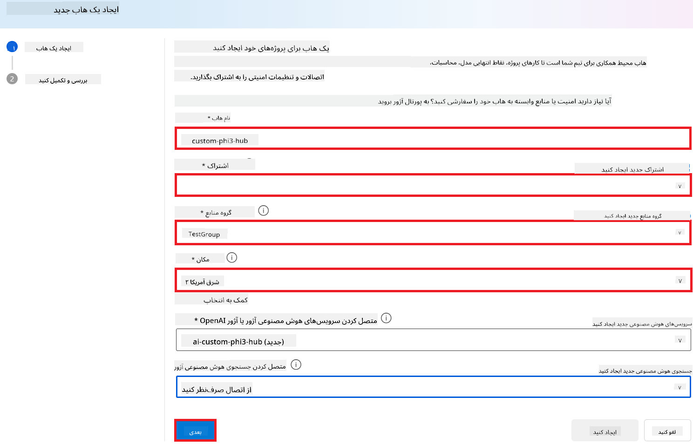

1. روی **Next** کلیک کنید.

#### ایجاد پروژه در Azure AI Foundry

1. در Hub ایجاد شده، از تب سمت چپ **All projects** را انتخاب کنید.

1. از منوی ناوبری **+ New project** را انتخاب کنید.

    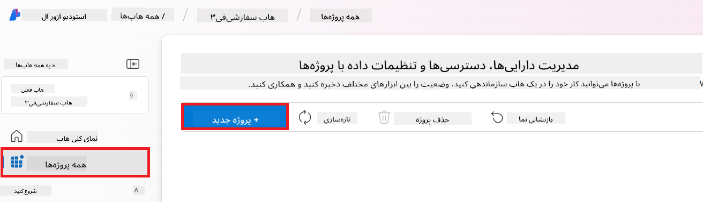

1. **Project name** وارد کنید. این مقدار باید منحصر به فرد باشد.

    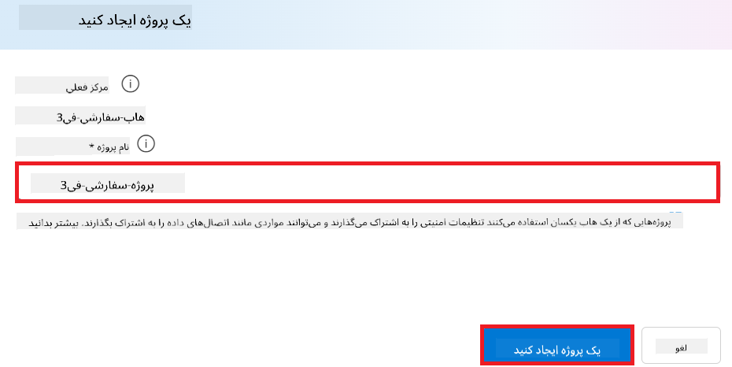

1. روی **Create a project** کلیک کنید.

#### اضافه کردن اتصال سفارشی برای مدل تنظیم‌شده Phi-3

برای یکپارچه‌سازی مدل سفارشی Phi-3 خود با Prompt flow، باید نقطه پایانی و کلید مدل را در یک اتصال سفارشی ذخیره کنید. این تنظیم دسترسی به مدل سفارشی Phi-3 شما را در Prompt flow تضمین می‌کند.

#### تنظیم کلید API و URI نقطه پایانی مدل تنظیم‌شده Phi-3

1. به [Azure ML Studio](https://ml.azure.com/home?WT.mc_id=aiml-137032-kinfeylo) مراجعه کنید.

1. به فضای کاری Azure Machine Learning که ایجاد کرده‌اید بروید.

1. از تب سمت چپ **Endpoints** را انتخاب کنید.

    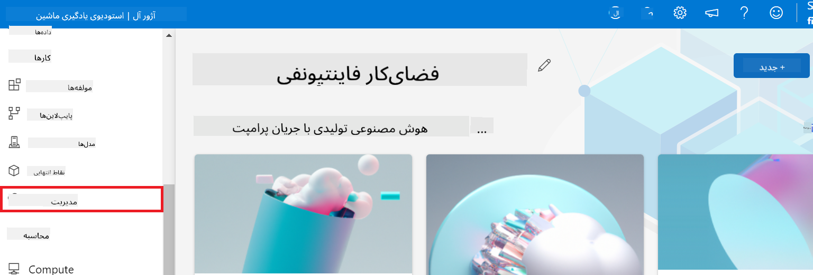

1. نقطه پایانی ایجاد شده را انتخاب کنید.

    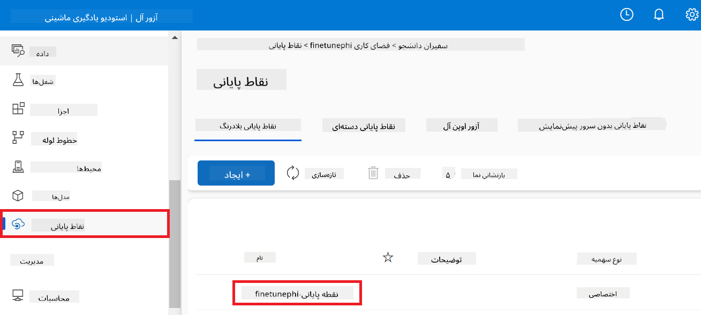

1. از منوی ناوبری **Consume** را انتخاب کنید.

1. **REST endpoint** و **Primary key** خود را کپی کنید.


#### افزودن اتصال سفارشی

1. به [Azure AI Foundry](https://ai.azure.com/?WT.mc_id=aiml-137032-kinfeylo) مراجعه کنید.

1. به پروژه Azure AI Foundry که ایجاد کرده‌اید بروید.

1. در پروژه‌ای که ایجاد کرده‌اید، از زبانه سمت چپ **Settings** را انتخاب کنید.

1. گزینه **+ New connection** را انتخاب کنید.

    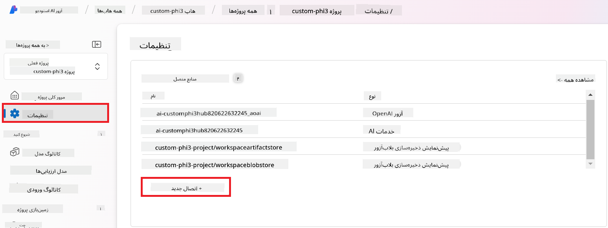

1. از منوی ناوبری **Custom keys** را انتخاب کنید.

    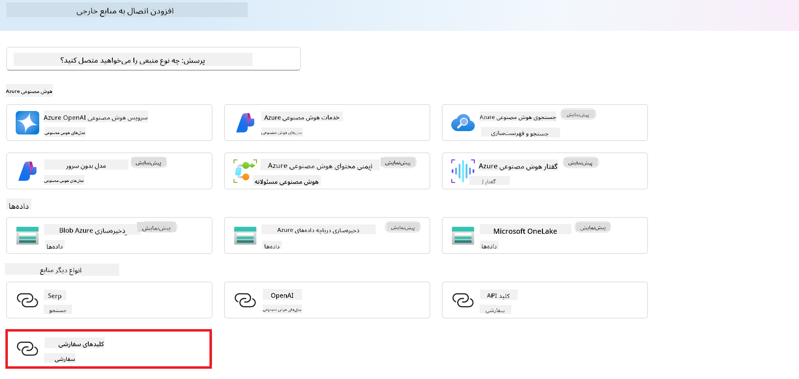

1. مراحل زیر را انجام دهید:

    - گزینه **+ Add key value pairs** را انتخاب کنید.
    - برای نام کلید، **endpoint** وارد کنید و نقطه پایانی که از Azure ML Studio کپی کرده‌اید را در قسمت مقدار قرار دهید.
    - دوباره گزینه **+ Add key value pairs** را انتخاب کنید.
    - برای نام کلید، **key** وارد کنید و کلیدی که از Azure ML Studio کپی کرده‌اید را در قسمت مقدار قرار دهید.
    - پس از افزودن کلیدها، گزینه **is secret** را انتخاب کنید تا از افشای کلید جلوگیری شود.

    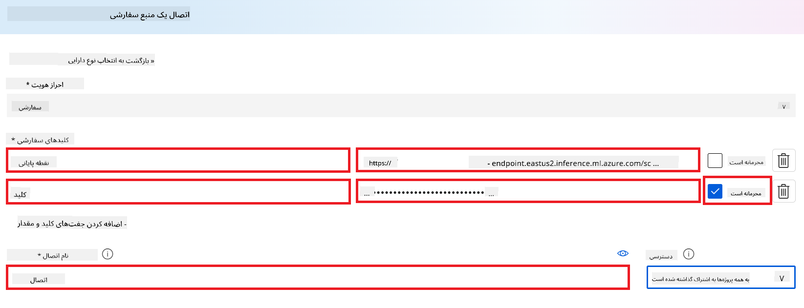

1. گزینه **Add connection** را انتخاب کنید.

#### ایجاد Prompt flow

شما یک اتصال سفارشی در Azure AI Foundry اضافه کرده‌اید. اکنون، بیایید یک Prompt flow ایجاد کنیم. سپس این Prompt flow را به اتصال سفارشی وصل می‌کنید تا بتوانید از مدل تنظیم‌شده درون Prompt flow استفاده کنید.

1. به پروژه Azure AI Foundry که ایجاد کرده‌اید بروید.

1. از زبانه سمت چپ **Prompt flow** را انتخاب کنید.

1. از منوی ناوبری **+ Create** را انتخاب کنید.

    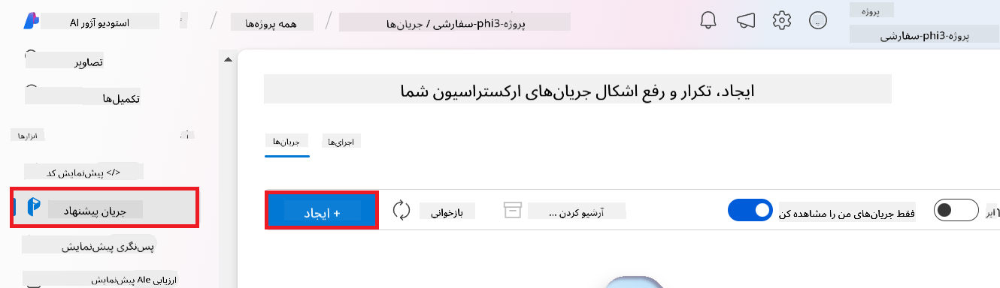

1. از منوی ناوبری **Chat flow** را انتخاب کنید.

    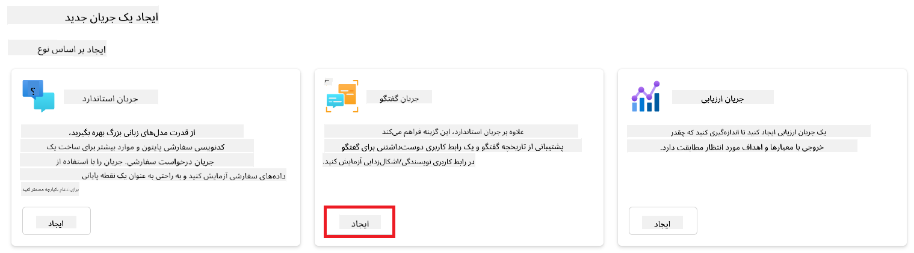

1. **Folder name** مورد نظر را وارد کنید.

    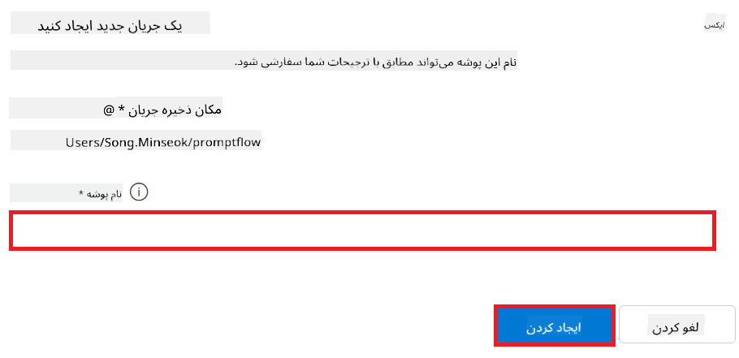

2. گزینه **Create** را انتخاب کنید.

#### تنظیم Prompt flow برای چت با مدل سفارشی Phi-3

شما باید مدل تنظیم‌شده Phi-3 را به یک Prompt flow ادغام کنید. با این حال، Prompt flow موجود برای این هدف طراحی نشده است. بنابراین، باید Prompt flow را بازطراحی کنید تا امکان ادغام مدل سفارشی فراهم شود.

1. در Prompt flow، مراحل زیر را برای بازسازی جریان موجود انجام دهید:

    - گزینه **Raw file mode** را انتخاب کنید.
    - تمام کد موجود در فایل *flow.dag.yml* را حذف کنید.
    - کد زیر را به فایل *flow.dag.yml* اضافه کنید.

        ```yml
        inputs:
          input_data:
            type: string
            default: "Who founded Microsoft?"

        outputs:
          answer:
            type: string
            reference: ${integrate_with_promptflow.output}

        nodes:
        - name: integrate_with_promptflow
          type: python
          source:
            type: code
            path: integrate_with_promptflow.py
          inputs:
            input_data: ${inputs.input_data}
        ```

    - گزینه **Save** را انتخاب کنید.

    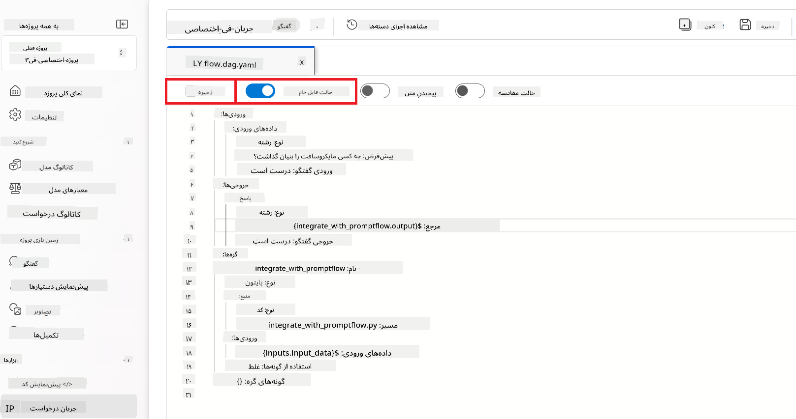

1. کد زیر را به فایل *integrate_with_promptflow.py* اضافه کنید تا از مدل سفارشی Phi-3 در Prompt flow استفاده کنید.

    ```python
    import logging
    import requests
    from promptflow import tool
    from promptflow.connections import CustomConnection

    # Logging setup
    logging.basicConfig(
        format="%(asctime)s - %(levelname)s - %(name)s - %(message)s",
        datefmt="%Y-%m-%d %H:%M:%S",
        level=logging.DEBUG
    )
    logger = logging.getLogger(__name__)

    def query_phi3_model(input_data: str, connection: CustomConnection) -> str:
        """
        Send a request to the Phi-3 model endpoint with the given input data using Custom Connection.
        """

        # "connection" is the name of the Custom Connection, "endpoint", "key" are the keys in the Custom Connection
        endpoint_url = connection.endpoint
        api_key = connection.key

        headers = {
            "Content-Type": "application/json",
            "Authorization": f"Bearer {api_key}"
        }
        data = {
            "input_data": {
                "input_string": [
                    {"role": "user", "content": input_data}
                ],
                "parameters": {
                    "temperature": 0.7,
                    "max_new_tokens": 128
                }
            }
        }
        try:
            response = requests.post(endpoint_url, json=data, headers=headers)
            response.raise_for_status()
            
            # Log the full JSON response
            logger.debug(f"Full JSON response: {response.json()}")

            result = response.json()["output"]
            logger.info("Successfully received response from Azure ML Endpoint.")
            return result
        except requests.exceptions.RequestException as e:
            logger.error(f"Error querying Azure ML Endpoint: {e}")
            raise

    @tool
    def my_python_tool(input_data: str, connection: CustomConnection) -> str:
        """
        Tool function to process input data and query the Phi-3 model.
        """
        return query_phi3_model(input_data, connection)

    ```

    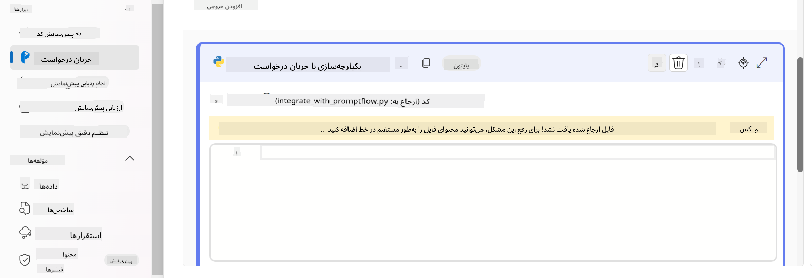

> [!NOTE]
> برای اطلاعات بیشتر در مورد استفاده از Prompt flow در Azure AI Foundry، می‌توانید به [Prompt flow in Azure AI Foundry](https://learn.microsoft.com/azure/ai-studio/how-to/prompt-flow) مراجعه کنید.

1. گزینه‌های **Chat input** و **Chat output** را انتخاب کنید تا چت با مدل شما فعال شود.

    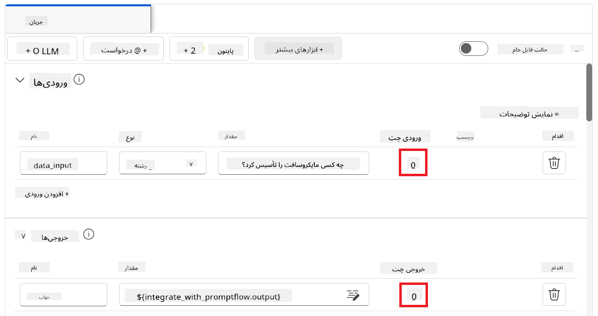

1. اکنون آماده چت با مدل سفارشی Phi-3 خود هستید. در تمرین بعدی، یاد می‌گیرید که چگونه Prompt flow را شروع کنید و از آن برای چت با مدل تنظیم‌شده Phi-3 خود استفاده کنید.

> [!NOTE]
>
> جریان بازسازی‌شده باید مانند تصویر زیر باشد:
>
> 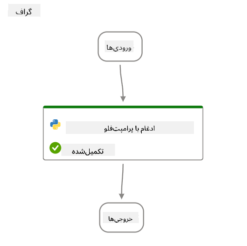
>

### چت با مدل سفارشی Phi-3 خود

اکنون که مدل سفارشی Phi-3 خود را تنظیم و با Prompt flow ادغام کرده‌اید، آماده هستید تا تعامل با آن را آغاز کنید. این تمرین شما را در فرآیند تنظیم و شروع چت با مدل خود با استفاده از Prompt flow راهنمایی می‌کند. با دنبال کردن این مراحل، می‌توانید از قابلیت‌های مدل تنظیم‌شده Phi-3 خود برای وظایف و مکالمات مختلف به طور کامل بهره ببرید.

- با مدل سفارشی Phi-3 خود از طریق Prompt flow چت کنید.

#### شروع Prompt flow

1. گزینه **Start compute sessions** را انتخاب کنید تا Prompt flow شروع شود.

    

1. گزینه **Validate and parse input** را انتخاب کنید تا پارامترها تازه‌سازی شوند.

    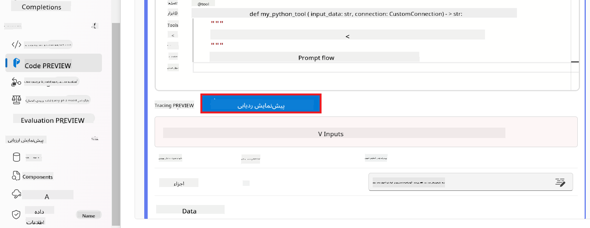

1. مقدار **connection** را به اتصال سفارشی که ایجاد کرده‌اید اختصاص دهید. به عنوان مثال، *connection*.

    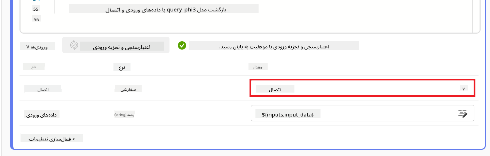

#### چت با مدل سفارشی خود

1. گزینه **Chat** را انتخاب کنید.

    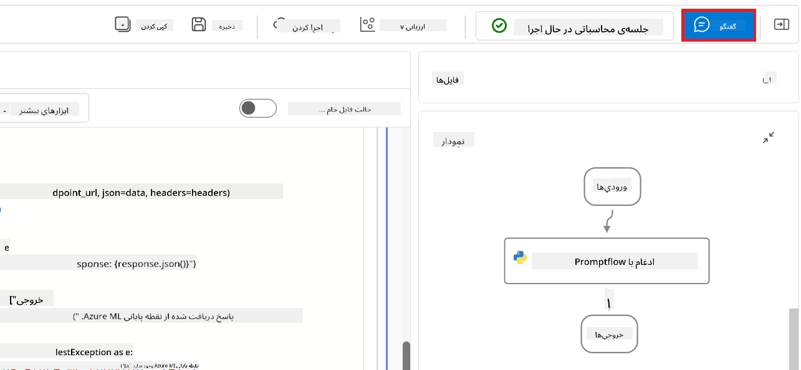

1. در اینجا نمونه‌ای از نتایج ارائه شده است: اکنون می‌توانید با مدل سفارشی Phi-3 خود چت کنید. توصیه می‌شود سوالاتی بر اساس داده‌های استفاده‌شده برای تنظیم بپرسید.

    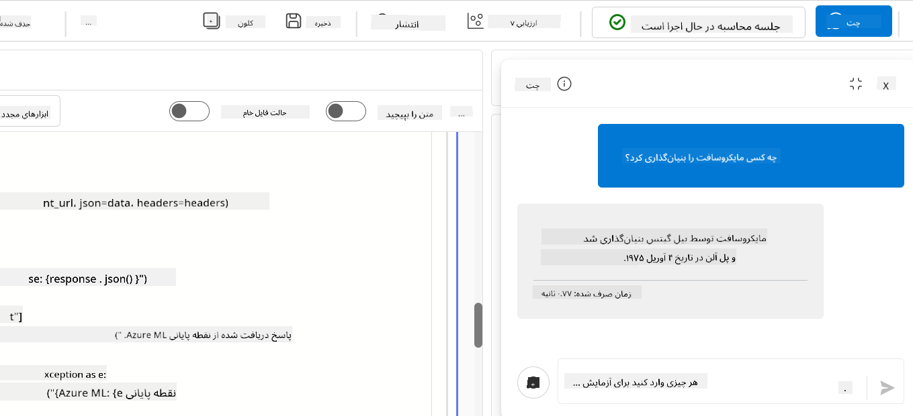

**سلب مسئولیت**:  
این سند با استفاده از سرویس ترجمه هوش مصنوعی [Co-op Translator](https://github.com/Azure/co-op-translator) ترجمه شده است. در حالی که ما تلاش می‌کنیم تا دقت ترجمه را تضمین کنیم، لطفاً توجه داشته باشید که ترجمه‌های خودکار ممکن است حاوی خطاها یا نواقصی باشند. سند اصلی به زبان اصلی باید به عنوان منبع معتبر در نظر گرفته شود. برای اطلاعات حساس، ترجمه انسانی حرفه‌ای توصیه می‌شود. ما هیچ مسئولیتی در قبال سوءتفاهم‌ها یا تفسیرهای نادرست ناشی از استفاده از این ترجمه نداریم.