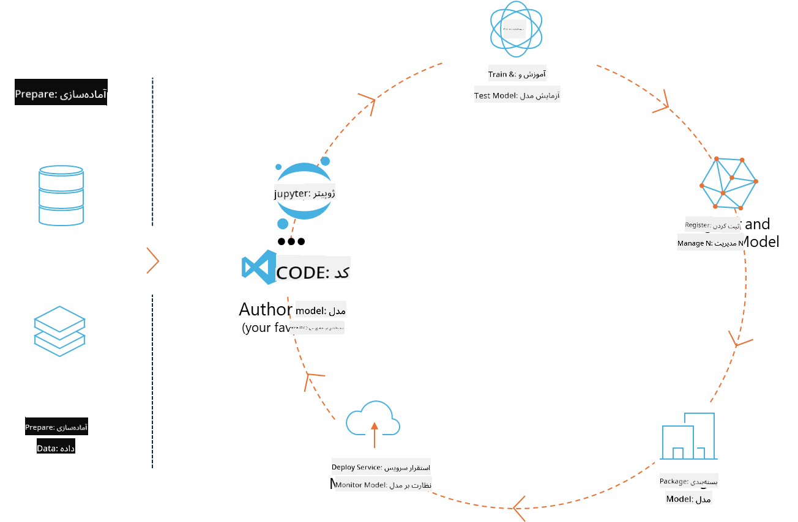
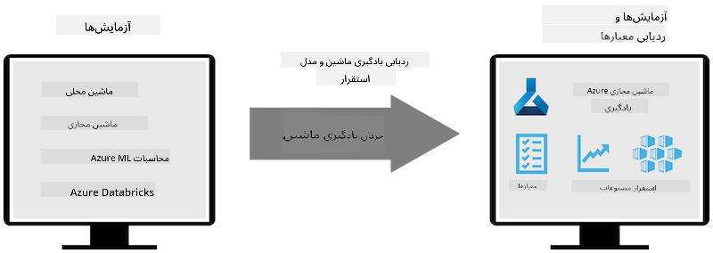
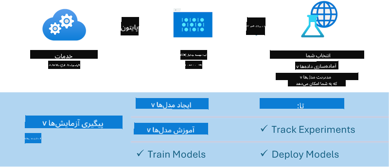

<!--
CO_OP_TRANSLATOR_METADATA:
{
  "original_hash": "f61c383bbf0c3dac97e43f833c258731",
  "translation_date": "2025-03-27T10:55:51+00:00",
  "source_file": "md\\02.Application\\01.TextAndChat\\Phi3\\E2E_Phi-3-MLflow.md",
  "language_code": "fa"
}
-->
# MLflow

[MLflow](https://mlflow.org/) یک پلتفرم متن‌باز است که برای مدیریت چرخه کامل یادگیری ماشین طراحی شده است.



MLFlow برای مدیریت چرخه یادگیری ماشین استفاده می‌شود، از جمله آزمایش‌ها، بازتولید، استقرار و یک ثبت مرکزی مدل. در حال حاضر MLFlow چهار مؤلفه ارائه می‌دهد:

- **MLflow Tracking:** ثبت و جستجوی آزمایش‌ها، کد، تنظیمات داده و نتایج.
- **MLflow Projects:** بسته‌بندی کد علوم داده در قالبی که امکان اجرای مجدد آن در هر پلتفرمی را فراهم می‌کند.
- **Mlflow Models:** استقرار مدل‌های یادگیری ماشین در محیط‌های مختلف سرویس‌دهی.
- **Model Registry:** ذخیره، توضیح و مدیریت مدل‌ها در یک مخزن مرکزی.

این پلتفرم قابلیت‌هایی برای پیگیری آزمایش‌ها، بسته‌بندی کد به منظور اجرای مجدد، و اشتراک‌گذاری و استقرار مدل‌ها دارد. MLFlow به Databricks متصل است و از کتابخانه‌های مختلف یادگیری ماشین پشتیبانی می‌کند، به این ترتیب مستقل از کتابخانه است. همچنین می‌توان آن را با هر زبان برنامه‌نویسی و هر کتابخانه یادگیری ماشین استفاده کرد، زیرا API REST و CLI برای راحتی فراهم می‌کند.



ویژگی‌های کلیدی MLFlow شامل موارد زیر است:

- **ردیابی آزمایش‌ها:** ثبت و مقایسه پارامترها و نتایج.
- **مدیریت مدل‌ها:** استقرار مدل‌ها در پلتفرم‌های مختلف سرویس‌دهی و استنتاج.
- **ثبت مدل:** مدیریت مشارکتی چرخه عمر مدل‌های MLflow، شامل نسخه‌بندی و توضیحات.
- **پروژه‌ها:** بسته‌بندی کد یادگیری ماشین برای اشتراک‌گذاری یا استفاده در تولید.

MLFlow همچنین از چرخه MLOps پشتیبانی می‌کند که شامل آماده‌سازی داده‌ها، ثبت و مدیریت مدل‌ها، بسته‌بندی مدل‌ها برای اجرا، استقرار سرویس‌ها و نظارت بر مدل‌ها می‌شود. هدف آن ساده‌سازی فرآیند حرکت از نمونه اولیه به گردش کار تولید، به‌ویژه در محیط‌های ابری و لبه‌ای است.

## سناریوی E2E - ساخت یک wrapper و استفاده از Phi-3 به عنوان مدل MLFlow

در این نمونه E2E، دو روش مختلف برای ساخت یک wrapper پیرامون مدل زبان کوچک Phi-3 (SLM) و سپس اجرای آن به عنوان مدل MLFlow، چه به صورت محلی یا در فضای ابری، مانند Azure Machine Learning workspace، نشان داده می‌شود.



| پروژه | توضیحات | مکان |
| ------------ | ----------- | -------- |
| Transformer Pipeline | Transformer Pipeline آسان‌ترین گزینه برای ساخت یک wrapper است، اگر بخواهید از یک مدل HuggingFace با قابلیت experimental transformers در MLFlow استفاده کنید. | [**TransformerPipeline.ipynb**](../../../../../../code/06.E2E/E2E_Phi-3-MLflow_TransformerPipeline.ipynb) |
| Custom Python Wrapper | در زمان نگارش، قابلیت Transformer Pipeline از ایجاد wrapper برای مدل‌های HuggingFace در فرمت ONNX پشتیبانی نمی‌کرد، حتی با استفاده از بسته experimental optimum Python. در چنین مواردی، می‌توانید یک wrapper سفارشی برای حالت MLFlow بسازید. | [**CustomPythonWrapper.ipynb**](../../../../../../code/06.E2E/E2E_Phi-3-MLflow_CustomPythonWrapper.ipynb) |

## پروژه: Transformer Pipeline

1. شما نیاز به بسته‌های مرتبط Python از MLFlow و HuggingFace خواهید داشت:

    ``` Python
    import mlflow
    import transformers
    ```

2. سپس باید یک pipeline transformer را با اشاره به مدل هدف Phi-3 در رجیستری HuggingFace آغاز کنید. همان‌طور که از کارت مدل _Phi-3-mini-4k-instruct_ مشاهده می‌شود، وظیفه آن از نوع "تولید متن" است:

    ``` Python
    pipeline = transformers.pipeline(
        task = "text-generation",
        model = "microsoft/Phi-3-mini-4k-instruct"
    )
    ```

3. اکنون می‌توانید pipeline transformer مدل Phi-3 خود را در فرمت MLFlow ذخیره کنید و جزئیات اضافی مانند مسیر مصنوعات هدف، تنظیمات خاص مدل و نوع API استنتاج را ارائه دهید:

    ``` Python
    model_info = mlflow.transformers.log_model(
        transformers_model = pipeline,
        artifact_path = "phi3-mlflow-model",
        model_config = model_config,
        task = "llm/v1/chat"
    )
    ```

## پروژه: Custom Python Wrapper

1. در اینجا می‌توانیم از [API generate() ONNX Runtime مایکروسافت](https://github.com/microsoft/onnxruntime-genai) برای استنتاج مدل ONNX و رمزگذاری / رمزگشایی توکن‌ها استفاده کنیم. شما باید بسته _onnxruntime_genai_ را برای محاسبات هدف خود انتخاب کنید، با مثال زیر که هدف آن CPU است:

    ``` Python
    import mlflow
    from mlflow.models import infer_signature
    import onnxruntime_genai as og
    ```

1. کلاس سفارشی ما دو متد را پیاده‌سازی می‌کند: _load_context()_ برای مقداردهی اولیه **مدل ONNX** Phi-3 Mini 4K Instruct، **پارامترهای تولید‌کننده** و **tokenizer**؛ و _predict()_ برای تولید توکن‌های خروجی برای درخواست ارائه شده:

    ``` Python
    class Phi3Model(mlflow.pyfunc.PythonModel):
        def load_context(self, context):
            # Retrieving model from the artifacts
            model_path = context.artifacts["phi3-mini-onnx"]
            model_options = {
                 "max_length": 300,
                 "temperature": 0.2,         
            }
        
            # Defining the model
            self.phi3_model = og.Model(model_path)
            self.params = og.GeneratorParams(self.phi3_model)
            self.params.set_search_options(**model_options)
            
            # Defining the tokenizer
            self.tokenizer = og.Tokenizer(self.phi3_model)
    
        def predict(self, context, model_input):
            # Retrieving prompt from the input
            prompt = model_input["prompt"][0]
            self.params.input_ids = self.tokenizer.encode(prompt)
    
            # Generating the model's response
            response = self.phi3_model.generate(self.params)
    
            return self.tokenizer.decode(response[0][len(self.params.input_ids):])
    ```

1. اکنون می‌توانید از تابع _mlflow.pyfunc.log_model()_ استفاده کنید تا یک wrapper سفارشی Python (در فرمت pickle) برای مدل Phi-3، همراه با مدل اصلی ONNX و وابستگی‌های مورد نیاز ایجاد کنید:

    ``` Python
    model_info = mlflow.pyfunc.log_model(
        artifact_path = artifact_path,
        python_model = Phi3Model(),
        artifacts = {
            "phi3-mini-onnx": "cpu_and_mobile/cpu-int4-rtn-block-32-acc-level-4",
        },
        input_example = input_example,
        signature = infer_signature(input_example, ["Run"]),
        extra_pip_requirements = ["torch", "onnxruntime_genai", "numpy"],
    )
    ```

## امضاهای مدل‌های تولید شده توسط MLFlow

1. در مرحله 3 از پروژه Transformer Pipeline بالا، ما وظیفه مدل MLFlow را به "_llm/v1/chat_" تنظیم کردیم. چنین دستوری یک wrapper API مدل سازگار با API چت OpenAI تولید می‌کند، همان‌طور که در زیر نشان داده شده است:

    ``` Python
    {inputs: 
      ['messages': Array({content: string (required), name: string (optional), role: string (required)}) (required), 'temperature': double (optional), 'max_tokens': long (optional), 'stop': Array(string) (optional), 'n': long (optional), 'stream': boolean (optional)],
    outputs: 
      ['id': string (required), 'object': string (required), 'created': long (required), 'model': string (required), 'choices': Array({finish_reason: string (required), index: long (required), message: {content: string (required), name: string (optional), role: string (required)} (required)}) (required), 'usage': {completion_tokens: long (required), prompt_tokens: long (required), total_tokens: long (required)} (required)],
    params: 
      None}
    ```

1. به این ترتیب، می‌توانید درخواست خود را در قالب زیر ارسال کنید:

    ``` Python
    messages = [{"role": "user", "content": "What is the capital of Spain?"}]
    ```

1. سپس از پردازش پس از سازگار با API OpenAI، مانند _response[0][‘choices’][0][‘message’][‘content’]_، برای زیباسازی خروجی خود استفاده کنید تا چیزی شبیه به این داشته باشید:

    ``` JSON
    Question: What is the capital of Spain?
    
    Answer: The capital of Spain is Madrid. It is the largest city in Spain and serves as the political, economic, and cultural center of the country. Madrid is located in the center of the Iberian Peninsula and is known for its rich history, art, and architecture, including the Royal Palace, the Prado Museum, and the Plaza Mayor.
    
    Usage: {'prompt_tokens': 11, 'completion_tokens': 73, 'total_tokens': 84}
    ```

1. در مرحله 3 از پروژه Custom Python Wrapper بالا، ما به بسته MLFlow اجازه دادیم تا امضای مدل را از یک نمونه ورودی داده شده تولید کند. امضای wrapper MLFlow ما به شکل زیر خواهد بود:

    ``` Python
    {inputs: 
      ['prompt': string (required)],
    outputs: 
      [string (required)],
    params: 
      None}
    ```

1. بنابراین، درخواست ما باید شامل کلید دیکشنری "prompt" باشد، مشابه این:

    ``` Python
    {"prompt": "<|system|>You are a stand-up comedian.<|end|><|user|>Tell me a joke about atom<|end|><|assistant|>",}
    ```

1. خروجی مدل سپس در قالب رشته ارائه خواهد شد:

    ``` JSON
    Alright, here's a little atom-related joke for you!
    
    Why don't electrons ever play hide and seek with protons?
    
    Because good luck finding them when they're always "sharing" their electrons!
    
    Remember, this is all in good fun, and we're just having a little atomic-level humor!
    ```

**سلب مسئولیت**:  
این سند با استفاده از سرویس ترجمه هوش مصنوعی [Co-op Translator](https://github.com/Azure/co-op-translator) ترجمه شده است. در حالی که ما تلاش می‌کنیم دقت ترجمه را حفظ کنیم، لطفاً توجه داشته باشید که ترجمه‌های خودکار ممکن است حاوی خطاها یا نواقصی باشند. سند اصلی به زبان مادری باید به عنوان منبع معتبر در نظر گرفته شود. برای اطلاعات حساس، توصیه می‌شود از ترجمه حرفه‌ای انسانی استفاده کنید. ما مسئولیتی در قبال سوء تفاهم‌ها یا تفسیرهای نادرست ناشی از استفاده از این ترجمه نداریم.