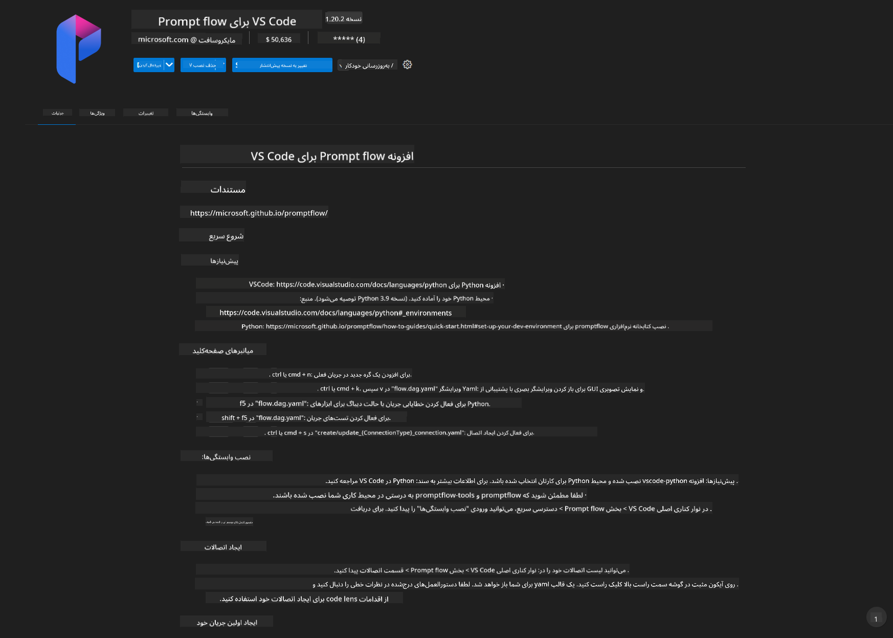
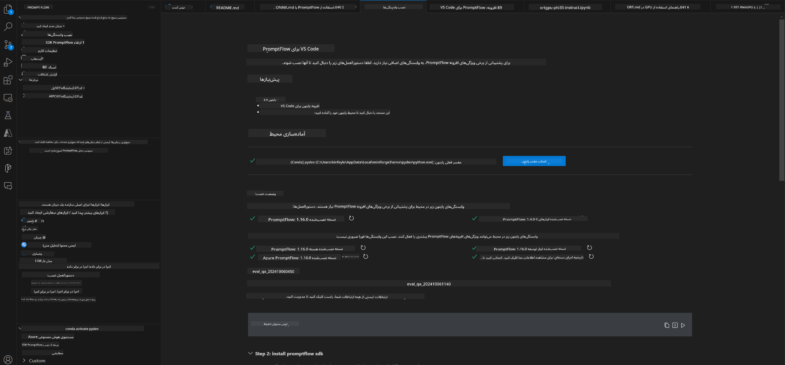
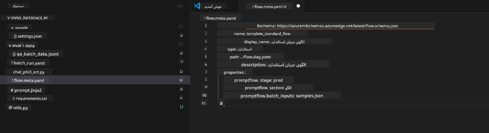
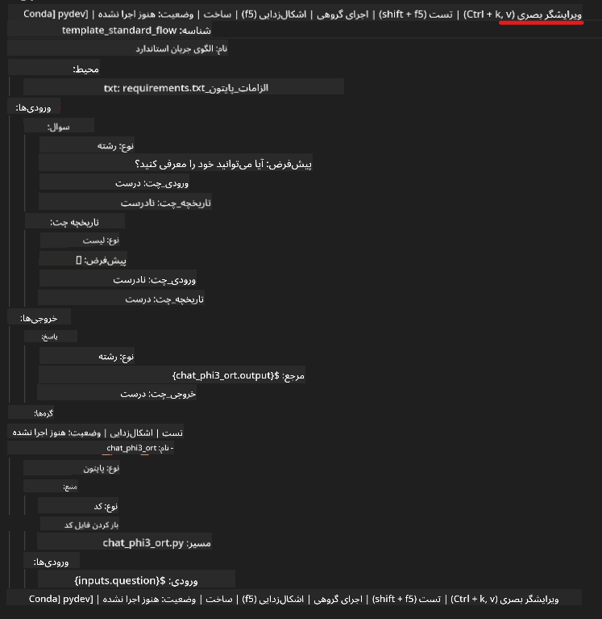
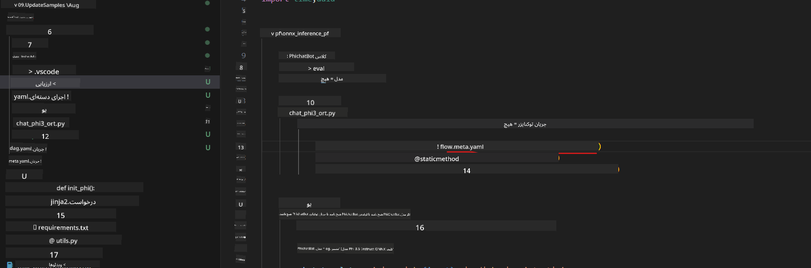
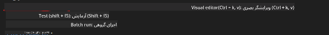
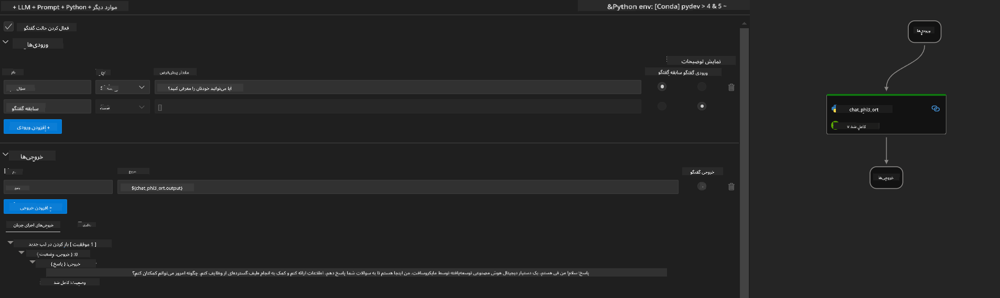
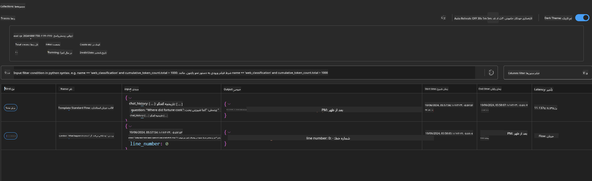

<!--
CO_OP_TRANSLATOR_METADATA:
{
  "original_hash": "92e7dac1e5af0dd7c94170fdaf6860fe",
  "translation_date": "2025-03-27T11:14:21+00:00",
  "source_file": "md\\02.Application\\01.TextAndChat\\Phi3\\UsingPromptFlowWithONNX.md",
  "language_code": "fa"
}
-->
# استفاده از GPU ویندوز برای ایجاد راه‌حل Prompt flow با Phi-3.5-Instruct ONNX

این سند مثالی از نحوه استفاده از PromptFlow با ONNX (Open Neural Network Exchange) برای توسعه برنامه‌های هوش مصنوعی مبتنی بر مدل‌های Phi-3 است.

PromptFlow مجموعه‌ای از ابزارهای توسعه است که برای ساده‌سازی چرخه کامل توسعه برنامه‌های هوش مصنوعی مبتنی بر مدل‌های زبان بزرگ (LLM) طراحی شده است؛ از ایده‌پردازی و نمونه‌سازی اولیه تا تست و ارزیابی.

با ترکیب PromptFlow با ONNX، توسعه‌دهندگان می‌توانند:

- **بهینه‌سازی عملکرد مدل**: از ONNX برای استنتاج و استقرار کارآمد مدل استفاده کنند.
- **ساده‌سازی توسعه**: با استفاده از PromptFlow جریان کاری را مدیریت کرده و وظایف تکراری را خودکار کنند.
- **تقویت همکاری**: با ارائه یک محیط توسعه یکپارچه، همکاری میان اعضای تیم را بهبود بخشند.

**Prompt flow** مجموعه‌ای از ابزارهای توسعه است که برای ساده‌سازی چرخه کامل توسعه برنامه‌های هوش مصنوعی مبتنی بر LLM طراحی شده است؛ از ایده‌پردازی، نمونه‌سازی اولیه، تست و ارزیابی گرفته تا استقرار در تولید و نظارت. این ابزار مهندسی درخواست‌ها (Prompt Engineering) را بسیار آسان‌تر می‌کند و به شما امکان می‌دهد برنامه‌های LLM با کیفیت تولیدی ایجاد کنید.

Prompt flow می‌تواند به OpenAI، سرویس Azure OpenAI و مدل‌های قابل تنظیم (Huggingface، LLM/SLM محلی) متصل شود. ما امیدواریم که مدل ONNX کم‌حجم‌شده Phi-3.5 را در برنامه‌های محلی مستقر کنیم. Prompt flow می‌تواند به ما کمک کند تا بهتر کسب‌وکارمان را برنامه‌ریزی کرده و راه‌حل‌های محلی مبتنی بر Phi-3.5 را تکمیل کنیم. در این مثال، ما کتابخانه ONNX Runtime GenAI را برای تکمیل راه‌حل Prompt flow مبتنی بر GPU ویندوز ترکیب خواهیم کرد.

## **نصب**

### **ONNX Runtime GenAI برای GPU ویندوز**

برای مطالعه راهنمای تنظیم ONNX Runtime GenAI برای GPU ویندوز [اینجا کلیک کنید](./ORTWindowGPUGuideline.md)

### **راه‌اندازی Prompt flow در VSCode**

1. افزونه Prompt flow برای VS Code را نصب کنید.



2. پس از نصب افزونه Prompt flow برای VS Code، روی افزونه کلیک کنید و گزینه **Installation dependencies** را انتخاب کنید و طبق این راهنما SDK Prompt flow را در محیط خود نصب کنید.



3. [نمونه کد](../../../../../../code/09.UpdateSamples/Aug/pf/onnx_inference_pf) را دانلود کرده و با VS Code باز کنید.



4. فایل **flow.dag.yaml** را باز کنید و محیط Python خود را انتخاب کنید.



   فایل **chat_phi3_ort.py** را باز کنید و مکان مدل Phi-3.5-instruct ONNX خود را تغییر دهید.



5. جریان Prompt flow خود را برای تست اجرا کنید.

فایل **flow.dag.yaml** را باز کرده و روی ویرایشگر بصری کلیک کنید.



پس از کلیک روی این گزینه، آن را اجرا کرده و تست کنید.



1. می‌توانید دسته‌ای از دستورات را در ترمینال اجرا کرده و نتایج بیشتری را بررسی کنید.

```bash

pf run create --file batch_run.yaml --stream --name 'Your eval qa name'    

```

نتایج را می‌توانید در مرورگر پیش‌فرض خود مشاهده کنید.



**سلب مسئولیت**:  
این سند با استفاده از سرویس ترجمه هوش مصنوعی [Co-op Translator](https://github.com/Azure/co-op-translator) ترجمه شده است. در حالی که ما تلاش می‌کنیم دقت را حفظ کنیم، لطفاً توجه داشته باشید که ترجمه‌های خودکار ممکن است شامل خطاها یا نادقتی‌ها باشند. سند اصلی به زبان بومی آن باید به عنوان منبع معتبر در نظر گرفته شود. برای اطلاعات حساس، ترجمه حرفه‌ای انسانی توصیه می‌شود. ما مسئول هیچ‌گونه سوءتفاهم یا تفسیر نادرستی که از استفاده از این ترجمه ناشی شود، نیستیم.