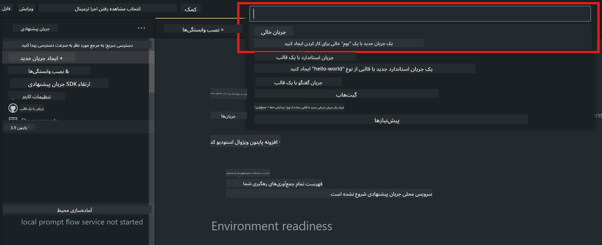
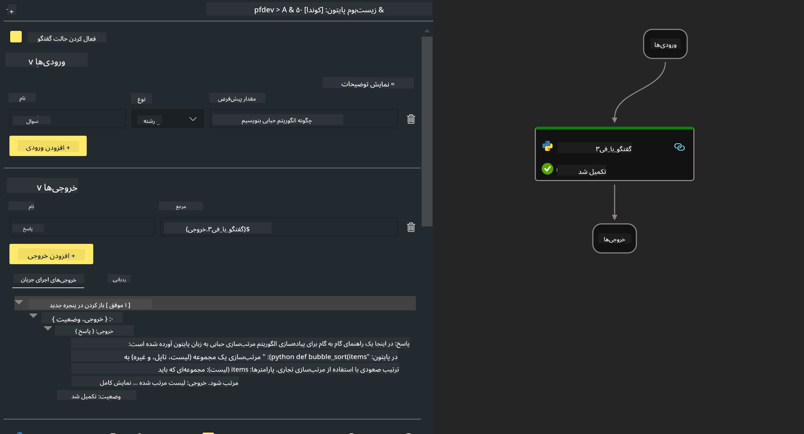

<!--
CO_OP_TRANSLATOR_METADATA:
{
  "original_hash": "bc29f7fe7fc16bed6932733eac8c81b8",
  "translation_date": "2025-03-27T11:57:21+00:00",
  "source_file": "md\\02.Application\\02.Code\\Phi3\\VSCodeExt\\HOL\\AIPC\\02.PromptflowWithNPU.md",
  "language_code": "fa"
}
-->
# **آزمایش ۲ - اجرای جریان Prompt با Phi-3-mini در AIPC**

## **Prompt flow چیست؟**

Prompt flow مجموعه‌ای از ابزارهای توسعه است که چرخه توسعه برنامه‌های هوش مصنوعی مبتنی بر مدل‌های زبانی بزرگ (LLM) را از ایده‌پردازی، نمونه‌سازی، آزمایش، ارزیابی تا استقرار و نظارت در تولید ساده‌تر می‌کند. این ابزار مهندسی پرامپت را بسیار آسان‌تر کرده و به شما امکان می‌دهد برنامه‌های LLM با کیفیت تولید بسازید.

با استفاده از Prompt flow، می‌توانید:

- جریان‌هایی ایجاد کنید که LLMها، پرامپت‌ها، کدهای پایتون و سایر ابزارها را در یک گردش کار اجرایی به هم متصل کند.

- جریان‌های خود را به‌راحتی اشکال‌زدایی و تکرار کنید، به‌ویژه تعامل با LLMها.

- جریان‌های خود را ارزیابی کنید و معیارهای کیفیت و عملکرد را با مجموعه داده‌های بزرگ‌تر محاسبه کنید.

- آزمایش و ارزیابی را در سیستم CI/CD خود ادغام کنید تا کیفیت جریان تضمین شود.

- جریان‌های خود را به پلتفرم خدماتی که انتخاب می‌کنید استقرار دهید یا به‌راحتی در پایه کد برنامه خود ادغام کنید.

- (اختیاری اما بسیار توصیه‌شده) با استفاده از نسخه ابری Prompt flow در Azure AI با تیم خود همکاری کنید.

## **AIPC چیست؟**

یک کامپیوتر هوش مصنوعی (AI PC) دارای یک CPU، یک GPU و یک NPU است که هر کدام قابلیت‌های خاصی برای شتاب‌دهی هوش مصنوعی دارند. NPU یا واحد پردازش عصبی، یک شتاب‌دهنده تخصصی است که وظایف هوش مصنوعی (AI) و یادگیری ماشین (ML) را مستقیماً روی کامپیوتر شما انجام می‌دهد، به‌جای ارسال داده‌ها برای پردازش در فضای ابری. GPU و CPU نیز می‌توانند این بارهای کاری را پردازش کنند، اما NPU به‌ویژه در محاسبات هوش مصنوعی کم‌مصرف عملکرد بسیار خوبی دارد. AI PC نشان‌دهنده یک تغییر اساسی در نحوه عملکرد کامپیوترهای ما است. این راه‌حلی برای مشکلی نیست که قبلاً وجود نداشته است، بلکه وعده بهبود قابل‌توجهی برای استفاده‌های روزمره از کامپیوترها را می‌دهد.

پس چگونه کار می‌کند؟ در مقایسه با هوش مصنوعی مولد و مدل‌های زبانی بزرگ (LLMs) که بر روی حجم عظیمی از داده‌های عمومی آموزش دیده‌اند، هوش مصنوعی که روی کامپیوتر شما اجرا می‌شود، در هر سطحی دسترسی‌پذیرتر است. این مفهوم ساده‌تر قابل درک است و به‌دلیل اینکه بر روی داده‌های شما آموزش دیده و نیازی به دسترسی به فضای ابری ندارد، مزایای آن برای طیف وسیع‌تری از افراد جذاب‌تر است.

در کوتاه‌مدت، دنیای AI PC شامل دستیارهای شخصی و مدل‌های کوچک‌تر هوش مصنوعی است که مستقیماً روی کامپیوتر شما اجرا می‌شوند و با استفاده از داده‌های شما، بهبودهای هوش مصنوعی شخصی، خصوصی و ایمن‌تری را برای کارهایی که هر روز انجام می‌دهید ارائه می‌دهند – مانند ثبت صورت‌جلسه‌های جلسات، سازمان‌دهی لیگ فوتبال فانتزی، خودکارسازی بهبودهای ویرایش عکس و ویدیو، یا طراحی یک برنامه سفر ایده‌آل برای یک گردهمایی خانوادگی بر اساس زمان‌های ورود و خروج همه افراد.

## **ساخت جریان‌های کد تولیدی در AIPC**

***توجه***: اگر نصب محیط را تکمیل نکرده‌اید، لطفاً به [آزمایش ۰ - نصب‌ها](./01.Installations.md) مراجعه کنید.

۱. افزونه Prompt flow را در Visual Studio Code باز کنید و یک پروژه جریان خالی ایجاد کنید.



۲. پارامترهای ورودی و خروجی را اضافه کنید و کد پایتون را به‌عنوان جریان جدید اضافه کنید.



می‌توانید از این ساختار (flow.dag.yaml) برای ساخت جریان خود استفاده کنید:

```yaml

inputs:
  question:
    type: string
    default: how to write Bubble Algorithm
outputs:
  answer:
    type: string
    reference: ${Chat_With_Phi3.output}
nodes:
- name: Chat_With_Phi3
  type: python
  source:
    type: code
    path: Chat_With_Phi3.py
  inputs:
    question: ${inputs.question}


```

۳. کد را در فایل ***Chat_With_Phi3.py*** اضافه کنید.

```python


from promptflow.core import tool

# import torch
from transformers import AutoTokenizer, pipeline,TextStreamer
import intel_npu_acceleration_library as npu_lib

import warnings

import asyncio
import platform

class Phi3CodeAgent:
    
    model = None
    tokenizer = None
    text_streamer = None
    
    model_id = "microsoft/Phi-3-mini-4k-instruct"

    @staticmethod
    def init_phi3():
        
        if Phi3CodeAgent.model is None or Phi3CodeAgent.tokenizer is None or Phi3CodeAgent.text_streamer is None:
            Phi3CodeAgent.model = npu_lib.NPUModelForCausalLM.from_pretrained(
                                    Phi3CodeAgent.model_id,
                                    torch_dtype="auto",
                                    dtype=npu_lib.int4,
                                    trust_remote_code=True
                                )
            Phi3CodeAgent.tokenizer = AutoTokenizer.from_pretrained(Phi3CodeAgent.model_id)
            Phi3CodeAgent.text_streamer = TextStreamer(Phi3CodeAgent.tokenizer, skip_prompt=True)

    

    @staticmethod
    def chat_with_phi3(prompt):
        
        Phi3CodeAgent.init_phi3()

        messages = "<|system|>You are a AI Python coding assistant. Please help me to generate code in Python.The answer only genertated Python code, but any comments and instructions do not need to be generated<|end|><|user|>" + prompt +"<|end|><|assistant|>"


        generation_args = {
            "max_new_tokens": 1024,
            "return_full_text": False,
            "temperature": 0.3,
            "do_sample": False,
            "streamer": Phi3CodeAgent.text_streamer,
        }

        pipe = pipeline(
            "text-generation",
            model=Phi3CodeAgent.model,
            tokenizer=Phi3CodeAgent.tokenizer,
            # **generation_args
        )

        result = ''

        with warnings.catch_warnings():
            warnings.simplefilter("ignore")
            response = pipe(messages, **generation_args)
            result =response[0]['generated_text']
            return result


@tool
def my_python_tool(question: str) -> str:
    if platform.system() == 'Windows':
        asyncio.set_event_loop_policy(asyncio.WindowsSelectorEventLoopPolicy())
    return Phi3CodeAgent.chat_with_phi3(question)


```

۴. می‌توانید جریان را از طریق Debug یا Run آزمایش کنید تا بررسی کنید که کد تولیدی درست کار می‌کند یا خیر.


۵. جریان را به‌عنوان یک API توسعه‌ای در ترمینال اجرا کنید.

```

pf flow serve --source ./ --port 8080 --host localhost   

```

می‌توانید آن را در Postman یا Thunder Client آزمایش کنید.

### **نکته**

۱. اجرای اولیه زمان زیادی می‌برد. پیشنهاد می‌شود مدل phi-3 را از Hugging Face CLI دانلود کنید.

۲. با توجه به توان محاسباتی محدود Intel NPU، پیشنهاد می‌شود از Phi-3-mini-4k-instruct استفاده کنید.

۳. ما از شتاب‌دهی Intel NPU برای تبدیل کوانتیزه INT4 استفاده می‌کنیم، اما اگر سرویس را مجدداً اجرا کنید، باید پوشه‌های cache و nc_workshop را حذف کنید.

## **منابع**

۱. یادگیری Promptflow [https://microsoft.github.io/promptflow/](https://microsoft.github.io/promptflow/)

۲. یادگیری شتاب‌دهی Intel NPU [https://github.com/intel/intel-npu-acceleration-library](https://github.com/intel/intel-npu-acceleration-library)

۳. کد نمونه، دانلود [کد نمونه عامل NPU محلی](../../../../../../../../../code/07.Lab/01/AIPC)

**سلب مسئولیت**:  
این سند با استفاده از سرویس ترجمه هوش مصنوعی [Co-op Translator](https://github.com/Azure/co-op-translator) ترجمه شده است. در حالی که ما برای دقت تلاش می‌کنیم، لطفاً توجه داشته باشید که ترجمه‌های خودکار ممکن است حاوی خطاها یا نادرستی‌هایی باشند. سند اصلی به زبان اصلی آن باید به‌عنوان منبع معتبر در نظر گرفته شود. برای اطلاعات حیاتی، توصیه می‌شود از ترجمه انسانی حرفه‌ای استفاده شود. ما هیچ‌گونه مسئولیتی در قبال سوءتفاهم‌ها یا برداشت‌های نادرست ناشی از استفاده از این ترجمه نداریم.