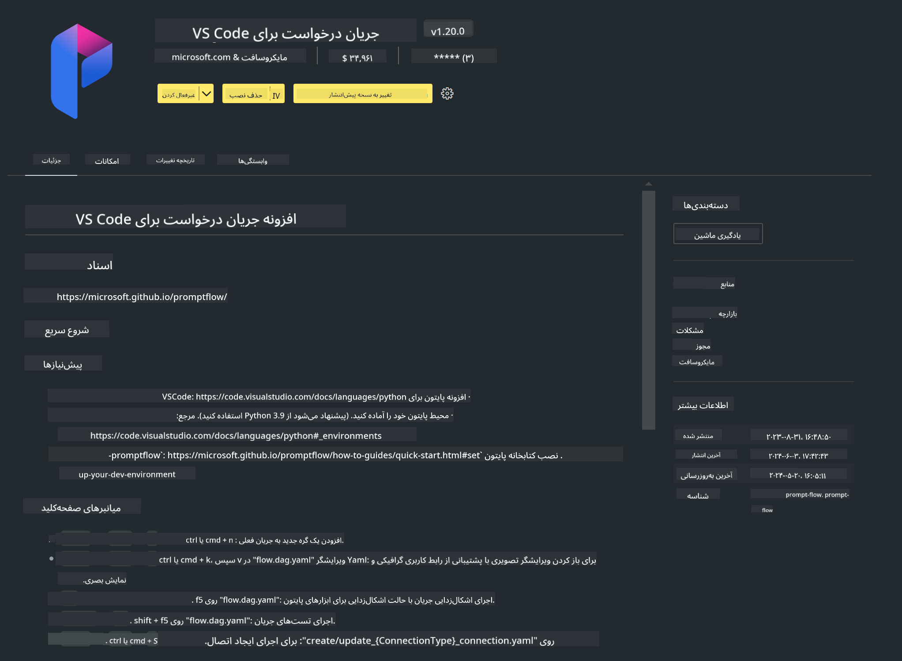

<!--
CO_OP_TRANSLATOR_METADATA:
{
  "original_hash": "4b16264917d9b93169745d92b8ce8c65",
  "translation_date": "2025-03-27T12:15:48+00:00",
  "source_file": "md\\02.Application\\02.Code\\Phi3\\VSCodeExt\\HOL\\Apple\\01.Installations.md",
  "language_code": "fa"
}
-->
# **آزمایش ۰ - نصب**

وقتی وارد آزمایشگاه می‌شویم، باید محیط مربوطه را تنظیم کنیم:

### **۱. Python 3.11+**

توصیه می‌شود از miniforge برای تنظیم محیط Python خود استفاده کنید.

برای تنظیم miniforge، لطفاً به [https://github.com/conda-forge/miniforge](https://github.com/conda-forge/miniforge) مراجعه کنید.

پس از تنظیم miniforge، فرمان زیر را در Power Shell اجرا کنید:

```bash

conda create -n pyenv python==3.11.8 -y

conda activate pyenv

```

### **۲. نصب Prompt flow SDK**

در آزمایشگاه ۱ از Prompt flow استفاده می‌کنیم، بنابراین باید Prompt flow SDK را تنظیم کنید.

```bash

pip install promptflow --upgrade

```

برای بررسی promptflow sdk می‌توانید از این فرمان استفاده کنید:

```bash

pf --version

```

### **۳. نصب افزونه Prompt flow در Visual Studio Code**



### **۴. چارچوب MLX اپل**

MLX یک چارچوب آرایه‌ای برای تحقیقات یادگیری ماشین بر روی تراشه‌های سیلیکونی اپل است که توسط تیم تحقیقات یادگیری ماشین اپل ارائه شده است. شما می‌توانید از **چارچوب MLX اپل** برای تسریع LLM / SLM با تراشه‌های سیلیکونی اپل استفاده کنید. اگر می‌خواهید اطلاعات بیشتری کسب کنید، می‌توانید به [https://github.com/microsoft/PhiCookBook/blob/main/md/01.Introduction/03/MLX_Inference.md](https://github.com/microsoft/PhiCookBook/blob/main/md/01.Introduction/03/MLX_Inference.md) مراجعه کنید.

کتابخانه چارچوب MLX را در bash نصب کنید:

```bash

pip install mlx-lm

```

### **۵. سایر کتابخانه‌های Python**

یک فایل requirements.txt ایجاد کنید و این محتوا را اضافه کنید:

```txt

notebook
numpy 
scipy 
scikit-learn 
matplotlib 
pandas 
pillow 
graphviz

```

### **۶. نصب NVM**

NVM را در Power Shell نصب کنید:

```bash

brew install nvm

```

Node.js نسخه ۱۸.۲۰ را نصب کنید:

```bash

nvm install 18.20.0

nvm use 18.20.0

```

### **۷. نصب پشتیبانی توسعه در Visual Studio Code**

```bash

npm install --global yo generator-code

```

تبریک! شما با موفقیت SDK را تنظیم کردید. حالا به مراحل عملی بعدی بروید.

**سلب مسئولیت**:  
این سند با استفاده از سرویس ترجمه هوش مصنوعی [Co-op Translator](https://github.com/Azure/co-op-translator) ترجمه شده است. در حالی که ما تلاش می‌کنیم دقت را حفظ کنیم، لطفاً توجه داشته باشید که ترجمه‌های خودکار ممکن است شامل خطاها یا نادرستی‌ها باشند. سند اصلی به زبان بومی آن باید به عنوان منبع معتبر در نظر گرفته شود. برای اطلاعات حساس، ترجمه انسانی حرفه‌ای توصیه می‌شود. ما هیچ مسئولیتی در قبال سوءتفاهم‌ها یا تفسیرهای اشتباه ناشی از استفاده از این ترجمه نداریم.