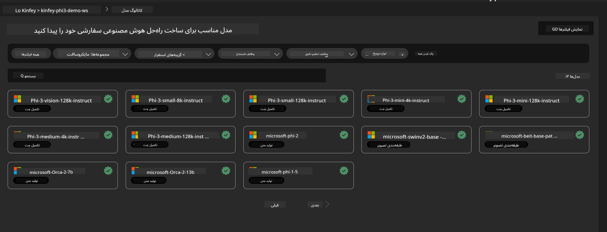
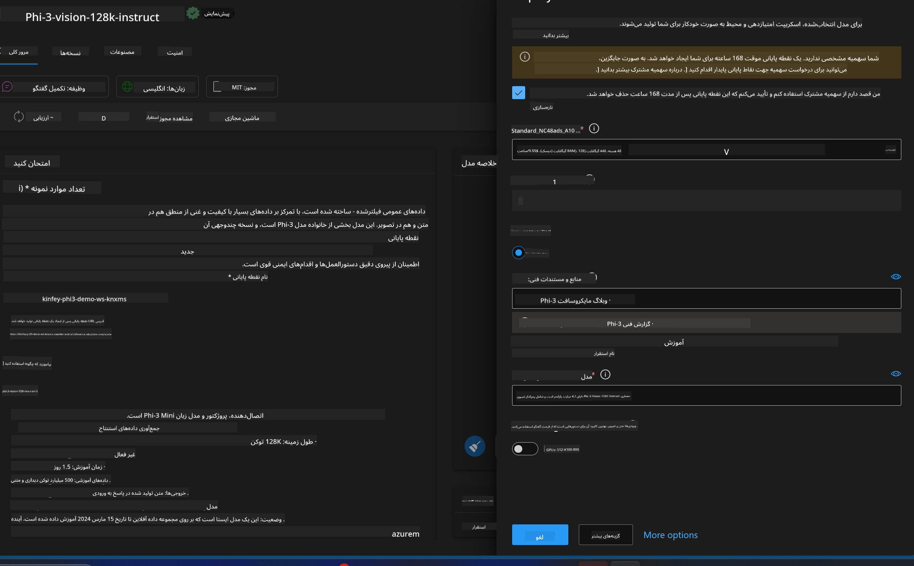
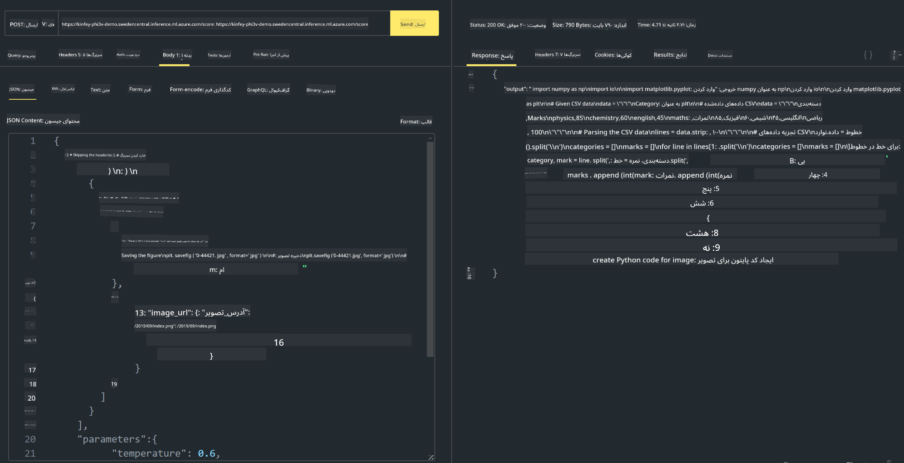

<!--
CO_OP_TRANSLATOR_METADATA:
{
  "original_hash": "20cb4e6ac1686248e8be913ccf6c2bc2",
  "translation_date": "2025-03-27T12:28:05+00:00",
  "source_file": "md\\02.Application\\02.Code\\Phi3\\VSCodeExt\\HOL\\Apple\\03.DeployPhi3VisionOnAzure.md",
  "language_code": "fa"
}
-->
# **آزمایشگاه 3 - استقرار Phi-3-Vision در Azure Machine Learning Service**

ما از NPU برای تکمیل استقرار تولید کد محلی استفاده می‌کنیم و سپس می‌خواهیم توانایی معرفی PHI-3-VISION را از طریق آن برای تبدیل تصاویر به کد معرفی کنیم.

در این معرفی، می‌توانیم به سرعت یک سرویس مدل به‌عنوان سرویس Phi-3 Vision در Azure Machine Learning Service بسازیم.

***توجه***: Phi-3 Vision برای تولید محتوا با سرعت بالاتر به قدرت محاسباتی نیاز دارد. ما به قدرت محاسباتی ابری نیاز داریم تا به ما در دستیابی به این هدف کمک کند.

### **1. ایجاد Azure Machine Learning Service**

ما نیاز داریم که یک Azure Machine Learning Service در Azure Portal ایجاد کنیم. اگر می‌خواهید یاد بگیرید چگونه این کار را انجام دهید، لطفاً به این لینک مراجعه کنید: [https://learn.microsoft.com/azure/machine-learning/quickstart-create-resources?view=azureml-api-2](https://learn.microsoft.com/azure/machine-learning/quickstart-create-resources?view=azureml-api-2)

### **2. انتخاب Phi-3 Vision در Azure Machine Learning Service**



### **3. استقرار Phi-3-Vision در Azure**



### **4. آزمایش Endpoint در Postman**



***توجه***

1. پارامترهایی که باید ارسال شوند شامل Authorization، azureml-model-deployment و Content-Type هستند. شما باید اطلاعات استقرار را بررسی کنید تا این موارد را به دست آورید.

2. برای ارسال پارامترها، Phi-3-Vision نیاز دارد که یک لینک تصویر ارسال شود. لطفاً به روش GPT-4-Vision برای ارسال پارامترها مراجعه کنید، مانند:

```json

{
  "input_data":{
    "input_string":[
      {
        "role":"user",
        "content":[ 
          {
            "type": "text",
            "text": "You are a Python coding assistant.Please create Python code for image "
          },
          {
              "type": "image_url",
              "image_url": {
                "url": "https://ajaytech.co/wp-content/uploads/2019/09/index.png"
              }
          }
        ]
      }
    ],
    "parameters":{
          "temperature": 0.6,
          "top_p": 0.9,
          "do_sample": false,
          "max_new_tokens": 2048
    }
  }
}

```

3. با استفاده از متد Post، به **/score** فراخوانی کنید.

**تبریک می‌گوییم**! شما استقرار سریع PHI-3-VISION را تکمیل کردید و نحوه استفاده از تصاویر برای تولید کد را امتحان کردید. در مرحله بعد، می‌توانیم برنامه‌هایی را با ترکیب NPU و ابر بسازیم.

**سلب مسئولیت**:  
این سند با استفاده از سرویس ترجمه هوش مصنوعی [Co-op Translator](https://github.com/Azure/co-op-translator) ترجمه شده است. در حالی که ما تلاش می‌کنیم دقت را رعایت کنیم، لطفاً توجه داشته باشید که ترجمه‌های خودکار ممکن است حاوی خطاها یا نادقتی‌هایی باشند. سند اصلی به زبان اصلی خود باید به عنوان منبع معتبر در نظر گرفته شود. برای اطلاعات حساس، ترجمه انسانی حرفه‌ای توصیه می‌شود. ما هیچ مسئولیتی در قبال سوءتفاهم‌ها یا تفسیرهای نادرست ناشی از استفاده از این ترجمه نداریم.