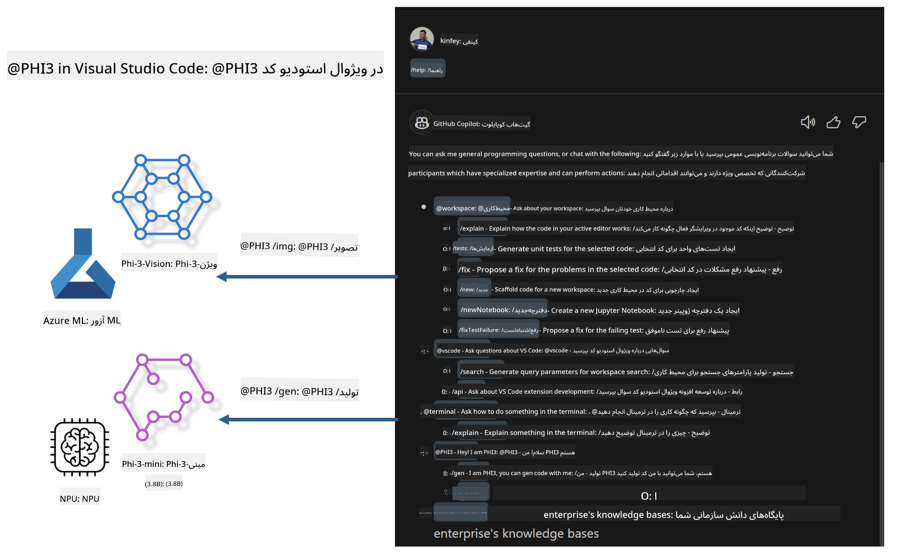

<!--
CO_OP_TRANSLATOR_METADATA:
{
  "original_hash": "00b7a699de8ac405fa821f4c0f7fc0ab",
  "translation_date": "2025-03-27T11:44:08+00:00",
  "source_file": "md\\02.Application\\02.Code\\Phi3\\VSCodeExt\\README.md",
  "language_code": "fa"
}
-->
# **ساخت چت GitHub Copilot خودتان در Visual Studio Code با خانواده Microsoft Phi-3**

آیا تا به حال از عامل محیط کاری در GitHub Copilot Chat استفاده کرده‌اید؟ آیا می‌خواهید عامل کد تیم خودتان را بسازید؟ این آزمایش عملی امیدوار است که با ترکیب مدل متن‌باز، یک عامل تجاری کد در سطح سازمانی ایجاد کند.

## **مبانی**

### **چرا انتخاب Microsoft Phi-3**

Phi-3 یک خانواده از مدل‌هاست که شامل phi-3-mini، phi-3-small و phi-3-medium است و بر اساس پارامترهای مختلف برای تولید متن، تکمیل دیالوگ و تولید کد طراحی شده است. همچنین phi-3-vision بر اساس Vision وجود دارد. این مدل برای شرکت‌ها یا تیم‌های مختلف جهت ایجاد راه‌حل‌های آفلاین هوش مصنوعی تولیدی مناسب است.

توصیه می‌شود این لینک را مطالعه کنید: [https://github.com/microsoft/PhiCookBook/blob/main/md/01.Introduction/01/01.PhiFamily.md](https://github.com/microsoft/PhiCookBook/blob/main/md/01.Introduction/01/01.PhiFamily.md)

### **GitHub Copilot Chat مایکروسافت**

افزونه GitHub Copilot Chat یک رابط چت ارائه می‌دهد که به شما امکان می‌دهد با GitHub Copilot تعامل داشته باشید و پاسخ‌هایی به سوالات مرتبط با کدنویسی مستقیماً در داخل VS Code دریافت کنید، بدون نیاز به جستجو در مستندات یا انجمن‌های آنلاین.

Copilot Chat ممکن است از ویژگی‌هایی مانند برجسته‌سازی سینتکس، تورفتگی و قالب‌بندی‌های دیگر برای افزایش وضوح پاسخ‌های تولید شده استفاده کند. بسته به نوع سوال کاربر، نتیجه ممکن است شامل لینک‌هایی به منابعی باشد که Copilot برای تولید پاسخ از آنها استفاده کرده است، مانند فایل‌های کد منبع یا مستندات، یا دکمه‌هایی برای دسترسی به قابلیت‌های VS Code.

- Copilot Chat در جریان کاری توسعه‌دهنده ادغام می‌شود و در جایی که نیاز دارید به شما کمک می‌کند:

- شروع یک گفتگوی چت داخلی مستقیماً از ویرایشگر یا ترمینال برای کمک هنگام کدنویسی

- استفاده از نمای چت برای داشتن یک دستیار هوش مصنوعی در کنار خود در هر زمان

- راه‌اندازی چت سریع برای پرسیدن یک سوال کوتاه و بازگشت به کاری که انجام می‌دهید

شما می‌توانید از GitHub Copilot Chat در سناریوهای مختلف استفاده کنید، مانند:

- پاسخ به سوالات کدنویسی درباره بهترین راه‌حل برای یک مشکل

- توضیح کد دیگران و پیشنهاد بهبود

- پیشنهاد رفع اشکال کد

- تولید موارد تست واحد

- تولید مستندات کد

توصیه می‌شود این لینک را مطالعه کنید: [https://code.visualstudio.com/docs/copilot/copilot-chat](https://code.visualstudio.com/docs/copilot/copilot-chat?WT.mc_id=aiml-137032-kinfeylo)

### **GitHub Copilot Chat @workspace مایکروسافت**

ارجاع به **@workspace** در Copilot Chat به شما امکان می‌دهد درباره کل کدبیس خود سوال بپرسید. بر اساس سوال، Copilot به صورت هوشمند فایل‌ها و نمادهای مرتبط را بازیابی می‌کند و سپس آنها را به صورت لینک و نمونه کد در پاسخ خود ارائه می‌دهد.

برای پاسخ به سوال شما، **@workspace** از همان منابعی استفاده می‌کند که یک توسعه‌دهنده هنگام پیمایش یک کدبیس در VS Code استفاده می‌کند:

- تمام فایل‌های موجود در محیط کاری، به جز فایل‌هایی که توسط فایل .gitignore نادیده گرفته شده‌اند

- ساختار دایرکتوری با پوشه‌ها و نام فایل‌های تو در تو

- شاخص جستجوی کد GitHub، اگر محیط کاری یک مخزن GitHub باشد و توسط جستجوی کد ایندکس شده باشد

- نمادها و تعاریف در محیط کاری

- متن انتخاب شده یا متن قابل مشاهده در ویرایشگر فعال

توجه: فایل .gitignore نادیده گرفته می‌شود اگر شما یک فایل باز کرده باشید یا متنی را در داخل یک فایل نادیده گرفته شده انتخاب کرده باشید.

توصیه می‌شود این لینک را مطالعه کنید: [https://code.visualstudio.com/docs/copilot/copilot-chat](https://code.visualstudio.com/docs/copilot/workspace-context?WT.mc_id=aiml-137032-kinfeylo)

## **اطلاعات بیشتر درباره این آزمایش**

GitHub Copilot به طور قابل توجهی بهره‌وری برنامه‌نویسی شرکت‌ها را بهبود داده است، و هر شرکت امیدوار است که عملکردهای مرتبط با GitHub Copilot را سفارشی کند. بسیاری از شرکت‌ها افزونه‌هایی مشابه GitHub Copilot را بر اساس سناریوهای تجاری خود و مدل‌های متن‌باز سفارشی کرده‌اند. برای شرکت‌ها، افزونه‌های سفارشی آسان‌تر کنترل می‌شوند، اما این نیز بر تجربه کاربر تأثیر می‌گذارد. به هر حال، GitHub Copilot در برخورد با سناریوهای عمومی و حرفه‌ای عملکرد قوی‌تری دارد. اگر بتوان تجربه را ثابت نگه داشت، بهتر است که افزونه سفارشی شرکت ایجاد شود. GitHub Copilot Chat APIهای مرتبطی را برای شرکت‌ها ارائه می‌دهد تا در تجربه چت گسترش دهند. حفظ یک تجربه ثابت و داشتن عملکردهای سفارشی، تجربه کاربری بهتری را فراهم می‌کند.

این آزمایش عمدتاً از مدل Phi-3 به همراه NPU محلی و ترکیب Azure برای ساخت یک عامل سفارشی در GitHub Copilot Chat با نام ***@PHI3*** استفاده می‌کند تا به توسعه‌دهندگان شرکت در تکمیل تولید کد ***(@PHI3 /gen)*** و تولید کد بر اساس تصاویر ***(@PHI3 /img)*** کمک کند.

### ***توجه:*** 

این آزمایش در حال حاضر در AIPC پردازنده‌های Intel و Apple Silicon اجرا شده است. ما به‌روزرسانی نسخه Qualcomm NPU را ادامه خواهیم داد.

## **آزمایش**

| نام | توضیحات | AIPC | Apple |
| ------------ | ----------- | -------- |-------- |
| آزمایش 0 - نصب‌ها (✅) | پیکربندی و نصب محیط‌ها و ابزارهای مرتبط | [برو](./HOL/AIPC/01.Installations.md) | [برو](./HOL/Apple/01.Installations.md) |
| آزمایش 1 - اجرای جریان Prompt با Phi-3-mini (✅) | ترکیب با AIPC / Apple Silicon و استفاده از NPU محلی برای ایجاد تولید کد با Phi-3-mini | [برو](./HOL/AIPC/02.PromptflowWithNPU.md) |  [برو](./HOL/Apple/02.PromptflowWithMLX.md) |
| آزمایش 2 - استقرار Phi-3-vision در Azure Machine Learning Service (✅) | تولید کد با استقرار کاتالوگ مدل Azure Machine Learning Service - تصویر Phi-3-vision | [برو](./HOL/AIPC/03.DeployPhi3VisionOnAzure.md) |[برو](./HOL/Apple/03.DeployPhi3VisionOnAzure.md) |
| آزمایش 3 - ایجاد یک عامل @phi-3 در GitHub Copilot Chat (✅)  | ایجاد یک عامل سفارشی Phi-3 در GitHub Copilot Chat برای تکمیل تولید کد، تولید کد گرافیکی، RAG و غیره | [برو](./HOL/AIPC/04.CreatePhi3AgentInVSCode.md) | [برو](./HOL/Apple/04.CreatePhi3AgentInVSCode.md) |
| کد نمونه (✅)  | دانلود کد نمونه | [برو](../../../../../../../code/07.Lab/01/AIPC) | [برو](../../../../../../../code/07.Lab/01/Apple) |

## **منابع**

1. Phi-3 Cookbook [https://github.com/microsoft/Phi-3CookBook](https://github.com/microsoft/Phi-3CookBook)

2. اطلاعات بیشتر درباره GitHub Copilot [https://learn.microsoft.com/training/paths/copilot/](https://learn.microsoft.com/training/paths/copilot/?WT.mc_id=aiml-137032-kinfeylo)

3. اطلاعات بیشتر درباره GitHub Copilot Chat [https://learn.microsoft.com/training/paths/accelerate-app-development-using-github-copilot/](https://learn.microsoft.com/training/paths/accelerate-app-development-using-github-copilot/?WT.mc_id=aiml-137032-kinfeylo)

4. اطلاعات بیشتر درباره APIهای GitHub Copilot Chat [https://code.visualstudio.com/api/extension-guides/chat](https://code.visualstudio.com/api/extension-guides/chat?WT.mc_id=aiml-137032-kinfeylo)

5. اطلاعات بیشتر درباره Azure AI Foundry [https://learn.microsoft.com/training/paths/create-custom-copilots-ai-studio/](https://learn.microsoft.com/training/paths/create-custom-copilots-ai-studio/?WT.mc_id=aiml-137032-kinfeylo)

6. اطلاعات بیشتر درباره کاتالوگ مدل Azure AI Foundry [https://learn.microsoft.com/azure/ai-studio/how-to/model-catalog-overview](https://learn.microsoft.com/azure/ai-studio/how-to/model-catalog-overview)

**سلب مسئولیت**:  
این سند با استفاده از سرویس ترجمه هوش مصنوعی [Co-op Translator](https://github.com/Azure/co-op-translator) ترجمه شده است. در حالی که ما برای دقت تلاش می‌کنیم، لطفاً توجه داشته باشید که ترجمه‌های خودکار ممکن است شامل خطاها یا نادقتی‌هایی باشند. سند اصلی به زبان اصلی خود باید به‌عنوان منبع معتبر در نظر گرفته شود. برای اطلاعات حساس، ترجمه حرفه‌ای انسانی توصیه می‌شود. ما هیچ مسئولیتی در قبال سوءتفاهم‌ها یا تفسیرهای نادرست ناشی از استفاده از این ترجمه نمی‌پذیریم.